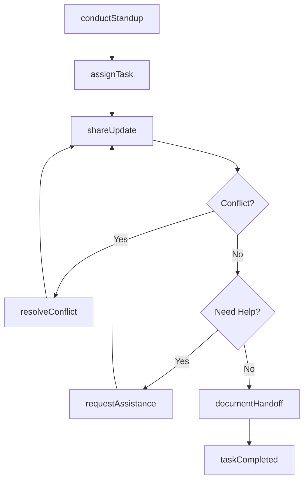
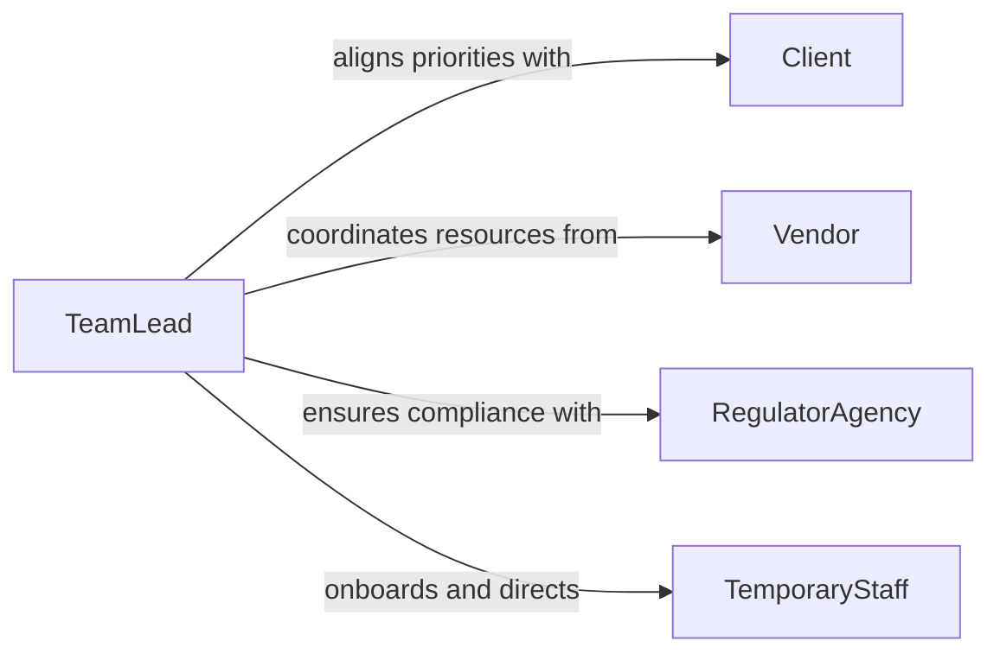

# Confer Coworkers Coordinate Work Activities

> Business-as-Code definition for conferring with coworkers to coordinate work activities. Models the peer-to-peer communication workflows that align team members on task sequencing, resource sharing, and daily operational priorities.

## Overview

Conferring with coworkers to coordinate work activities involves discussing task assignments, sharing progress updates, and resolving scheduling conflicts among team members. This definition captures the daily coordination lifecycle from shift planning through task execution and handoff. It enables teams to maintain alignment on workloads, avoid duplication of effort, and ensure smooth transitions between interdependent tasks across shifts and functional areas.

## Actors

| Actor | Description |
|-------|-------------|
| Client | External party whose requirements drive work priorities |
| Vendor | Supplies tools, materials, or services needed to complete tasks |
| RegulatorAgency | Sets compliance requirements that influence work sequencing |
| TemporaryStaff | Contract workers who require onboarding into active task coordination |

## Roles

| Role | Description |
|------|-------------|
| TeamLead | Facilitates coordination meetings and resolves task conflicts |
| TeamMember | Executes assigned tasks and communicates status to peers |
| Scheduler | Maintains the team calendar and manages shift rotations |
| QualityReviewer | Verifies completed work meets standards before handoff |

## Entities

| Entity | Description |
|--------|-------------|
| TaskAssignment | A specific work item assigned to a team member |
| WorkSchedule | The planned timeline of activities for a team or shift |
| StatusUpdate | A progress report on an active task or deliverable |
| ResourceAllocation | The assignment of tools, equipment, or shared spaces to tasks |
| HandoffNote | Documentation of pending work transferred between shifts or team members |

## Actions

| Action | Description |
|--------|-------------|
| assignTask | Delegate a work item to a specific team member |
| shareUpdate | Communicate current progress on an active task |
| resolveConflict | Address a scheduling or resource conflict between team members |
| requestAssistance | Ask a coworker for help with a task or deliverable |
| conductStandup | Hold a brief coordination meeting to align on priorities |
| documentHandoff | Record pending work for the next shift or team member |

## Events

| Event | Description |
|-------|-------------|
| taskAssigned | A work item has been delegated to a team member |
| updateShared | A progress report on an active task has been communicated |
| conflictResolved | A scheduling or resource conflict has been addressed |
| assistanceRequested | A coworker has been asked for help with a task |
| standupConducted | A coordination meeting has been held |
| handoffDocumented | Pending work has been recorded for the next shift |
| taskCompleted | A work item has been finished and verified |

## Searches

| Search | Description |
|--------|-------------|
| findTasks | List task assignments by status, assignee, or due date |
| getScheduleConflicts | Identify overlapping or conflicting resource allocations |
| getHandoffNotes | Retrieve pending handoff documentation by shift or team member |
| getTeamStatus | View current progress across all active tasks for a team |

## Workflow



## Actor Relationships



## Usage

### Calling Actions

```typescript
import { conferCoworkersCoordinateWorkActivities } from '@headlessly/confer-coworkers-coordinate-work-activities'

const coordination = conferCoworkersCoordinateWorkActivities()

// Hold a morning standup meeting
const standup = await coordination.conductStandup({
  team: 'operations-alpha',
  date: '2026-02-10',
  attendees: ['alice', 'bob', 'carlos', 'diana'],
  agenda: ['Yesterday review', 'Today priorities', 'Blockers']
})

// Assign a task to a team member
await coordination.assignTask({
  title: 'Complete inventory audit for warehouse section B',
  assignee: 'bob',
  dueDate: '2026-02-11',
  priority: 'high',
  dependencies: ['task-inv-audit-section-a']
})

// Share a progress update
await coordination.shareUpdate({
  taskId: 'task-inv-audit-section-a',
  status: 'in-progress',
  percentComplete: 75,
  notes: 'Section A shelves 1-6 complete, shelves 7-8 remaining'
})
```

### Event-Driven Automation

```typescript
// Notify team lead when assistance is requested
coordination.assistanceRequested(async ({ taskId, requestedBy, reason }) => {
  await notify({
    to: 'team-lead',
    message: `${requestedBy} needs help on task ${taskId}: ${reason}`
  })
})

// Auto-create handoff notes at shift end
coordination.standupConducted(async ({ team, date, actionItems }) => {
  for (const item of actionItems.filter(a => a.status === 'in-progress')) {
    await coordination.documentHandoff({
      taskId: item.taskId,
      notes: item.summary,
      nextShift: 'evening'
    })
  }
})
```
