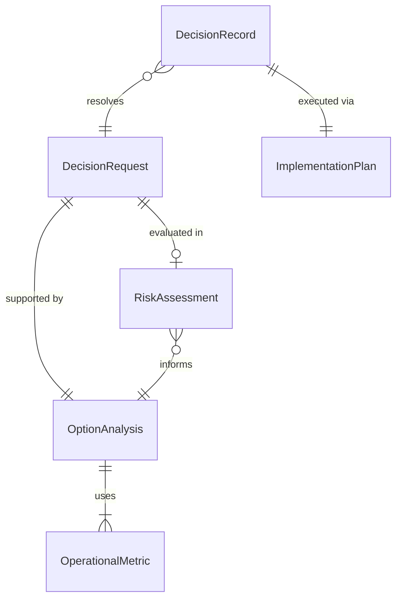
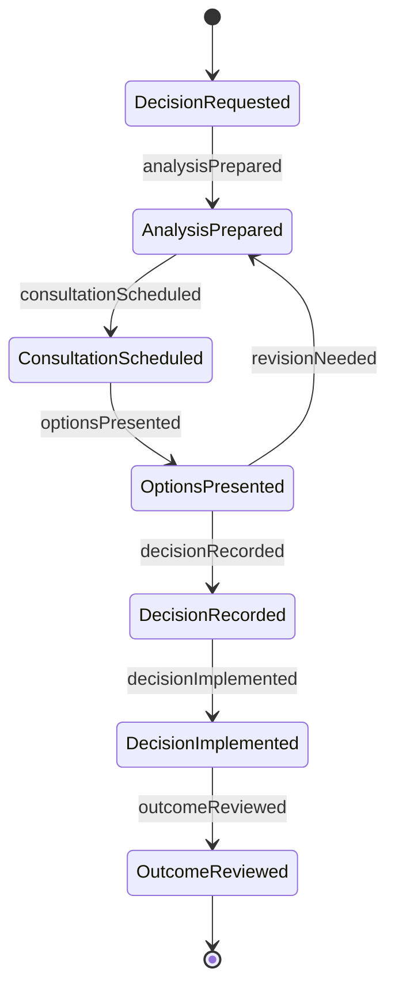
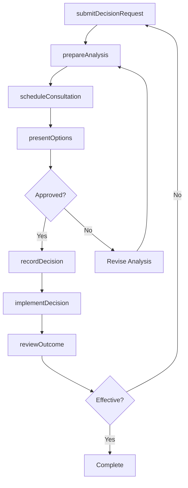
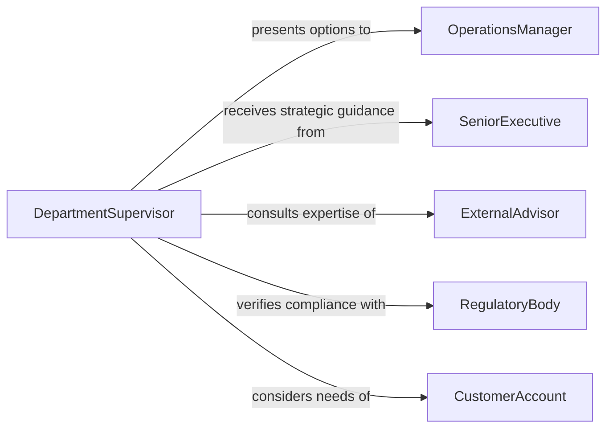

# Confer Managers Make Operational Decisions

> Business-as-Code definition for conferring with managers to make operational decisions. Models the upward communication and decision-making workflows where staff present options, data, and recommendations to management for authorization and direction.

## Overview

Conferring with managers to make operational decisions involves presenting relevant information, analyzing options, and obtaining management direction on day-to-day operational matters. This definition captures the decision lifecycle from issue identification through option analysis, management consultation, and decision implementation. It enables organizations to maintain structured decision-making processes that balance frontline expertise with management oversight and accountability.

## Actors

| Actor | Description |
|-------|-------------|
| SeniorExecutive | Provides strategic direction that constrains operational choices |
| ExternalAdvisor | Offers specialized expertise to inform complex operational decisions |
| RegulatoryBody | Imposes requirements that must be considered in operational decisions |
| CustomerAccount | Key account whose needs influence operational priority decisions |
| BoardMember | Oversees governance and approves high-impact operational changes |

## Roles

| Role | Description |
|------|-------------|
| OperationsManager | Makes day-to-day operational decisions and sets team direction |
| Analyst | Gathers data and prepares decision support materials |
| DepartmentSupervisor | Presents operational options and recommendations to management |
| ComplianceOfficer | Ensures decisions align with regulatory and policy requirements |

## Entities

| Entity | Description |
|--------|-------------|
| DecisionRequest | A formal request for management input on an operational matter |
| OptionAnalysis | A structured comparison of alternatives with pros, cons, and costs |
| DecisionRecord | A documented outcome of a management decision with rationale |
| OperationalMetric | A data point used to support or evaluate a decision |
| RiskAssessment | An evaluation of potential negative outcomes for each option |
| ImplementationPlan | The action steps to carry out an approved decision |

## Actions

| Action | Description |
|--------|-------------|
| submitDecisionRequest | Present an operational issue requiring management input |
| prepareAnalysis | Compile data and options for a pending decision |
| scheduleConsultation | Arrange a meeting with management to discuss the decision |
| presentOptions | Present analyzed alternatives to managers for evaluation |
| recordDecision | Document the chosen option, rationale, and next steps |
| implementDecision | Execute the action plan following management approval |
| reviewOutcome | Assess the results of a decision after implementation |

## Events

| Event | Description |
|-------|-------------|
| decisionRequested | An operational matter has been submitted for management input |
| analysisPrepared | Data and options for a decision have been compiled |
| consultationScheduled | A meeting with management has been arranged |
| optionsPresented | Alternatives have been presented to managers for evaluation |
| decisionRecorded | A management decision has been documented with rationale |
| decisionImplemented | The approved action plan has been executed |
| outcomeReviewed | The results of an implemented decision have been assessed |

## Searches

| Search | Description |
|--------|-------------|
| findDecisionRequests | List pending decision requests by urgency, department, or status |
| getDecisionHistory | Retrieve past decisions by topic, manager, or date range |
| getOpenAnalyses | Find decision analyses awaiting management review |
| getImplementationStatus | Check progress on decisions that have been approved |

## Entity Relationships



## State Diagram



## Workflow



## Actor Relationships



## Usage

### Calling Actions

```typescript
import { conferManagersMakeOperationalDecisions } from '@headlessly/confer-managers-make-operational-decisions'

const decisions = conferManagersMakeOperationalDecisions()

// Submit a decision request for management review
const request = await decisions.submitDecisionRequest({
  title: 'Shift schedule restructuring for Q2 production ramp',
  department: 'Manufacturing',
  urgency: 'high',
  description: 'Production targets increased 30% for Q2, requiring shift changes',
  submittedBy: 'supervisor-garcia'
})

// Prepare the option analysis
await decisions.prepareAnalysis({
  requestId: request.id,
  options: [
    { name: 'Add third shift', cost: 180000, riskLevel: 'medium', leadTime: '3 weeks' },
    { name: 'Extend existing shifts by 2 hours', cost: 95000, riskLevel: 'low', leadTime: '1 week' },
    { name: 'Hire temporary workforce', cost: 150000, riskLevel: 'high', leadTime: '2 weeks' }
  ],
  recommendation: 'Extend existing shifts by 2 hours',
  rationale: 'Lowest cost and fastest implementation with manageable overtime impact'
})

// Record the decision after management consultation
await decisions.recordDecision({
  requestId: request.id,
  chosenOption: 'Extend existing shifts by 2 hours',
  approvedBy: 'manager-thompson',
  rationale: 'Minimizes disruption while meeting Q2 targets',
  effectiveDate: '2026-03-01'
})
```

### Event-Driven Automation

```typescript
// Notify stakeholders when decisions are recorded
decisions.decisionRecorded(async ({ requestId, title, chosenOption, approvedBy }) => {
  await notify({
    to: 'department-all',
    message: `Decision on "${title}": ${chosenOption} (approved by ${approvedBy})`
  })
})

// Auto-schedule outcome review 30 days after implementation
decisions.decisionImplemented(async ({ requestId, effectiveDate }) => {
  const reviewDate = addDays(new Date(effectiveDate), 30)
  await decisions.reviewOutcome({
    requestId,
    scheduledDate: reviewDate.toISOString(),
    reviewType: '30-day-assessment'
  })
})
```
