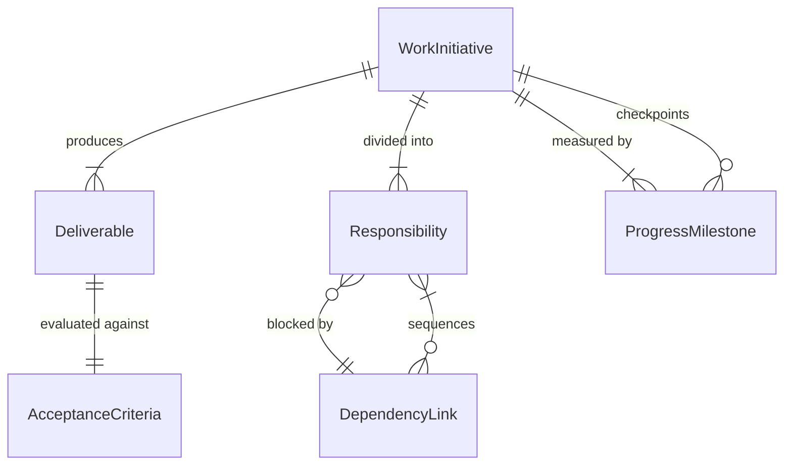
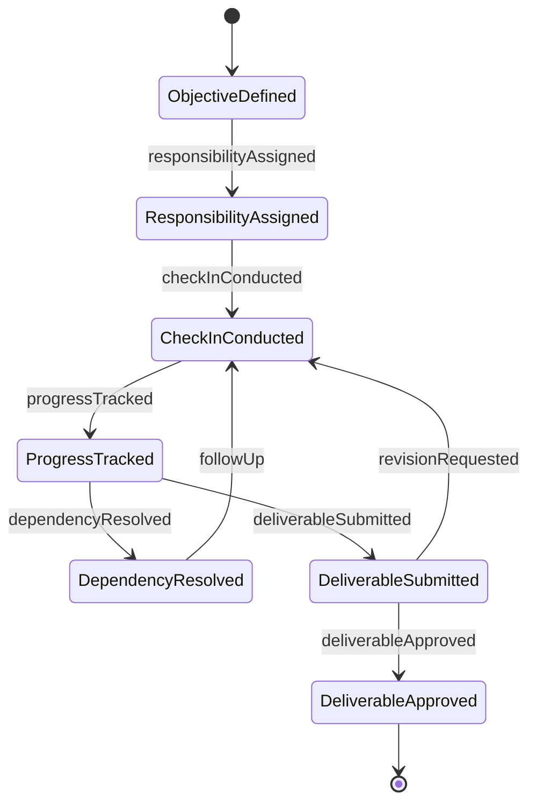
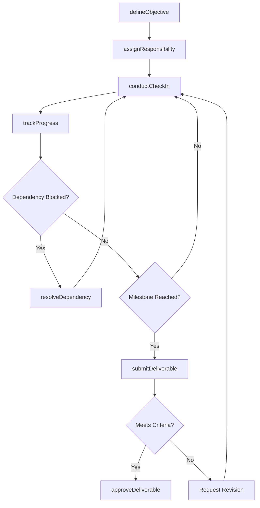
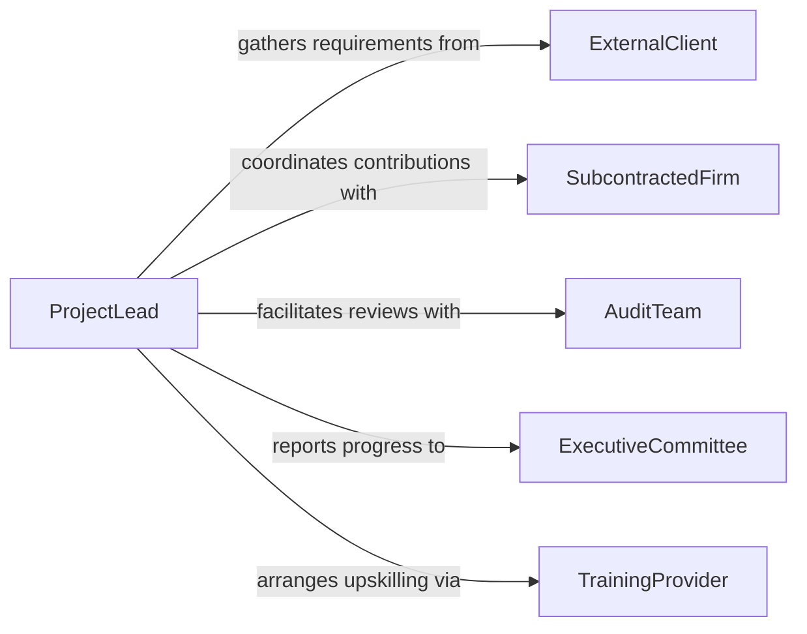

# Confer Organizational Members Accomplish Work

> Business-as-Code definition for conferring with organizational members to accomplish work activities. Models the intra-organizational communication workflows that align departments, teams, and individuals toward completing shared objectives and deliverables.

## Overview

Conferring with organizational members to accomplish work activities involves engaging colleagues across departments and levels to clarify requirements, coordinate contributions, and drive tasks to completion. This definition captures the collaborative work lifecycle from objective setting through task coordination, progress tracking, and completion verification. It enables organizations to orchestrate multi-stakeholder efforts by providing structured communication for assigning responsibilities, resolving dependencies, and confirming deliverable acceptance.

## Actors

| Actor | Description |
|-------|-------------|
| ExternalClient | The customer or partner whose requirements drive the work |
| SubcontractedFirm | An outside organization contributing specialized work components |
| AuditTeam | Reviews completed work for compliance and quality standards |
| ExecutiveCommittee | Senior leadership that sets organizational priorities and approves initiatives |
| TrainingProvider | Delivers skill development needed for organizational members to complete work |

## Roles

| Role | Description |
|------|-------------|
| ProjectLead | Drives the work initiative and coordinates across departments |
| ContributingMember | Executes assigned portions of the work deliverables |
| StakeholderLiaison | Communicates progress and gathers feedback from stakeholders |
| QualityAssurer | Verifies that completed work meets acceptance criteria |

## Entities

| Entity | Description |
|--------|-------------|
| WorkInitiative | A defined body of work with objectives, scope, and timeline |
| Deliverable | A tangible output produced as part of the work initiative |
| Responsibility | An assigned portion of work mapped to a specific member |
| DependencyLink | A relationship between tasks where one must complete before another begins |
| ProgressMilestone | A checkpoint marking completion of a significant phase of work |
| AcceptanceCriteria | The standards a deliverable must meet to be considered complete |

## Actions

| Action | Description |
|--------|-------------|
| defineObjective | Establish the goals and scope for a work initiative |
| assignResponsibility | Delegate a portion of work to a specific organizational member |
| trackProgress | Monitor the status of tasks and milestones across the initiative |
| resolveDependency | Address a blocking relationship between interdependent tasks |
| conductCheckIn | Hold a progress meeting with contributing members |
| submitDeliverable | Present a completed work output for review and acceptance |
| approveDeliverable | Formally accept a deliverable as meeting acceptance criteria |

## Events

| Event | Description |
|-------|-------------|
| objectiveDefined | The goals and scope for a work initiative have been established |
| responsibilityAssigned | A portion of work has been delegated to a member |
| progressTracked | Task and milestone status has been updated |
| dependencyResolved | A blocking inter-task relationship has been addressed |
| checkInConducted | A progress meeting with contributing members has been held |
| deliverableSubmitted | A completed work output has been presented for review |
| deliverableApproved | A deliverable has been formally accepted |

## Searches

| Search | Description |
|--------|-------------|
| findInitiatives | List work initiatives by status, department, or lead |
| getResponsibilities | Retrieve assigned work portions by member or initiative |
| getBlockedTasks | Find tasks waiting on unresolved dependencies |
| getMilestoneStatus | Check progress against defined milestones for an initiative |

## Entity Relationships



## State Diagram



## Workflow



## Actor Relationships



## Usage

### Calling Actions

```typescript
import { conferOrganizationalMembersAccomplishWork } from '@headlessly/confer-organizational-members-accomplish-work'

const work = conferOrganizationalMembersAccomplishWork()

// Define a new work initiative
const initiative = await work.defineObjective({
  title: 'Annual Regulatory Filing Preparation',
  scope: 'Compile, review, and submit all required regulatory documents for FY2025',
  departments: ['Legal', 'Finance', 'Compliance'],
  deadline: '2026-03-31',
  lead: 'project-lead-chen'
})

// Assign responsibilities to team members
await work.assignResponsibility({
  initiativeId: initiative.id,
  assignments: [
    { member: 'analyst-patel', task: 'Financial data compilation', dueDate: '2026-02-28' },
    { member: 'counsel-rivera', task: 'Legal review and sign-off', dueDate: '2026-03-15' },
    { member: 'officer-nakamura', task: 'Compliance checklist verification', dueDate: '2026-03-20' }
  ]
})

// Conduct a check-in meeting
await work.conductCheckIn({
  initiativeId: initiative.id,
  date: '2026-02-15',
  attendees: ['analyst-patel', 'counsel-rivera', 'officer-nakamura'],
  agenda: ['Progress updates', 'Dependency review', 'Risk identification']
})
```

### Event-Driven Automation

```typescript
// Notify lead when dependencies are blocking progress
work.progressTracked(async ({ initiativeId, blockedTasks }) => {
  if (blockedTasks.length > 0) {
    await notify({
      to: 'project-lead',
      message: `${blockedTasks.length} tasks blocked on initiative ${initiativeId}`
    })
  }
})

// Auto-notify stakeholders when deliverables are approved
work.deliverableApproved(async ({ initiativeId, deliverable, approvedBy }) => {
  await notify({
    to: 'executive-committee',
    message: `Deliverable "${deliverable}" approved by ${approvedBy} for initiative ${initiativeId}`
  })
})
```
