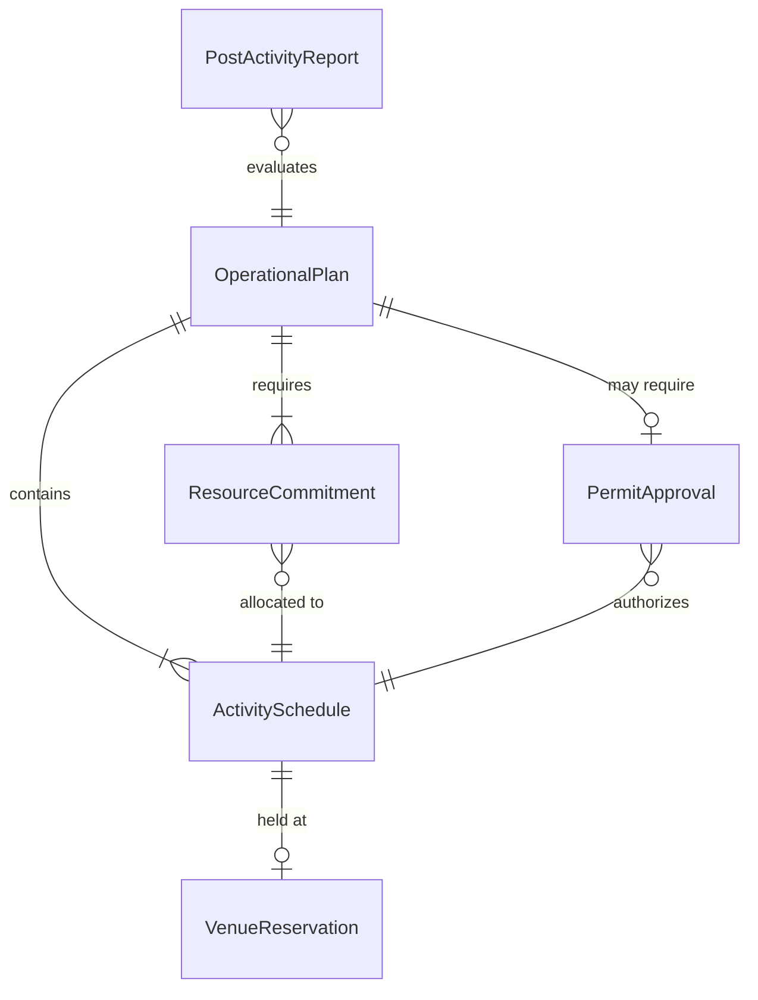
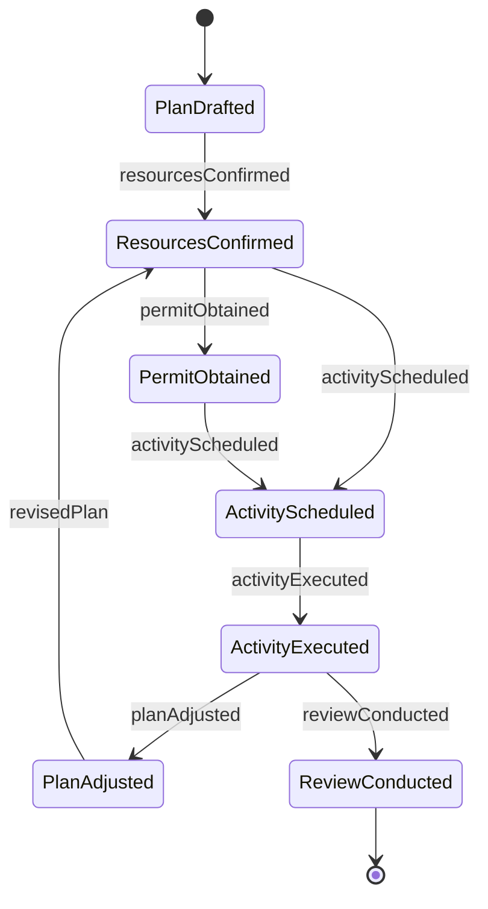
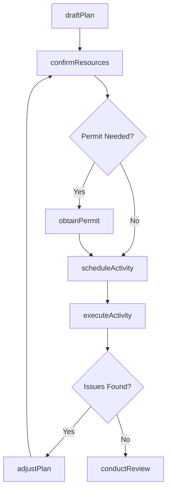
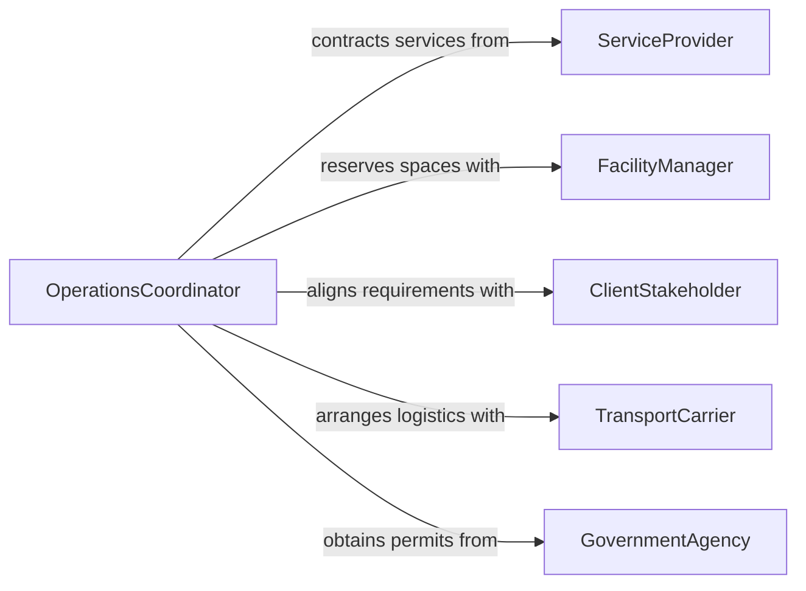

# Confer Others Conduct Arrange Operational

> Business-as-Code definition for conferring with others to conduct or arrange operational activities. Models the collaborative planning and coordination workflows required to organize, schedule, and execute day-to-day operational functions across teams.

## Overview

Conferring with others to conduct or arrange operational activities involves collaborating with colleagues, supervisors, and external parties to plan logistics, allocate resources, and sequence work for smooth execution of business operations. This definition captures the operational arrangement lifecycle from initial planning discussions through resource commitment, activity scheduling, and post-execution review. It enables organizations to coordinate complex multi-party operations by providing structured communication channels for planning, confirmation, and adjustment.

## Actors

| Actor | Description |
|-------|-------------|
| ServiceProvider | External party that delivers contracted services for operational activities |
| FacilityManager | Controls access to venues, equipment, and physical spaces |
| ClientStakeholder | External customer or partner whose requirements drive operational arrangements |
| TransportCarrier | Provides transportation and logistics services for operational activities |
| GovernmentAgency | Issues permits or approvals required for certain operational activities |

## Roles

| Role | Description |
|------|-------------|
| OperationsCoordinator | Organizes and sequences operational activities across teams |
| ResourcePlanner | Manages allocation of personnel, equipment, and budget to activities |
| ActivityLead | Directs execution of a specific operational activity |
| AdminSupport | Handles scheduling, documentation, and logistics for operational arrangements |

## Entities

| Entity | Description |
|--------|-------------|
| OperationalPlan | A structured outline of activities, timelines, and resource needs |
| ActivitySchedule | The confirmed date, time, and location for an operational activity |
| ResourceCommitment | A confirmed allocation of personnel, equipment, or budget |
| VenueReservation | A booking for a physical space needed for an activity |
| PermitApproval | An authorization required before an activity can proceed |
| PostActivityReport | A summary of outcomes and lessons learned after execution |

## Actions

| Action | Description |
|--------|-------------|
| draftPlan | Create an initial operational plan outlining activities and resources |
| confirmResources | Secure commitments from personnel, vendors, and equipment providers |
| scheduleActivity | Set the date, time, and location for an operational activity |
| obtainPermit | Request and secure required approvals or permits |
| executeActivity | Carry out the planned operational activity |
| adjustPlan | Modify the operational plan in response to changes or constraints |
| conductReview | Assess outcomes and document lessons learned after execution |

## Events

| Event | Description |
|-------|-------------|
| planDrafted | An initial operational plan has been created |
| resourcesConfirmed | Personnel, vendors, and equipment have been secured |
| activityScheduled | An operational activity has been given a confirmed time and place |
| permitObtained | A required approval or permit has been secured |
| activityExecuted | The planned operational activity has been carried out |
| planAdjusted | The operational plan has been modified due to changes |
| reviewConducted | Post-activity outcomes have been assessed and documented |

## Searches

| Search | Description |
|--------|-------------|
| findOperationalPlans | List operational plans by status, date range, or coordinator |
| getResourceAvailability | Check availability of personnel, equipment, or venues |
| getPendingPermits | Find permit requests that are still awaiting approval |
| getActivityHistory | Retrieve past operational activities and their outcomes |

## Entity Relationships



## State Diagram



## Workflow



## Actor Relationships



## Usage

### Calling Actions

```typescript
import { conferOthersConductArrangeOperational } from '@headlessly/confer-others-conduct-arrange-operational'

const operations = conferOthersConductArrangeOperational()

// Draft an operational plan for a corporate relocation
const plan = await operations.draftPlan({
  title: 'Office Relocation - Building C to Building D',
  activities: [
    { name: 'IT infrastructure setup', leadTime: '2 weeks' },
    { name: 'Furniture transport', leadTime: '3 days' },
    { name: 'Employee move-in coordination', leadTime: '1 week' }
  ],
  targetDate: '2026-03-15',
  coordinator: 'ops-coordinator-kim'
})

// Confirm resource commitments
await operations.confirmResources({
  planId: plan.id,
  resources: [
    { type: 'vendor', name: 'IT Systems Inc', service: 'network-setup' },
    { type: 'personnel', count: 8, role: 'moving-crew' },
    { type: 'equipment', items: ['cargo-van-x2', 'dolly-x10'] }
  ]
})

// Schedule the main activity
await operations.scheduleActivity({
  planId: plan.id,
  activity: 'Furniture transport',
  date: '2026-03-14',
  startTime: '07:00',
  venue: 'Building D - Loading Dock',
  assignedLead: 'activity-lead-martinez'
})
```

### Event-Driven Automation

```typescript
// Notify stakeholders when resources are confirmed
operations.resourcesConfirmed(async ({ planId, title, resources }) => {
  await notify({
    to: 'client-stakeholder',
    message: `All resources confirmed for "${title}": ${resources.length} commitments secured`
  })
})

// Auto-schedule review meeting after activity execution
operations.activityExecuted(async ({ planId, activity }) => {
  await operations.conductReview({
    planId,
    activity,
    reviewDate: addDays(new Date(), 3).toISOString(),
    participants: ['operations-coordinator', 'activity-lead', 'client-stakeholder']
  })
})
```
