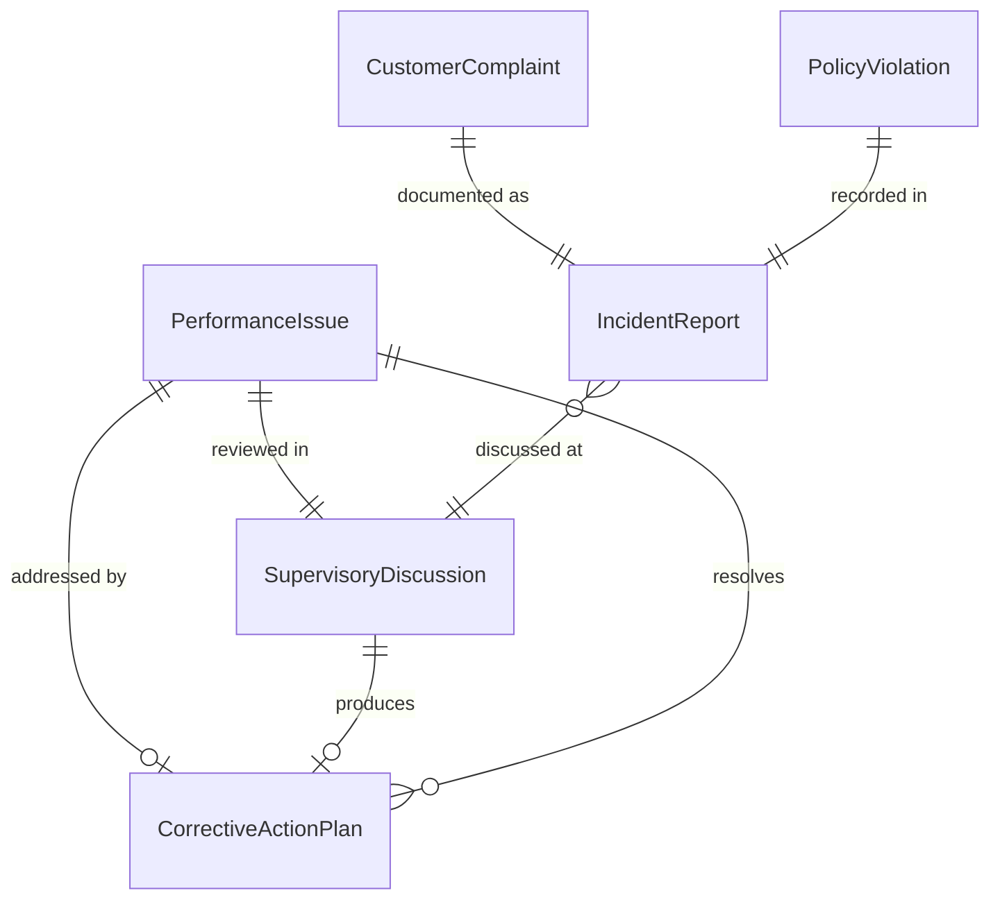
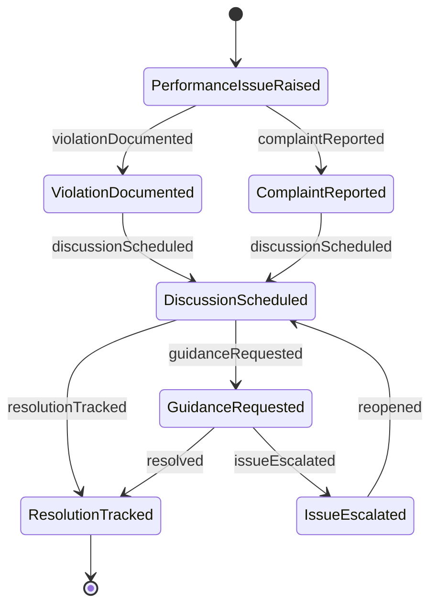
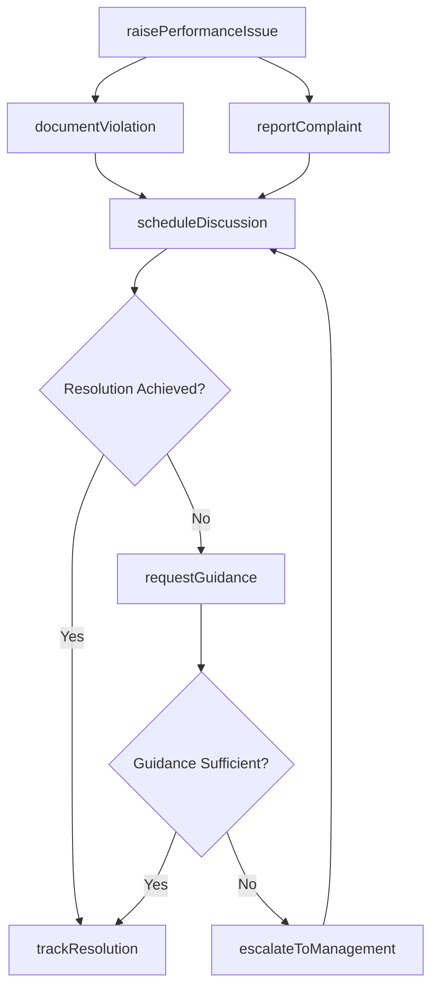
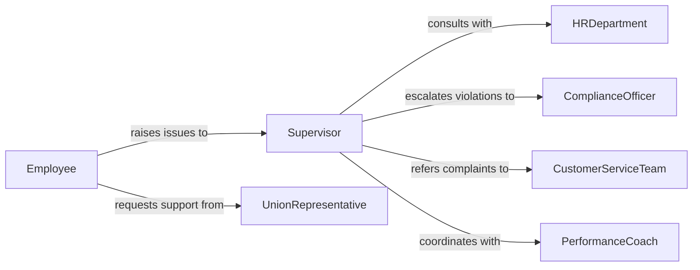

# Discuss Performance Complaints Violations Supervisors

> Business-as-Code definition for discussing performance issues, complaints, and policy violations with supervisory personnel. Models escalation workflows and documentation tracking for workplace concerns.

## Overview

Performance and compliance discussions with supervisors involve raising concerns about work quality, customer complaints, or policy violations requiring management attention. This definition provides actions for initiating discussions, documenting issues, and tracking resolutions through formal supervisory channels.

## Actors

| Actor | Description |
|-------|-------------|
| HRDepartment | Provides guidance on personnel policies and violation procedures |
| ComplianceOfficer | Reviews policy violations and regulatory compliance issues |
| UnionRepresentative | Represents employee interests in performance discussions |
| LegalCounsel | Advises on employment law matters and liability exposure |
| CustomerServiceTeam | Escalates customer complaints to supervisory review |
| QualityAssurance | Reports performance deficiencies requiring corrective action |

## Roles

| Role | Description |
|------|-------------|
| Employee | Reports performance concerns or violations to supervisor |
| Supervisor | Receives and addresses performance and compliance issues |
| DepartmentManager | Reviews escalated issues and determines corrective actions |
| PerformanceCoach | Provides guidance on improvement strategies |

## Entities

| Entity | Description |
|--------|-------------|
| PerformanceIssue | A documented concern about work quality or productivity |
| CustomerComplaint | A formal complaint from a customer requiring resolution |
| PolicyViolation | An instance of non-compliance with organizational policies |
| SupervisoryDiscussion | A formal conversation between employee and supervisor |
| CorrectiveActionPlan | A structured plan for addressing performance deficiencies |
| IncidentReport | A detailed record of a specific violation or concern |

## Actions

| Action | Description |
|--------|-------------|
| raisePerformanceIssue | Initiate discussion with supervisor about performance concern |
| reportComplaint | Escalate customer complaint to supervisory review |
| documentViolation | Record policy violation requiring supervisory attention |
| scheduleDiscussion | Arrange formal meeting to address concerns |
| requestGuidance | Seek supervisory input on handling a workplace issue |
| trackResolution | Monitor progress on addressing reported concerns |
| escalateToManagement | Elevate unresolved issue to higher management level |

## Events

| Event | Description |
|-------|-------------|
| performanceIssueRaised | A performance concern has been reported to supervisor |
| complaintReported | A customer complaint has been escalated |
| violationDocumented | A policy violation has been formally recorded |
| discussionScheduled | A supervisory meeting has been arranged |
| guidanceRequested | Employee has requested supervisory input |
| resolutionTracked | Progress update on addressing concern has been logged |
| issueEscalated | Concern has been elevated to higher management |

## Searches

| Search | Description |
|--------|-------------|
| findOpenIssues | List unresolved performance concerns and violations |
| getDiscussionHistory | Retrieve past supervisory discussions by employee or topic |
| getViolationsByType | Find policy violations grouped by category |
| getComplaintsByPeriod | Retrieve customer complaints within a date range |
| getPendingActions | List corrective action plans awaiting implementation |

## Entity Relationships



## State Diagram



## Workflow



## Actor Relationships



## Usage

### Calling Actions

```typescript
import { discussPerformanceComplaintsViolationsSupervisors } from '@headlessly/discuss-performance-complaints-violations-supervisors'

const supervisor = discussPerformanceComplaintsViolationsSupervisors()

// Report a performance issue to supervisor
const issue = await supervisor.raisePerformanceIssue({
  employeeId: 'emp-12345',
  supervisorId: 'sup-67890',
  issueType: 'quality',
  description: 'Recurring errors in data entry affecting downstream processes',
  severity: 'moderate'
})

// Document a policy violation
await supervisor.documentViolation({
  employeeId: 'emp-12345',
  policyCode: 'SAFETY-101',
  violationDate: '2026-02-04',
  description: 'Failed to wear required PPE in manufacturing area',
  witnesses: ['emp-22222', 'emp-33333']
})

// Schedule discussion with supervisor
const meeting = await supervisor.scheduleDiscussion({
  issueId: issue.id,
  supervisorId: 'sup-67890',
  scheduledFor: '2026-02-07T14:00:00Z',
  agenda: 'Review data entry quality issues and develop improvement plan'
})
```

### Event-Driven Automation

```typescript
// Notify HR when policy violation is documented
supervisor.violationDocumented(async ({ violation, employeeId }) => {
  if (violation.severity === 'critical') {
    await notifyHR({
      subject: `Critical Policy Violation: ${violation.policyCode}`,
      employeeId,
      details: violation
    })
  }
})

// Auto-escalate unresolved issues after threshold period
supervisor.resolutionTracked(async ({ issueId, daysSinceReported }) => {
  if (daysSinceReported > 14 && status === 'unresolved') {
    await supervisor.escalateToManagement({
      issueId,
      reason: 'Unresolved after 14 days',
      escalateTo: 'department-manager'
    })
  }
})
```
