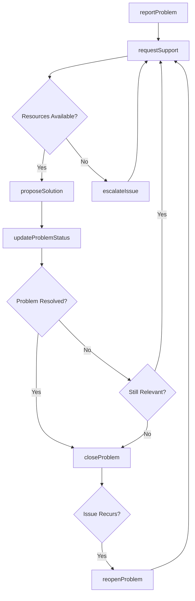
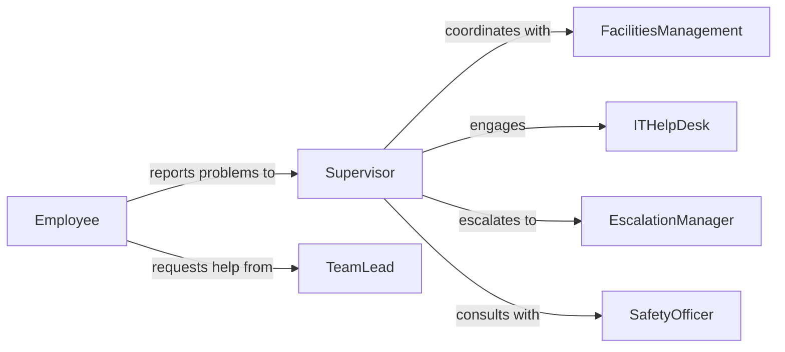

# Discuss Problems Issues Supervisors

> Business-as-Code definition for escalating operational problems and workplace issues to supervisory personnel. Models problem reporting, resolution tracking, and management communication workflows.

## Overview

Problem discussions with supervisors involve raising operational challenges, resource constraints, or workplace obstacles requiring management intervention. This definition exposes actions for reporting issues, requesting support, and collaborating with supervisors to resolve blockers affecting work progress.

## Actors

| Actor | Description |
|-------|-------------|
| FacilitiesManagement | Addresses physical workspace and equipment issues |
| ITHelpDesk | Resolves technology and systems problems |
| Vendor | Provides external products or services requiring troubleshooting |
| SafetyOfficer | Responds to workplace safety concerns |
| LegalDepartment | Advises on compliance or liability issues |
| FinanceTeam | Addresses budget or procurement problems |

## Roles

| Role | Description |
|------|-------------|
| Employee | Reports problems requiring supervisory attention |
| Supervisor | Receives problem reports and coordinates resolutions |
| TeamLead | Facilitates problem-solving within work groups |
| EscalationManager | Handles issues requiring senior management intervention |

## Entities

| Entity | Description |
|--------|-------------|
| Problem | An operational issue impeding work progress |
| IssueReport | A formal documentation of a workplace problem |
| Resolution | The outcome or solution to a reported issue |
| ResourceRequest | A request for additional resources to address problems |
| WorkBlocker | An obstacle preventing task completion |
| EscalationPath | The chain of supervisory contacts for issue resolution |

## Actions

| Action | Description |
|--------|-------------|
| reportProblem | Submit an issue to supervisor for resolution |
| requestSupport | Ask supervisor for resources or assistance |
| updateProblemStatus | Provide progress update on ongoing issue |
| escalateIssue | Elevate problem to higher supervisory level |
| proposeSolution | Suggest approach to resolve reported problem |
| closeProblem | Mark issue as resolved and document outcome |
| reopenProblem | Reactivate previously closed issue if unresolved |

## Events

| Event | Description |
|-------|-------------|
| problemReported | An issue has been submitted to supervisor |
| supportRequested | Employee has asked for supervisory assistance |
| problemStatusUpdated | Progress information has been provided |
| issueEscalated | Problem has been elevated to higher management |
| solutionProposed | A resolution approach has been suggested |
| problemClosed | Issue has been marked as resolved |
| problemReopened | Previously closed issue has been reactivated |

## Searches

| Search | Description |
|--------|-------------|
| findActivePro blems | List unresolved issues by team or department |
| getProblemsByCategory | Retrieve issues grouped by problem type |
| getEscalatedIssues | Find problems elevated to management |
| getResolutionHistory | Retrieve past problem resolutions for reference |
| getBlockersBySeverity | List work blockers ordered by impact level |

## Workflow



## Actor Relationships



## Usage

### Calling Actions

```typescript
import { discussProblemsIssuesSupervisors } from '@headlessly/discuss-problems-issues-supervisors'

const issues = discussProblemsIssuesSupervisors()

// Report an operational problem to supervisor
const problem = await issues.reportProblem({
  employeeId: 'emp-12345',
  supervisorId: 'sup-67890',
  category: 'equipment',
  title: 'Production line conveyor belt malfunction',
  description: 'Belt slips intermittently causing 15-minute delays per shift',
  severity: 'high',
  impactedOperations: ['assembly-line-3']
})

// Request supervisory support
await issues.requestSupport({
  problemId: problem.id,
  supportType: 'resources',
  requestedResources: ['maintenance-technician', 'replacement-parts'],
  urgency: 'immediate'
})

// Propose a solution
await issues.proposeSolution({
  problemId: problem.id,
  proposedBy: 'emp-12345',
  solution: 'Replace worn belt tensioner and realign pulley system',
  estimatedCost: 850,
  estimatedDowntime: '4 hours'
})
```

### Event-Driven Automation

```typescript
// Auto-escalate high-severity problems not resolved within threshold
issues.problemReported(async ({ problemId, severity, reportedAt }) => {
  if (severity === 'critical') {
    setTimeout(async () => {
      const status = await issues.getProblemStatus(problemId)
      if (status !== 'resolved') {
        await issues.escalateIssue({
          problemId,
          reason: 'Critical issue unresolved after 2 hours',
          escalateTo: 'operations-director'
        })
      }
    }, 2 * 60 * 60 * 1000) // 2 hours
  }
})

// Notify relevant teams when support is requested
issues.supportRequested(async ({ problemId, supportType, requestedResources }) => {
  if (supportType === 'resources' && requestedResources.includes('maintenance-technician')) {
    await notifyTeam({
      team: 'facilities-maintenance',
      subject: `Maintenance Support Requested - Problem ${problemId}`,
      priority: 'high'
    })
  }
})
```
