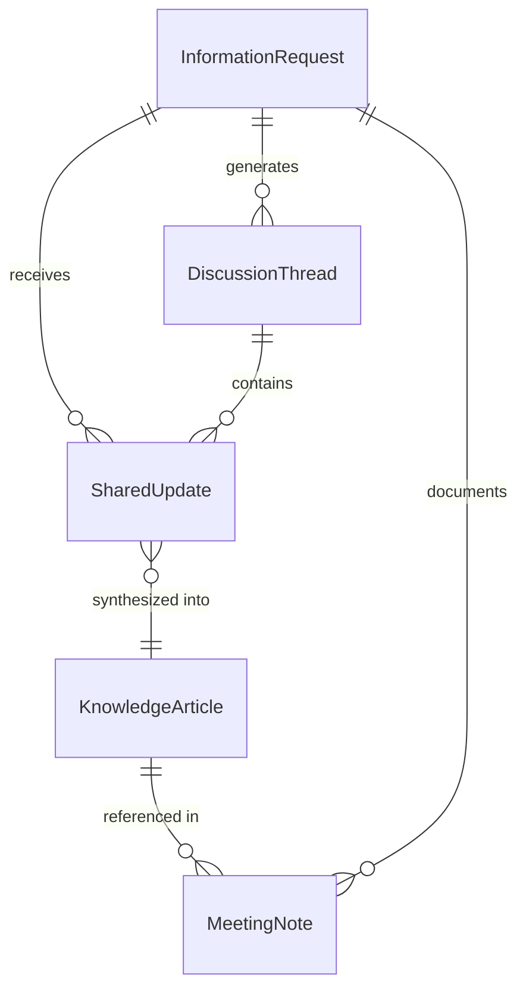
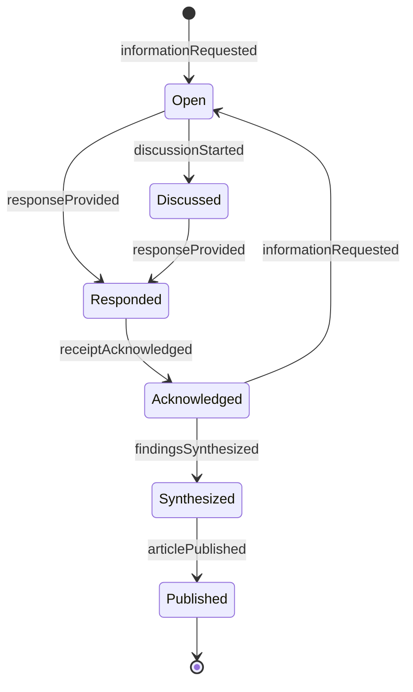
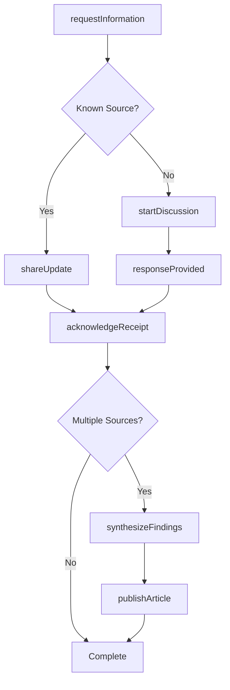
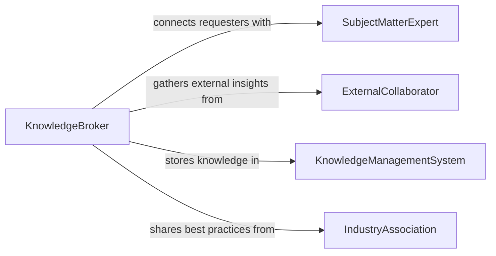

# Exchange Information Colleagues

> Business-as-Code definition for exchanging information with colleagues. Models the bidirectional communication workflows where professionals share knowledge, updates, and data with peers to support informed decision-making and coordinated action.

## Overview

Exchanging information with colleagues involves the reciprocal sharing of knowledge, status updates, observations, and data between peers within an organization. This definition captures the information exchange lifecycle from identifying information needs through sharing, receiving, validating, and acting on shared knowledge. It enables teams to maintain situational awareness, reduce information asymmetry, and support collaborative problem-solving by providing structured channels for professional information sharing.

## Actors

| Actor | Description |
|-------|-------------|
| ExternalCollaborator | A professional from a partner organization who shares cross-organizational information |
| IndustryAssociation | Provides benchmarking data and best practices for professional information exchange |
| KnowledgeManagementSystem | A centralized platform where shared information is stored and retrieved |
| ProfessionalNetwork | External community of practice where industry knowledge is exchanged |

## Roles

| Role | Description |
|------|-------------|
| SubjectMatterExpert | Possesses deep domain knowledge and shares insights with colleagues |
| InformationRequester | Identifies an information need and seeks input from peers |
| KnowledgeBroker | Facilitates connections between people who have and need information |
| TeamCoordinator | Ensures information flows effectively within and across teams |

## Entities

| Entity | Description |
|--------|-------------|
| InformationRequest | A formal or informal ask for specific knowledge or data |
| SharedUpdate | A status report or knowledge contribution shared with colleagues |
| KnowledgeArticle | A documented piece of expertise stored for reuse |
| DiscussionThread | An asynchronous conversation around a specific topic or question |
| MeetingNote | A structured record of information exchanged during a meeting |

## Actions

| Action | Description |
|--------|-------------|
| requestInformation | Ask colleagues for specific knowledge, data, or input |
| shareUpdate | Provide a status report or knowledge contribution to peers |
| publishArticle | Create and share a documented piece of expertise for team reference |
| startDiscussion | Initiate an asynchronous conversation on a topic requiring input |
| acknowledgeReceipt | Confirm that shared information has been received and understood |
| synthesizeFindings | Combine inputs from multiple colleagues into a consolidated summary |

## Events

| Event | Description |
|-------|-------------|
| informationRequested | A request for specific knowledge has been made |
| updateShared | A status report or knowledge contribution has been provided |
| articlePublished | A new knowledge article has been created and shared |
| discussionStarted | An asynchronous conversation has been initiated |
| receiptAcknowledged | Shared information has been confirmed as received |
| findingsSynthesized | Inputs from multiple sources have been consolidated |
| responseProvided | A colleague has responded to an information request |

## Searches

| Search | Description |
|--------|-------------|
| findOpenRequests | List unanswered information requests by topic, urgency, or requester |
| getKnowledgeArticles | Search published articles by topic, author, or date |
| getDiscussionThreads | Find active discussion threads by topic or participants |

## Entity Relationships



## State Diagram



## Workflow



## Actor Relationships



## Usage

### Calling Actions

```typescript
import { exchangeInformationColleagues } from '@headlessly/exchange-information-colleagues'

const exchange = exchangeInformationColleagues()

// Request information from colleagues
const request = await exchange.requestInformation({
  topic: 'Cloud migration cost benchmarks',
  description: 'Looking for actual cost data from teams that have migrated to cloud infrastructure in the past 12 months',
  urgency: 'medium',
  requestedBy: 'analyst-wong',
  targetAudience: ['infrastructure-team', 'finance-team']
})

// Share an update in response
await exchange.shareUpdate({
  requestId: request.id,
  content: 'Our team spent $340K migrating 12 workloads over 6 months. Main cost drivers were data transfer and retraining.',
  sharedBy: 'engineer-kowalski',
  attachments: ['cloud-migration-cost-breakdown.xlsx']
})

// Publish a knowledge article from synthesized findings
await exchange.publishArticle({
  title: 'Cloud Migration Cost Benchmarks - Internal Survey Results',
  content: 'Based on responses from 4 teams, average migration cost is $28K per workload...',
  tags: ['cloud', 'migration', 'cost-analysis'],
  author: 'analyst-wong'
})
```

### Event-Driven Automation

```typescript
// Notify subject matter experts when their domain is requested
exchange.informationRequested(async ({ topic, targetAudience, urgency }) => {
  for (const audience of targetAudience) {
    await notify({
      to: audience,
      message: `Information requested on "${topic}" (${urgency} priority)`
    })
  }
})

// Auto-prompt synthesis when multiple responses are received
exchange.responseProvided(async ({ requestId }) => {
  const responses = await exchange.findOpenRequests({ requestId })
  if (responses.responseCount >= 3) {
    await notify({
      to: responses.requestedBy,
      message: `${responses.responseCount} responses received for your request. Consider synthesizing findings.`
    })
  }
})
```
