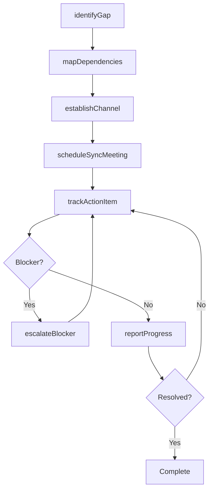
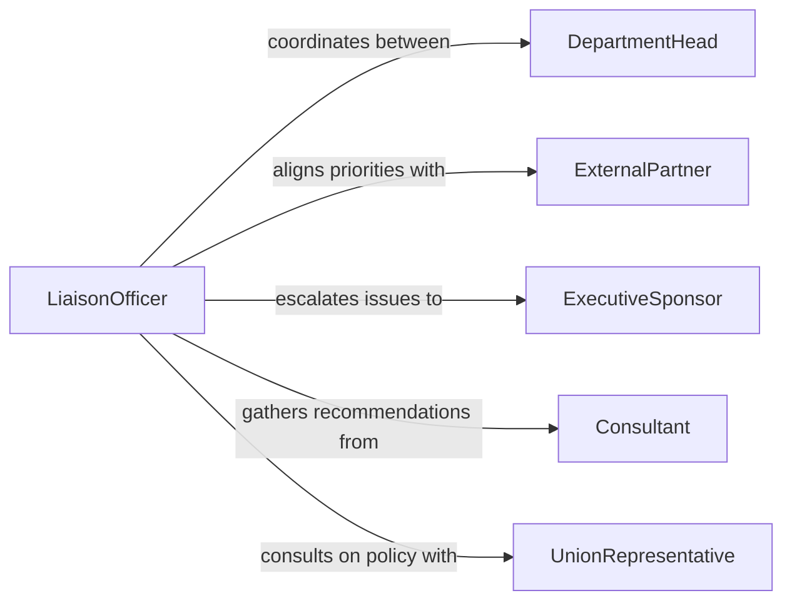

# Liaise Between Departments Groups Improve

> Business-as-Code definition for liaising between departments or groups to improve function or communication. Models the cross-functional coordination workflows that bridge organizational silos and enhance inter-team collaboration.

## Overview

Liaising between departments or other groups to improve function or communication involves serving as a bridge across organizational boundaries to facilitate information sharing, resolve inter-team dependencies, and align on shared objectives. This definition captures the coordination lifecycle from identifying communication gaps through establishing regular touchpoints and tracking cross-functional initiatives. It enables organizations to reduce silos, streamline handoffs, and ensure that interdependent teams maintain alignment on priorities and timelines.

## Actors

| Actor | Description |
|-------|-------------|
| DepartmentHead | Leads a functional area and sets team priorities |
| ExternalPartner | Outside organization that requires coordination with internal teams |
| ExecutiveSponsor | Senior leader who authorizes cross-functional initiatives |
| Consultant | External advisor brought in to assess and improve inter-team processes |
| UnionRepresentative | Represents workforce interests in cross-departmental policy changes |

## Roles

| Role | Description |
|------|-------------|
| LiaisonOfficer | Serves as the primary point of contact between departments |
| ProjectCoordinator | Manages cross-functional project timelines and deliverables |
| ProcessAnalyst | Identifies inefficiencies in inter-departmental workflows |
| CommunicationsLead | Designs and maintains internal communication channels and protocols |

## Entities

| Entity | Description |
|--------|-------------|
| CrossFunctionalInitiative | A coordinated effort spanning multiple departments |
| CommunicationChannel | A defined pathway for sharing information between groups |
| DependencyMap | A record of inter-team dependencies and handoff points |
| StakeholderRegistry | A list of key contacts and their roles across departments |
| MeetingCadence | A recurring schedule of cross-departmental sync meetings |
| ActionItem | A specific task arising from cross-functional coordination |

## Actions

| Action | Description |
|--------|-------------|
| identifyGap | Detect a communication or process gap between departments |
| establishChannel | Create a new formal communication pathway between groups |
| scheduleSyncMeeting | Set up recurring cross-departmental coordination meetings |
| mapDependencies | Document inter-team dependencies and handoff points |
| escalateBlocker | Raise an unresolved cross-functional issue to leadership |
| trackActionItem | Record and monitor a specific follow-up task between teams |
| reportProgress | Share status updates on cross-functional initiatives with stakeholders |

## Events

| Event | Description |
|-------|-------------|
| gapIdentified | A communication or process gap has been detected |
| channelEstablished | A new inter-departmental communication pathway has been created |
| syncMeetingScheduled | A recurring cross-departmental meeting has been set up |
| dependenciesMapped | Inter-team dependencies have been documented |
| blockerEscalated | An unresolved issue has been raised to leadership |
| actionItemCompleted | A cross-functional follow-up task has been resolved |
| progressReported | Status on a cross-functional initiative has been shared |

## Searches

| Search | Description |
|--------|-------------|
| findInitiatives | List cross-functional initiatives by status, department, or sponsor |
| getBlockers | Retrieve unresolved blockers between departments |
| getActionItems | Look up open action items by department or assignee |
| getDependencies | Find inter-team dependencies for a given project or department |

## Workflow



## Actor Relationships



## Usage

### Calling Actions

```typescript
import { liaiseBetweenDepartmentsGroupsImprove } from '@headlessly/liaise-between-departments-groups-improve'

const liaison = liaiseBetweenDepartmentsGroupsImprove()

// Identify a communication gap between teams
const gap = await liaison.identifyGap({
  departments: ['Engineering', 'Product Management'],
  description: 'No formal handoff process for feature requirements',
  impact: 'Frequent rework due to misunderstood specifications'
})

// Establish a new communication channel
await liaison.establishChannel({
  gapId: gap.id,
  type: 'shared-workspace',
  name: 'Engineering-Product Requirements Channel',
  participants: ['engineering-leads', 'product-managers']
})

// Schedule recurring sync meetings
await liaison.scheduleSyncMeeting({
  departments: ['Engineering', 'Product Management'],
  frequency: 'weekly',
  day: 'Tuesday',
  time: '10:00',
  agenda: ['Requirements review', 'Blocker triage', 'Sprint alignment']
})
```

### Event-Driven Automation

```typescript
// Alert leadership when blockers are escalated
liaison.blockerEscalated(async ({ initiative, departments, description }) => {
  await notify({
    to: 'executive-sponsor',
    message: `Cross-functional blocker between ${departments.join(' and ')}: ${description}`
  })
})

// Auto-generate progress reports after action items are completed
liaison.actionItemCompleted(async ({ initiativeId, completedItems, totalItems }) => {
  const percentComplete = Math.round((completedItems / totalItems) * 100)
  if (percentComplete % 25 === 0) {
    await liaison.reportProgress({
      initiativeId,
      summary: `${percentComplete}% of action items completed`
    })
  }
})
```
