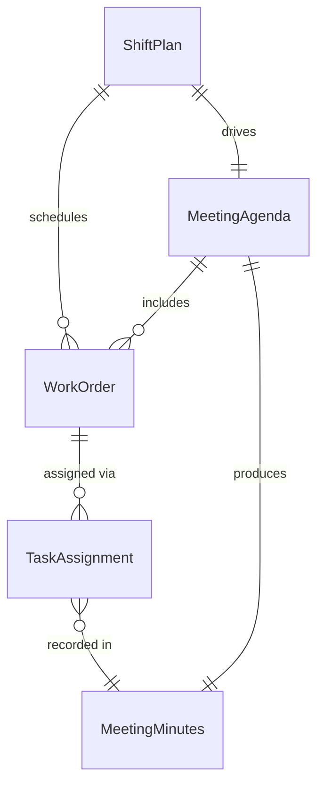
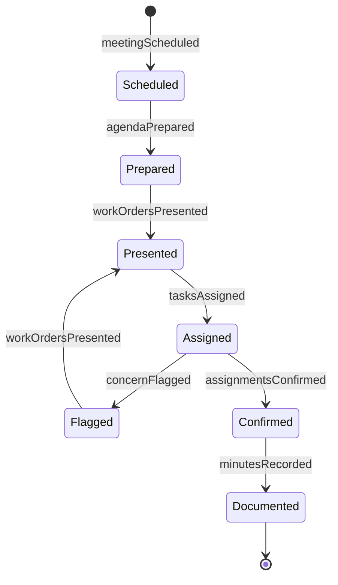
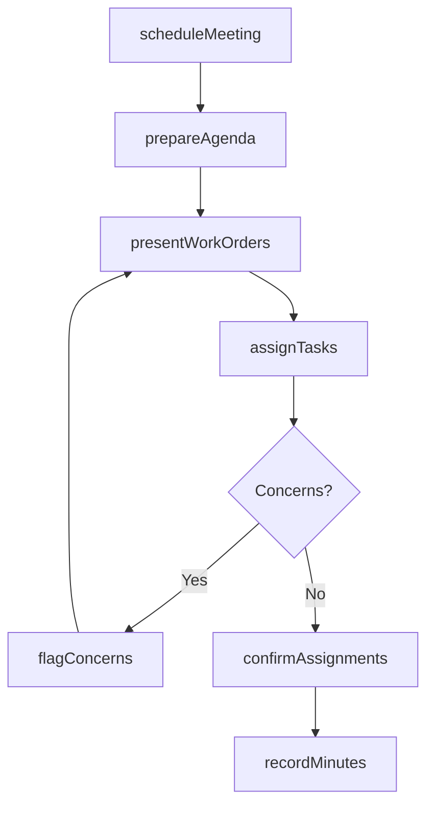
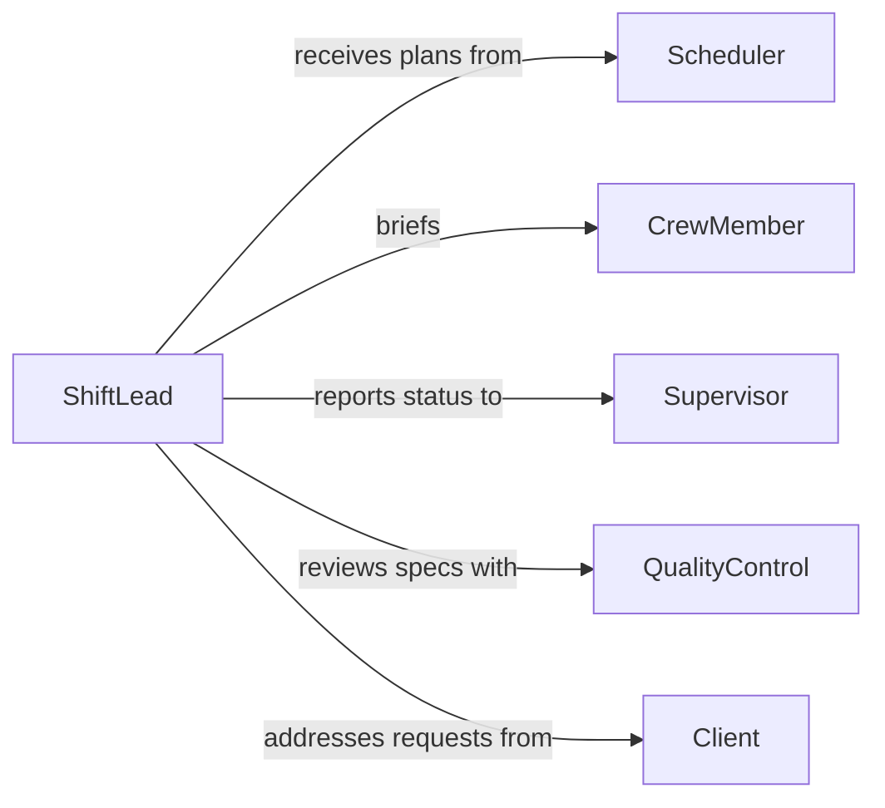

# Meet Coworkers Communicate Work Orders

> Business-as-Code definition for meeting with coworkers to communicate work orders or plans. Models the full cycle of scheduling meetings, distributing work orders, discussing priorities, and confirming task assignments.

## Overview

Meeting with coworkers to communicate work orders and plans is a foundational operational activity that ensures teams understand their assignments, priorities, and deadlines. This definition covers the scheduling of crew briefings, distribution of work order details, discussion of sequencing and dependencies, and formal acknowledgment of task ownership. It applies across maintenance, construction, manufacturing, and service operations where daily or shift-based coordination is required.

## Actors

| Actor | Description |
|-------|-------------|
| Supervisor | Prepares and presents work orders to crew members |
| CrewMember | Receives work assignments and confirms understanding |
| Scheduler | Develops the work plan and sequencing of tasks |
| QualityControl | Provides specifications and acceptance criteria for work |
| Client | Originates service requests that generate work orders |

## Roles

| Role | Description |
|------|-------------|
| ShiftLead | Conducts briefings and distributes daily work assignments |
| Planner | Prepares work order packages with instructions and materials lists |
| TeamMember | Executes assigned work and reports back on progress |
| SafetyOfficer | Reviews hazard information before work begins |

## Entities

| Entity | Description |
|--------|-------------|
| WorkOrder | A documented set of instructions for a specific task or job |
| MeetingAgenda | The list of topics, work orders, and priorities to discuss |
| TaskAssignment | The formal pairing of a crew member with a specific work order |
| ShiftPlan | The overall schedule of work for a shift or day |
| MeetingMinutes | A record of decisions, assignments, and action items from the meeting |

## Actions

| Action | Description |
|--------|-------------|
| scheduleMeeting | Set a time, location, and attendee list for a crew briefing |
| prepareAgenda | Compile work orders, priorities, and safety notes into a meeting agenda |
| presentWorkOrders | Walk the crew through each work order and its requirements |
| assignTasks | Formally designate crew members to specific work orders |
| recordMinutes | Document decisions, assignments, and open items from the meeting |
| confirmAssignments | Obtain acknowledgment from crew members that they understand their tasks |
| flagConcerns | Raise questions or issues about a work order during the meeting |

## Events

| Event | Description |
|-------|-------------|
| meetingScheduled | A crew briefing has been placed on the calendar |
| agendaPrepared | The meeting agenda with work orders has been compiled |
| workOrdersPresented | Work orders have been reviewed with the crew |
| tasksAssigned | Crew members have been matched to work orders |
| minutesRecorded | Meeting notes and action items have been documented |
| assignmentsConfirmed | All crew members have acknowledged their assignments |
| concernFlagged | A crew member has raised an issue about a work order |

## Searches

| Search | Description |
|--------|-------------|
| findUpcomingMeetings | List scheduled briefings by date, shift, or team |
| getWorkOrdersByShift | Retrieve work orders assigned to a specific shift or crew |
| getMeetingHistory | Look up past meeting minutes and assignment records |
| getPendingAssignments | Find work orders that have not yet been acknowledged by crew |

## Entity Relationships



## State Diagram



## Workflow



## Actor Relationships



## Usage

### Calling Actions

```typescript
import { meetCoworkersCommunicateWorkOrders } from '@headlessly/meet-coworkers-communicate-work-orders'

const meetings = meetCoworkersCommunicateWorkOrders()

// Schedule a morning crew briefing
const meeting = await meetings.scheduleMeeting({
  date: '2026-03-10',
  time: '07:00',
  location: 'Shop Floor Conference Room',
  attendees: ['crew-alpha', 'crew-bravo']
})

// Prepare the agenda with work orders
await meetings.prepareAgenda({
  meetingId: meeting.id,
  workOrders: ['WO-1190', 'WO-1191', 'WO-1192'],
  safetyNotes: ['Lockout/tagout required on Line 4']
})

// Assign tasks to crew members
await meetings.assignTasks({
  meetingId: meeting.id,
  assignments: [
    { workOrderId: 'WO-1190', assignee: 'tech-301' },
    { workOrderId: 'WO-1191', assignee: 'tech-302' },
    { workOrderId: 'WO-1192', assignee: 'tech-303' }
  ]
})
```

### Event-Driven Automation

```typescript
// Auto-distribute agenda before the meeting
meetings.meetingScheduled(async ({ meetingId, attendees, date }) => {
  const agenda = await meetings.prepareAgenda({ meetingId })
  await distribute({
    to: attendees,
    subject: `Crew Briefing Agenda - ${date}`,
    content: agenda
  })
})

// Alert supervisor when a concern is flagged
meetings.concernFlagged(async ({ meetingId, workOrderId, concern }) => {
  await notify({
    to: 'shift-supervisor',
    message: `Concern raised on ${workOrderId}: ${concern.description}`
  })
})
```
