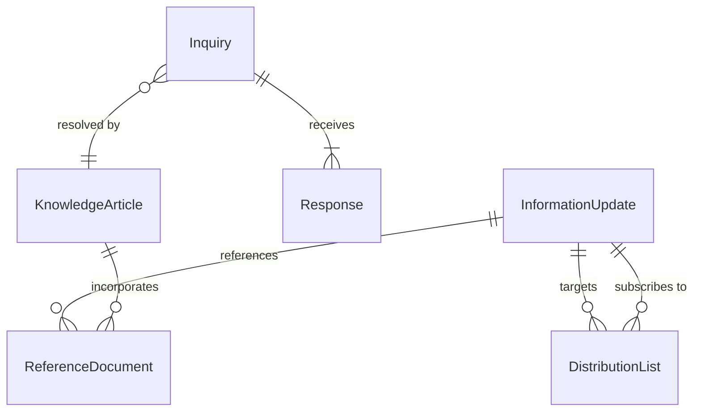
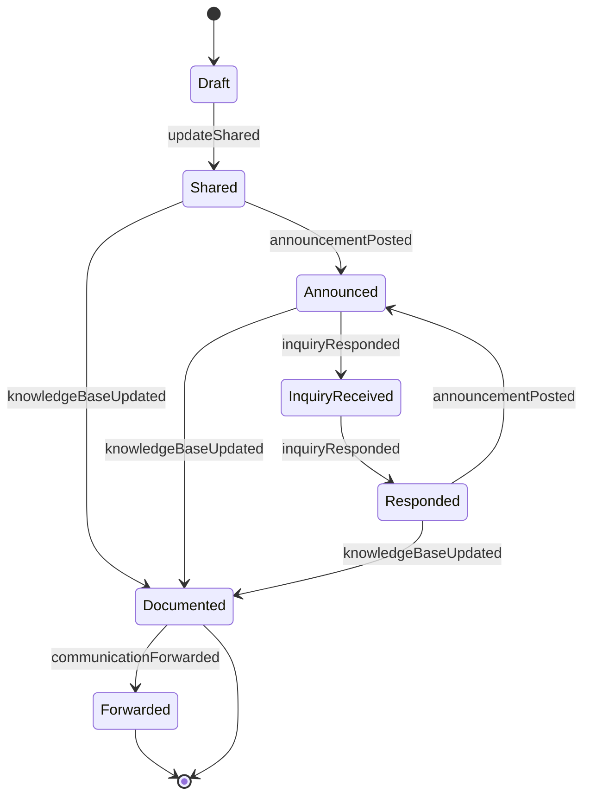
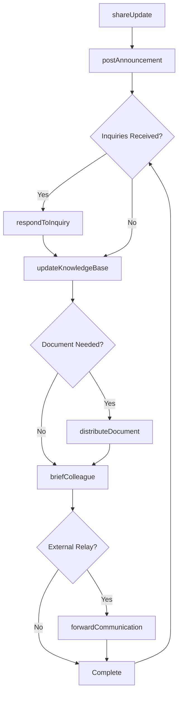
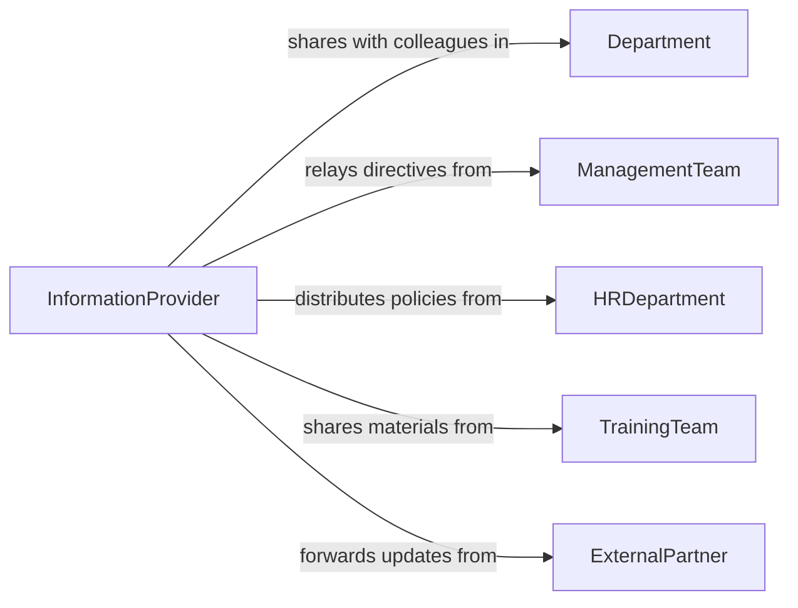

# Provide Information to Coworkers

> Business-as-Code definition for providing information to coworkers. Models the internal knowledge-sharing process where employees communicate relevant data, updates, procedures, and context to colleagues to support their work performance and decision-making.

## Overview

Providing information to coworkers involves sharing operational updates, distributing reference materials, answering colleague inquiries, forwarding relevant communications, and ensuring team members have the data they need to perform their roles. This definition covers knowledge transfer during onboarding, routine information sharing in team channels, ad-hoc technical consultations between peers, and cross-functional briefings, enabling organizations to maintain information flow and reduce knowledge silos.

## Actors

| Actor | Description |
|-------|-------------|
| Department | The organizational unit within which information is shared |
| ManagementTeam | Leadership that originates or approves information for distribution |
| HRDepartment | Provides policy and procedural information to be shared with staff |
| TrainingTeam | Develops materials and resources shared among coworkers |
| ExternalPartner | Outside entities whose updates need to be relayed internally |

## Roles

| Role | Description |
|------|-------------|
| InformationProvider | The individual sharing knowledge or data with colleagues |
| Recipient | The coworker receiving the information |
| KnowledgeManager | Organizes and maintains shared information repositories |
| TeamCoordinator | Facilitates information distribution across team members |

## Entities

| Entity | Description |
|--------|-------------|
| InformationUpdate | A communication containing new or revised data for coworkers |
| ReferenceDocument | A stored resource that coworkers can consult for guidance |
| Inquiry | A question from a coworker requesting specific information |
| Response | An answer provided to a coworker's inquiry |
| DistributionList | A group of colleagues designated to receive specific information |
| KnowledgeArticle | A documented explanation of a process, system, or topic |

## Actions

| Action | Description |
|--------|-------------|
| shareUpdate | Distribute new information or changes to coworkers |
| respondToInquiry | Answer a colleague's question with relevant information |
| distributeDocument | Send reference materials to appropriate coworkers |
| postAnnouncement | Publish information to a shared channel for all team members |
| briefColleague | Provide a one-on-one information update to a specific coworker |
| updateKnowledgeBase | Add or revise information in a shared repository |
| forwardCommunication | Relay an external or management message to relevant coworkers |

## Events

| Event | Description |
|-------|-------------|
| updateShared | New information has been distributed to coworkers |
| inquiryResponded | A colleague's question has been answered |
| documentDistributed | Reference materials have been sent to coworkers |
| announcementPosted | Information has been published to a shared channel |
| colleagueBriefed | A one-on-one information update has been delivered |
| knowledgeBaseUpdated | Shared repository information has been added or revised |
| communicationForwarded | An external message has been relayed to coworkers |

## Searches

| Search | Description |
|--------|-------------|
| findUpdates | List information updates by topic, sender, or date |
| getInquiries | Retrieve coworker questions by topic or status |
| findDocuments | Locate reference materials by subject or department |
| getAnnouncements | Find team announcements by date or channel |
| getKnowledgeArticles | Retrieve knowledge base entries by topic or author |

## Entity Relationships



## State Diagram



## Workflow



## Actor Relationships



## Usage

### Calling Actions

```typescript
import { provideInformationCoworkers } from '@headlessly/provide-information-coworkers'

const info = provideInformationCoworkers()

// Share a process update with the team
await info.shareUpdate({
  topic: 'Updated Expense Reporting Process',
  audience: 'finance-team',
  summary: 'New expense categories effective March 1 - travel meals now separated from client entertainment',
  attachments: ['expense-policy-v4.pdf', 'category-guide.xlsx'],
  urgency: 'normal'
})

// Respond to a coworker inquiry
await info.respondToInquiry({
  from: 'martinez-a',
  question: 'What is the approval threshold for equipment purchases?',
  response: 'Equipment purchases under $5,000 require manager approval; $5,000-$25,000 require director approval',
  reference: 'procurement-policy-section-4.2'
})

// Update the knowledge base
await info.updateKnowledgeBase({
  article: 'equipment-procurement-thresholds',
  revision: 'Updated to reflect 2026 approval limits',
  content: 'Manager: up to $5,000 | Director: $5,001-$25,000 | VP: $25,001+'
})
```

### Event-Driven Automation

```typescript
// Notify team when announcements are posted
info.announcementPosted(async ({ topic, channel }) => {
  await notify({
    to: channel,
    message: `New announcement: ${topic} - check the team channel for details`
  })
})

// Track unanswered inquiries
info.updateShared(async ({ topic, audience }) => {
  await notify({
    to: 'knowledge-manager',
    message: `Information update shared on ${topic} - monitor for follow-up questions`
  })
})
```
