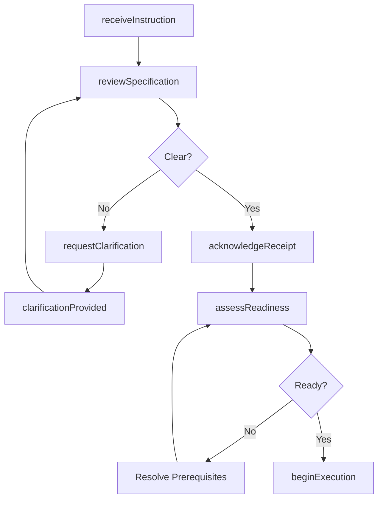
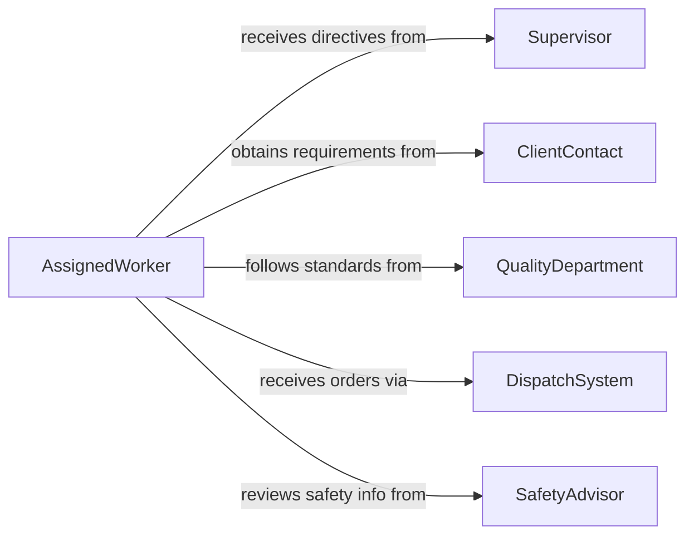

# Receive Information Instructions Performing Work

> Business-as-Code definition for receiving information or instructions for performing work assignments. Models the inbound communication workflows where workers obtain directives, specifications, and guidance needed to execute their tasks.

## Overview

Receiving information or instructions for performing work assignments involves accepting work directives, technical specifications, procedural guidance, and contextual information from supervisors, clients, or automated systems. This definition captures the instruction receipt lifecycle from initial notification through review, clarification, acknowledgment, and execution readiness. It enables workers to systematically intake, validate, and confirm understanding of work instructions before beginning execution, reducing errors caused by miscommunication or incomplete information.

## Actors

| Actor | Description |
|-------|-------------|
| Supervisor | Issues work assignments and provides operational direction |
| ClientContact | Supplies project requirements and specifications that define work scope |
| QualityDepartment | Provides standards and inspection criteria that guide work execution |
| DispatchSystem | An automated system that routes work orders to assigned personnel |
| SafetyAdvisor | Communicates safety precautions and hazard information related to assignments |

## Roles

| Role | Description |
|------|-------------|
| AssignedWorker | Receives and executes work instructions |
| ShiftSupervisor | Issues work directives and clarifies requirements |
| TechnicalWriter | Creates and maintains standard operating procedures |
| TrainingCoordinator | Ensures workers are qualified to receive and execute specific instruction types |

## Entities

| Entity | Description |
|--------|-------------|
| WorkInstruction | A directive specifying what work to perform and how |
| StandardOperatingProcedure | A documented step-by-step guide for completing a task |
| ClarificationRequest | A formal question about unclear or incomplete instructions |
| Acknowledgment | A confirmation that instructions have been received and understood |
| WorkAssignment | The formal allocation of a task to a specific worker |
| SpecificationDocument | Technical details and requirements attached to a work instruction |

## Actions

| Action | Description |
|--------|-------------|
| receiveInstruction | Accept and log an incoming work directive or assignment |
| reviewSpecification | Examine the technical details and requirements of an assignment |
| requestClarification | Ask for additional information about unclear instructions |
| acknowledgeReceipt | Confirm that instructions have been received and understood |
| assessReadiness | Verify that all tools, materials, and information are available to begin |
| beginExecution | Mark the transition from instruction receipt to active work |

## Events

| Event | Description |
|-------|-------------|
| instructionReceived | A work directive has been accepted and logged |
| specificationReviewed | Technical details of an assignment have been examined |
| clarificationRequested | A question about unclear instructions has been submitted |
| receiptAcknowledged | Instructions have been confirmed as received and understood |
| readinessAssessed | Availability of tools, materials, and information has been verified |
| executionBegun | The worker has transitioned from instruction receipt to active work |
| clarificationProvided | A response to a clarification request has been received |

## Searches

| Search | Description |
|--------|-------------|
| findPendingInstructions | List work instructions awaiting acknowledgment or review |
| getOpenClarifications | Retrieve unanswered clarification requests by worker or assignment |
| getAssignmentHistory | Look up past work assignments by worker, date, or type |
| getReadinessStatus | Check whether prerequisites are met for a pending assignment |

## Workflow



## Actor Relationships



## Usage

### Calling Actions

```typescript
import { receiveInformationInstructionsPerformingWork } from '@headlessly/receive-information-instructions-performing-work'

const instructions = receiveInformationInstructionsPerformingWork()

// Receive a new work instruction
const instruction = await instructions.receiveInstruction({
  title: 'Install electrical conduit on floors 3-5',
  issuedBy: 'supervisor-fernandez',
  assignedTo: 'electrician-park',
  priority: 'high',
  specifications: ['blueprint-elec-3F-5F.pdf', 'conduit-spec-sheet.pdf'],
  deadline: '2026-02-14'
})

// Review the attached specifications
await instructions.reviewSpecification({
  instructionId: instruction.id,
  reviewedBy: 'electrician-park',
  notes: 'Blueprint shows 3/4-inch conduit but spec sheet references 1-inch. Need clarification.'
})

// Request clarification on the discrepancy
await instructions.requestClarification({
  instructionId: instruction.id,
  question: 'Blueprint specifies 3/4-inch conduit but spec sheet says 1-inch. Which is correct for floors 3-5?',
  askedBy: 'electrician-park',
  urgency: 'high'
})
```

### Event-Driven Automation

```typescript
// Auto-acknowledge instructions from automated dispatch
instructions.instructionReceived(async ({ instructionId, source }) => {
  if (source === 'dispatch-system') {
    await instructions.acknowledgeReceipt({
      instructionId,
      acknowledgedBy: 'auto-ack',
      notes: 'Auto-acknowledged from dispatch system'
    })
  }
})

// Alert supervisor when clarifications remain unanswered
instructions.clarificationRequested(async ({ instructionId, question, urgency }) => {
  if (urgency === 'high') {
    await notify({
      to: 'shift-supervisor',
      message: `High-priority clarification needed on instruction ${instructionId}: ${question}`
    })
  }
})
```
