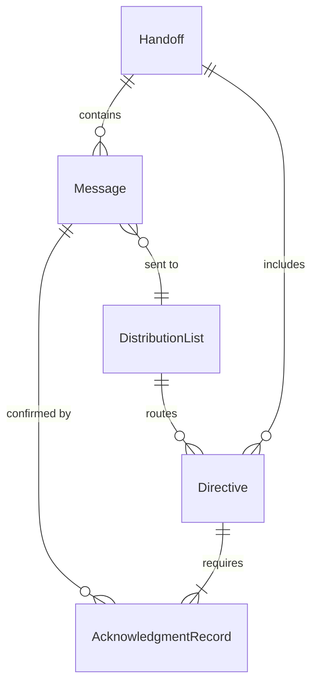
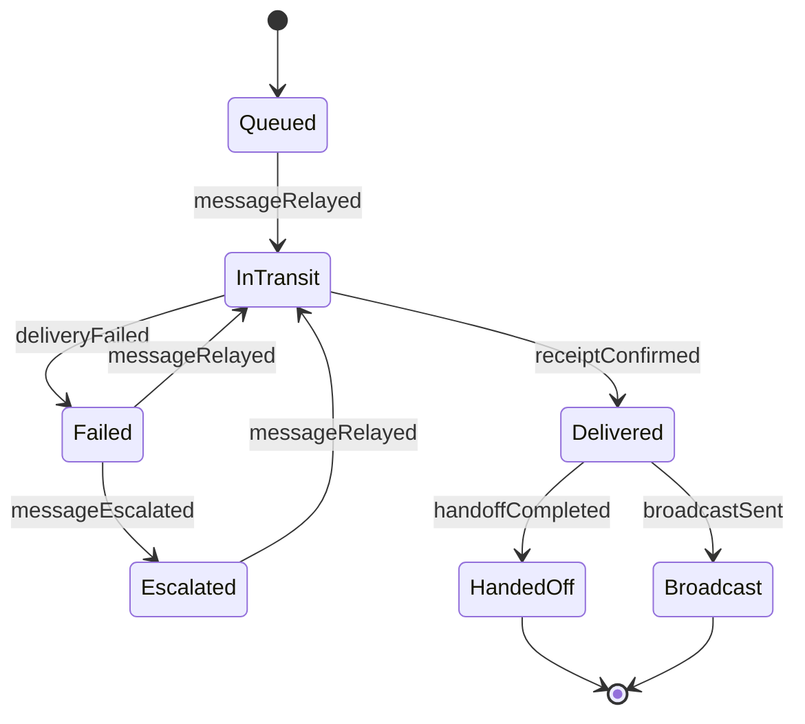
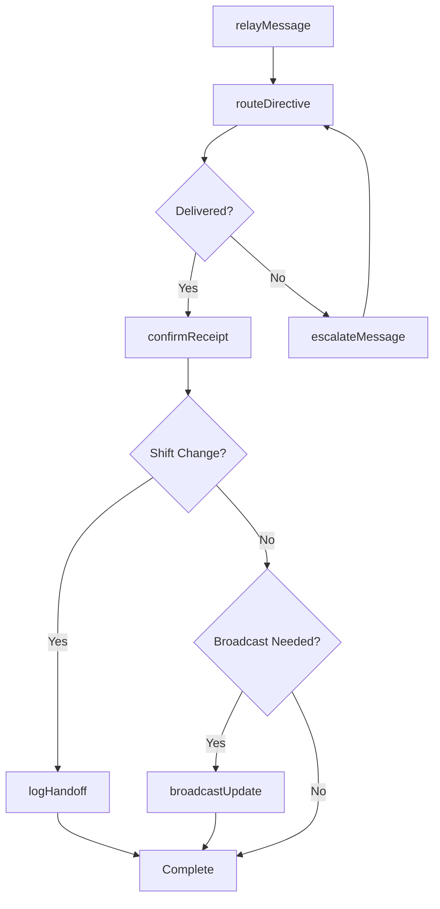
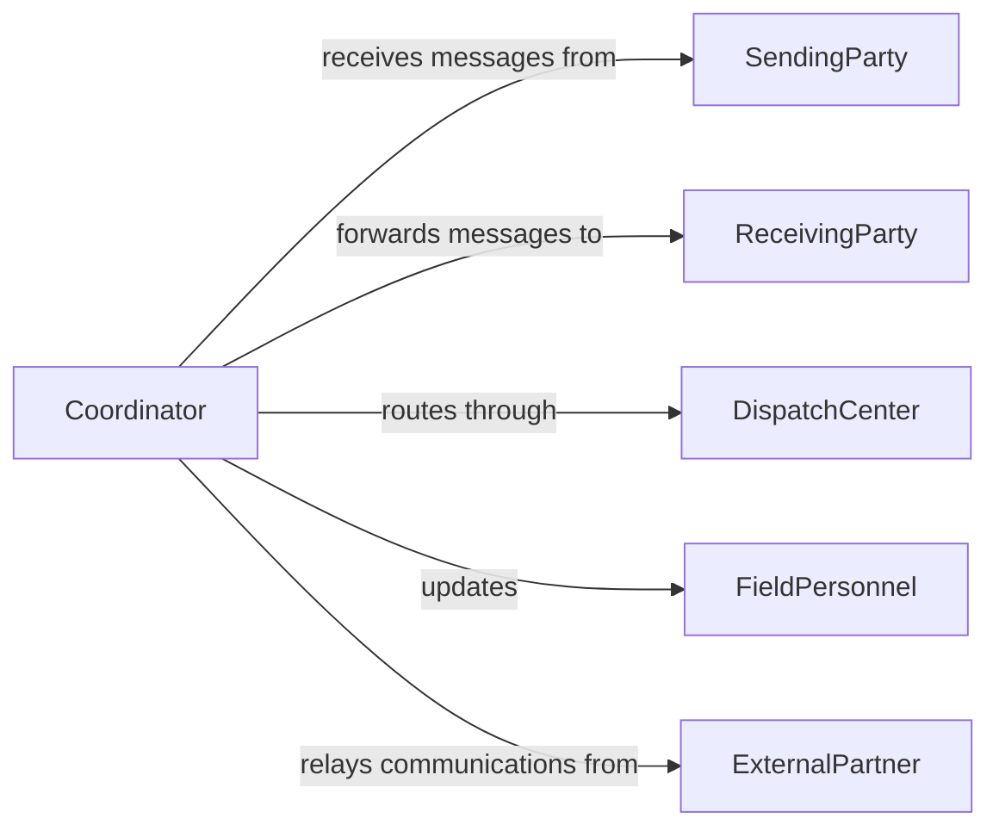

# Relay Information Between Personnel

> Business-as-Code definition for relaying information between personnel. Models the process of transmitting messages, instructions, and updates across teams and organizational levels to maintain operational alignment.

## Overview

Relaying information between personnel involves receiving communications from one party and accurately transmitting them to another, ensuring that critical messages, directives, and status updates reach the intended recipients in a timely manner. This activity spans verbal handoffs during shift changes, written message forwarding between departments, and digital routing of operational updates across distributed teams. Effective information relay prevents misunderstandings, reduces delays, and keeps all stakeholders aligned on priorities and responsibilities.

## Actors

| Actor | Description |
|-------|-------------|
| SendingParty | The individual or team originating the message or directive |
| ReceivingParty | The individual or team intended to receive the relayed information |
| DispatchCenter | A centralized communication hub that routes messages across units |
| FieldPersonnel | On-site workers who need real-time operational updates |
| ExternalPartner | Third-party contacts whose communications must be forwarded internally |

## Roles

| Role | Description |
|------|-------------|
| Coordinator | Manages the flow of information between departments and teams |
| Dispatcher | Routes messages and directives to appropriate personnel |
| ShiftSupervisor | Ensures information continuity during personnel transitions |
| CommunicationsOfficer | Oversees message accuracy and delivery confirmation |

## Entities

| Entity | Description |
|--------|-------------|
| Message | A discrete unit of information to be relayed between parties |
| Directive | An instruction or order requiring acknowledgment from the recipient |
| Handoff | A structured transfer of information during shift or role changes |
| DistributionList | A predefined group of recipients for specific message categories |
| AcknowledgmentRecord | Confirmation that a message was received and understood |

## Actions

| Action | Description |
|--------|-------------|
| relayMessage | Transmit a message from the sending party to the receiving party |
| routeDirective | Forward an instruction to the appropriate personnel based on role or department |
| confirmReceipt | Record acknowledgment that the recipient received the information |
| escalateMessage | Elevate an unacknowledged or urgent message to a higher authority |
| logHandoff | Document a structured information transfer during a shift change |
| broadcastUpdate | Send an operational update to all members of a distribution list |

## Events

| Event | Description |
|-------|-------------|
| messageRelayed | A message has been successfully transmitted to the receiving party |
| directiveRouted | An instruction has been forwarded to the designated personnel |
| receiptConfirmed | The recipient has acknowledged receipt of the information |
| messageEscalated | An urgent or unacknowledged message has been elevated |
| handoffCompleted | A shift-change information transfer has been documented |
| broadcastSent | An operational update has been distributed to all listed recipients |
| deliveryFailed | A message could not be delivered to the intended recipient |

## Searches

| Search | Description |
|--------|-------------|
| findMessages | Retrieve messages by sender, recipient, date range, or status |
| getUnacknowledged | List messages that have not yet been confirmed as received |
| getHandoffHistory | Retrieve handoff records for a specific shift, team, or date |

## Entity Relationships



## State Diagram



## Workflow



## Actor Relationships



## Usage

### Calling Actions

```typescript
import { relayInformationBetweenPersonnel } from '@headlessly/relay-information-between-personnel'

const relay = relayInformationBetweenPersonnel()

// Relay a message from operations to maintenance
const message = await relay.relayMessage({
  from: 'operations-manager',
  to: 'maintenance-lead',
  subject: 'Equipment shutdown scheduled for Bay 3',
  priority: 'high',
  requiresAcknowledgment: true
})

// Broadcast a safety update to all field personnel
await relay.broadcastUpdate({
  distributionList: 'field-operations',
  content: 'Weather advisory: suspend outdoor activities until further notice',
  priority: 'urgent'
})

// Log a shift handoff
await relay.logHandoff({
  outgoingShift: 'day-shift-alpha',
  incomingShift: 'night-shift-bravo',
  notes: 'Pending delivery at dock 7, awaiting confirmation from vendor'
})
```

### Event-Driven Automation

```typescript
// Escalate unacknowledged high-priority messages
relay.deliveryFailed(async ({ messageId, recipient, attempts }) => {
  if (attempts >= 3) {
    await relay.escalateMessage({
      messageId,
      escalateTo: 'shift-supervisor',
      reason: `Message undeliverable to ${recipient} after ${attempts} attempts`
    })
  }
})

// Auto-notify sender when receipt is confirmed
relay.receiptConfirmed(async ({ messageId, acknowledgedBy, timestamp }) => {
  await notify({
    to: 'original-sender',
    message: `Message ${messageId} acknowledged by ${acknowledgedBy} at ${timestamp}`
  })
})
```
