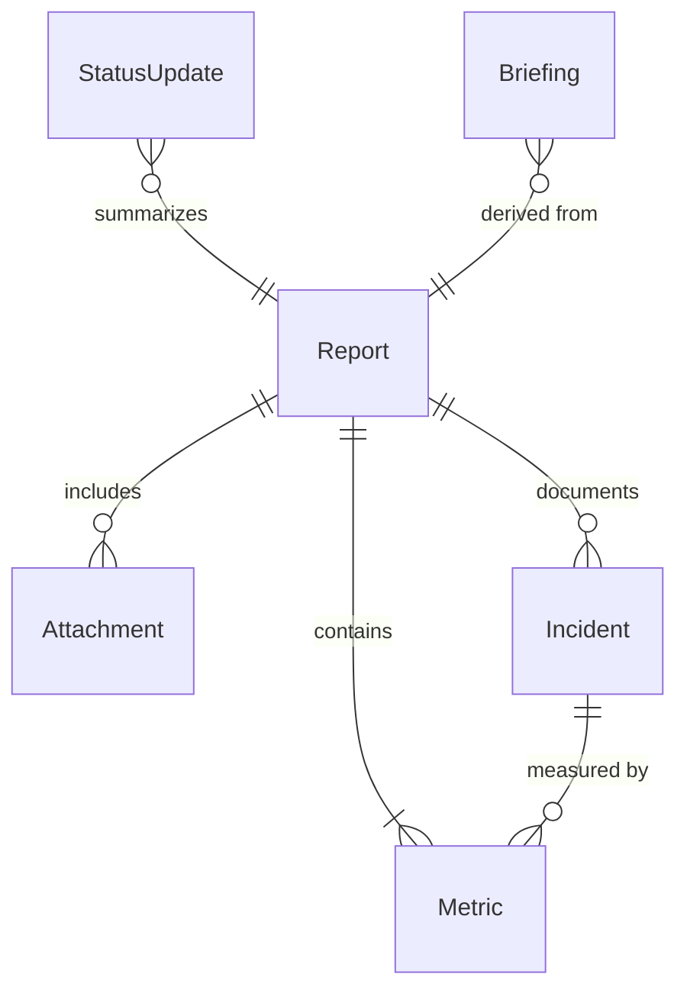
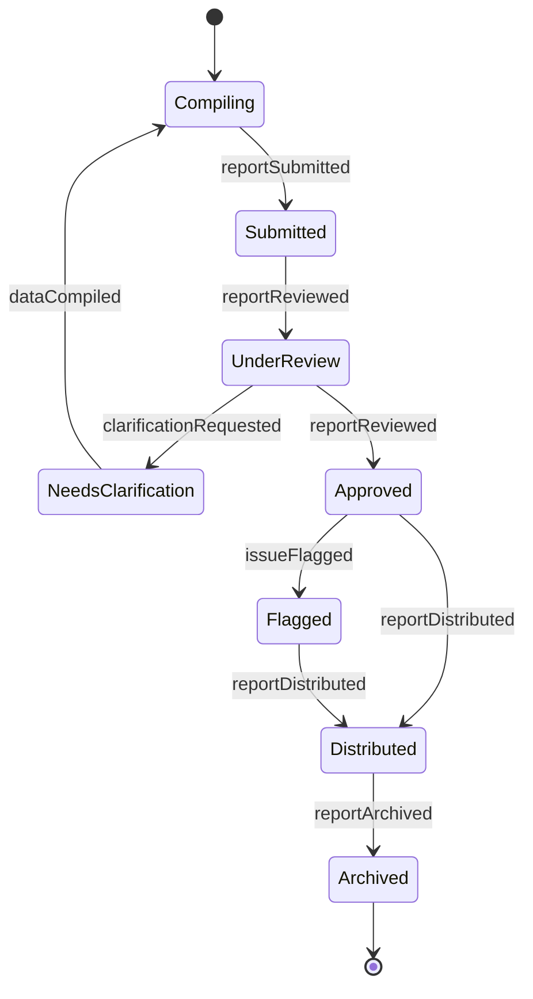
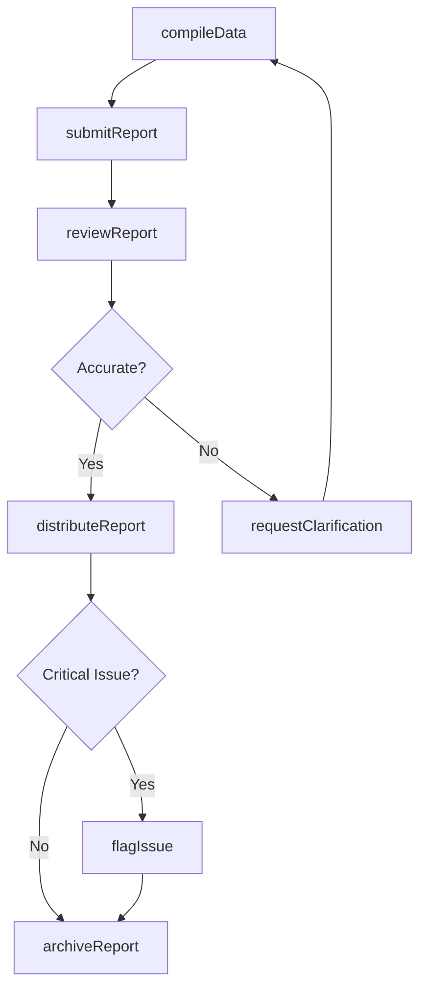
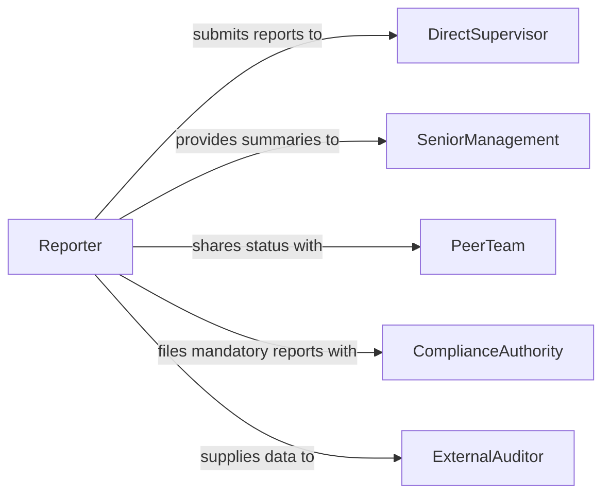

# Report Information Managers Personnel

> Business-as-Code definition for reporting information to managers or other personnel. Models the structured communication of operational data, status updates, and findings to supervisors and colleagues for decision-making.

## Overview

Reporting information to managers and personnel involves compiling observations, metrics, and operational data into structured communications that support management decision-making. This includes routine status reports, incident summaries, progress updates on projects or tasks, and ad-hoc briefings on emerging issues. Timely and accurate reporting ensures that leadership maintains visibility into operations and can respond proactively to changing conditions.

## Actors

| Actor | Description |
|-------|-------------|
| SeniorManagement | Executive leadership who receives high-level summaries and strategic reports |
| DirectSupervisor | Immediate manager who receives routine operational updates |
| PeerTeam | Colleagues in related departments who benefit from shared status information |
| ComplianceAuthority | Regulatory body requiring periodic or mandatory reporting |
| ExternalAuditor | Third-party reviewer who evaluates reported data for accuracy |

## Roles

| Role | Description |
|------|-------------|
| Reporter | Compiles and submits information to the designated recipients |
| ReportReviewer | Reviews submitted reports for accuracy and completeness before distribution |
| OperationsManager | Receives and acts on operational reports from subordinate teams |
| DataAnalyst | Transforms raw operational data into meaningful report formats |

## Entities

| Entity | Description |
|--------|-------------|
| Report | A structured document containing operational data and findings |
| StatusUpdate | A brief communication on current progress or conditions |
| Incident | An event requiring formal documentation and management notification |
| Metric | A quantitative measure included in reports to track performance |
| Briefing | A concise verbal or written summary for management consumption |
| Attachment | Supporting documentation, data files, or evidence appended to a report |

## Actions

| Action | Description |
|--------|-------------|
| submitReport | File a formal report to the designated manager or personnel |
| compileData | Gather and organize operational data for inclusion in a report |
| reviewReport | Evaluate a submitted report for accuracy and completeness |
| distributeReport | Send an approved report to all relevant stakeholders |
| flagIssue | Highlight a critical finding or anomaly within a report |
| archiveReport | Store a finalized report for future reference and audit trails |
| requestClarification | Ask the reporter for additional detail on submitted information |

## Events

| Event | Description |
|-------|-------------|
| reportSubmitted | A report has been filed by the reporter |
| dataCompiled | Operational data has been gathered and organized for reporting |
| reportReviewed | A submitted report has been evaluated for accuracy |
| reportDistributed | An approved report has been sent to all stakeholders |
| issueFlagged | A critical finding has been highlighted within a report |
| reportArchived | A finalized report has been stored for future reference |
| clarificationRequested | Additional detail has been requested on submitted information |

## Searches

| Search | Description |
|--------|-------------|
| findReports | Retrieve reports by author, date range, type, or recipient |
| getFlaggedIssues | List reports containing critical findings that require attention |
| getReportHistory | Retrieve the submission and review history for a specific report |
| getPendingReviews | List reports awaiting reviewer approval before distribution |

## Entity Relationships



## State Diagram



## Workflow



## Actor Relationships



## Usage

### Calling Actions

```typescript
import { reportInformationManagersPersonnel } from '@headlessly/report-information-managers-personnel'

const reporting = reportInformationManagersPersonnel()

// Compile weekly operational data
const data = await reporting.compileData({
  sources: ['production-logs', 'quality-checks', 'safety-incidents'],
  period: { start: '2026-01-27', end: '2026-02-02' }
})

// Submit a weekly status report
const report = await reporting.submitReport({
  title: 'Weekly Operations Summary - Week 5',
  recipient: 'operations-manager',
  type: 'status-update',
  data: data.id,
  attachments: ['production-metrics.csv']
})

// Distribute to stakeholders after review
await reporting.distributeReport({
  reportId: report.id,
  recipients: ['senior-management', 'quality-team', 'safety-officer']
})
```

### Event-Driven Automation

```typescript
// Auto-notify manager when critical issues are flagged
reporting.issueFlagged(async ({ reportId, issue, severity }) => {
  await notify({
    to: 'operations-manager',
    message: `Critical issue in report ${reportId}: ${issue}`,
    priority: severity
  })
})

// Archive reports automatically after distribution
reporting.reportDistributed(async ({ reportId, distributedAt }) => {
  await reporting.archiveReport({
    reportId,
    retentionPolicy: 'standard-3yr'
  })
})
```
