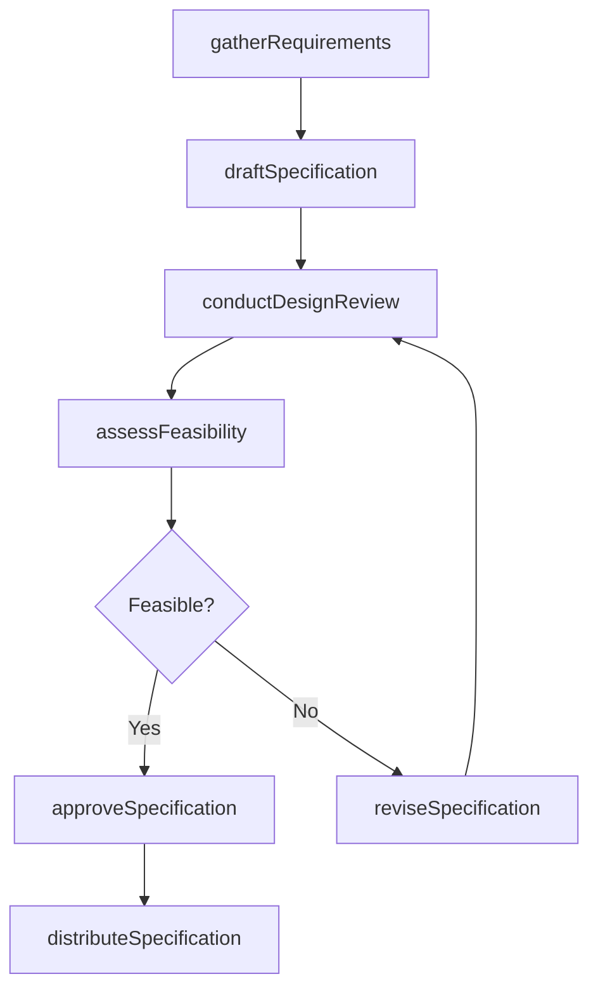
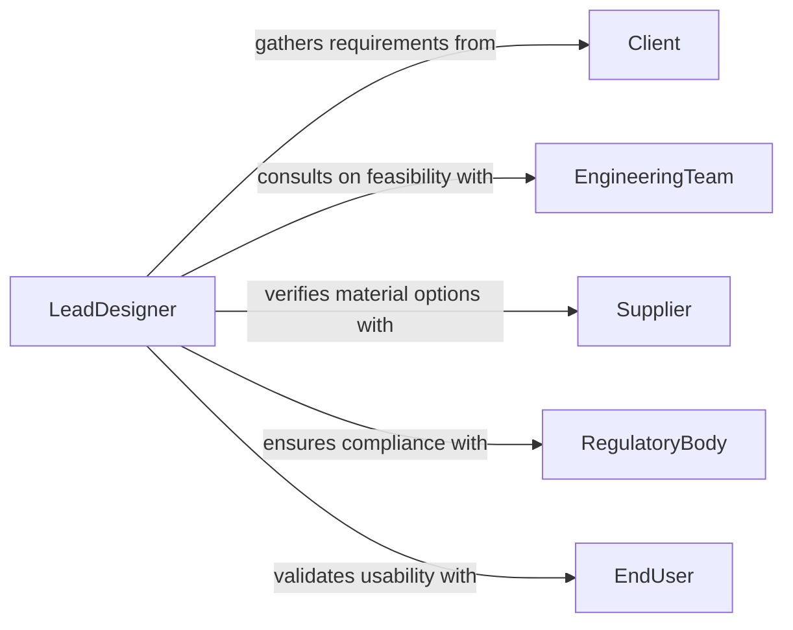

# Collaborate Others Determine Design Specifications

> Business-as-Code definition for collaborating with others to determine design specifications or details. Models the cross-functional process of defining, negotiating, and finalizing design requirements through stakeholder engagement.

## Overview

Collaborating to determine design specifications involves working with engineers, architects, clients, and subject matter experts to define the technical parameters, materials, dimensions, and performance criteria for a product, system, or structure. This activity includes requirements gathering sessions, design review meetings, and iterative specification refinement based on feasibility analysis and stakeholder feedback. The outcome is a set of agreed-upon specifications that guide downstream development, manufacturing, or construction activities.

## Actors

| Actor | Description |
|-------|-------------|
| Client | The end customer or stakeholder who defines functional requirements and constraints |
| EngineeringTeam | Technical professionals who evaluate feasibility and propose design solutions |
| Supplier | Material or component provider who advises on availability and capabilities |
| RegulatoryBody | Authority that defines compliance standards the design must meet |
| EndUser | The person who will ultimately use the designed product or system |
| QualityAssurance | Team that validates specifications against quality and reliability standards |

## Roles

| Role | Description |
|------|-------------|
| LeadDesigner | Facilitates specification discussions and synthesizes inputs into a cohesive design |
| ProjectEngineer | Evaluates technical feasibility and translates requirements into specifications |
| SpecificationAnalyst | Documents and manages the evolving specification set through revisions |
| StakeholderLiaison | Coordinates communication between internal teams and external parties |

## Entities

| Entity | Description |
|--------|-------------|
| Specification | A formal description of a design parameter, tolerance, or requirement |
| DesignBrief | A summary document outlining the project scope, objectives, and constraints |
| ReviewComment | Feedback provided by a stakeholder during a specification review cycle |
| Revision | A tracked version of the specification set reflecting iterative changes |
| FeasibilityAssessment | An analysis of whether proposed specifications can be achieved within constraints |

## Actions

| Action | Description |
|--------|-------------|
| gatherRequirements | Collect functional and technical needs from all stakeholders |
| draftSpecification | Create an initial specification document based on gathered requirements |
| conductDesignReview | Facilitate a meeting to evaluate and discuss proposed specifications |
| assessFeasibility | Analyze whether proposed specifications are achievable given constraints |
| reviseSpecification | Update specifications based on review feedback and feasibility findings |
| approveSpecification | Formally sign off on a finalized specification set |
| distributeSpecification | Share approved specifications with all downstream teams |

## Events

| Event | Description |
|-------|-------------|
| requirementsGathered | All stakeholder requirements have been collected and documented |
| specificationDrafted | An initial specification document has been created |
| designReviewConducted | A specification review meeting has been completed |
| feasibilityAssessed | A feasibility analysis of proposed specifications has been completed |
| specificationRevised | Specifications have been updated based on feedback |
| specificationApproved | A specification set has been formally signed off |
| specificationDistributed | Approved specifications have been shared with downstream teams |

## Searches

| Search | Description |
|--------|-------------|
| findSpecifications | Retrieve specifications by project, revision, status, or component |
| getReviewComments | List feedback from stakeholders for a specific specification revision |
| getRevisionHistory | Retrieve the full change history for a specification document |
| getPendingApprovals | List specifications awaiting formal sign-off |

## Workflow



## Actor Relationships



## Usage

### Calling Actions

```typescript
import { collaborateOthersDetermineDesignSpecifications } from '@headlessly/collaborate-others-determine-design-specifications'

const specs = collaborateOthersDetermineDesignSpecifications()

// Gather requirements for a new product design
const requirements = await specs.gatherRequirements({
  project: 'industrial-pump-v3',
  stakeholders: ['client-acme', 'engineering', 'quality-assurance'],
  deadline: '2026-03-01'
})

// Draft initial specification
const draft = await specs.draftSpecification({
  projectId: requirements.projectId,
  parameters: [
    { name: 'flow-rate', value: '500 GPM', tolerance: '+/- 5%' },
    { name: 'operating-pressure', value: '150 PSI', tolerance: '+/- 10 PSI' },
    { name: 'material', value: 'stainless-steel-316' }
  ]
})

// Conduct a design review
await specs.conductDesignReview({
  specificationId: draft.id,
  reviewers: ['lead-engineer', 'client-rep', 'qa-manager'],
  scheduledDate: '2026-02-15'
})
```

### Event-Driven Automation

```typescript
// Notify all stakeholders when specifications are approved
specs.specificationApproved(async ({ specificationId, approvedBy, version }) => {
  await notify({
    to: 'project-team',
    message: `Specification ${specificationId} v${version} approved by ${approvedBy}`
  })
})

// Auto-trigger feasibility check after design review
specs.designReviewConducted(async ({ specificationId, comments }) => {
  const hasBlockers = comments.some(c => c.severity === 'blocking')
  if (!hasBlockers) {
    await specs.assessFeasibility({ specificationId })
  }
})
```
