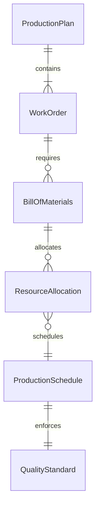
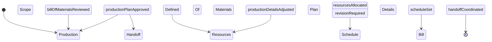
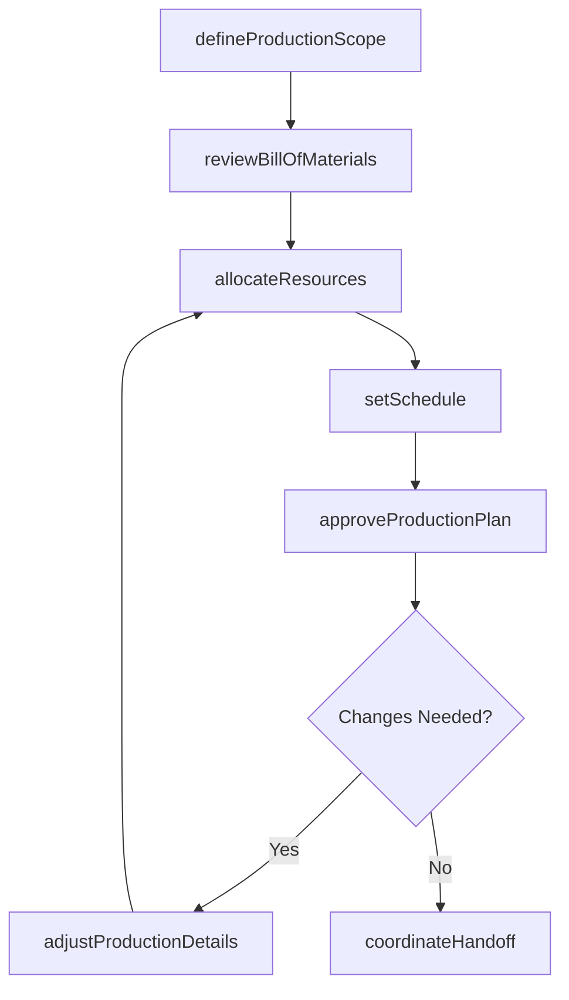
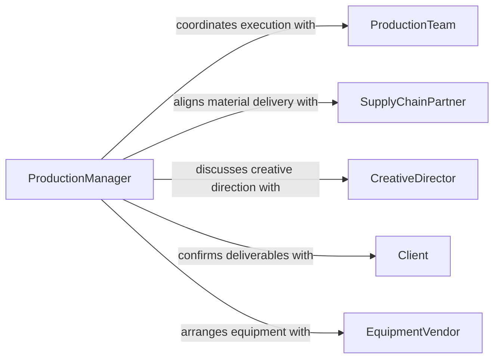

# Collaborate Others Determine Production Details

> Business-as-Code definition for collaborating with others to determine production details. Models the cross-team coordination required to define production schedules, methods, resource allocation, and output targets.

## Overview

Collaborating to determine production details involves working with production managers, line supervisors, supply chain teams, and creative directors to finalize the specifics of how a product or content will be produced. This includes establishing production schedules, selecting methods and equipment, allocating personnel and materials, and agreeing on quality standards and output volumes. The collaborative process ensures that all parties are aligned on timelines, resource constraints, and deliverable expectations before production begins.

## Actors

| Actor | Description |
|-------|-------------|
| ProductionTeam | Workers and supervisors on the production floor who execute manufacturing or content creation |
| SupplyChainPartner | Vendors and logistics providers who deliver raw materials and components |
| CreativeDirector | The individual responsible for artistic or content vision in media and entertainment productions |
| Client | The customer who defines deliverable requirements and acceptance criteria |
| EquipmentVendor | Supplier of machinery, tools, or technology used in the production process |

## Roles

| Role | Description |
|------|-------------|
| ProductionManager | Oversees the production process and coordinates resource allocation |
| Scheduler | Develops and maintains production timelines and sequencing |
| QualityController | Defines quality checkpoints and acceptance criteria for production output |
| ResourcePlanner | Plans material, equipment, and labor needs for production runs |

## Entities

| Entity | Description |
|--------|-------------|
| ProductionPlan | A comprehensive document outlining the schedule, methods, and resources for a production run |
| WorkOrder | A specific instruction set for producing a defined quantity of a product or deliverable |
| BillOfMaterials | A list of raw materials, components, and quantities needed for production |
| ProductionSchedule | A timeline defining the sequence and duration of production activities |
| QualityStandard | Criteria that production output must meet for acceptance |
| ResourceAllocation | The assignment of personnel, equipment, and materials to production tasks |

## Actions

| Action | Description |
|--------|-------------|
| defineProductionScope | Establish the boundaries, objectives, and deliverables of a production run |
| allocateResources | Assign personnel, equipment, and materials to production tasks |
| setSchedule | Define the timeline and sequencing of production activities |
| reviewBillOfMaterials | Evaluate and confirm the materials required for production |
| approveProductionPlan | Formally authorize the production plan to proceed |
| adjustProductionDetails | Modify production parameters based on stakeholder feedback or constraints |
| coordinateHandoff | Transfer production responsibilities between teams or shifts |

## Events

| Event | Description |
|-------|-------------|
| productionScopeDefined | The boundaries and deliverables of a production run have been established |
| resourcesAllocated | Personnel, equipment, and materials have been assigned to production tasks |
| scheduleSet | The production timeline and sequencing have been finalized |
| billOfMaterialsReviewed | Required materials have been evaluated and confirmed |
| productionPlanApproved | The production plan has been formally authorized |
| productionDetailsAdjusted | Production parameters have been modified based on feedback |
| handoffCoordinated | Production responsibilities have been transferred between teams |

## Searches

| Search | Description |
|--------|-------------|
| findProductionPlans | Retrieve production plans by project, date range, or status |
| getResourceAvailability | Check availability of personnel, equipment, and materials for scheduling |
| getWorkOrders | List active work orders by production line, product, or priority |
| getScheduleConflicts | Identify overlapping or conflicting production schedule entries |

## Entity Relationships



## State Diagram



## Workflow



## Actor Relationships



## Usage

### Calling Actions

```typescript
import { collaborateOthersDetermineProductionDetails } from '@headlessly/collaborate-others-determine-production-details'

const production = collaborateOthersDetermineProductionDetails()

// Define production scope for a new product run
const scope = await production.defineProductionScope({
  project: 'widget-batch-q1-2026',
  deliverables: [{ product: 'Widget-A', quantity: 10000 }],
  targetCompletion: '2026-03-31'
})

// Allocate resources to the production run
await production.allocateResources({
  planId: scope.planId,
  personnel: ['assembly-team-alpha', 'quality-inspector-3'],
  equipment: ['press-line-2', 'cnc-mill-7'],
  materials: scope.billOfMaterials
})

// Set the production schedule
await production.setSchedule({
  planId: scope.planId,
  phases: [
    { name: 'material-prep', start: '2026-02-15', end: '2026-02-20' },
    { name: 'assembly', start: '2026-02-21', end: '2026-03-15' },
    { name: 'quality-check', start: '2026-03-16', end: '2026-03-25' }
  ]
})
```

### Event-Driven Automation

```typescript
// Notify supply chain when bill of materials is confirmed
production.billOfMaterialsReviewed(async ({ planId, materials }) => {
  await notify({
    to: 'supply-chain-partner',
    message: `Materials confirmed for ${planId}. Please verify delivery schedule.`,
    data: materials
  })
})

// Alert scheduler when resource conflicts arise
production.resourcesAllocated(async ({ planId, allocations }) => {
  const conflicts = await production.getScheduleConflicts({ planId })
  if (conflicts.length > 0) {
    await notify({
      to: 'scheduler',
      message: `${conflicts.length} scheduling conflicts detected for ${planId}`
    })
  }
})
```
