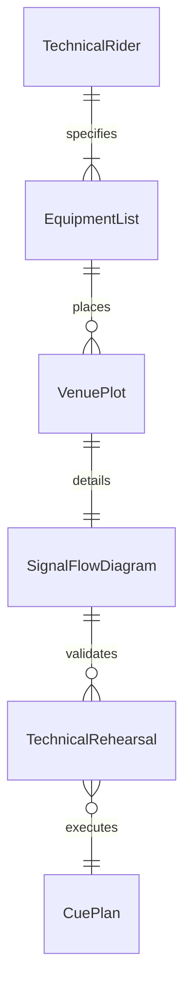
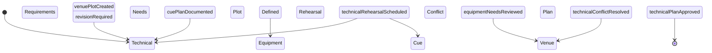
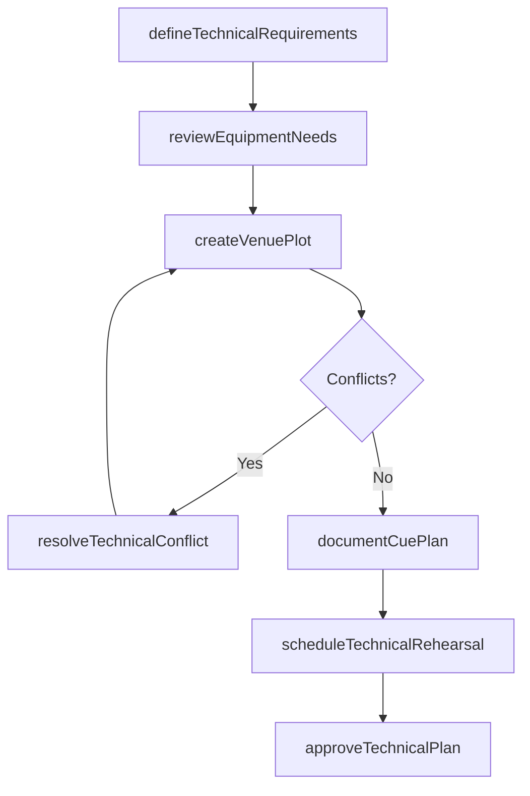
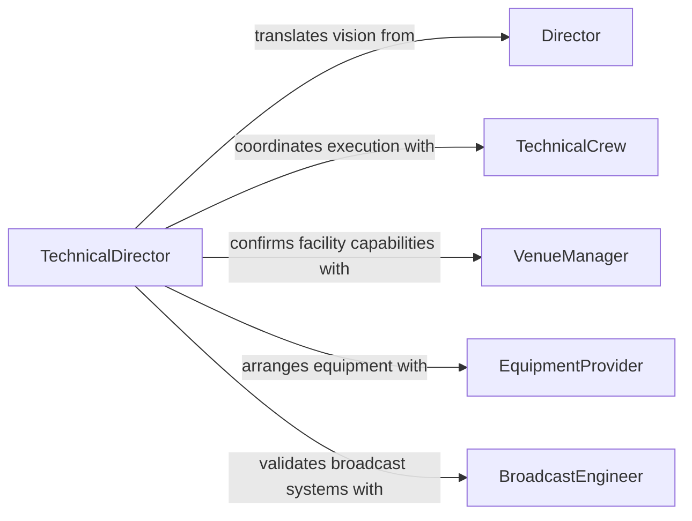

# Collaborate Others Determine Technical Details

> Business-as-Code definition for collaborating with others to determine technical details of productions. Models the coordination between technical, creative, and operational teams to resolve technical requirements for media, manufacturing, and event productions.

## Overview

Collaborating to determine technical details of productions involves working with directors, engineers, technical crews, and venue managers to define the lighting, sound, staging, equipment, and infrastructure requirements for a production. This applies to film and television production, live events, theatrical performances, and broadcast operations where technical precision is essential for successful execution. The process includes technical walkthroughs, equipment specification meetings, and coordination of technical rehearsals to validate all details before the production goes live.

## Actors

| Actor | Description |
|-------|-------------|
| Director | The creative lead who defines the artistic vision that technical details must support |
| TechnicalCrew | Specialists in lighting, sound, rigging, and staging who implement technical requirements |
| VenueManager | The facility operator responsible for space, power, and infrastructure constraints |
| EquipmentProvider | Rental or supply company providing specialized production equipment |
| BroadcastEngineer | Technical professional managing signal routing, transmission, and recording systems |
| SafetyInspector | Authority who evaluates technical setups for safety compliance |

## Roles

| Role | Description |
|------|-------------|
| TechnicalDirector | Leads technical planning and coordinates all technical departments |
| ProductionCoordinator | Manages communication flow between creative and technical teams |
| StageManager | Oversees the execution of technical cues and sequences during production |
| SystemsEngineer | Designs and validates technical systems for sound, lighting, and video |

## Entities

| Entity | Description |
|--------|-------------|
| TechnicalRider | A document specifying all technical requirements for a production |
| CuePlan | A sequence of technical actions timed to production events |
| EquipmentList | An itemized inventory of all technical equipment required |
| VenuePlot | A diagram showing equipment placement, cable runs, and staging layout |
| TechnicalRehearsal | A practice session focused on validating technical execution |
| SignalFlowDiagram | A schematic showing audio, video, and data routing paths |

## Actions

| Action | Description |
|--------|-------------|
| defineTechnicalRequirements | Establish the lighting, sound, staging, and infrastructure needs |
| reviewEquipmentNeeds | Evaluate and confirm the specific equipment required for production |
| createVenuePlot | Develop a layout diagram showing all technical element placements |
| scheduleTechnicalRehearsal | Plan a rehearsal session to validate technical execution |
| resolveTechnicalConflict | Address competing technical requirements between departments |
| approveTechnicalPlan | Formally sign off on the consolidated technical specifications |
| documentCuePlan | Record the sequence and timing of all technical actions |

## Events

| Event | Description |
|-------|-------------|
| technicalRequirementsDefined | All technical needs for the production have been established |
| equipmentNeedsReviewed | Required equipment has been evaluated and confirmed |
| venuePlotCreated | A layout diagram has been completed showing technical placements |
| technicalRehearsalScheduled | A rehearsal session has been planned for technical validation |
| technicalConflictResolved | Competing technical requirements have been addressed |
| technicalPlanApproved | The consolidated technical plan has been formally signed off |
| cuePlanDocumented | The sequence of technical actions has been recorded |

## Searches

| Search | Description |
|--------|-------------|
| findTechnicalRiders | Retrieve technical riders by production, venue, or date |
| getEquipmentAvailability | Check availability of specific equipment from providers |
| getRehearsalSchedule | List upcoming technical rehearsals by production or venue |
| getCuePlans | Retrieve cue plans for a specific production or show |

## Entity Relationships



## State Diagram



## Workflow



## Actor Relationships



## Usage

### Calling Actions

```typescript
import { collaborateOthersDetermineTechnicalDetails } from '@headlessly/collaborate-others-determine-technical-details'

const tech = collaborateOthersDetermineTechnicalDetails()

// Define technical requirements for a live broadcast event
const requirements = await tech.defineTechnicalRequirements({
  production: 'annual-awards-ceremony-2026',
  venue: 'civic-center-main-hall',
  departments: ['lighting', 'sound', 'video', 'staging'],
  broadcastFormat: '4K-HDR'
})

// Create venue plot with equipment placements
const plot = await tech.createVenuePlot({
  productionId: requirements.productionId,
  elements: [
    { type: 'lighting-rig', position: 'overhead-grid-A', fixtures: 48 },
    { type: 'speaker-array', position: 'stage-left', units: 12 },
    { type: 'camera-position', position: 'front-of-house', cameras: 4 }
  ]
})

// Schedule a technical rehearsal
await tech.scheduleTechnicalRehearsal({
  productionId: requirements.productionId,
  date: '2026-03-10',
  duration: '8 hours',
  departments: ['all']
})
```

### Event-Driven Automation

```typescript
// Notify equipment provider when needs are confirmed
tech.equipmentNeedsReviewed(async ({ productionId, equipmentList }) => {
  await notify({
    to: 'equipment-provider',
    message: `Equipment order confirmed for production ${productionId}`,
    data: equipmentList
  })
})

// Auto-generate safety review after venue plot is finalized
tech.venuePlotCreated(async ({ productionId, venuePlotId }) => {
  await notify({
    to: 'safety-inspector',
    message: `Venue plot ready for safety review: production ${productionId}`,
    attachments: [venuePlotId]
  })
})
```
