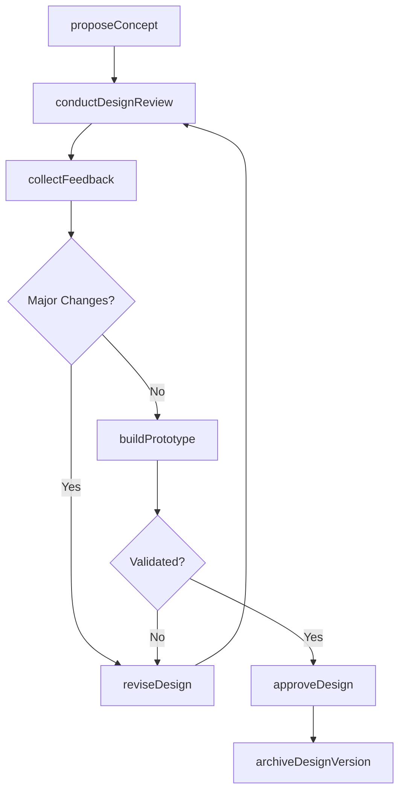
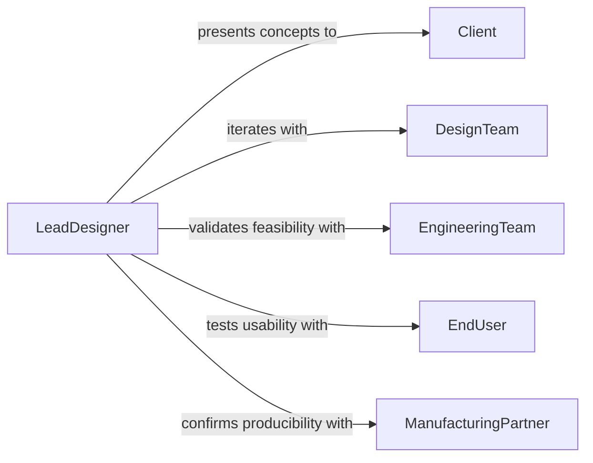

# Collaborate Others Develop Refine Designs

> Business-as-Code definition for collaborating with others to develop or refine designs. Models the iterative design process where cross-functional teams propose, critique, and improve design concepts through structured review and feedback cycles.

## Overview

Collaborating to develop or refine designs involves working with designers, engineers, clients, and end users through iterative cycles of concept creation, feedback collection, and design improvement. This includes brainstorming sessions, design critiques, prototype evaluations, and revision cycles where each stakeholder contributes their domain expertise to improve the design. The process applies across disciplines including product design, architecture, software interfaces, and graphic design, producing progressively refined outputs that balance aesthetics, functionality, and manufacturability.

## Actors

| Actor | Description |
|-------|-------------|
| Client | The stakeholder who defines design objectives and provides approval at key milestones |
| DesignTeam | Creative professionals who generate and iterate on design concepts |
| EngineeringTeam | Technical professionals who evaluate designs for structural and manufacturing feasibility |
| EndUser | The target user whose needs and preferences guide design refinement |
| ManufacturingPartner | The production facility that advises on material and process constraints |
| RegulatoryConsultant | Specialist who ensures designs comply with applicable codes and standards |

## Roles

| Role | Description |
|------|-------------|
| LeadDesigner | Drives the design vision and synthesizes feedback into cohesive revisions |
| DesignReviewer | Evaluates design iterations and provides structured critique |
| PrototypeEngineer | Builds physical or digital prototypes for testing and evaluation |
| ProjectArchitect | Defines the overall design framework and ensures consistency across components |

## Entities

| Entity | Description |
|--------|-------------|
| DesignConcept | An initial or proposed design idea expressed as sketches, renderings, or models |
| Prototype | A working model used to test and validate design decisions |
| DesignReview | A structured evaluation session where stakeholders critique a design iteration |
| Revision | A tracked update to a design reflecting incorporated feedback |
| FeedbackItem | A specific comment, suggestion, or concern raised during a design review |
| DesignApproval | A formal sign-off indicating a design iteration meets requirements |

## Actions

| Action | Description |
|--------|-------------|
| proposeConcept | Present a new design idea or approach for stakeholder consideration |
| conductDesignReview | Facilitate a structured evaluation of a design iteration |
| collectFeedback | Gather comments and suggestions from reviewers and stakeholders |
| reviseDesign | Incorporate feedback and constraints into an updated design iteration |
| buildPrototype | Create a working model to test and validate design decisions |
| approveDesign | Formally sign off on a design iteration as meeting requirements |
| archiveDesignVersion | Store a completed design iteration for reference and traceability |

## Events

| Event | Description |
|-------|-------------|
| conceptProposed | A new design idea has been presented for stakeholder consideration |
| designReviewConducted | A structured design evaluation session has been completed |
| feedbackCollected | Comments and suggestions have been gathered from reviewers |
| designRevised | A design iteration has been updated based on incorporated feedback |
| prototypeBuilt | A working model has been created for testing and validation |
| designApproved | A design iteration has been formally signed off |
| designVersionArchived | A completed design iteration has been stored for reference |

## Searches

| Search | Description |
|--------|-------------|
| findDesignConcepts | Retrieve design concepts by project, designer, or iteration status |
| getFeedbackItems | List feedback for a specific design iteration or review session |
| getRevisionHistory | Retrieve the full sequence of revisions for a design |
| getPrototypes | List prototypes associated with a design concept or project |

## Workflow



## Actor Relationships



## Usage

### Calling Actions

```typescript
import { collaborateOthersDevelopRefineDesigns } from '@headlessly/collaborate-others-develop-refine-designs'

const designs = collaborateOthersDevelopRefineDesigns()

// Propose an initial design concept
const concept = await designs.proposeConcept({
  project: 'ergonomic-office-chair-v2',
  description: 'Mesh-back design with adjustable lumbar and armrests',
  attachments: ['concept-sketch-001.pdf', 'material-options.xlsx'],
  presentedTo: ['client-rep', 'engineering-lead']
})

// Conduct a design review with stakeholders
const review = await designs.conductDesignReview({
  conceptId: concept.id,
  reviewers: ['industrial-designer', 'ergonomics-specialist', 'manufacturing-lead'],
  scheduledDate: '2026-02-20'
})

// Revise the design based on collected feedback
await designs.reviseDesign({
  conceptId: concept.id,
  reviewId: review.id,
  changes: [
    { area: 'lumbar-support', modification: 'increase adjustment range by 2cm' },
    { area: 'armrest-pivot', modification: 'add 15-degree lateral rotation' }
  ]
})
```

### Event-Driven Automation

```typescript
// Trigger prototype build when design passes review without major issues
designs.feedbackCollected(async ({ conceptId, reviewId, feedbackItems }) => {
  const majorIssues = feedbackItems.filter(f => f.severity === 'major')
  if (majorIssues.length === 0) {
    await designs.buildPrototype({
      conceptId,
      type: '3d-printed',
      scale: '1:1'
    })
  }
})

// Notify all stakeholders when a design is approved
designs.designApproved(async ({ conceptId, approvedBy, version }) => {
  await notify({
    to: 'project-team',
    message: `Design ${conceptId} v${version} approved by ${approvedBy}. Ready for production planning.`
  })
})
```
