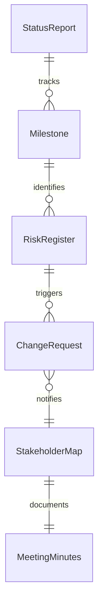
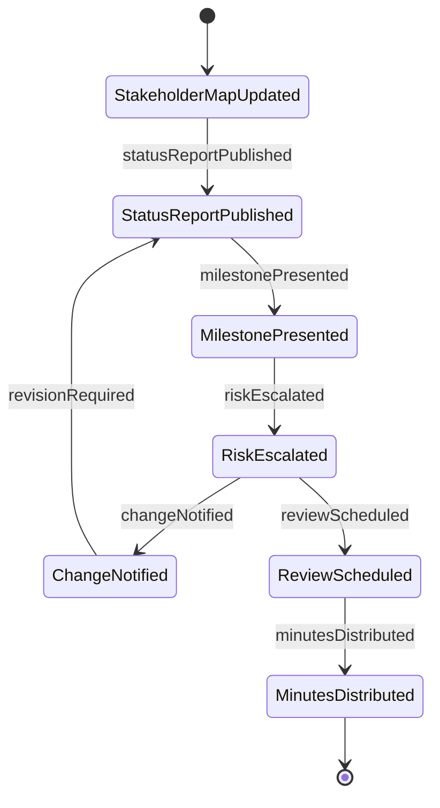
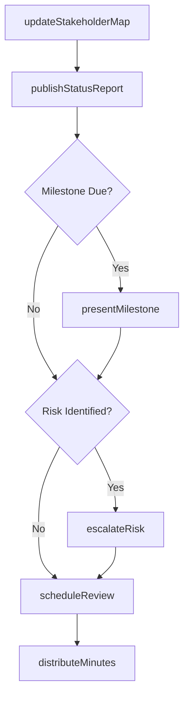
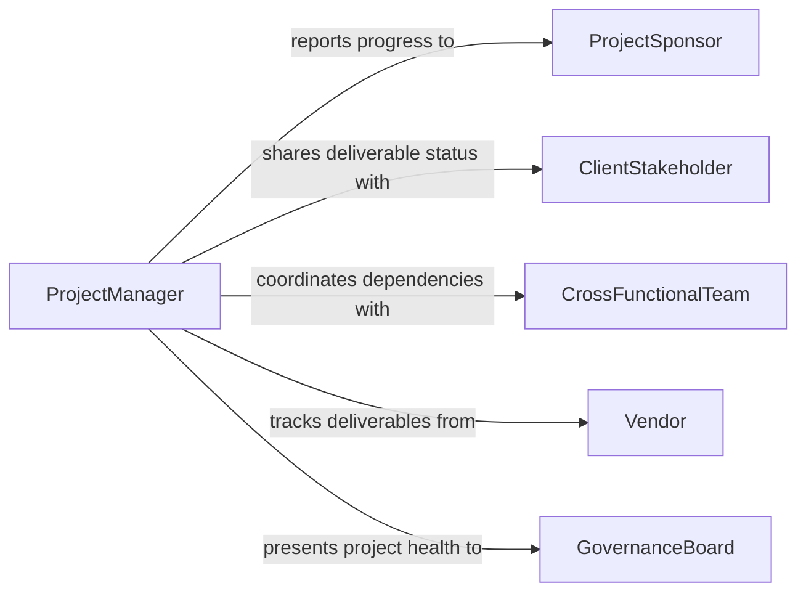

# Communicate Project Information Others

> Business-as-Code definition for communicating project information to others. Models the structured dissemination of project status, milestones, risks, and deliverables to stakeholders across the organization.

## Overview

Communicating project information to others involves preparing and delivering updates on project scope, timeline, budget, risks, and deliverables to diverse audiences including team members, management, clients, and cross-functional partners. This includes status reports, milestone presentations, risk briefings, and change notifications that keep all parties informed and aligned. Effective project communication prevents misalignment, enables timely decision-making, and ensures that dependencies and blockers are surfaced before they impact delivery.

## Actors

| Actor | Description |
|-------|-------------|
| ProjectSponsor | The executive who funds the project and receives high-level progress reports |
| ClientStakeholder | The external customer who needs visibility into project progress and deliverables |
| CrossFunctionalTeam | Members of other departments whose work depends on or intersects with the project |
| Vendor | Third-party supplier providing deliverables or services to the project |
| GovernanceBoard | The oversight body that reviews project health and approves major decisions |

## Roles

| Role | Description |
|------|-------------|
| ProjectManager | Owns project communication and ensures all stakeholders receive timely updates |
| ProjectCoordinator | Prepares reports, schedules meetings, and distributes project documentation |
| TeamLead | Communicates task-level progress and blockers to the project manager |
| CommunicationsLead | Tailors project messages for different audience types and channels |

## Entities

| Entity | Description |
|--------|-------------|
| StatusReport | A periodic document summarizing project progress, risks, and next steps |
| Milestone | A significant project checkpoint with defined deliverables and criteria |
| RiskRegister | A log of identified risks with likelihood, impact, and mitigation plans |
| ChangeRequest | A formal proposal to modify project scope, timeline, or budget |
| StakeholderMap | A matrix defining who receives what information at what frequency |
| MeetingMinutes | A record of decisions, actions, and discussions from project meetings |

## Actions

| Action | Description |
|--------|-------------|
| publishStatusReport | Distribute a periodic project status update to stakeholders |
| presentMilestone | Deliver a milestone review to management or clients |
| escalateRisk | Communicate a newly identified or elevated risk to decision-makers |
| notifyChange | Inform stakeholders of an approved change to project scope or timeline |
| scheduleReview | Organize a project review meeting with relevant participants |
| distributeMinutes | Share meeting notes and action items with attendees and stakeholders |
| updateStakeholderMap | Revise the communication plan to reflect changes in project participants |

## Events

| Event | Description |
|-------|-------------|
| statusReportPublished | A project status update has been distributed to stakeholders |
| milestonePresented | A milestone review has been delivered to the audience |
| riskEscalated | A newly identified or elevated risk has been communicated to decision-makers |
| changeNotified | Stakeholders have been informed of an approved project change |
| reviewScheduled | A project review meeting has been organized |
| minutesDistributed | Meeting notes and action items have been shared with attendees |
| stakeholderMapUpdated | The communication plan has been revised for new project participants |

## Searches

| Search | Description |
|--------|-------------|
| findStatusReports | Retrieve status reports by project, date range, or author |
| getMilestones | List milestones by project, status, or upcoming deadline |
| getOpenRisks | Retrieve active risks from the risk register for a project |
| getChangeRequests | List change requests by project, status, or impact level |

## Entity Relationships



## State Diagram



## Workflow



## Actor Relationships



## Usage

### Calling Actions

```typescript
import { communicateProjectInformationOthers } from '@headlessly/communicate-project-information-others'

const comms = communicateProjectInformationOthers()

// Publish a weekly status report
const report = await comms.publishStatusReport({
  project: 'platform-migration-v3',
  period: 'week-of-2026-02-03',
  summary: 'Database migration 85% complete. On track for Feb 28 go-live.',
  risks: [{ id: 'risk-007', status: 'mitigated' }],
  nextSteps: ['Complete data validation', 'Schedule UAT with client']
})

// Escalate a newly identified risk
await comms.escalateRisk({
  project: 'platform-migration-v3',
  risk: {
    description: 'Third-party API deprecation may affect integration timeline',
    likelihood: 'high',
    impact: 'medium',
    mitigation: 'Evaluate alternative endpoints by Feb 15'
  },
  escalateTo: ['project-sponsor', 'technical-lead']
})

// Present a milestone to stakeholders
await comms.presentMilestone({
  project: 'platform-migration-v3',
  milestone: 'data-migration-complete',
  audience: ['client-stakeholder', 'governance-board'],
  scheduledDate: '2026-02-28'
})
```

### Event-Driven Automation

```typescript
// Auto-schedule review when milestone is delivered
comms.milestonePresented(async ({ project, milestone }) => {
  await comms.scheduleReview({
    project,
    topic: `Post-milestone review: ${milestone}`,
    participants: ['project-team', 'client-stakeholder'],
    withinDays: 5
  })
})

// Notify governance board on risk escalation
comms.riskEscalated(async ({ project, risk, escalatedBy }) => {
  await notify({
    to: 'governance-board',
    message: `Risk escalated on ${project}: ${risk.description}`,
    priority: risk.likelihood === 'high' ? 'urgent' : 'normal'
  })
})
```
