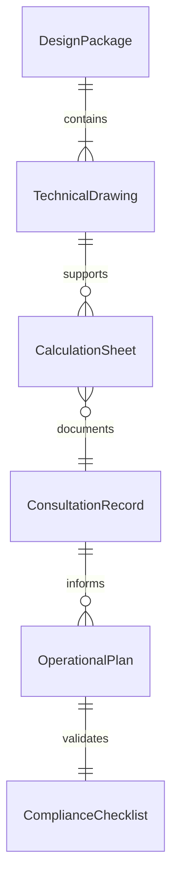
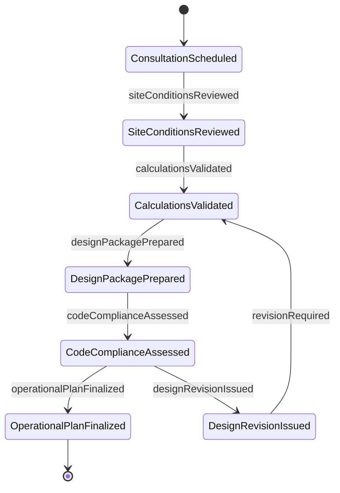
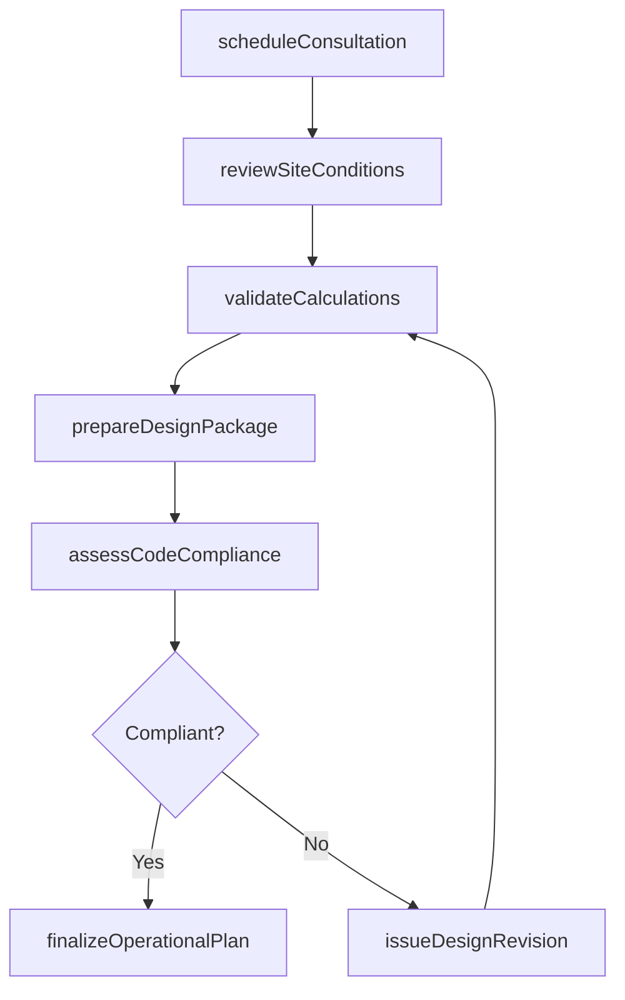
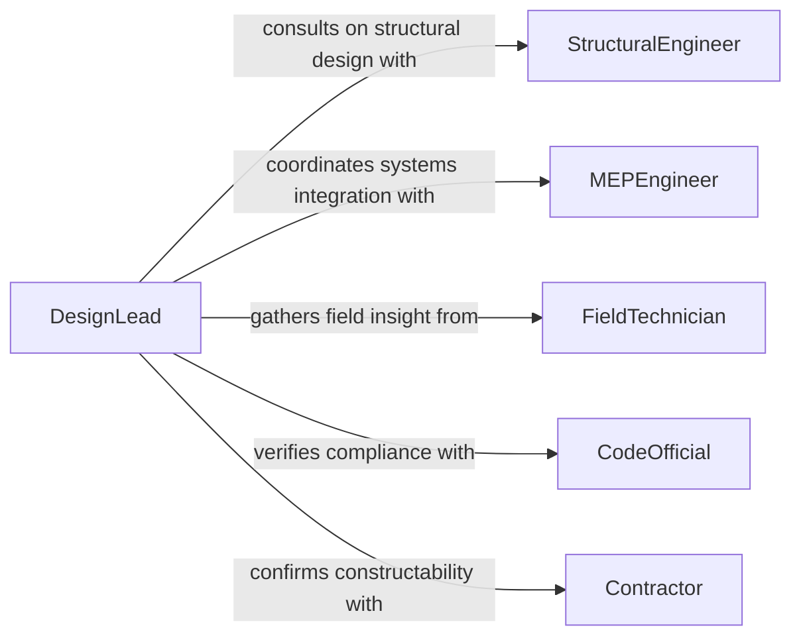

# Confer Technical Personnel Prepare Designs

> Business-as-Code definition for conferring with technical personnel to prepare designs or operational plans. Models the consultation process between planners and technical experts to produce feasible, standards-compliant designs and operational procedures.

## Overview

Conferring with technical personnel to prepare designs or operational plans involves holding structured discussions with engineers, architects, technicians, and specialists to translate project objectives into actionable design documents and operational procedures. These consultations address material selection, structural calculations, system configurations, safety requirements, and constructability assessments. The resulting designs and plans reflect both the project vision and the practical constraints identified through technical expertise.

## Actors

| Actor | Description |
|-------|-------------|
| StructuralEngineer | Provides calculations and guidance on load-bearing capacity and structural integrity |
| MEPEngineer | Advises on mechanical, electrical, and plumbing system integration |
| FieldTechnician | Offers practical insight from on-site experience regarding constructability |
| CodeOfficial | Represents the building or regulatory authority that enforces compliance standards |
| Contractor | The construction or implementation firm that will execute the design |
| Surveyor | Provides site measurements, topographic data, and boundary information |

## Roles

| Role | Description |
|------|-------------|
| DesignLead | Coordinates technical consultations and integrates inputs into the design package |
| PlanningEngineer | Translates technical discussions into operational plans and procedures |
| TechnicalReviewer | Evaluates designs for compliance with codes, standards, and best practices |
| DraftsPerson | Produces technical drawings and CAD models based on consultation outcomes |

## Entities

| Entity | Description |
|--------|-------------|
| DesignPackage | A collection of drawings, specifications, and calculations for a project |
| OperationalPlan | A document outlining procedures, sequences, and resources for executing work |
| TechnicalDrawing | A scaled diagram showing dimensions, materials, and construction details |
| CalculationSheet | Engineering calculations supporting design decisions and safety factors |
| ConsultationRecord | A log of discussions, decisions, and action items from technical meetings |
| ComplianceChecklist | A verification document confirming that designs meet applicable codes |

## Actions

| Action | Description |
|--------|-------------|
| scheduleConsultation | Arrange a meeting with technical personnel to discuss design or planning topics |
| reviewSiteConditions | Evaluate physical site data to inform design and operational decisions |
| validateCalculations | Verify engineering calculations supporting the proposed design |
| prepareDesignPackage | Compile drawings, specifications, and supporting documents into a deliverable set |
| assessCodeCompliance | Check the design against applicable building codes and regulatory standards |
| finalizeOperationalPlan | Complete and approve the operational procedures for project execution |
| issueDesignRevision | Release an updated version of the design package incorporating technical feedback |

## Events

| Event | Description |
|-------|-------------|
| consultationScheduled | A meeting with technical personnel has been arranged |
| siteConditionsReviewed | Physical site data has been evaluated for design and planning purposes |
| calculationsValidated | Engineering calculations have been verified for the proposed design |
| designPackagePrepared | Drawings and specifications have been compiled into a deliverable set |
| codeComplianceAssessed | The design has been checked against applicable codes and standards |
| operationalPlanFinalized | Operational procedures have been completed and approved |
| designRevisionIssued | An updated design package has been released incorporating feedback |

## Searches

| Search | Description |
|--------|-------------|
| findDesignPackages | Retrieve design packages by project, revision number, or discipline |
| getConsultationHistory | List past consultations for a project including attendees and decisions |
| getComplianceStatus | Check the code compliance status of designs for a project |
| getOpenActionItems | List unresolved action items from technical consultations |

## Entity Relationships



## State Diagram



## Workflow



## Actor Relationships



## Usage

### Calling Actions

```typescript
import { conferTechnicalPersonnelPrepareDesigns } from '@headlessly/confer-technical-personnel-prepare-designs'

const designs = conferTechnicalPersonnelPrepareDesigns()

// Schedule a technical consultation for a bridge design
const consultation = await designs.scheduleConsultation({
  project: 'highway-overpass-section-12',
  topic: 'Structural load analysis and foundation design',
  attendees: ['structural-engineer', 'geotechnical-specialist', 'field-technician'],
  scheduledDate: '2026-02-18'
})

// Validate engineering calculations
await designs.validateCalculations({
  projectId: consultation.projectId,
  calculations: [
    { type: 'dead-load', value: '2400 kN', safetyFactor: 1.5 },
    { type: 'live-load', value: '800 kN', safetyFactor: 2.0 },
    { type: 'seismic', value: 'Zone 3', method: 'equivalent-lateral-force' }
  ]
})

// Prepare the design package
await designs.prepareDesignPackage({
  projectId: consultation.projectId,
  drawings: ['foundation-plan.dwg', 'elevation-view.dwg', 'reinforcement-detail.dwg'],
  specifications: ['concrete-mix-design.pdf', 'steel-grade-requirements.pdf'],
  calculations: consultation.calculationSheetId
})
```

### Event-Driven Automation

```typescript
// Auto-trigger code compliance review when design package is ready
designs.designPackagePrepared(async ({ projectId, packageId }) => {
  await designs.assessCodeCompliance({
    projectId,
    packageId,
    codes: ['AASHTO-LRFD', 'IBC-2024', 'ACI-318']
  })
})

// Notify contractor when operational plan is finalized
designs.operationalPlanFinalized(async ({ projectId, planId }) => {
  await notify({
    to: 'contractor',
    message: `Operational plan finalized for ${projectId}. Ready for mobilization planning.`,
    attachments: [planId]
  })
})
```
