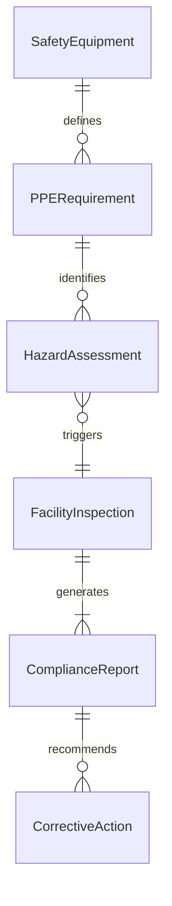
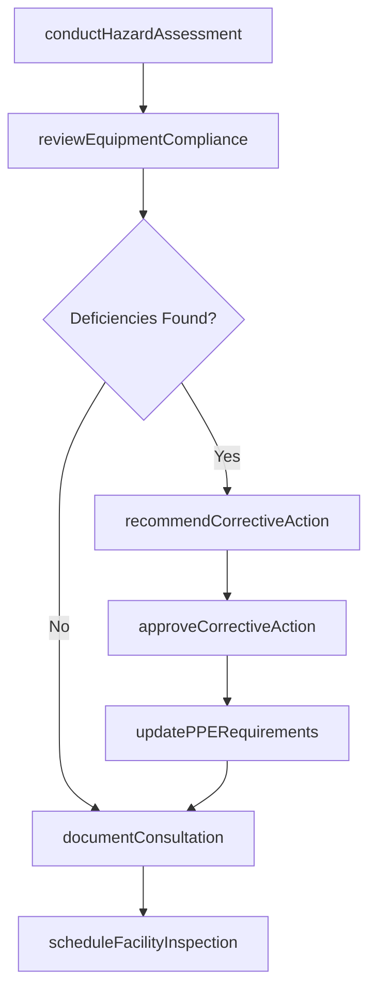
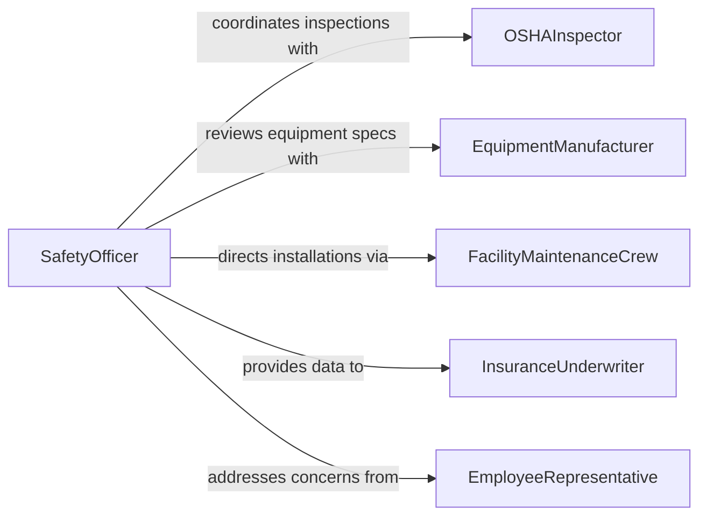

# Consult Others Regarding Safety Health

> Business-as-Code definition for consulting with others regarding safety or health equipment or facilities. Models the advisory process where safety professionals, facility managers, and health officers collaborate to evaluate and improve workplace safety systems and infrastructure.

## Overview

Consulting with others regarding safety or health equipment or facilities involves engaging safety officers, occupational health professionals, facility managers, and regulatory inspectors in discussions about the adequacy, placement, maintenance, and compliance of safety systems and health-related infrastructure. This includes evaluating personal protective equipment needs, assessing emergency systems such as fire suppression and ventilation, reviewing facility layouts for ergonomic and safety compliance, and planning upgrades to meet evolving regulatory standards. The consultations ensure that workplaces maintain safe operating conditions and meet all applicable health and safety requirements.

## Actors

| Actor | Description |
|-------|-------------|
| OSHAInspector | Regulatory official who evaluates workplace safety compliance |
| EquipmentManufacturer | Producer of safety or health equipment who provides specifications and guidance |
| FacilityMaintenanceCrew | Technicians who install, repair, and maintain safety systems and equipment |
| InsuranceUnderwriter | Risk assessor who evaluates safety measures for coverage and premium determinations |
| EmployeeRepresentative | Worker delegate who communicates safety concerns on behalf of staff |

## Roles

| Role | Description |
|------|-------------|
| SafetyOfficer | Leads safety consultations and coordinates compliance activities |
| OccupationalHealthSpecialist | Advises on health-related equipment, ergonomics, and exposure controls |
| FacilityManager | Oversees the physical infrastructure and safety system installations |
| SafetyCommitteeChair | Facilitates cross-functional discussions on safety policies and improvements |

## Entities

| Entity | Description |
|--------|-------------|
| SafetyEquipment | Devices and systems designed to protect workers from hazards (e.g., fire extinguishers, eyewash stations) |
| PPERequirement | A specification for personal protective equipment needed for a task or area |
| FacilityInspection | A structured evaluation of a workplace for safety and health compliance |
| HazardAssessment | An analysis identifying potential safety or health risks in a work area |
| ComplianceReport | A document summarizing the results of a safety or health evaluation |
| CorrectiveAction | A planned remediation step to address an identified safety deficiency |

## Actions

| Action | Description |
|--------|-------------|
| conductHazardAssessment | Evaluate a work area to identify safety or health risks |
| reviewEquipmentCompliance | Check safety equipment against regulatory standards and manufacturer specifications |
| scheduleFacilityInspection | Arrange a formal evaluation of facility safety systems |
| recommendCorrectiveAction | Propose a remediation plan to address identified safety deficiencies |
| updatePPERequirements | Revise personal protective equipment specifications based on assessment findings |
| documentConsultation | Record the topics discussed, decisions made, and actions assigned during a safety consultation |
| approveCorrectiveAction | Formally authorize a remediation plan for implementation |

## Events

| Event | Description |
|-------|-------------|
| hazardAssessmentConducted | A work area evaluation for safety or health risks has been completed |
| equipmentComplianceReviewed | Safety equipment has been checked against regulatory standards |
| facilityInspectionScheduled | A formal evaluation of facility safety systems has been arranged |
| correctiveActionRecommended | A remediation plan has been proposed for a safety deficiency |
| ppeRequirementsUpdated | Personal protective equipment specifications have been revised |
| consultationDocumented | A safety consultation record has been created |
| correctiveActionApproved | A remediation plan has been formally authorized for implementation |

## Searches

| Search | Description |
|--------|-------------|
| findHazardAssessments | Retrieve assessments by facility, area, date, or risk severity |
| getOpenCorrectiveActions | List unresolved corrective actions by facility, priority, or due date |
| getEquipmentInventory | Retrieve safety equipment records by type, location, or inspection status |
| getInspectionHistory | List past facility inspections with results and follow-up status |

## Entity Relationships



## State Diagram

```mermaid
stateDiagram-v2
    [*] --> Hazard Assessment Conducted
    Hazard Assessment Conducted --> Equipment Compliance Reviewed : equipmentComplianceReviewed
    Equipment Compliance Reviewed --> Facility Inspection Scheduled : facilityInspectionScheduled
    Facility Inspection Scheduled --> Corrective Action Recommended : correctiveActionRecommended
    Corrective Action Recommended --> Corrective Action Approved : correctiveActionApproved
    Corrective Action Approved --> PPE Requirements Updated : ppeRequirementsUpdated
    Corrective Action Recommended --> Equipment Compliance Reviewed : revisionRequired
    PPE Requirements Updated --> Consultation Documented : consultationDocumented
    Consultation Documented --> [*]
```



## Workflow



## Actor Relationships



## Usage

### Calling Actions

```typescript
import { consultOthersRegardingSafetyHealth } from '@headlessly/consult-others-regarding-safety-health'

const safety = consultOthersRegardingSafetyHealth()

// Conduct a hazard assessment for a manufacturing floor
const assessment = await safety.conductHazardAssessment({
  facility: 'plant-north-building-a',
  area: 'welding-bay-3',
  assessors: ['safety-officer', 'occupational-health-specialist'],
  hazardTypes: ['chemical-exposure', 'fire', 'noise', 'ergonomic']
})

// Review equipment compliance
await safety.reviewEquipmentCompliance({
  assessmentId: assessment.id,
  equipment: [
    { type: 'fume-extraction-system', serialNumber: 'FES-2024-047' },
    { type: 'fire-suppression', serialNumber: 'FS-2023-112' },
    { type: 'emergency-eyewash', serialNumber: 'EW-2025-003' }
  ],
  standards: ['OSHA-29-CFR-1910', 'NFPA-10']
})

// Recommend corrective actions for identified deficiencies
await safety.recommendCorrectiveAction({
  assessmentId: assessment.id,
  actions: [
    { deficiency: 'Inadequate ventilation in welding bay', remedy: 'Install additional fume extraction hood', priority: 'high', dueDate: '2026-03-01' }
  ]
})
```

### Event-Driven Automation

```typescript
// Auto-schedule follow-up inspection after corrective action is approved
safety.correctiveActionApproved(async ({ assessmentId, actionId, dueDate }) => {
  await safety.scheduleFacilityInspection({
    facility: assessmentId,
    purpose: `Verify corrective action ${actionId}`,
    scheduledDate: dueDate,
    inspectors: ['safety-officer']
  })
})

// Notify employees when PPE requirements change
safety.ppeRequirementsUpdated(async ({ area, updatedRequirements }) => {
  await notify({
    to: `employees-${area}`,
    message: `PPE requirements updated for ${area}. Please review new specifications.`,
    data: updatedRequirements
  })
})
```
