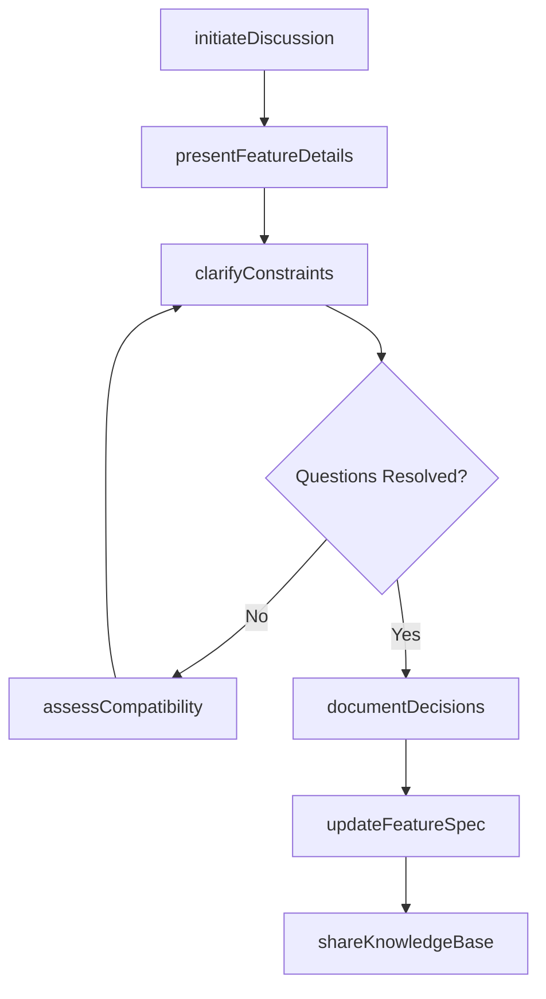
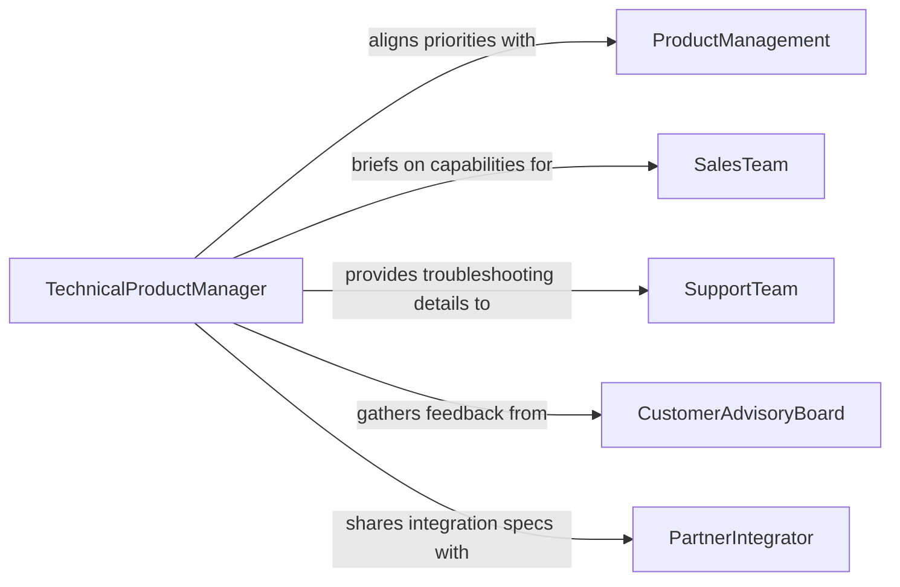

# Discuss Design Technical Features Products

> Business-as-Code definition for discussing design or technical features of products or services with technical personnel. Models the communication process where product managers, sales teams, and technical staff align on feature capabilities, constraints, and implementation details.

## Overview

Discussing design or technical features of products or services with technical personnel involves structured conversations between product owners, engineers, designers, and sales or support teams to clarify how a product works, what its capabilities and limitations are, and how features should be presented to customers or implemented in future iterations. These discussions bridge the gap between technical implementation and business or customer-facing requirements, ensuring that all parties share an accurate understanding of feature behavior, performance characteristics, and design intent.

## Actors

| Actor | Description |
|-------|-------------|
| ProductManagement | Defines product strategy and communicates feature priorities to technical teams |
| SalesTeam | Requires accurate technical knowledge to present product capabilities to prospects |
| SupportTeam | Needs detailed feature understanding to troubleshoot and guide customers |
| CustomerAdvisoryBoard | External customers who provide feedback on product features and design |
| PartnerIntegrator | Third-party developers who need technical details for integration purposes |

## Roles

| Role | Description |
|------|-------------|
| TechnicalProductManager | Bridges product vision and engineering execution on feature discussions |
| SoftwareEngineer | Provides deep technical knowledge of feature implementation and constraints |
| SolutionsArchitect | Explains system-level design and integration capabilities to stakeholders |
| UXDesigner | Communicates design decisions and user interaction patterns |

## Entities

| Entity | Description |
|--------|-------------|
| FeatureSpecification | A document detailing the behavior, parameters, and constraints of a product feature |
| TechnicalBrief | A concise summary of a feature's technical architecture and dependencies |
| DesignRationale | An explanation of why specific design decisions were made |
| CompatibilityMatrix | A table showing which features work across platforms, versions, or configurations |
| DiscussionRecord | A log of topics covered, decisions made, and follow-up items from a feature discussion |

## Actions

| Action | Description |
|--------|-------------|
| initiateDiscussion | Start a structured conversation about a product feature or design topic |
| presentFeatureDetails | Deliver a technical walkthrough of a feature's design and behavior |
| clarifyConstraints | Explain technical limitations or dependencies that affect feature behavior |
| documentDecisions | Record the outcomes and action items from a feature discussion |
| updateFeatureSpec | Revise a feature specification based on discussion outcomes |
| assessCompatibility | Evaluate how a feature interacts with other systems, platforms, or configurations |
| shareKnowledgeBase | Distribute technical documentation to teams who need feature understanding |

## Events

| Event | Description |
|-------|-------------|
| discussionInitiated | A structured feature discussion has been started |
| featureDetailsPresented | A technical walkthrough of a feature has been delivered |
| constraintsClarified | Technical limitations or dependencies have been explained |
| decisionsDocumented | Discussion outcomes and action items have been recorded |
| featureSpecUpdated | A feature specification has been revised based on discussion outcomes |
| compatibilityAssessed | Feature interaction with other systems has been evaluated |
| knowledgeBaseShared | Technical documentation has been distributed to relevant teams |

## Searches

| Search | Description |
|--------|-------------|
| findFeatureSpecs | Retrieve feature specifications by product, version, or feature name |
| getDiscussionHistory | List past discussions for a specific feature or product area |
| getCompatibilityMatrix | Retrieve compatibility data for a feature across platforms and versions |
| getOpenQuestions | List unresolved technical questions from feature discussions |

## Workflow



## Actor Relationships



## Usage

### Calling Actions

```typescript
import { discussDesignTechnicalFeaturesProducts } from '@headlessly/discuss-design-technical-features-products'

const features = discussDesignTechnicalFeaturesProducts()

// Initiate a discussion about a new authentication feature
const discussion = await features.initiateDiscussion({
  product: 'platform-v4',
  feature: 'multi-factor-authentication',
  participants: ['software-engineer', 'solutions-architect', 'sales-lead'],
  topics: ['supported-methods', 'performance-impact', 'enterprise-compatibility']
})

// Present technical details of the feature
await features.presentFeatureDetails({
  discussionId: discussion.id,
  feature: 'multi-factor-authentication',
  details: {
    methods: ['TOTP', 'WebAuthn', 'SMS'],
    latencyImpact: '<200ms per authentication',
    dependencies: ['identity-service-v2', 'sms-gateway']
  }
})

// Update the feature specification after discussion
await features.updateFeatureSpec({
  feature: 'multi-factor-authentication',
  version: '1.2',
  changes: [
    { field: 'supported-methods', added: 'passkey-support' },
    { field: 'minimum-version', value: 'platform-v4.1' }
  ]
})
```

### Event-Driven Automation

```typescript
// Auto-distribute updated specs to sales and support teams
features.featureSpecUpdated(async ({ feature, version, changes }) => {
  await features.shareKnowledgeBase({
    feature,
    version,
    recipients: ['sales-team', 'support-team'],
    format: 'technical-brief'
  })
})

// Notify partner integrators when compatibility data changes
features.compatibilityAssessed(async ({ feature, compatibilityMatrix }) => {
  await notify({
    to: 'partner-integrators',
    message: `Compatibility matrix updated for ${feature}. Please review for integration impact.`,
    data: compatibilityMatrix
  })
})
```
