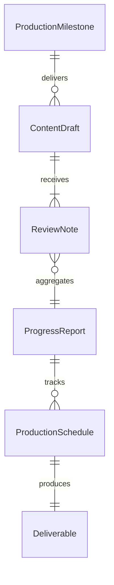
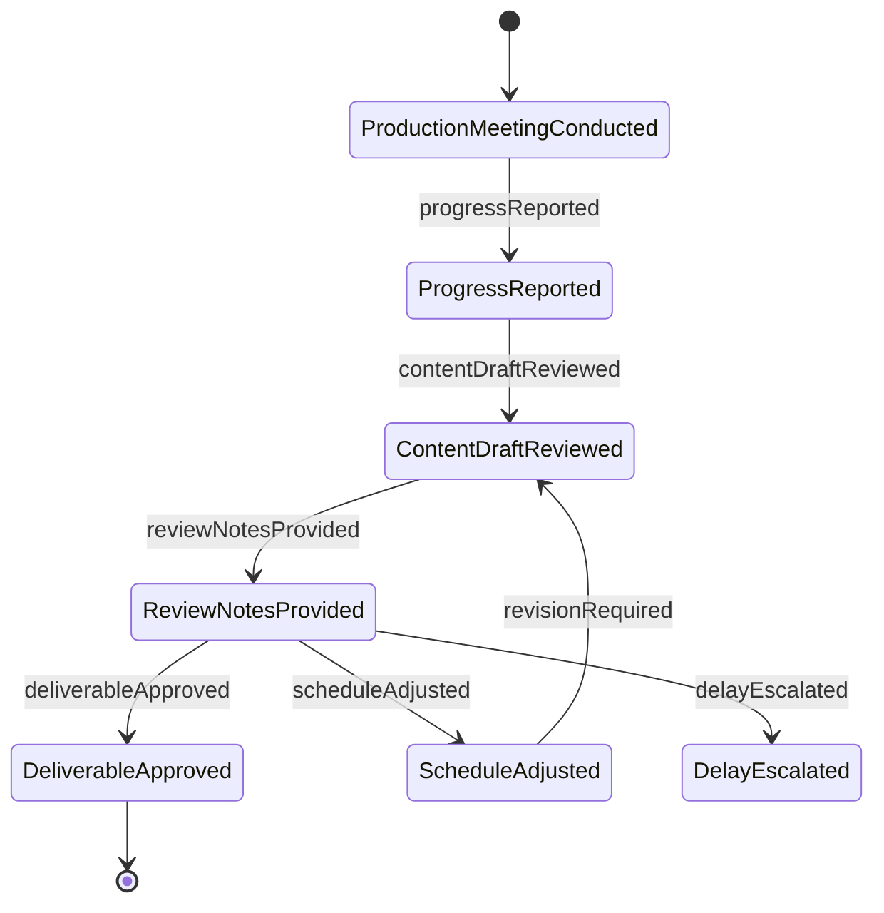
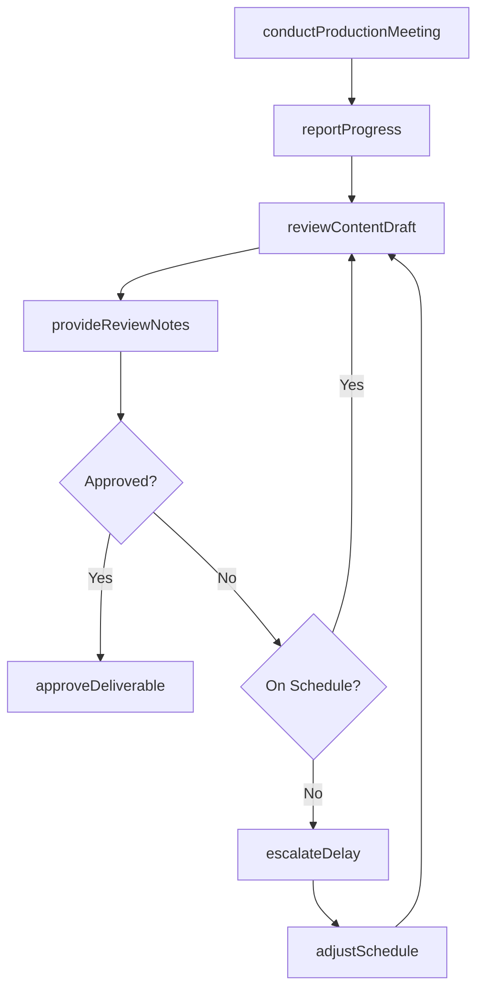
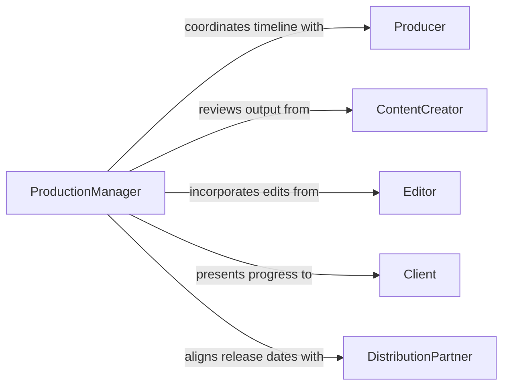

# Discuss Production Content Progress Others

> Business-as-Code definition for discussing production content and progress with others. Models the communication process for reviewing creative and production output, tracking progress against schedules, and aligning teams on content direction and delivery timelines.

## Overview

Discussing production content and progress with others involves holding regular check-ins, reviews, and status meetings where creative teams, producers, editors, and stakeholders evaluate the quality and completeness of production output. This applies to media production, publishing, advertising, software development, and manufacturing contexts where content or deliverables progress through defined stages. These discussions surface quality issues, identify schedule risks, and ensure that the evolving work product aligns with the original vision and client expectations.

## Actors

| Actor | Description |
|-------|-------------|
| Producer | Oversees the production timeline and coordinates between creative and business teams |
| ContentCreator | Writers, designers, or developers who generate the production output |
| Editor | Reviews and refines content for quality, consistency, and alignment with standards |
| Client | The stakeholder who commissioned the production and approves deliverables |
| DistributionPartner | The channel or platform through which the content will be released or delivered |

## Roles

| Role | Description |
|------|-------------|
| ProductionManager | Tracks progress across all production workstreams and flags schedule risks |
| CreativeDirector | Guides the artistic or strategic direction of the production content |
| ContentReviewer | Evaluates deliverables against quality standards and provides structured feedback |
| ScheduleCoordinator | Maintains the production timeline and manages dependencies between tasks |

## Entities

| Entity | Description |
|--------|-------------|
| ProductionMilestone | A defined checkpoint in the production timeline with expected deliverables |
| ContentDraft | A version of production output submitted for review and feedback |
| ProgressReport | A summary of completed, in-progress, and upcoming production activities |
| ReviewNote | Specific feedback on a content draft from a reviewer or stakeholder |
| ProductionSchedule | A timeline defining phases, deadlines, and dependencies for the production |
| Deliverable | A final or interim output that satisfies a production milestone requirement |

## Actions

| Action | Description |
|--------|-------------|
| reviewContentDraft | Evaluate a submitted content draft for quality and alignment with objectives |
| reportProgress | Share a status update on completed and upcoming production activities |
| conductProductionMeeting | Facilitate a scheduled discussion on content and production status |
| provideReviewNotes | Submit structured feedback on a content draft to the creator |
| adjustSchedule | Modify the production timeline to reflect current progress and constraints |
| approveDeliverable | Formally accept a production output as meeting milestone requirements |
| escalateDelay | Communicate a schedule risk or delay to management or the client |

## Events

| Event | Description |
|-------|-------------|
| contentDraftReviewed | A content draft has been evaluated for quality and alignment |
| progressReported | A production status update has been shared with stakeholders |
| productionMeetingConducted | A scheduled production discussion has been completed |
| reviewNotesProvided | Structured feedback has been submitted to the content creator |
| scheduleAdjusted | The production timeline has been modified based on current progress |
| deliverableApproved | A production output has been formally accepted |
| delayEscalated | A schedule risk or delay has been communicated to decision-makers |

## Searches

| Search | Description |
|--------|-------------|
| findContentDrafts | Retrieve content drafts by production, creator, status, or review stage |
| getMilestoneStatus | Check progress against defined production milestones |
| getReviewNotes | List feedback for a specific content draft or production phase |
| getUpcomingDeadlines | List approaching deadlines across active productions |

## Entity Relationships



## State Diagram



## Workflow



## Actor Relationships



## Usage

### Calling Actions

```typescript
import { discussProductionContentProgressOthers } from '@headlessly/discuss-production-content-progress-others'

const production = discussProductionContentProgressOthers()

// Report weekly production progress
const report = await production.reportProgress({
  production: 'brand-campaign-spring-2026',
  period: 'week-of-2026-02-03',
  completed: ['hero-video-rough-cut', 'social-media-copy-batch-1'],
  inProgress: ['landing-page-design', 'email-sequence-draft'],
  blocked: []
})

// Review a content draft
const review = await production.reviewContentDraft({
  production: 'brand-campaign-spring-2026',
  draft: 'hero-video-rough-cut',
  reviewers: ['creative-director', 'client-rep'],
  criteria: ['brand-alignment', 'messaging-clarity', 'visual-quality']
})

// Provide review notes to the content creator
await production.provideReviewNotes({
  draftId: review.draftId,
  notes: [
    { timestamp: '00:15', note: 'Tighten the opening transition' },
    { timestamp: '01:42', note: 'Replace stock footage with branded b-roll' },
    { area: 'audio', note: 'Music bed overpowers voiceover in final segment' }
  ]
})
```

### Event-Driven Automation

```typescript
// Notify client when deliverable is approved
production.deliverableApproved(async ({ production: prodId, deliverable, approvedBy }) => {
  await notify({
    to: 'client-rep',
    message: `Deliverable "${deliverable}" approved for ${prodId} by ${approvedBy}`
  })
})

// Alert production manager on schedule delays
production.delayEscalated(async ({ production: prodId, milestone, delayDays }) => {
  await notify({
    to: 'production-manager',
    message: `Schedule delay on ${prodId}: "${milestone}" delayed by ${delayDays} days`,
    priority: delayDays > 5 ? 'urgent' : 'normal'
  })
})
```
