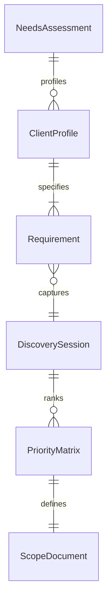
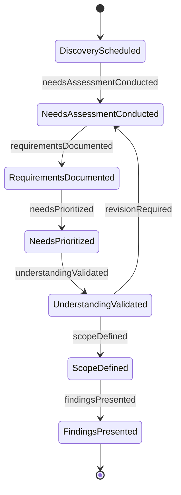
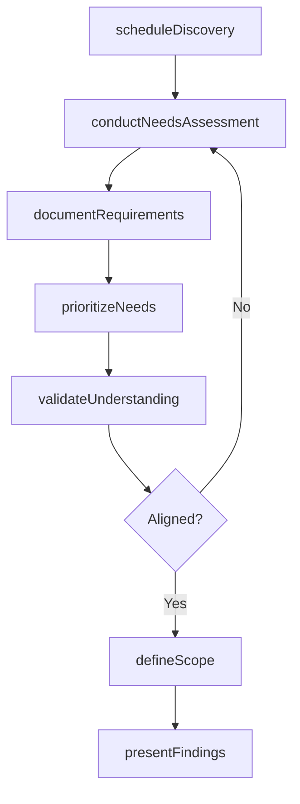
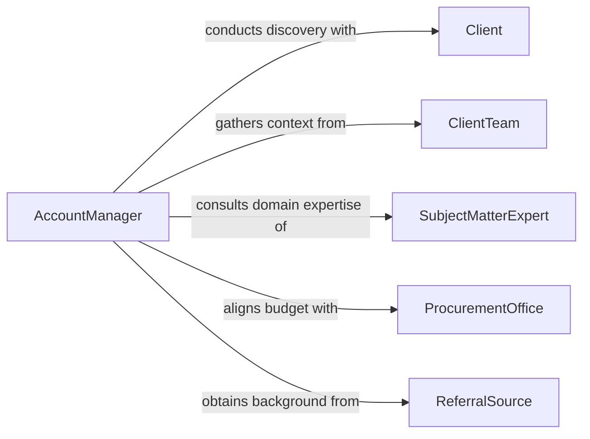

# Confer Clients Determine Needs

> Business-as-Code definition for conferring with clients to determine needs. Models the discovery and requirements-gathering process where service providers engage with clients to understand their objectives, constraints, and priorities before proposing solutions.

## Overview

Conferring with clients to determine needs involves conducting structured conversations, interviews, and discovery sessions to understand a client's business objectives, pain points, constraints, and success criteria. This activity is foundational to professional services, consulting, healthcare, legal work, and any engagement where the provider must first understand the client's situation before delivering a solution. The discovery process produces a clear set of documented requirements that guide subsequent planning, design, and delivery activities.

## Actors

| Actor | Description |
|-------|-------------|
| Client | The individual or organization seeking services and defining their requirements |
| ClientTeam | Additional stakeholders within the client organization who provide context and constraints |
| SubjectMatterExpert | A specialist who provides domain-specific insight during needs assessment |
| ProcurementOffice | The client department responsible for budgetary approval and contract terms |
| ReferralSource | A third party who introduced the client and may provide background context |

## Roles

| Role | Description |
|------|-------------|
| AccountManager | Leads the client relationship and facilitates the needs discovery process |
| BusinessAnalyst | Documents and analyzes client requirements in structured formats |
| SolutionConsultant | Translates client needs into potential service or product recommendations |
| EngagementLead | Defines the scope and approach for the client engagement based on discovered needs |

## Entities

| Entity | Description |
|--------|-------------|
| NeedsAssessment | A structured evaluation of the client's requirements, priorities, and constraints |
| ClientProfile | Background information about the client including industry, size, and history |
| Requirement | A specific need or expectation documented during the discovery process |
| DiscoverySession | A scheduled meeting dedicated to understanding client needs |
| ScopeDocument | A formal definition of what the engagement will and will not cover |
| PriorityMatrix | A ranking of client needs by urgency and importance |

## Actions

| Action | Description |
|--------|-------------|
| scheduleDiscovery | Arrange an initial meeting to begin understanding the client's needs |
| conductNeedsAssessment | Perform a structured evaluation of the client's requirements and constraints |
| documentRequirements | Record specific client needs in a structured and traceable format |
| prioritizeNeeds | Rank client requirements by urgency, importance, and feasibility |
| validateUnderstanding | Confirm with the client that documented needs accurately reflect their expectations |
| defineScope | Establish the boundaries of the engagement based on assessed needs |
| presentFindings | Share the results of the needs assessment with the client and internal teams |

## Events

| Event | Description |
|-------|-------------|
| discoveryScheduled | An initial needs discovery meeting has been arranged |
| needsAssessmentConducted | A structured evaluation of client requirements has been completed |
| requirementsDocumented | Client needs have been recorded in a structured format |
| needsPrioritized | Client requirements have been ranked by urgency and importance |
| understandingValidated | The client has confirmed that documented needs are accurate |
| scopeDefined | The engagement boundaries have been established based on assessed needs |
| findingsPresented | Needs assessment results have been shared with stakeholders |

## Searches

| Search | Description |
|--------|-------------|
| findNeedsAssessments | Retrieve assessments by client, date range, or engagement status |
| getClientRequirements | List documented requirements for a specific client or engagement |
| getPriorityMatrix | Retrieve the ranked needs for a client engagement |
| getDiscoverySessions | List scheduled or completed discovery sessions by client or account manager |

## Entity Relationships



## State Diagram



## Workflow



## Actor Relationships



## Usage

### Calling Actions

```typescript
import { conferClientsDetermineNeeds } from '@headlessly/confer-clients-determine-needs'

const discovery = conferClientsDetermineNeeds()

// Schedule a discovery session with a new client
const session = await discovery.scheduleDiscovery({
  client: 'acme-manufacturing',
  accountManager: 'sarah-johnson',
  participants: ['cto-acme', 'ops-director-acme', 'solutions-consultant'],
  scheduledDate: '2026-02-12',
  topics: ['current-systems', 'pain-points', 'growth-objectives']
})

// Conduct the needs assessment
const assessment = await discovery.conductNeedsAssessment({
  sessionId: session.id,
  client: 'acme-manufacturing',
  areas: ['inventory-management', 'order-fulfillment', 'reporting']
})

// Document and prioritize requirements
await discovery.documentRequirements({
  assessmentId: assessment.id,
  requirements: [
    { need: 'Real-time inventory visibility across 3 warehouses', category: 'inventory-management' },
    { need: 'Automated reorder triggers at threshold levels', category: 'order-fulfillment' },
    { need: 'Custom dashboard for executive KPI reporting', category: 'reporting' }
  ]
})

await discovery.prioritizeNeeds({
  assessmentId: assessment.id,
  priorities: [
    { requirement: 'real-time-inventory', urgency: 'high', importance: 'critical' },
    { requirement: 'automated-reorder', urgency: 'medium', importance: 'high' },
    { requirement: 'executive-dashboard', urgency: 'low', importance: 'medium' }
  ]
})
```

### Event-Driven Automation

```typescript
// Auto-generate scope document when understanding is validated
discovery.understandingValidated(async ({ assessmentId, clientId }) => {
  await discovery.defineScope({
    assessmentId,
    clientId,
    template: 'standard-engagement'
  })
})

// Notify internal team when findings are ready for presentation
discovery.requirementsDocumented(async ({ assessmentId, requirementCount }) => {
  await notify({
    to: 'engagement-team',
    message: `${requirementCount} requirements documented for assessment ${assessmentId}. Ready for prioritization and review.`
  })
})
```
