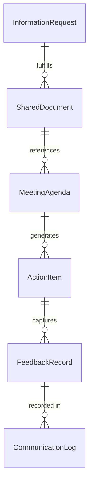
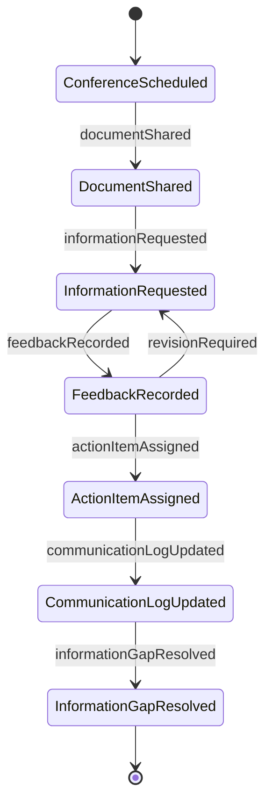
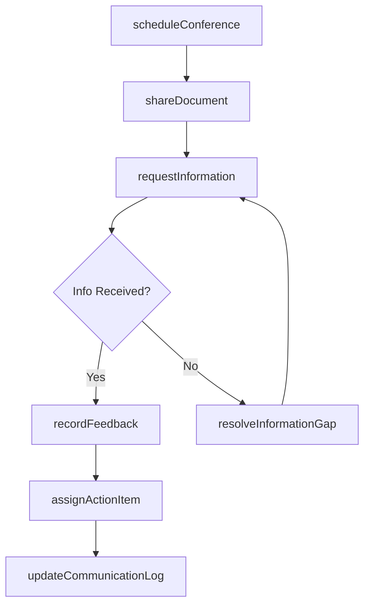
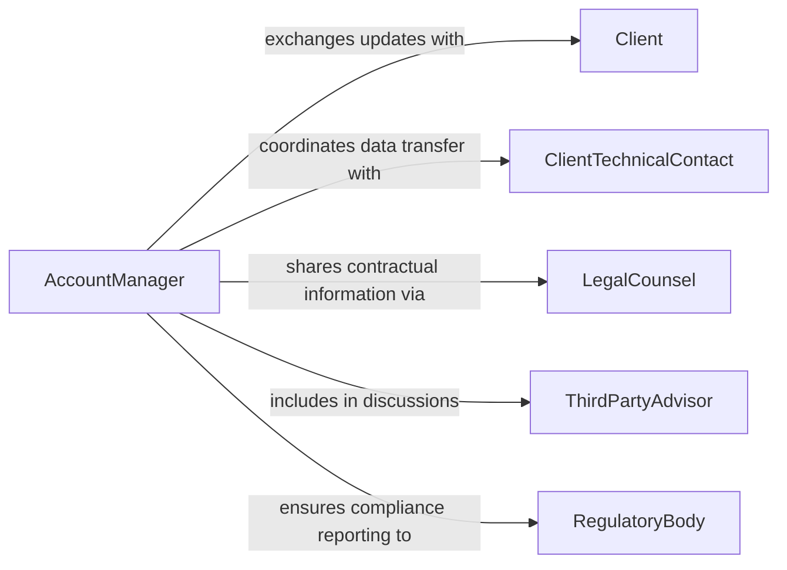

# Confer Clients Exchange Information

> Business-as-Code definition for conferring with clients to exchange information. Models the bidirectional communication process where service providers and clients share updates, data, documentation, and feedback to support ongoing engagements.

## Overview

Conferring with clients to exchange information involves the regular, structured sharing of data, status updates, documentation, and feedback between service providers and their clients throughout an engagement. Unlike initial needs discovery, this activity focuses on ongoing communication that keeps both parties aligned as work progresses. It includes sharing project updates, exchanging technical data, providing and receiving deliverable feedback, and coordinating on decisions that require mutual input. This continuous information exchange builds trust, reduces misunderstandings, and ensures that deliverables remain aligned with evolving client expectations.

## Actors

| Actor | Description |
|-------|-------------|
| Client | The individual or organization receiving services and exchanging project-related information |
| ClientTechnicalContact | The client's designated point of contact for technical data and system access |
| LegalCounsel | Attorney representing either party who exchanges contractual or regulatory information |
| ThirdPartyAdvisor | An independent consultant engaged by the client who participates in information exchange |
| RegulatoryBody | A government or industry authority whose requirements shape the information exchanged |

## Roles

| Role | Description |
|------|-------------|
| AccountManager | Manages the overall client relationship and facilitates information flow |
| ProjectLead | Coordinates the exchange of project-specific data, updates, and deliverables |
| DataCoordinator | Handles the secure transfer and organization of shared data and documents |
| ClientSuccessManager | Ensures the client receives timely information and that feedback loops are effective |

## Entities

| Entity | Description |
|--------|-------------|
| InformationRequest | A formal ask from one party for specific data or documentation from the other |
| SharedDocument | A file or report exchanged between the provider and client |
| MeetingAgenda | A structured outline of topics to be covered during a client conference |
| ActionItem | A task assigned to either party as a result of an information exchange |
| FeedbackRecord | A documented response from the client regarding a deliverable or update |
| CommunicationLog | A chronological record of all exchanges between provider and client |

## Actions

| Action | Description |
|--------|-------------|
| scheduleConference | Arrange a meeting with the client for information exchange |
| shareDocument | Transmit a file or report to the client through a secure channel |
| requestInformation | Submit a formal request to the client for specific data or documentation |
| recordFeedback | Document the client's response, comments, or concerns about a deliverable |
| assignActionItem | Create a task for either party resulting from a discussion or review |
| updateCommunicationLog | Append a new entry to the chronological record of client exchanges |
| resolveInformationGap | Address a discrepancy or missing data identified during an exchange |

## Events

| Event | Description |
|-------|-------------|
| conferenceScheduled | A client meeting for information exchange has been arranged |
| documentShared | A file or report has been transmitted to the client |
| informationRequested | A formal request for data has been submitted to the client |
| feedbackRecorded | The client's response to a deliverable has been documented |
| actionItemAssigned | A task has been created for either party from a discussion |
| communicationLogUpdated | A new entry has been added to the exchange record |
| informationGapResolved | A discrepancy or missing data has been addressed |

## Searches

| Search | Description |
|--------|-------------|
| findSharedDocuments | Retrieve documents exchanged with a client by date, type, or project |
| getOpenActionItems | List unresolved tasks from client conferences by assignee or due date |
| getCommunicationLog | Retrieve the chronological exchange history for a client engagement |
| getPendingRequests | List information requests that have not yet been fulfilled |


## Entity Relationships



## State Diagram



## Workflow



## Actor Relationships



## Usage

### Calling Actions

```typescript
import { conferClientsExchangeInformation } from '@headlessly/confer-clients-exchange-information'

const exchange = conferClientsExchangeInformation()

// Schedule a bi-weekly client conference
const conference = await exchange.scheduleConference({
  client: 'meridian-financial',
  frequency: 'bi-weekly',
  nextDate: '2026-02-14',
  attendees: ['account-manager', 'project-lead', 'client-cfo', 'client-it-director'],
  agenda: ['project-status', 'data-migration-progress', 'open-items-review']
})

// Share a project deliverable with the client
await exchange.shareDocument({
  client: 'meridian-financial',
  document: {
    name: 'Q1-Integration-Progress-Report.pdf',
    type: 'progress-report',
    confidentiality: 'client-confidential'
  },
  recipients: ['client-cfo', 'client-it-director'],
  channel: 'secure-portal'
})

// Request missing data from the client
await exchange.requestInformation({
  client: 'meridian-financial',
  request: {
    description: 'Historical transaction data for fiscal years 2023-2025',
    format: 'CSV or database export',
    dueDate: '2026-02-21',
    assignedTo: 'client-it-director'
  }
})
```

### Event-Driven Automation

```typescript
// Auto-log all document exchanges
exchange.documentShared(async ({ client, document, sharedAt }) => {
  await exchange.updateCommunicationLog({
    client,
    entry: `Document shared: ${document.name}`,
    timestamp: sharedAt,
    type: 'document-exchange'
  })
})

// Follow up on overdue information requests
exchange.informationRequested(async ({ client, request }) => {
  setTimeout(async () => {
    const pending = await exchange.getPendingRequests({ client })
    const overdue = pending.filter(r => r.id === request.id)
    if (overdue.length > 0) {
      await notify({
        to: 'account-manager',
        message: `Information request overdue from ${client}: "${request.description}"`
      })
    }
  }, 7 * 24 * 60 * 60 * 1000) // 7 days
})
```
