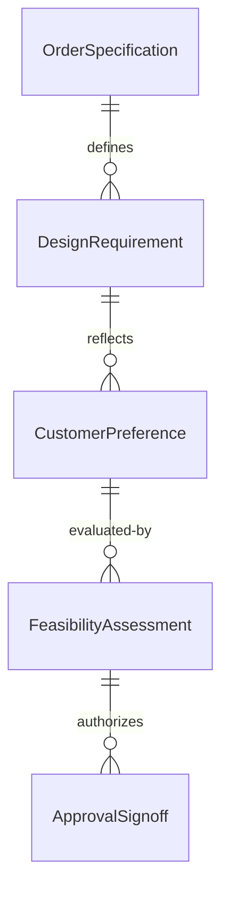
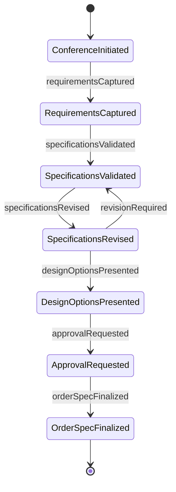
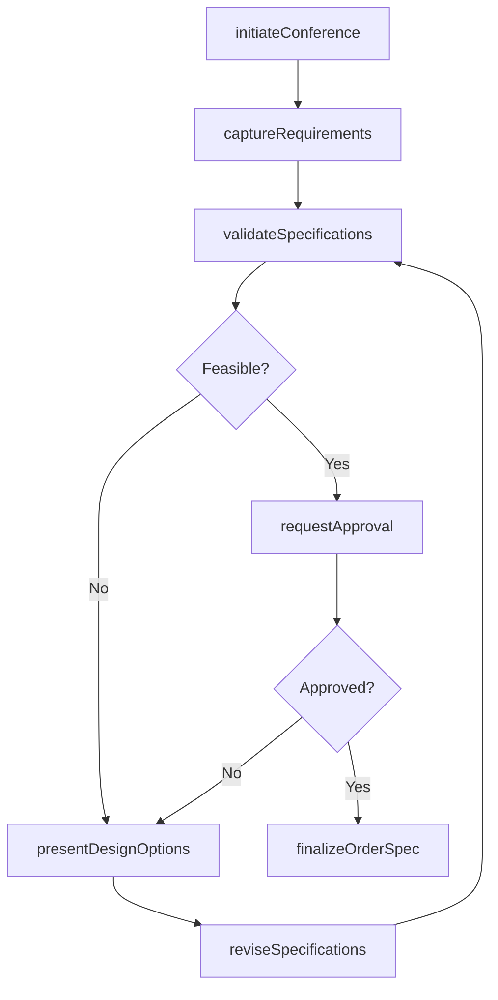
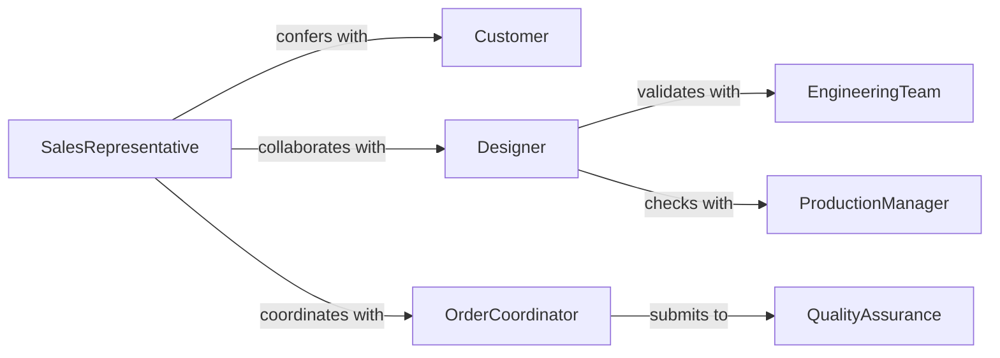

# Confer Customers Designers Determine Order

> Business-as-Code definition for collaborating with customers and design professionals to establish precise order specifications. Models requirements gathering, specification validation, and approval workflows for custom orders.

## Overview

Order specification conferencing involves engaging with customers and designers to define detailed requirements for custom products or services. This definition provides actions for capturing specifications, validating feasibility, and securing approvals before order fulfillment begins.

## Actors

| Actor | Description |
|-------|-------------|
| Customer | Requests custom product or service with specific requirements |
| Designer | Provides technical expertise on design specifications |
| SupplierVendor | Supplies materials or components for custom orders |
| EngineeringTeam | Validates technical feasibility of specifications |
| ProductionManager | Confirms manufacturing capability and timeline |
| QualityAssurance | Reviews specifications against quality standards |

## Roles

| Role | Description |
|------|-------------|
| SalesRepresentative | Facilitates customer conferencing and requirements capture |
| DesignConsultant | Translates customer needs into technical specifications |
| SpecificationWriter | Documents detailed order requirements |
| OrderCoordinator | Manages specification approval and order processing |

## Entities

| Entity | Description |
|--------|-------------|
| OrderSpecification | Detailed requirements for a custom order |
| DesignRequirement | Specific design criteria or constraint |
| CustomerPreference | Client choices regarding materials, features, or options |
| Specification Document | Formal record of all order requirements |
| FeasibilityAssessment | Evaluation of whether specifications can be met |
| ApprovalSignoff | Customer confirmation of final specifications |

## Actions

| Action | Description |
|--------|-------------|
| initiateConference | Begin requirements discussion with customer and designer |
| captureRequirements | Document customer needs and design parameters |
| validateSpecifications | Confirm technical feasibility of stated requirements |
| reviseSpecifications | Modify requirements based on feedback or constraints |
| presentDesignOptions | Show alternative approaches meeting customer needs |
| requestApproval | Submit final specifications for customer signoff |
| finalizeOrderSpec | Lock specifications and prepare for order processing |

## Events

| Event | Description |
|-------|-------------|
| conferenceInitiated | Requirements discussion has begun |
| requirementsCaptured | Customer needs have been documented |
| specificationsValidated | Technical feasibility has been confirmed |
| specificationsRevised | Requirements have been modified |
| designOptionsPresented | Alternative approaches have been shown to customer |
| approvalRequested | Final specifications submitted for customer signoff |
| orderSpecFinalized | Specifications locked and order ready to process |

## Searches

| Search | Description |
|--------|-------------|
| findPendingSpecs | List orders awaiting specification finalization |
| getSpecsByCustomer | Retrieve specification history for a customer |
| getDesignOptions | Find alternative design approaches for requirements |
| getApprovalStatus | Check specification approval state by order |
| getFeasibilityIssues | List specifications with validation concerns |


## Entity Relationships



## State Diagram



## Workflow



## Actor Relationships



## Usage

### Calling Actions

```typescript
import { conferCustomersDesignersDetermineOrder } from '@headlessly/confer-customers-designers-determine-order'

const orderSpec = conferCustomersDesignersDetermineOrder()

// Initiate specification conference
const conference = await orderSpec.initiateConference({
  customerId: 'cust-98765',
  designerId: 'des-11111',
  salesRepId: 'sales-22222',
  orderType: 'custom-furniture',
  scheduledDate: '2026-02-10T10:00:00Z'
})

// Capture customer requirements
const requirements = await orderSpec.captureRequirements({
  conferenceId: conference.id,
  specifications: {
    dimensions: { width: 84, depth: 42, height: 36, unit: 'inches' },
    material: 'solid-walnut',
    finish: 'oil-rubbed',
    hardware: 'brass-antique',
    features: ['soft-close-drawers', 'dovetail-joints']
  },
  budget: { max: 4500, currency: 'USD' },
  timeline: { desiredDelivery: '2026-04-15' }
})

// Validate specifications
const validation = await orderSpec.validateSpecifications({
  requirementsId: requirements.id,
  checkFeasibility: true,
  checkMaterialAvailability: true,
  estimateCost: true
})

// Present design options if revisions needed
if (!validation.feasible) {
  await orderSpec.presentDesignOptions({
    conferenceId: conference.id,
    options: [
      {
        name: 'Premium Walnut',
        modifications: ['Use book-matched walnut veneer instead of solid'],
        costSavings: 1200,
        deliveryImpact: 'None'
      },
      {
        name: 'Extended Timeline',
        modifications: ['Maintain solid walnut, extend delivery to May 30'],
        costSavings: 0,
        deliveryImpact: '+45 days'
      }
    ]
  })
}
```

### Event-Driven Automation

```typescript
// Auto-notify engineering when complex specifications are captured
orderSpec.requirementsCaptured(async ({ requirements, orderType }) => {
  if (requirements.complexity === 'high' || orderType === 'custom-machinery') {
    await notifyTeam({
      team: 'engineering',
      subject: `Complex Order Specification Requires Review`,
      requirements
    })
  }
})

// Track approval bottlenecks
orderSpec.approvalRequested(async ({ conferenceId, requestedAt }) => {
  setTimeout(async () => {
    const status = await orderSpec.getApprovalStatus(conferenceId)
    if (status !== 'approved' && status !== 'rejected') {
      await escalateToSalesManager({
        conferenceId,
        reason: 'Approval pending for 3 days',
        requestFollowup: true
      })
    }
  }, 3 * 24 * 60 * 60 * 1000) // 3 days
})
```
