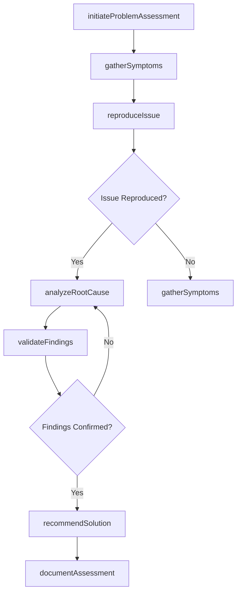
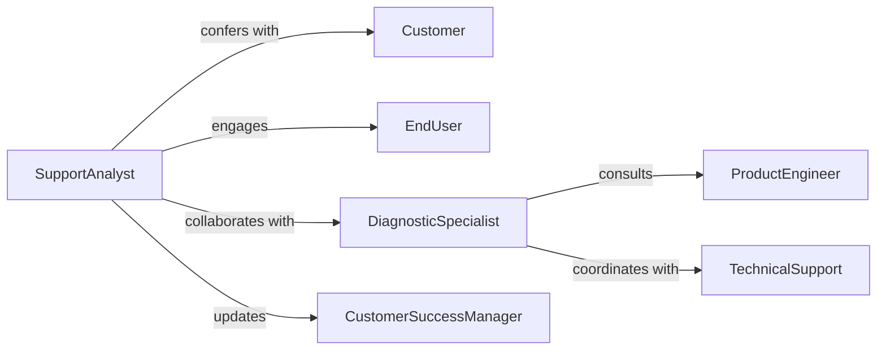

# Confer Customers Users Assess Problems

> Business-as-Code definition for diagnosing customer and end-user problems through collaborative assessment. Models issue discovery, root cause analysis, and solution recommendation workflows.

## Overview

Customer problem assessment involves engaging with users to understand difficulties, diagnose root causes, and identify appropriate solutions. This definition exposes actions for conducting problem interviews, analyzing symptoms, and collaborating with customers to validate findings before recommending remediation.

## Actors

| Actor | Description |
|-------|-------------|
| Customer | Experiences problems with products or services |
| EndUser | Directly operates systems or tools encountering issues |
| TechnicalSupport | Provides expertise in troubleshooting and diagnosis |
| ProductEngineer | Analyzes product-related problems and defects |
| VendorSupplier | Assists with third-party component issues |
| QualityAssurance | Investigates quality defects and failure patterns |

## Roles

| Role | Description |
|------|-------------|
| SupportAnalyst | Conducts initial problem assessment with customer |
| DiagnosticSpecialist | Performs detailed technical analysis of issues |
| CustomerSuccessManager | Ensures customer satisfaction through problem resolution |
| SolutionArchitect | Designs remediation approaches for complex problems |

## Entities

| Entity | Description |
|--------|-------------|
| ProblemReport | Customer-reported issue requiring assessment |
| Symptom | Observable indication of underlying problem |
| RootCause | Underlying factor causing problem symptoms |
| DiagnosticSession | Collaborative investigation with customer |
| AssessmentFinding | Conclusion from problem analysis |
| RecommendedSolution | Proposed approach to resolve identified problem |

## Actions

| Action | Description |
|--------|-------------|
| initiateProblemAssessment | Begin diagnostic session with customer |
| gatherSymptoms | Collect detailed information about problem manifestation |
| reproduceIssue | Attempt to recreate problem in controlled environment |
| analyzeRootCause | Investigate underlying factors causing symptoms |
| validateFindings | Confirm diagnosis with customer or user |
| recommendSolution | Propose remediation approach based on assessment |
| documentAssessment | Record complete problem analysis and recommendations |

## Events

| Event | Description |
|-------|-------------|
| problemAssessmentInitiated | Diagnostic session has begun |
| symptomsGathered | Problem information has been collected |
| issueReproduced | Problem has been successfully recreated |
| rootCauseAnalyzed | Underlying cause has been identified |
| findingsValidated | Diagnosis has been confirmed with customer |
| solutionRecommended | Remediation approach has been proposed |
| assessmentDocumented | Complete analysis has been recorded |

## Searches

| Search | Description |
|--------|-------------|
| findActiveSessions | List ongoing problem assessment sessions |
| getProblemsByCategory | Retrieve issues grouped by problem type |
| getUnresolvedAssessments | Find assessments without recommended solutions |
| getSymptomPatterns | Identify recurring problem symptoms across customers |
| getSolutionsByProblemType | Retrieve recommended fixes for similar issues |

## Workflow



## Actor Relationships



## Usage

### Calling Actions

```typescript
import { conferCustomersUsersAssessProblems } from '@headlessly/confer-customers-users-assess-problems'

const assessment = conferCustomersUsersAssessProblems()

// Initiate problem assessment session
const session = await assessment.initiateProblemAssessment({
  customerId: 'cust-54321',
  userId: 'user-99999',
  analystId: 'analyst-777',
  problemCategory: 'software-performance',
  severity: 'high',
  scheduledTime: '2026-02-06T09:00:00Z'
})

// Gather problem symptoms from customer
const symptoms = await assessment.gatherSymptoms({
  sessionId: session.id,
  reportedSymptoms: [
    {
      description: 'Application freezes for 30-60 seconds during report generation',
      frequency: 'Every time reports exceed 1000 records',
      impactedOperations: ['monthly-sales-report', 'inventory-analysis']
    },
    {
      description: 'Database connection timeouts in error logs',
      firstObserved: '2026-01-28',
      environmentDetails: { version: '2.5.3', database: 'PostgreSQL 14.2' }
    }
  ]
})

// Attempt to reproduce the issue
const reproduction = await assessment.reproduceIssue({
  sessionId: session.id,
  environment: 'test',
  reproductionSteps: [
    'Navigate to Reports > Sales Analysis',
    'Select date range: Jan 1-31, 2026',
    'Click Generate Report button',
    'Observe application response time'
  ],
  observedBehavior: 'Application freezes at 45 seconds, timeout error at 60 seconds'
})

// Analyze root cause
await assessment.analyzeRootCause({
  sessionId: session.id,
  symptoms: symptoms.id,
  findings: {
    primaryCause: 'Inefficient SQL query missing index on transaction_date column',
    contributingFactors: ['Large dataset growth in January', 'Query timeout set too low at 60s'],
    evidenceCollected: ['Query execution plan', 'Database performance metrics']
  }
})
```

### Event-Driven Automation

```typescript
// Auto-escalate high-severity problems not reproduced within threshold
assessment.problemAssessmentInitiated(async ({ sessionId, severity, customerId }) => {
  if (severity === 'critical' || severity === 'high') {
    setTimeout(async () => {
      const status = await assessment.getSessionStatus(sessionId)
      if (status.stage === 'symptom-gathering' && !status.issueReproduced) {
        await notifyEscalationTeam({
          sessionId,
          customer: customerId,
          reason: 'High-severity issue not reproduced after 4 hours',
          requestAssistance: true
        })
      }
    }, 4 * 60 * 60 * 1000) // 4 hours
  }
})

// Track common problem patterns
assessment.rootCauseAnalyzed(async ({ findings, problemCategory }) => {
  await updateProblemPatterns({
    category: problemCategory,
    rootCause: findings.primaryCause,
    incrementOccurrence: true
  })

  // Suggest proactive outreach for similar issues
  const similarCases = await assessment.getSymptomPatterns({
    matchSymptoms: findings.symptoms,
    threshold: 0.8
  })

  if (similarCases.length > 5) {
    await suggestProactiveCustomerOutreach({
      affectedCustomers: similarCases.map(c => c.customerId),
      problemPattern: findings.primaryCause
    })
  }
})
```
