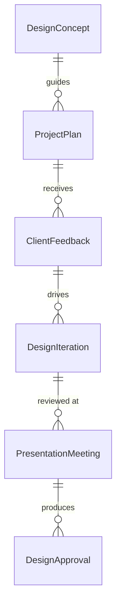
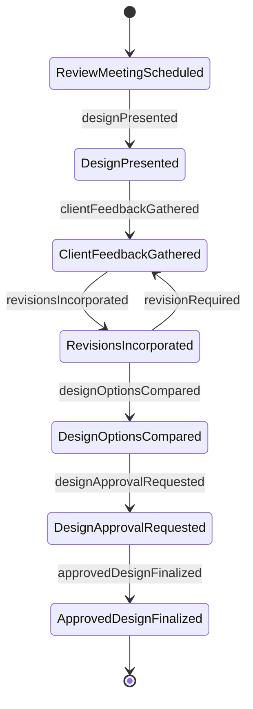
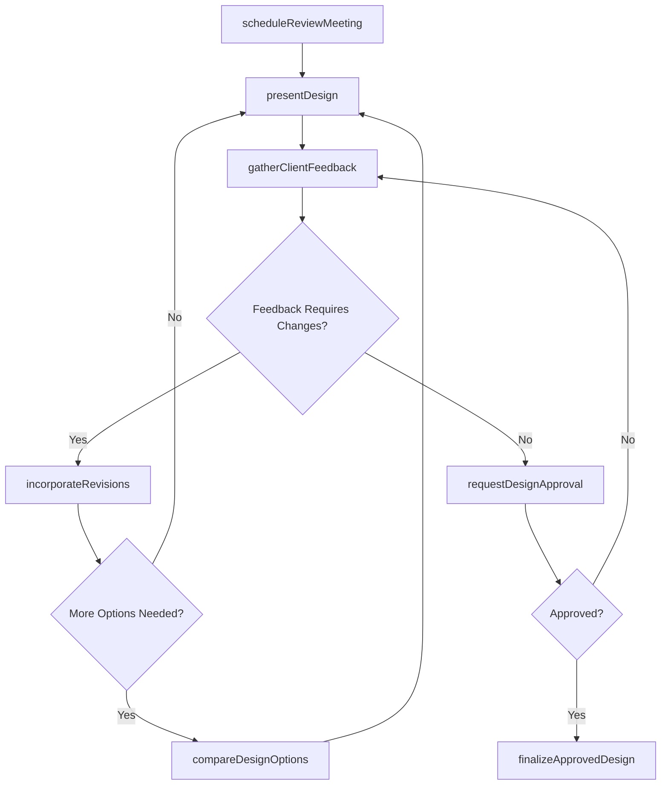
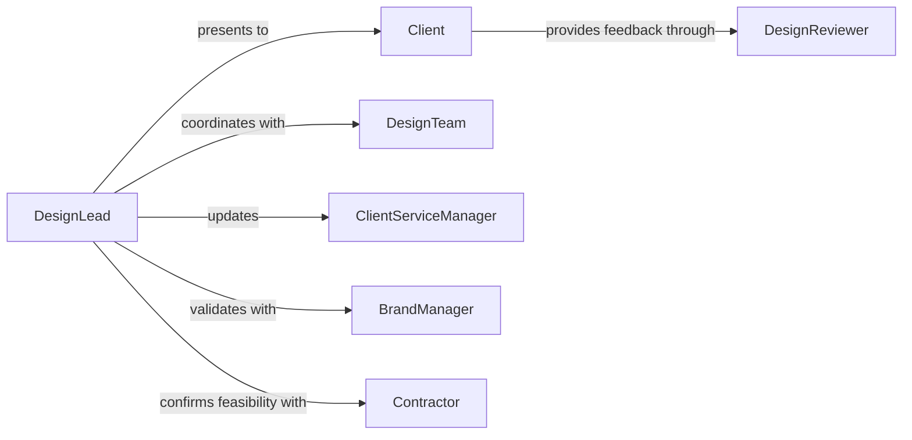

# Discuss Designs Plans Clients

> Business-as-Code definition for presenting and refining designs or project plans with clients. Models design review workflows, feedback incorporation, and approval processes for creative and technical deliverables.

## Overview

Design and plan discussions with clients involve presenting concepts, gathering feedback, and iterating toward approved solutions. This definition provides actions for scheduling reviews, presenting designs, capturing client input, and managing revision cycles until final approval is achieved.

## Actors

| Actor | Description |
|-------|-------------|
| Client | Reviews and approves designs or plans |
| DesignTeam | Creates design concepts and revisions |
| ProjectStakeholder | Provides input on design alignment with objectives |
| BrandManager | Ensures designs align with brand guidelines |
| Contractor | Evaluates plans for construction or implementation feasibility |
| RegulatoryAuthority | Reviews plans for code compliance and permitting |

## Roles

| Role | Description |
|------|-------------|
| DesignLead | Presents designs and coordinates revision process |
| ClientServiceManager | Facilitates client communication and satisfaction |
| DesignReviewer | Provides technical or aesthetic design feedback |
| ApprovalAuthority | Makes final decision on design acceptance |

## Entities

| Entity | Description |
|--------|-------------|
| DesignConcept | Visual or technical representation of proposed solution |
| ProjectPlan | Detailed timeline and approach for deliverables |
| ClientFeedback | Input and requested changes from client review |
| DesignIteration | Revised version incorporating client feedback |
| PresentationMeeting | Scheduled session to review designs with client |
| DesignApproval | Formal client acceptance of design or plan |

## Actions

| Action | Description |
|--------|-------------|
| scheduleReviewMeeting | Arrange design presentation session with client |
| presentDesign | Show design concepts or plans to client |
| gatherClientFeedback | Collect client input and change requests |
| incorporateRevisions | Update design based on client feedback |
| compareDesignOptions | Review multiple concepts side-by-side with client |
| requestDesignApproval | Submit design for formal client acceptance |
| finalizeApprovedDesign | Lock design and prepare for implementation |

## Events

| Event | Description |
|-------|-------------|
| reviewMeetingScheduled | Design presentation has been arranged |
| designPresented | Concepts have been shown to client |
| clientFeedbackGathered | Client input has been collected |
| revisionsIncorporated | Design has been updated based on feedback |
| designOptionsCompared | Multiple concepts have been reviewed together |
| designApprovalRequested | Design submitted for formal acceptance |
| approvedDesignFinalized | Design locked and ready for implementation |

## Searches

| Search | Description |
|--------|-------------|
| findPendingReviews | List designs awaiting client presentation |
| getDesignIterations | Retrieve revision history for a design concept |
| getFeedbackByClient | Find all client input for a specific customer |
| getApprovalStatus | Check approval state for designs by project |
| getActiveRevisionCycles | List designs undergoing iterative refinement |


## Entity Relationships



## State Diagram



## Workflow



## Actor Relationships



## Usage

### Calling Actions

```typescript
import { discussDesignsPlansClients } from '@headlessly/discuss-designs-plans-clients'

const designReview = discussDesignsPlansClients()

// Schedule design review meeting with client
const meeting = await designReview.scheduleReviewMeeting({
  clientId: 'client-88888',
  projectId: 'proj-12345',
  designLeadId: 'designer-555',
  scheduledFor: '2026-02-12T14:00:00Z',
  agenda: 'Present initial website homepage design concepts',
  designsToReview: ['concept-A', 'concept-B', 'concept-C']
})

// Present design concepts to client
const presentation = await designReview.presentDesign({
  meetingId: meeting.id,
  designs: [
    {
      conceptId: 'concept-A',
      name: 'Modern Minimalist',
      assets: ['homepage-desktop.png', 'homepage-mobile.png'],
      description: 'Clean layout with focus on product imagery',
      keyFeatures: ['Hero video', 'Parallax scrolling', 'Minimal navigation']
    },
    {
      conceptId: 'concept-B',
      name: 'Bold Typography',
      assets: ['homepage-alt.png'],
      description: 'Statement typography with vibrant color palette',
      keyFeatures: ['Large headings', 'Geometric shapes', 'Brand colors']
    }
  ]
})

// Gather client feedback
const feedback = await designReview.gatherClientFeedback({
  presentationId: presentation.id,
  clientInput: {
    preferredConcept: 'concept-A',
    requestedChanges: [
      'Reduce hero video to static image for faster loading',
      'Add testimonial section above footer',
      'Incorporate brand blue color (#003B73) in call-to-action buttons'
    ],
    approvalStatus: 'revisions-required'
  }
})

// Incorporate revisions
await designReview.incorporateRevisions({
  conceptId: 'concept-A',
  feedbackId: feedback.id,
  revisions: {
    changes: feedback.clientInput.requestedChanges,
    iterationNumber: 2,
    estimatedCompletionDate: '2026-02-15'
  }
})
```

### Event-Driven Automation

```typescript
// Auto-notify design team when client feedback requires significant changes
designReview.clientFeedbackGathered(async ({ feedback, projectId }) => {
  if (feedback.requestedChanges.length > 5 || feedback.approvalStatus === 'major-revisions') {
    await notifyDesignTeam({
      project: projectId,
      priority: 'high',
      message: `Client requesting ${feedback.requestedChanges.length} design changes`,
      scheduleReviewMeeting: true
    })
  }
})

// Track approval cycle duration metrics
designReview.reviewMeetingScheduled(async ({ meetingId, scheduledFor, projectId }) => {
  await trackMetric({
    metric: 'design-review-cycle-start',
    project: projectId,
    timestamp: scheduledFor
  })
})

designReview.approvedDesignFinalized(async ({ designId, projectId, finalizedAt }) => {
  const cycleStart = await getMetric({
    metric: 'design-review-cycle-start',
    project: projectId
  })

  const durationDays = (new Date(finalizedAt) - new Date(cycleStart)) / (1000 * 60 * 60 * 24)

  await trackMetric({
    metric: 'design-approval-cycle-duration',
    project: projectId,
    value: durationDays
  })
})
```
