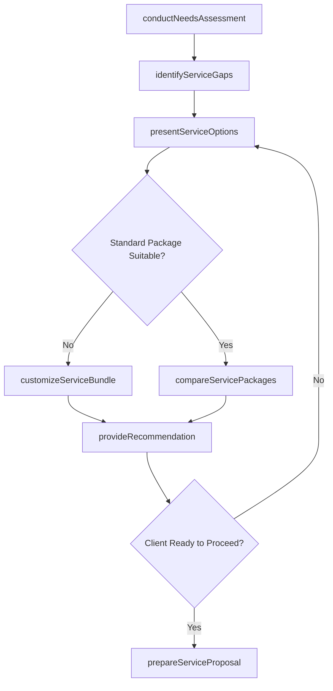
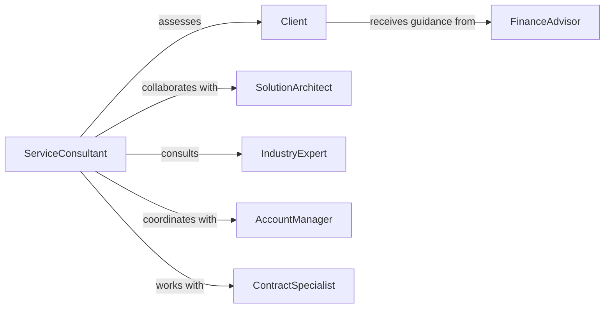

# Discuss Service Options Needs Clients

> Business-as-Code definition for consultative service discussions with clients to identify needs and recommend appropriate solutions. Models needs assessment, option presentation, and service package configuration workflows.

## Overview

Service option discussions involve understanding client requirements and presenting tailored service offerings that address specific needs. This definition exposes actions for conducting needs assessments, presenting service alternatives, configuring custom packages, and guiding clients through service selection decisions.

## Actors

| Actor | Description |
|-------|-------------|
| Client | Seeks services to address business or personal needs |
| ServiceProvider | Delivers specialized services or capabilities |
| IndustryExpert | Provides domain-specific knowledge for service recommendations |
| FinanceAdvisor | Assists with budgeting and cost-benefit analysis |
| ComplianceOfficer | Ensures service options meet regulatory requirements |
| ReferralPartner | Recommends complementary services outside core offerings |

## Roles

| Role | Description |
|------|-------------|
| ServiceConsultant | Conducts needs assessment and presents options |
| AccountManager | Manages ongoing client relationship and satisfaction |
| SolutionArchitect | Designs custom service configurations |
| ContractSpecialist | Develops service agreements and terms |

## Entities

| Entity | Description |
|--------|-------------|
| NeedsAssessment | Analysis of client requirements and objectives |
| ServiceOption | Available service offering or package |
| ServicePackage | Bundled combination of services |
| ClientRequirement | Specific need or constraint identified during assessment |
| Recommendation | Suggested service configuration for client |
| ServiceProposal | Formal presentation of recommended services and pricing |

## Actions

| Action | Description |
|--------|-------------|
| conductNeedsAssessment | Evaluate client requirements and objectives |
| identifyServiceGaps | Determine unmet needs or improvement opportunities |
| presentServiceOptions | Show available service offerings to client |
| compareServicePackages | Review alternative configurations side-by-side |
| customizeServiceBundle | Create tailored service combination for client |
| provideRecommendation | Suggest optimal service configuration |
| prepareServiceProposal | Develop formal offer with pricing and terms |

## Events

| Event | Description |
|-------|-------------|
| needsAssessmentConducted | Client requirements have been evaluated |
| serviceGapsIdentified | Unmet needs have been determined |
| serviceOptionsPresented | Available offerings have been shown to client |
| servicePackagesCompared | Alternative configurations have been reviewed |
| serviceBundleCustomized | Tailored service combination has been created |
| recommendationProvided | Optimal configuration has been suggested |
| serviceProposalPrepared | Formal offer has been developed |

## Searches

| Search | Description |
|--------|-------------|
| findServicesByNeed | List service options addressing specific requirements |
| getPackagesByBudget | Retrieve service bundles within price range |
| getRecommendationHistory | Find past service recommendations for client |
| getProposalStatus | Check state of service proposals by client |
| getPopularPackages | Identify most-selected service configurations |

## Workflow



## Actor Relationships



## Usage

### Calling Actions

```typescript
import { discussServiceOptionsNeedsClients } from '@headlessly/discuss-service-options-needs-clients'

const serviceDiscussion = discussServiceOptionsNeedsClients()

// Conduct needs assessment with client
const assessment = await serviceDiscussion.conductNeedsAssessment({
  clientId: 'client-77777',
  consultantId: 'consultant-444',
  assessmentDate: '2026-02-08',
  clientObjectives: [
    'Improve cybersecurity posture',
    'Achieve SOC 2 compliance within 6 months',
    'Train staff on security best practices'
  ],
  currentState: {
    securityTools: ['Basic firewall', 'Antivirus software'],
    complianceStatus: 'None',
    staffTraining: 'Minimal'
  },
  constraints: {
    budget: { max: 50000, currency: 'USD' },
    timeline: { target: '2026-08-01' }
  }
})

// Identify service gaps
const gaps = await serviceDiscussion.identifyServiceGaps({
  assessmentId: assessment.id,
  identifiedGaps: [
    {
      category: 'infrastructure',
      gap: 'No intrusion detection system',
      priority: 'high'
    },
    {
      category: 'compliance',
      gap: 'Missing documented security policies',
      priority: 'critical'
    },
    {
      category: 'training',
      gap: 'No phishing awareness program',
      priority: 'medium'
    }
  ]
})

// Present service options
const options = await serviceDiscussion.presentServiceOptions({
  assessmentId: assessment.id,
  serviceOfferings: [
    {
      name: 'Security Infrastructure Setup',
      description: 'Deploy IDS, SIEM, and endpoint detection tools',
      duration: '4 weeks',
      cost: 18000
    },
    {
      name: 'SOC 2 Compliance Program',
      description: 'Policy development, controls implementation, audit preparation',
      duration: '20 weeks',
      cost: 28000
    },
    {
      name: 'Security Awareness Training',
      description: 'Quarterly phishing simulations and training workshops',
      duration: '12 months',
      cost: 6000
    }
  ]
})

// Customize service bundle
const bundle = await serviceDiscussion.customizeServiceBundle({
  clientId: 'client-77777',
  selectedServices: options.serviceOfferings.map(s => s.name),
  customizations: {
    addOns: ['24/7 SOC monitoring for first 90 days'],
    removals: [],
    adjustments: ['Extend compliance timeline to 24 weeks for budget alignment']
  },
  totalCost: 52000
})

// Provide recommendation
await serviceDiscussion.provideRecommendation({
  bundleId: bundle.id,
  recommendation: {
    rationale: 'Comprehensive approach addresses all critical gaps within timeline and budget',
    phasing: [
      { phase: 1, services: ['Security Infrastructure Setup'], weeks: '1-4' },
      { phase: 2, services: ['SOC 2 Compliance Program'], weeks: '5-24' },
      { phase: 3, services: ['Security Awareness Training'], weeks: '1-52' }
    ],
    expectedOutcomes: ['SOC 2 certification', 'Reduced security incidents by 80%', 'Compliant workforce']
  }
})
```

### Event-Driven Automation

```typescript
// Auto-suggest complementary services based on needs assessment
serviceDiscussion.needsAssessmentConducted(async ({ assessmentId, clientObjectives }) => {
  if (clientObjectives.some(obj => obj.includes('compliance'))) {
    const complementary = await getComplementaryServices({
      category: 'compliance',
      exclude: ['audit-services'] // Already in assessment
    })

    await serviceDiscussion.suggestAdditionalOptions({
      assessmentId,
      suggestions: complementary
    })
  }
})

// Track proposal conversion rates
serviceDiscussion.serviceProposalPrepared(async ({ proposalId, clientId, totalValue }) => {
  await trackMetric({
    metric: 'proposal-created',
    client: clientId,
    value: totalValue,
    timestamp: new Date()
  })

  // Set reminder to follow up in 7 days
  setTimeout(async () => {
    const status = await getProposalStatus(proposalId)
    if (status === 'pending') {
      await scheduleFollowUp({
        consultant: 'assigned-consultant',
        client: clientId,
        proposalId,
        suggestedDate: new Date(Date.now() + 2 * 24 * 60 * 60 * 1000) // +2 days
      })
    }
  }, 7 * 24 * 60 * 60 * 1000) // 7 days
})
```
