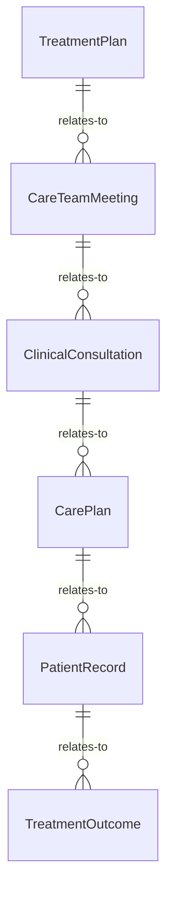
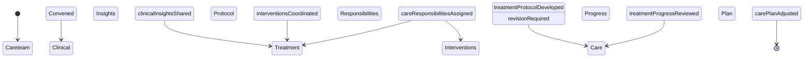
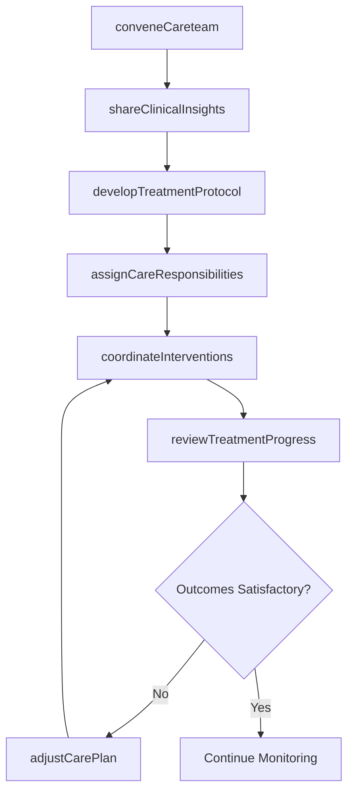
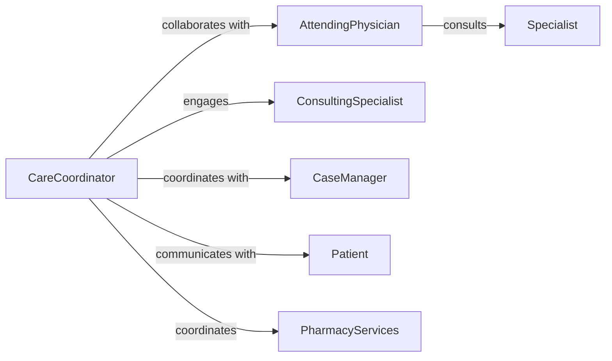

# Collaborate Healthcare Professionals Plan Provide

> Business-as-Code definition for interdisciplinary collaboration among healthcare professionals in treatment planning and delivery. Models care coordination, multidisciplinary case reviews, and integrated care workflows.

## Overview

Healthcare professional collaboration involves coordinating expertise across medical specialties to develop comprehensive treatment plans and deliver integrated patient care. This definition provides actions for convening care teams, sharing clinical insights, developing treatment protocols, and coordinating care delivery across disciplines.

## Actors

| Actor | Description |
|-------|-------------|
| Patient | Receives coordinated care from multiple providers |
| Physician | Provides medical diagnosis and treatment oversight |
| Specialist | Offers expertise in specific medical domain |
| PharmacyServices | Manages medication therapy and drug interactions |
| DiagnosticLab | Performs tests and provides clinical results |
| InsurancePayer | Covers treatment costs and requires care authorization |

## Roles

| Role | Description |
|------|-------------|
| CareCoordinator | Facilitates collaboration across healthcare team |
| AttendingPhysician | Leads treatment planning and decision-making |
| ConsultingSpecialist | Provides domain expertise for complex cases |
| CaseManager | Manages patient journey and resource coordination |

## Entities

| Entity | Description |
|--------|-------------|
| TreatmentPlan | Comprehensive care strategy across disciplines |
| CareTeamMeeting | Interdisciplinary case review session |
| ClinicalConsultation | Specialist input on treatment approach |
| CarePlan | Detailed schedule and protocols for treatment delivery |
| PatientRecord | Shared clinical documentation across providers |
| TreatmentOutcome | Measured results from coordinated care interventions |

## Actions

| Action | Description |
|--------|-------------|
| conveneCareteam | Assemble interdisciplinary team for case review |
| shareClinicalInsights | Exchange professional observations and findings |
| developTreatmentProtocol | Create integrated care approach across specialties |
| assignCareResponsibilities | Designate provider roles in treatment delivery |
| coordinateInterventions | Synchronize timing and sequencing of treatments |
| reviewTreatmentProgress | Evaluate patient response to collaborative care |
| adjustCarePlan | Modify treatment approach based on outcomes |

## Events

| Event | Description |
|-------|-------------|
| careteamConvened | Interdisciplinary team has been assembled |
| clinicalInsightsShared | Professional observations have been exchanged |
| treatmentProtocolDeveloped | Integrated care approach has been created |
| careResponsibilitiesAssigned | Provider roles have been designated |
| interventionsCoordinated | Treatment timing has been synchronized |
| treatmentProgressReviewed | Patient response has been evaluated |
| carePlanAdjusted | Treatment approach has been modified |

## Searches

| Search | Description |
|--------|-------------|
| findActiveCarePlans | List ongoing collaborative treatment cases |
| getCareteamByPatient | Retrieve providers involved in patient care |
| getTreatmentProtocolsByCondition | Find protocols for specific diagnoses |
| getPendingConsultations | List specialist consultations awaiting completion |
| getOutcomesByIntervention | Retrieve results data for treatment types |


## Entity Relationships



## State Diagram



## Workflow



## Actor Relationships



## Usage

### Calling Actions

```typescript
import { collaborateHealthcareProfessionalsPlanProvide } from '@headlessly/collaborate-healthcare-professionals-plan-provide'

const careTeam = collaborateHealthcareProfessionalsPlanProvide()

// Convene interdisciplinary care team
const meeting = await careTeam.conveneCareteam({
  patientId: 'patient-12345',
  primaryCondition: 'Type 2 Diabetes with Cardiovascular Complications',
  teamMembers: [
    { providerId: 'doc-111', role: 'Endocrinologist', specialty: 'Diabetes Management' },
    { providerId: 'doc-222', role: 'Cardiologist', specialty: 'Heart Disease' },
    { providerId: 'nurse-333', role: 'Diabetes Educator', specialty: 'Patient Education' },
    { providerId: 'dietitian-444', role: 'Clinical Nutritionist', specialty: 'Dietary Therapy' }
  ],
  scheduledDate: '2026-02-10T10:00:00Z',
  objectives: ['Develop integrated treatment plan', 'Coordinate medication management', 'Establish monitoring protocols']
})

// Share clinical insights during meeting
await careTeam.shareClinicalInsights({
  meetingId: meeting.id,
  insights: [
    {
      providerId: 'doc-111',
      findings: 'HbA1c elevated at 8.2%, requiring intensified glycemic control',
      recommendations: ['Increase metformin dose', 'Add GLP-1 agonist']
    },
    {
      providerId: 'doc-222',
      findings: 'Echocardiogram shows reduced ejection fraction at 45%',
      recommendations: ['Initiate ACE inhibitor', 'Limit sodium intake', 'Monitor fluid status']
    },
    {
      providerId: 'dietitian-444',
      findings: 'Current diet high in refined carbohydrates and sodium',
      recommendations: ['Develop low-glycemic meal plan', 'Reduce sodium to < 2000mg/day']
    }
  ]
})

// Develop integrated treatment protocol
const protocol = await careTeam.developTreatmentProtocol({
  meetingId: meeting.id,
  protocolComponents: [
    {
      category: 'pharmacotherapy',
      interventions: ['Metformin 1000mg BID', 'Liraglutide 1.2mg daily', 'Lisinopril 10mg daily'],
      responsibleProvider: 'doc-111'
    },
    {
      category: 'nutrition',
      interventions: ['Carbohydrate counting education', 'Heart-healthy meal planning'],
      responsibleProvider: 'dietitian-444'
    },
    {
      category: 'monitoring',
      interventions: ['Daily home glucose checks', 'Weekly weight tracking', 'Monthly HbA1c labs'],
      responsibleProvider: 'nurse-333'
    }
  ],
  targetOutcomes: {
    HbA1c: { target: '<7.0%', timeline: '3 months' },
    ejectionFraction: { target: '>50%', timeline: '6 months' },
    weight: { target: 'Reduce 10 lbs', timeline: '3 months' }
  }
})

// Coordinate intervention timing
await careTeam.coordinateInterventions({
  protocolId: protocol.id,
  schedule: [
    { week: 1, activities: ['Initiate medications', 'Nutrition consultation', 'Establish monitoring'] },
    { week: 4, activities: ['Review glucose logs', 'Assess medication tolerance', 'Adjust diet plan'] },
    { week: 12, activities: ['Repeat HbA1c', 'Cardiology follow-up', 'Evaluate target progress'] }
  ]
})
```

### Event-Driven Automation

```typescript
// Auto-notify team when treatment progress review shows concerning trends
careTeam.treatmentProgressReviewed(async ({ patientId, outcomes, targetOutcomes }) => {
  const concerningTrends = outcomes.filter(outcome =>
    outcome.trend === 'worsening' || outcome.variance > 20
  )

  if (concerningTrends.length > 0) {
    await notifyCareteam({
      patientId,
      priority: 'high',
      message: `${concerningTrends.length} concerning trends identified in treatment progress`,
      requestUrgentReview: true
    })
  }
})

// Track care plan adjustments and trigger re-coordination
careTeam.carePlanAdjusted(async ({ protocolId, modifications }) => {
  if (modifications.some(mod => mod.type === 'medication-change')) {
    await careTeam.coordinateInterventions({
      protocolId,
      notifyPharmacy: true,
      updateMonitoringSchedule: true
    })
  }
})
```
