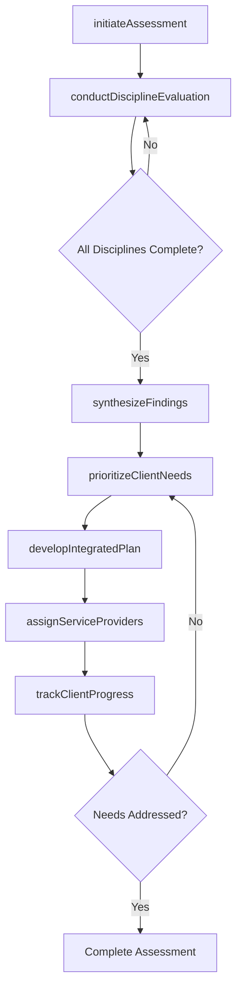
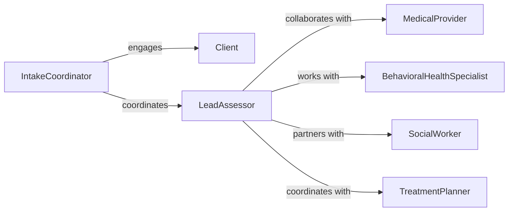

# Collaborate Professionals Assess Client Needs

> Business-as-Code definition for multidisciplinary client needs assessment and treatment planning across healthcare and human services. Models collaborative evaluation, integrated care planning, and coordinated service delivery.

## Overview

Professional collaboration for client assessment involves engaging specialists from multiple disciplines to comprehensively evaluate needs and develop integrated treatment or service plans. This definition exposes actions for coordinating assessments, synthesizing professional evaluations, and creating unified care strategies.

## Actors

| Actor | Description |
|-------|-------------|
| Client | Individual requiring multidisciplinary assessment and services |
| MedicalProvider | Evaluates physical health needs |
| BehavioralHealthSpecialist | Assesses mental health and substance use needs |
| SocialWorker | Evaluates social determinants and support requirements |
| OccupationalTherapist | Assesses functional capabilities and adaptive needs |
| FinancialCounselor | Evaluates financial resources and assistance eligibility |

## Roles

| Role | Description |
|------|-------------|
| IntakeCoordinator | Initiates multidisciplinary assessment process |
| LeadAssessor | Coordinates professional evaluations |
| TreatmentPlanner | Synthesizes assessments into integrated care plan |
| ServiceNavigator | Helps client access recommended services |

## Entities

| Entity | Description |
|--------|-------------|
| ClientAssessment | Comprehensive evaluation of client needs |
| ProfessionalEvaluation | Discipline-specific assessment findings |
| NeedsPrioritization | Ranked list of client requirements |
| IntegratedCarePlan | Unified strategy addressing all identified needs |
| ServiceReferral | Connection to external resources or providers |
| OutcomeMeasure | Metric for tracking assessment-driven interventions |

## Actions

| Action | Description |
|--------|-------------|
| initiateAssessment | Begin multidisciplinary client evaluation process |
| conductDisciplineEvaluation | Perform specialist-specific needs assessment |
| synthesizeFindings | Integrate evaluations from all professionals |
| prioritizeClientNeeds | Rank requirements by urgency and impact |
| developIntegratedPlan | Create unified strategy addressing all needs |
| assignServiceProviders | Designate professionals for each intervention |
| trackClientProgress | Monitor outcomes from coordinated services |

## Events

| Event | Description |
|-------|-------------|
| assessmentInitiated | Multidisciplinary evaluation has begun |
| disciplineEvaluationConducted | Specialist assessment has been completed |
| findingsSynthesized | Professional evaluations have been integrated |
| clientNeedsPrioritized | Requirements have been ranked |
| integratedPlanDeveloped | Unified strategy has been created |
| serviceProvidersAssigned | Professionals have been designated |
| clientProgressTracked | Outcomes have been monitored |

## Searches

| Search | Description |
|--------|-------------|
| findActiveAssessments | List ongoing multidisciplinary evaluations |
| getEvaluationsByDiscipline | Retrieve assessments by professional specialty |
| getCarePlansByClient | Find integrated plans for specific individuals |
| getPrioritizedNeedsByCategory | List requirements grouped by need type |
| getOutcomesByIntervention | Retrieve results for specific service types |

## Workflow



## Actor Relationships



## Usage

### Calling Actions

```typescript
import { collaborateProfessionalsAssessClientNeeds } from '@headlessly/collaborate-professionals-assess-client-needs'

const assessment = collaborateProfessionalsAssessClientNeeds()

// Initiate multidisciplinary assessment
const clientAssessment = await assessment.initiateAssessment({
  clientId: 'client-55555',
  intakeCoordinatorId: 'coord-111',
  assessmentType: 'comprehensive',
  requestingAgency: 'Community Health Center',
  disciplines: ['medical', 'behavioral-health', 'social-services', 'occupational-therapy'],
  assessmentDate: '2026-02-11'
})

// Conduct discipline-specific evaluations
await assessment.conductDisciplineEvaluation({
  assessmentId: clientAssessment.id,
  discipline: 'behavioral-health',
  assessorId: 'psych-222',
  findings: {
    diagnoses: ['Major Depressive Disorder', 'Generalized Anxiety Disorder'],
    severity: 'moderate',
    functioningLevel: 'Impaired in work and social relationships',
    riskFactors: ['Social isolation', 'Recent job loss'],
    protectiveFactors: ['Engaged family support', 'Insight into condition']
  },
  recommendations: [
    'Weekly individual psychotherapy',
    'Medication evaluation with psychiatrist',
    'Peer support group participation'
  ]
})

await assessment.conductDisciplineEvaluation({
  assessmentId: clientAssessment.id,
  discipline: 'social-services',
  assessorId: 'sw-333',
  findings: {
    housing: 'Unstable - behind on rent, facing eviction',
    income: 'Unemployment benefits expiring in 30 days',
    foodSecurity: 'Insufficient resources for adequate nutrition',
    transportation: 'Lacks reliable access to medical appointments',
    socialSupport: 'Limited network, family lives out of state'
  },
  recommendations: [
    'Emergency rental assistance',
    'Food pantry referral',
    'Job placement services',
    'Transportation vouchers'
  ]
})

// Synthesize findings across disciplines
const synthesis = await assessment.synthesizeFindings({
  assessmentId: clientAssessment.id,
  integratedFindings: {
    primaryChallenges: [
      'Mental health symptoms exacerbated by financial stress',
      'Unemployment contributing to depression and social isolation',
      'Housing instability creating barrier to treatment engagement'
    ],
    strengthsAssets: [
      'Client motivated to improve situation',
      'Family willing to provide emotional support',
      'Prior successful employment history'
    ]
  }
})

// Prioritize client needs
await assessment.prioritizeClientNeeds({
  assessmentId: clientAssessment.id,
  prioritizedNeeds: [
    { priority: 1, need: 'Housing stabilization', urgency: 'critical', timeline: 'Immediate' },
    { priority: 2, need: 'Mental health treatment', urgency: 'high', timeline: 'Within 1 week' },
    { priority: 3, need: 'Income support', urgency: 'high', timeline: 'Within 2 weeks' },
    { priority: 4, need: 'Food security', urgency: 'moderate', timeline: 'Within 1 week' }
  ]
})

// Develop integrated care plan
await assessment.developIntegratedPlan({
  assessmentId: clientAssessment.id,
  planComponents: [
    {
      goal: 'Secure stable housing',
      interventions: ['Emergency rental assistance application', 'Housing case management'],
      responsibleDisciplines: ['social-services'],
      timeline: '2 weeks'
    },
    {
      goal: 'Reduce depressive symptoms',
      interventions: ['Weekly therapy', 'Psychiatric medication management', 'Peer support'],
      responsibleDisciplines: ['behavioral-health'],
      timeline: '12 weeks'
    },
    {
      goal: 'Achieve financial stability',
      interventions: ['Job placement assistance', 'Financial counseling', 'Benefits enrollment'],
      responsibleDisciplines: ['social-services'],
      timeline: '8 weeks'
    }
  ]
})
```

### Event-Driven Automation

```typescript
// Auto-escalate when critical needs are identified
assessment.disciplineEvaluationConducted(async ({ findings, discipline }) => {
  if (findings.riskLevel === 'critical' || findings.safety Concerns) {
    await escalateToCrisisTeam({
      assessmentId: findings.assessmentId,
      discipline,
      urgency: 'immediate',
      findings: findings.safetyConcerns
    })
  }
})

// Notify case manager when integrated plan is ready
assessment.integratedPlanDeveloped(async ({ assessmentId, clientId, planComponents }) => {
  await notifyServiceNavigator({
    clientId,
    message: `Integrated care plan ready with ${planComponents.length} components`,
    nextSteps: 'Schedule client meeting to review plan and initiate services'
  })
})
```
