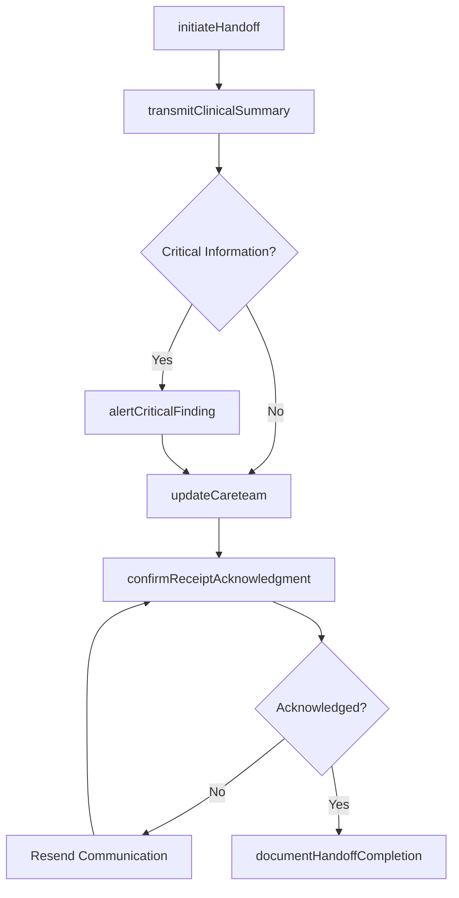
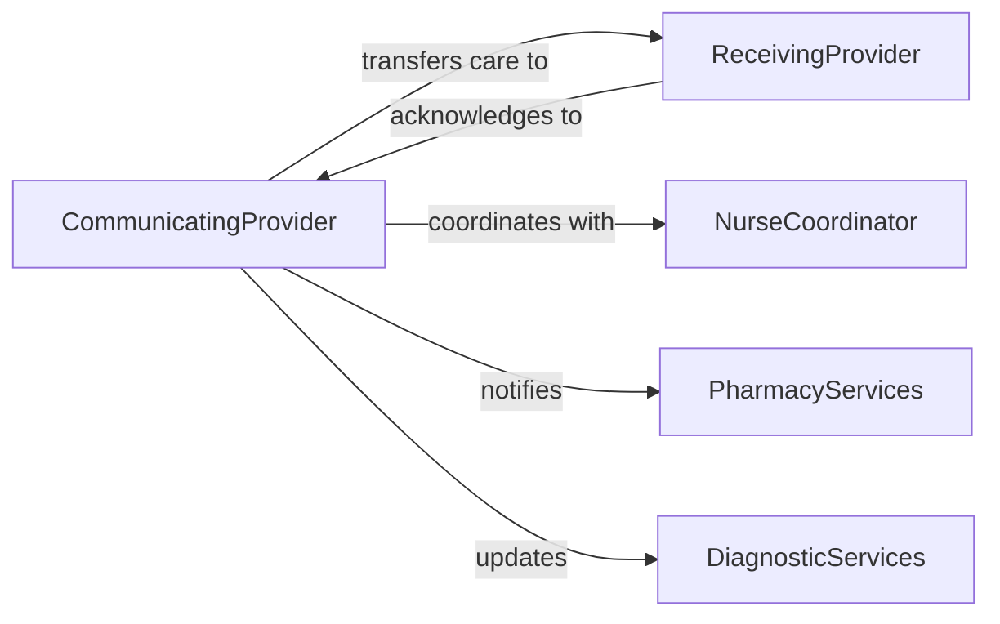

# Communicate Patient Status Health Practitioners

> Business-as-Code definition for clinical handoffs and status communications among healthcare providers. Models patient information exchange, care transitions, and interdisciplinary status updates.

## Overview

Patient status communication involves sharing clinical information among healthcare professionals to ensure continuity of care during transitions and ongoing treatment. This definition provides actions for conducting handoffs, documenting status changes, and notifying relevant practitioners of important patient updates.

## Actors

| Actor | Description |
|-------|-------------|
| Patient | Individual receiving care across multiple providers |
| ReceivingProvider | Healthcare professional assuming care responsibility |
| ReferringProvider | Healthcare professional transferring care |
| PharmacyServices | Manages medication information and updates |
| DiagnosticServices | Provides test results and imaging reports |
| InsurancePayer | Requires notification of status changes affecting coverage |

## Roles

| Role | Description |
|------|-------------|
| CommunicatingProvider | Shares patient status with other practitioners |
| ReceivingPractitioner | Receives and acknowledges patient information |
| NurseCoordinator | Facilitates information flow between providers |
| HospitalAdmissions | Manages patient transitions into facility care |

## Entities

| Entity | Description |
|--------|-------------|
| PatientStatus | Current clinical condition and care requirements |
| ClinicalHandoff | Transfer of care responsibility between providers |
| StatusUpdate | Change in patient condition requiring communication |
| CareTransition | Movement of patient between care settings |
| CriticalAlert | Urgent patient information requiring immediate attention |
| ProviderNotification | Formal communication of patient information |

## Actions

| Action | Description |
|--------|-------------|
| initiateHandoff | Begin transfer of care responsibility to another provider |
| communicateStatusChange | Notify practitioners of significant patient condition change |
| transmitClinicalSummary | Share comprehensive patient information for continuity |
| alertCriticalFinding | Send urgent notification of critical clinical information |
| confirmReceiptAcknowledgment | Verify that receiving provider has reviewed information |
| updateCareteam | Inform all involved practitioners of patient status |
| documentHandoffCompletion | Record successful transfer of care responsibility |

## Events

| Event | Description |
|-------|-------------|
| handoffInitiated | Care transfer process has begun |
| statusChangeCommunicated | Condition update has been sent to practitioners |
| clinicalSummaryTransmitted | Comprehensive patient information has been shared |
| criticalFindingAlerted | Urgent notification has been sent |
| receiptAcknowledgmentConfirmed | Provider has verified receipt of information |
| careteamUpdated | All practitioners have been informed of status |
| handoffCompletionDocumented | Care transfer has been formally recorded |

## Searches

| Search | Description |
|--------|-------------|
| findPendingHandoffs | List care transfers awaiting completion |
| getStatusUpdatesByPatient | Retrieve condition changes for specific patient |
| getCriticalAlertsByProvider | Find urgent notifications for practitioner |
| getUnacknowledgedCommunications | List information not yet confirmed as received |
| getTransitionsByCareSetting | Retrieve handoffs between specific locations |

## Workflow



## Actor Relationships



## Usage

### Calling Actions

```typescript
import { communicatePatientStatusHealthPractitioners } from '@headlessly/communicate-patient-status-health-practitioners'

const statusComm = communicatePatientStatusHealthPractitioners()

// Initiate clinical handoff
const handoff = await statusComm.initiateHandoff({
  patientId: 'patient-78901',
  fromProviderId: 'doc-emergency-101',
  toProviderId: 'doc-hospitalist-202',
  transitionType: 'ED-to-inpatient',
  scheduledTime: '2026-02-06T18:30:00Z',
  handoffMethod: 'verbal-with-written-summary'
})

// Transmit clinical summary
await statusComm.transmitClinicalSummary({
  handoffId: handoff.id,
  summary: {
    chiefComplaint: 'Chest pain',
    workupCompleted: [
      'ECG showing ST elevation in leads V2-V4',
      'Troponin elevated at 2.4 ng/mL',
      'Chest X-ray clear'
    ],
    diagnosis: 'ST-Elevation Myocardial Infarction (STEMI)',
    treatmentProvided: [
      'Aspirin 325mg PO',
      'Heparin bolus and infusion initiated',
      'Morphine for pain control',
      'Cardiology consulted - Cath lab activated'
    ],
    pendingActions: [
      'Awaiting cardiac catheterization',
      'Continuous telemetry monitoring',
      'Serial troponin measurements'
    ],
    allergies: ['Penicillin'],
    currentMedications: ['Metoprolol 50mg BID', 'Atorvastatin 40mg daily']
  }
})

// Alert critical finding
await statusComm.alertCriticalFinding({
  patientId: 'patient-78901',
  recipientProviderIds: ['doc-hospitalist-202', 'nurse-cardiology-303'],
  criticalInformation: {
    finding: 'New onset atrial fibrillation with rapid ventricular response',
    vitalSigns: { heartRate: 145, bloodPressure: '90/60', timestamp: '2026-02-06T18:45:00Z' },
    urgency: 'immediate',
    recommendedAction: 'Consider rate control vs cardioversion per cardiology'
  }
})

// Confirm receipt and acknowledgment
await statusComm.confirmReceiptAcknowledgment({
  handoffId: handoff.id,
  receivingProviderId: 'doc-hospitalist-202',
  acknowledgedAt: '2026-02-06T18:50:00Z',
  questionsForClarification: [
    'Has family been notified of STEMI diagnosis and cath lab procedure?',
    'Any history of bleeding disorders or recent surgeries?'
  ],
  readbackSummary: 'Accepting care for 68yo male with STEMI, post-heparin bolus, awaiting cath'
})

// Update entire care team
await statusComm.updateCareteam({
  patientId: 'patient-78901',
  careteamProviders: ['doc-hospitalist-202', 'cardiologist-404', 'nurse-cardiology-303'],
  updateType: 'status-change',
  statusUpdate: {
    event: 'Transfer to cardiac catheterization lab',
    time: '2026-02-06T19:00:00Z',
    anticipatedDuration: '60-90 minutes',
    postProcedureDisposition: 'Cardiac ICU'
  }
})
```

### Event-Driven Automation

```typescript
// Auto-escalate if handoff not acknowledged within time threshold
statusComm.handoffInitiated(async ({ handoffId, toProviderId, urgency }) => {
  const timeoutMinutes = urgency === 'critical' ? 15 : 60

  setTimeout(async () => {
    const status = await statusComm.getHandoffStatus(handoffId)
    if (!status.acknowledged) {
      await escalateHandoff({
        handoffId,
        toProvider: toProviderId,
        escalateTo: 'charge-nurse',
        reason: `Handoff not acknowledged within ${timeoutMinutes} minutes`
      })
    }
  }, timeoutMinutes * 60 * 1000)
})

// Notify relevant services when critical alert is sent
statusComm.criticalFindingAlerted(async ({ patientId, finding, urgency }) => {
  if (finding.includes('cardiac') || finding.includes('MI')) {
    await notifyService({
      service: 'cardiology',
      patientId,
      alert: finding,
      urgency
    })
  }

  if (urgency === 'immediate') {
    await activateRapidResponse({
      patientId,
      reason: finding
    })
  }
})
```
