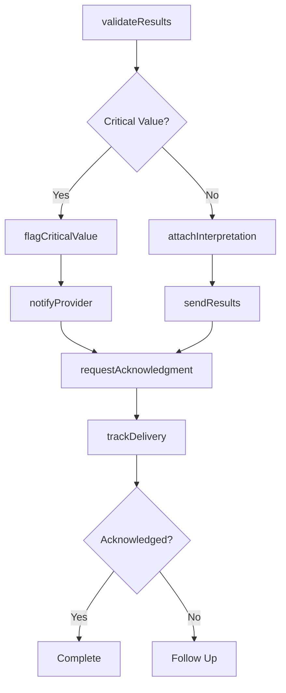

# Communicate Test Assessment Results Medical

> Business-as-Code definition for communicating test and assessment results to medical professionals. Models the complete results communication lifecycle from validation through delivery and acknowledgment.

## Overview

Medical test results communication involves transmitting laboratory, imaging, and diagnostic assessment findings to physicians, specialists, and care teams. This definition exposes actions for results management, events for workflow automation, and searches for tracking delivery and critical findings.

## Actors

| Actor | Description |
|-------|-------------|
| Ordering Physician | Receives results for tests they requested |
| Consulting Specialist | Reviews results for specialty consultations |
| Care Team | Accesses results for coordinated patient care |
| Laboratory | Produces diagnostic test results |
| Radiologist | Interprets imaging study results |
| Pathologist | Analyzes tissue and specimen findings |

## Roles

| Role | Description |
|------|-------------|
| Results Coordinator | Manages delivery of test results to providers |
| Laboratory Technician | Validates and releases test findings |
| Medical Records Specialist | Ensures results are properly documented |
| Nurse Coordinator | Routes results to appropriate care team members |

## Entities

| Entity | Description |
|--------|-------------|
| TestResult | Findings from laboratory or diagnostic assessment |
| CriticalValue | Result requiring immediate clinical attention |
| Report | Formatted document containing test findings |
| Interpretation | Clinical analysis and recommendations |
| Acknowledgment | Confirmation of result receipt by provider |
| Notification | Alert sent to provider about result availability |

## Actions

| Action | Description |
|--------|-------------|
| validateResults | Verify accuracy and completeness of test findings |
| sendResults | Deliver test results to ordering provider |
| flagCriticalValue | Identify and escalate urgent findings |
| requestAcknowledgment | Require confirmation of result receipt |
| attachInterpretation | Include clinical analysis with results |
| notifyProvider | Alert provider of result availability |
| trackDelivery | Monitor result transmission and receipt |

## Events

| Event | Description |
|-------|-------------|
| resultsValidated | Test findings have been verified |
| resultsSent | Results have been delivered to provider |
| criticalValueFlagged | Urgent finding has been identified |
| acknowledgmentRequested | Receipt confirmation has been requested |
| interpretationAttached | Clinical analysis has been included |
| providerNotified | Provider has been alerted to results |
| deliveryTracked | Transmission status has been recorded |

## Searches

| Search | Description |
|--------|-------------|
| findResults | List test results by patient, provider, or date |
| getCriticalValues | Retrieve urgent findings requiring attention |
| getAcknowledgments | Find confirmed result receipts by providers |
| getPendingResults | List results awaiting provider review |

## Workflow



## Actor Relationships

```mermaid
graph LR
    RC[Results Coordinator]

    RC -->|delivers to| Ordering Physician
    RC -->|routes to| Consulting Specialist
    RC -->|shares with| Care Team
    RC -->|receives from| Laboratory
    RC -->|obtains from| Radiologist
```

## Usage

### Calling Actions

```typescript
import { communicateTestAssessmentResultsMedical } from '@headlessly/communicate-test-assessment-results-medical'

const results = communicateTestAssessmentResultsMedical()

// Validate and send laboratory results
const testResult = await results.validateResults({
  testId: 'lab-12345',
  patientId: 'patient-789',
  findings: {
    test: 'Complete Blood Count',
    values: [
      { name: 'Hemoglobin', value: 14.2, unit: 'g/dL', reference: '12-16' },
      { name: 'White Blood Cell Count', value: 8500, unit: 'cells/μL', reference: '4000-11000' }
    ]
  }
})

// Flag critical value
await results.flagCriticalValue({
  resultId: testResult.id,
  finding: 'Potassium',
  value: 6.2,
  critical: true,
  urgency: 'immediate'
})

// Send results with interpretation
await results.sendResults({
  resultId: testResult.id,
  to: { providerId: 'physician-456', type: 'ordering' },
  requireAcknowledgment: true
})

await results.attachInterpretation({
  resultId: testResult.id,
  interpretation: 'All values within normal limits except potassium elevation requiring immediate attention.'
})
```

### Event-Driven Automation

```typescript
// Auto-escalate critical values
results.criticalValueFlagged(async ({ resultId, finding, value }) => {
  await results.notifyProvider({
    resultId,
    priority: 'urgent',
    channels: ['phone', 'pager', 'ehr-alert']
  })

  await results.requestAcknowledgment({
    resultId,
    timeout: 15,
    escalateTo: 'supervisor'
  })
})

// Track unacknowledged results
results.resultsSent(async ({ resultId, requireAcknowledgment }) => {
  if (requireAcknowledgment) {
    await wait({ hours: 4 })
    const delivery = await results.trackDelivery({ resultId })
    if (!delivery.acknowledged) {
      await alert({
        to: 'results-coordinator',
        message: `Result ${resultId} not acknowledged after 4 hours`
      })
    }
  }
})
```
