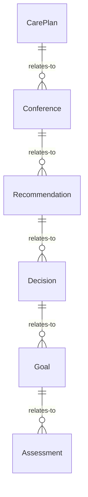
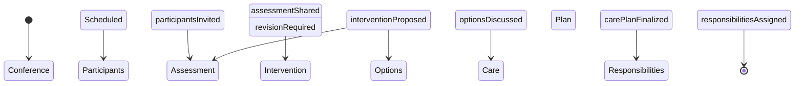
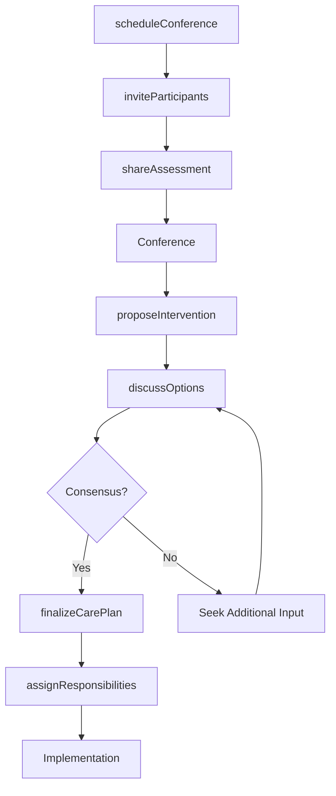

# Confer Professionals Plan Patient Care

> Business-as-Code definition for interprofessional conferences to plan patient care. Models the complete care planning lifecycle from team assembly through care plan finalization and implementation.

## Overview

Patient care planning conferences involve coordinating consultations among physicians, nurses, therapists, and specialists to develop comprehensive treatment strategies. This definition exposes actions for collaboration management, events for workflow automation, and searches for tracking care plans and team decisions.

## Actors

| Actor | Description |
|-------|-------------|
| Primary Physician | Leads overall patient care strategy |
| Consulting Specialist | Provides expertise on specific conditions |
| Nursing Team | Implements and monitors daily care activities |
| Physical Therapist | Plans rehabilitation and mobility interventions |
| Social Worker | Addresses psychosocial and discharge planning needs |
| Pharmacist | Reviews medication regimens and interactions |

## Roles

| Role | Description |
|------|-------------|
| Care Coordinator | Facilitates interprofessional planning meetings |
| Case Manager | Oversees care plan development and implementation |
| Clinical Lead | Makes final decisions on treatment strategies |
| Documentation Specialist | Records care planning decisions and actions |

## Entities

| Entity | Description |
|--------|-------------|
| CarePlan | Comprehensive treatment strategy for patient |
| Conference | Scheduled interprofessional planning meeting |
| Recommendation | Suggested intervention from team member |
| Decision | Agreed-upon action or treatment approach |
| Goal | Target outcome for patient care |
| Assessment | Clinical evaluation informing care planning |

## Actions

| Action | Description |
|--------|-------------|
| scheduleConference | Arrange interprofessional planning meeting |
| inviteParticipants | Notify care team members of conference |
| shareAssessment | Distribute clinical evaluations to team |
| proposeIntervention | Suggest treatment or care approach |
| discussOptions | Collaborate on alternative strategies |
| finalizeCarePlan | Approve comprehensive treatment strategy |
| assignResponsibilities | Designate team members for care tasks |

## Events

| Event | Description |
|-------|-------------|
| conferenceScheduled | Planning meeting has been arranged |
| participantsInvited | Team members have been notified |
| assessmentShared | Clinical evaluation has been distributed |
| interventionProposed | Treatment approach has been suggested |
| optionsDiscussed | Alternatives have been collaboratively reviewed |
| carePlanFinalized | Treatment strategy has been approved |
| responsibilitiesAssigned | Care tasks have been designated |

## Searches

| Search | Description |
|--------|-------------|
| findConferences | List planning meetings by patient or date |
| getCarePlans | Retrieve treatment strategies by patient or status |
| getRecommendations | Find suggested interventions from team members |
| getAssignments | List care task responsibilities by team member |


## Entity Relationships



## State Diagram



## Workflow



## Actor Relationships

```mermaid
graph LR
    CC[Care Coordinator]

    CC -->|coordinates with| Primary Physician
    CC -->|consults| Consulting Specialist
    CC -->|collaborates with| Nursing Team
    CC -->|engages| Physical Therapist
    CC -->|involves| Social Worker
```

## Usage

### Calling Actions

```typescript
import { conferProfessionalsPlanPatientCare } from '@headlessly/confer-professionals-plan-patient-care'

const carePlanning = conferProfessionalsPlanPatientCare()

// Schedule interprofessional conference
const conference = await carePlanning.scheduleConference({
  patientId: 'patient-789',
  date: '2026-02-25',
  time: '10:00',
  duration: 60,
  urgency: 'routine'
})

// Invite care team participants
await carePlanning.inviteParticipants({
  conferenceId: conference.id,
  participants: [
    { providerId: 'physician-123', role: 'Primary Physician' },
    { providerId: 'specialist-456', role: 'Cardiology Consult' },
    { providerId: 'nurse-789', role: 'Nursing Lead' },
    { providerId: 'therapist-101', role: 'Physical Therapy' }
  ]
})

// Share clinical assessment
await carePlanning.shareAssessment({
  conferenceId: conference.id,
  assessment: {
    diagnosis: 'Heart failure with reduced ejection fraction',
    currentStatus: 'Stable, improving functional capacity',
    concerns: ['medication adherence', 'exercise tolerance']
  }
})

// Propose intervention and finalize care plan
await carePlanning.proposeIntervention({
  conferenceId: conference.id,
  proposedBy: 'specialist-456',
  intervention: {
    type: 'medication adjustment',
    details: 'Increase beta-blocker dosage',
    rationale: 'Improved heart rate control'
  }
})

const carePlan = await carePlanning.finalizeCarePlan({
  conferenceId: conference.id,
  goals: ['Improve exercise tolerance', 'Optimize medication regimen'],
  interventions: ['medication adjustment', 'physical therapy 3x/week']
})
```

### Event-Driven Automation

```typescript
// Auto-share assessments before conference
carePlanning.participantsInvited(async ({ conferenceId, participants }) => {
  const assessments = await getRecentAssessments({ conferenceId })
  await carePlanning.shareAssessment({
    conferenceId,
    assessment: assessments
  })
})

// Track unresolved discussions
carePlanning.optionsDiscussed(async ({ conferenceId, consensus }) => {
  if (!consensus) {
    await notify({
      to: 'care-coordinator',
      message: `Conference ${conferenceId} requires additional input for consensus`
    })
  }
})
```
