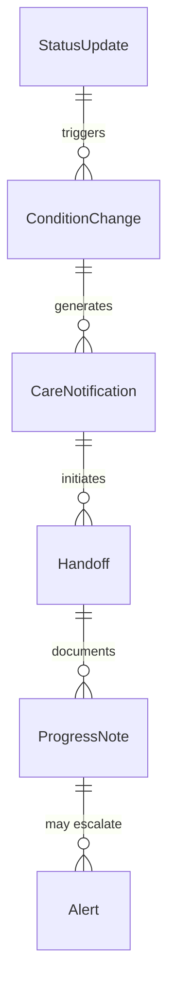
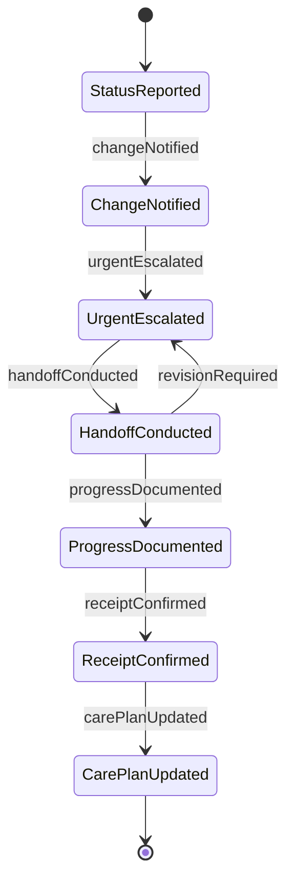
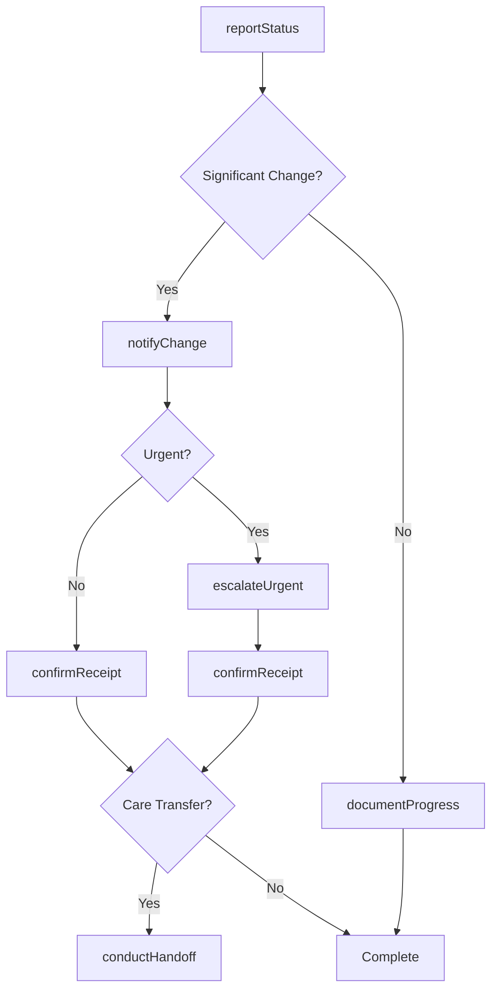

# Inform Medical Professionals Regarding Patient

> Business-as-Code definition for informing medical professionals about patient conditions and care. Models the complete information delivery lifecycle from status assessment through communication and acknowledgment.

## Overview

Patient information communication involves sharing clinical status, condition changes, and care updates among physicians, nurses, specialists, and care team members. This definition exposes actions for information management, events for workflow automation, and searches for tracking communications and critical updates.

## Actors

| Actor | Description |
|-------|-------------|
| Attending Physician | Receives updates on patient status and care |
| On-Call Provider | Gets notified of urgent patient changes |
| Consulting Specialist | Informed of relevant clinical developments |
| Nursing Supervisor | Receives care coordination updates |
| Emergency Department | Notified during patient transfers |
| Primary Care Provider | Informed of hospital care and discharge |

## Roles

| Role | Description |
|------|-------------|
| Bedside Nurse | Reports patient status changes to providers |
| Charge Nurse | Coordinates communication across care team |
| Hospitalist | Manages inpatient care and provider updates |
| Care Transition Coordinator | Ensures continuity across care settings |

## Entities

| Entity | Description |
|--------|-------------|
| StatusUpdate | Current patient condition and vital signs |
| ConditionChange | Significant clinical development or deterioration |
| CareNotification | Alert about treatment activities or plans |
| Handoff | Transfer of patient care responsibility |
| ProgressNote | Documented summary of patient status |
| Alert | Urgent notification requiring immediate attention |

## Actions

| Action | Description |
|--------|-------------|
| reportStatus | Share current patient condition and vitals |
| notifyChange | Alert providers to significant clinical developments |
| escalateUrgent | Communicate critical situations requiring immediate action |
| conductHandoff | Transfer care responsibility with status summary |
| documentProgress | Record patient status for team review |
| confirmReceipt | Verify provider has received critical information |
| updateCarePlan | Inform team of treatment modifications |

## Events

| Event | Description |
|-------|-------------|
| statusReported | Patient condition has been shared with provider |
| changeNotified | Clinical development has been communicated |
| urgentEscalated | Critical situation has been alerted |
| handoffConducted | Care responsibility has been transferred |
| progressDocumented | Status update has been recorded |
| receiptConfirmed | Provider has acknowledged information |
| carePlanUpdated | Treatment modifications have been communicated |

## Searches

| Search | Description |
|--------|-------------|
| findUpdates | List patient status communications by date or provider |
| getChangeNotifications | Retrieve significant clinical developments |
| getHandoffs | Find care transfers by shift or provider |
| getUrgentAlerts | List critical notifications requiring immediate attention |


## Entity Relationships



## State Diagram



## Workflow



## Actor Relationships

```mermaid
graph LR
    BN[Bedside Nurse]

    BN -->|reports to| Attending Physician
    BN -->|alerts| On-Call Provider
    BN -->|notifies| Consulting Specialist
    BN -->|coordinates with| Nursing Supervisor
    BN -->|transfers to| Emergency Department
```

## Usage

### Calling Actions

```typescript
import { informMedicalProfessionalsRegardingPatient } from '@headlessly/inform-medical-professionals-regarding-patient'

const patientInfo = informMedicalProfessionalsRegardingPatient()

// Report routine patient status
const update = await patientInfo.reportStatus({
  patientId: 'patient-789',
  providerId: 'physician-123',
  status: {
    vitals: { temp: 98.6, bp: '120/80', hr: 72, spo2: 98 },
    condition: 'Stable, alert and oriented',
    painLevel: 2,
    timestamp: '2026-02-20T14:30:00Z'
  }
})

// Notify of significant condition change
await patientInfo.notifyChange({
  patientId: 'patient-789',
  change: {
    type: 'respiratory distress',
    severity: 'moderate',
    onset: '2026-02-20T16:45:00Z',
    interventions: ['oxygen increased to 4L', 'physician notified']
  }
})

// Escalate urgent situation
await patientInfo.escalateUrgent({
  patientId: 'patient-789',
  providerId: 'on-call-456',
  alert: {
    urgency: 'critical',
    issue: 'Rapid response activated for altered mental status',
    actions: ['Team responding', 'Code cart at bedside']
  }
})

// Conduct shift handoff
await patientInfo.conductHandoff({
  patientId: 'patient-789',
  from: { providerId: 'nurse-101', shift: 'day' },
  to: { providerId: 'nurse-202', shift: 'evening' },
  summary: {
    status: 'Stable post-procedure',
    pending: ['Lab results due at 20:00', 'Pain reassessment in 2 hours'],
    concerns: ['Monitor for post-procedure complications']
  }
})
```

### Event-Driven Automation

```typescript
// Auto-escalate critical changes
patientInfo.changeNotified(async ({ patientId, change }) => {
  if (change.severity === 'critical' || change.severity === 'severe') {
    await patientInfo.escalateUrgent({
      patientId,
      providerId: 'attending-physician',
      alert: {
        urgency: 'immediate',
        issue: change.type,
        actions: change.interventions
      }
    })
  }
})

// Track unconfirmed urgent alerts
patientInfo.urgentEscalated(async ({ patientId, providerId, alert }) => {
  await wait({ minutes: 5 })
  const delivery = await patientInfo.getUrgentAlerts({ patientId })
  const unconfirmed = delivery.filter(a => !a.confirmed)
  if (unconfirmed.length > 0) {
    await notify({
      to: 'nursing-supervisor',
      message: `Urgent alert for ${patientId} not confirmed after 5 minutes`
    })
  }
})
```
