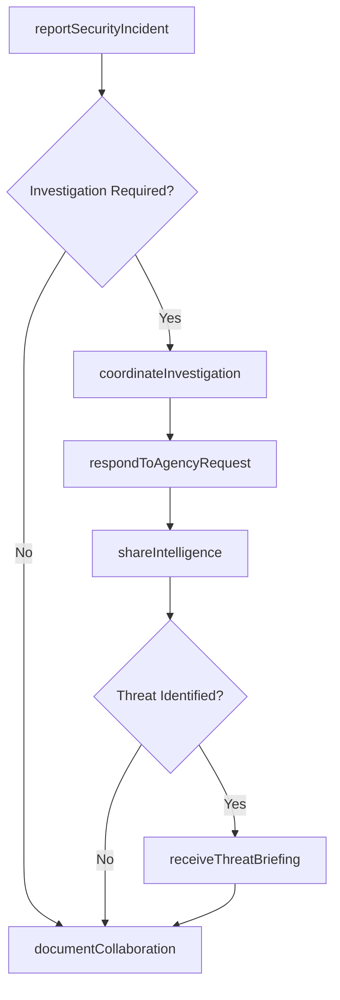
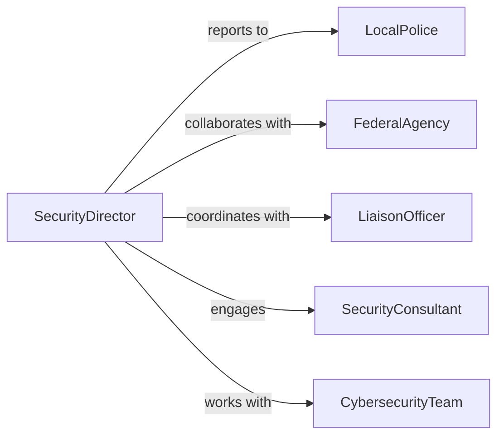

# Collaborate Law Enforcement Security Agencies

> Business-as-Code definition for organizational collaboration with law enforcement and security agencies. Models information sharing, incident reporting, and coordinated response workflows for security and investigative matters.

## Overview

Law enforcement and security agency collaboration involves sharing information about incidents, coordinating investigations, and supporting public safety initiatives. This definition provides actions for reporting security events, responding to agency requests, and maintaining partnerships with law enforcement and security organizations.

## Actors

| Actor | Description |
|-------|-------------|
| LocalPolice | Municipal law enforcement agency |
| FederalAgency | FBI, Secret Service, or other federal investigative body |
| SecurityConsultant | Private security advisor or firm |
| EmergencyServices | Fire, EMS, or emergency management agencies |
| CybersecurityTeam | Digital security and incident response specialists |
| IntelligenceAgency | Government organization focused on threat analysis |

## Roles

| Role | Description |
|------|-------------|
| SecurityDirector | Oversees organizational security and agency relationships |
| IncidentReporter | Documents and reports security events |
| LiaisonOfficer | Maintains ongoing communication with agencies |
| InvestigationCoordinator | Facilitates agency investigations involving organization |

## Entities

| Entity | Description |
|--------|-------------|
| SecurityIncident | Event requiring law enforcement notification or involvement |
| InformationSharingAgreement | Formal arrangement for data exchange with agency |
| IncidentReport | Detailed documentation of security event |
| AgencyRequest | Official demand for information or assistance |
| ThreatIntelligence | Security-related information from agency sources |
| CollaborativeInvestigation | Joint inquiry with law enforcement participation |

## Actions

| Action | Description |
|--------|-------------|
| reportSecurityIncident | Notify law enforcement of criminal or security event |
| shareIntelligence | Provide threat information to security agencies |
| respondToAgencyRequest | Fulfill official requests for data or assistance |
| coordinateInvestigation | Facilitate agency inquiries involving organization |
| establishInformationSharing | Create formal data exchange agreement |
| receiveThreatBriefing | Obtain security intelligence from agency partners |
| documentCollaboration | Record agency interactions and outcomes |

## Events

| Event | Description |
|-------|-------------|
| securityIncidentReported | Law enforcement has been notified of event |
| intelligenceShared | Threat information has been provided to agencies |
| agencyRequestResponded | Official demand has been fulfilled |
| investigationCoordinated | Agency inquiry has been facilitated |
| informationSharingEstablished | Data exchange agreement has been created |
| threatBriefingReceived | Security intelligence has been obtained |
| collaborationDocumented | Agency interaction has been recorded |

## Searches

| Search | Description |
|--------|-------------|
| findReportedIncidents | List security events reported to law enforcement |
| getActiveInvestigations | Retrieve ongoing agency inquiries |
| getAgencyRequestsByType | Find official demands grouped by category |
| getThreatIntelligence | Access security information from agency sources |
| getCollaborationHistory | Retrieve past agency interactions |

## Workflow



## Actor Relationships



## Usage

### Calling Actions

```typescript
import { collaborateLawEnforcementSecurityAgencies } from '@headlessly/collaborate-law-enforcement-security-agencies'

const agencyCollab = collaborateLawEnforcementSecurityAgencies()

// Report security incident to law enforcement
const incident = await agencyCollab.reportSecurityIncident({
  agencyId: 'local-police-dept',
  incidentType: 'data-breach',
  incidentDate: '2026-02-05T14:30:00Z',
  location: 'Corporate headquarters - IT infrastructure',
  description: 'Unauthorized access to customer database detected by intrusion detection system',
  affectedSystems: ['customer-database-prod', 'web-application-server'],
  estimatedImpact: {
    recordsCompromised: 'Investigating - potentially up to 50,000 customer records',
    dataTypes: ['names', 'email addresses', 'encrypted passwords']
  },
  reportedBy: 'security-director-456',
  urgency: 'high'
})

// Share intelligence with federal agency
await agencyCollab.shareIntelligence({
  agencyId: 'fbi-cyber-division',
  intelligenceType: 'attack-indicators',
  information: {
    attackVector: 'SQL injection exploit targeting web application',
    suspectedActors: 'Unknown - investigating IP addresses from Eastern Europe',
    indicators: {
      ipAddresses: ['185.220.101.42', '185.220.101.58'],
      attackSignatures: ['union-based-sql-injection', 'time-based-blind-sqli'],
      timestampPattern: 'Automated scanning from 14:15-14:30 UTC'
    },
    mitigationActions: ['Web application firewall rules updated', 'Application patched', 'Database access restricted']
  },
  sharedDate: '2026-02-05T18:00:00Z',
  classificationLevel: 'unclassified'
})

// Respond to agency request for information
await agencyCollab.respondToAgencyRequest({
  requestId: 'FBI-CR-2026-00421',
  agencyId: 'fbi-cyber-division',
  requestType: 'digital-forensics',
  requestedInformation: 'Server logs and network traffic captures for incident timeframe',
  providedData: {
    serverLogs: 'web-server-logs-2026-02-05.tar.gz',
    networkCaptures: 'packet-capture-incident-window.pcap',
    accessLogs: 'database-access-logs.csv',
    incidentTimeline: 'forensic-timeline.pdf'
  },
  legalReview: {
    reviewedBy: 'legal-counsel-789',
    reviewDate: '2026-02-06',
    approvedForRelease: true
  },
  respondedDate: '2026-02-06T16:00:00Z'
})

// Coordinate investigation with law enforcement
await agencyCollab.coordinateInvestigation({
  incidentId: incident.id,
  investigatingAgencies: ['fbi-cyber-division', 'local-police-dept'],
  coordinationActivities: [
    {
      activity: 'Forensic examination of compromised servers',
      agencyLead: 'fbi-cyber-division',
      organizationSupport: 'IT team provides system access and documentation',
      scheduledDate: '2026-02-08'
    },
    {
      activity: 'Victim notification planning',
      agencyLead: 'local-police-dept',
      organizationSupport: 'Legal and communications teams draft customer notice',
      scheduledDate: '2026-02-10'
    }
  ],
  pointOfContact: 'security-director-456'
})

// Receive threat briefing from agency
await agencyCollab.receiveThreatBriefing({
  agencyId: 'fbi-cyber-division',
  briefingType: 'threat-advisory',
  threatInformation: {
    threatActors: 'APT group targeting healthcare and financial services sectors',
    tactics: ['Spear-phishing', 'Credential harvesting', 'Ransomware deployment'],
    indicators: 'IOC list provided separately - 250 malicious domains and IP addresses',
    recommendations: [
      'Implement multi-factor authentication for all remote access',
      'Conduct phishing awareness training',
      'Review and test backup/recovery procedures'
    ]
  },
  briefingDate: '2026-02-07',
  attendees: ['security-director-456', 'it-director-111', 'ciso-222']
})
```

### Event-Driven Automation

```typescript
// Auto-escalate critical security incidents to management and agencies
agencyCollab.securityIncidentReported(async ({ incidentType, urgency, estimatedImpact }) => {
  if (urgency === 'critical' || incidentType === 'ransomware' || incidentType === 'data-breach') {
    await escalateToExecutives({
      incident: incidentType,
      urgency,
      impact: estimatedImpact,
      notifyBoard: true
    })

    // Automatically notify federal agencies for certain incident types
    if (incidentType === 'ransomware' || estimatedImpact.recordsCompromised > 10000) {
      await agencyCollab.shareIntelligence({
        agencyId: 'fbi-cyber-division',
        intelligenceType: 'incident-notification',
        urgency: 'immediate'
      })
    }
  }
})

// Track agency request response times
agencyCollab.agencyRequestResponded(async ({ requestId, agencyId, respondedDate, requestType }) => {
  await trackMetric({
    metric: 'agency-request-response-time',
    agency: agencyId,
    requestType,
    completionDate: respondedDate
  })
})

// Distribute threat intelligence internally
agencyCollab.threatBriefingReceived(async ({ threatInformation, agencyId }) => {
  await distributeInternally({
    recipients: ['it-security-team', 'operations-team', 'risk-management'],
    subject: `Threat Advisory from ${agencyId}`,
    content: threatInformation,
    actionRequired: 'Review recommendations and implement within 48 hours'
  })
})
```
