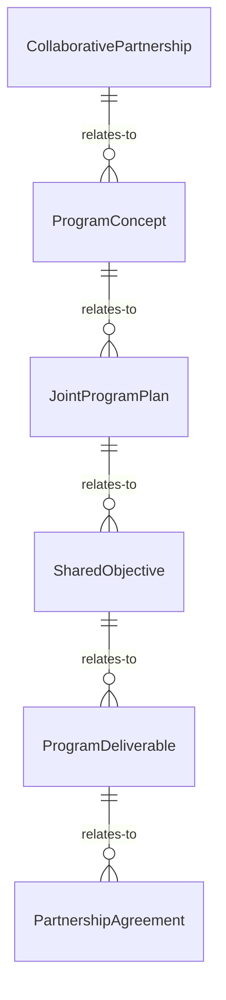
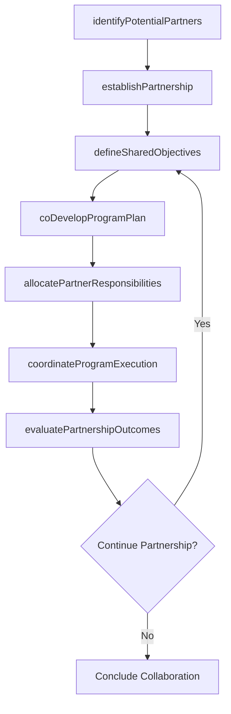
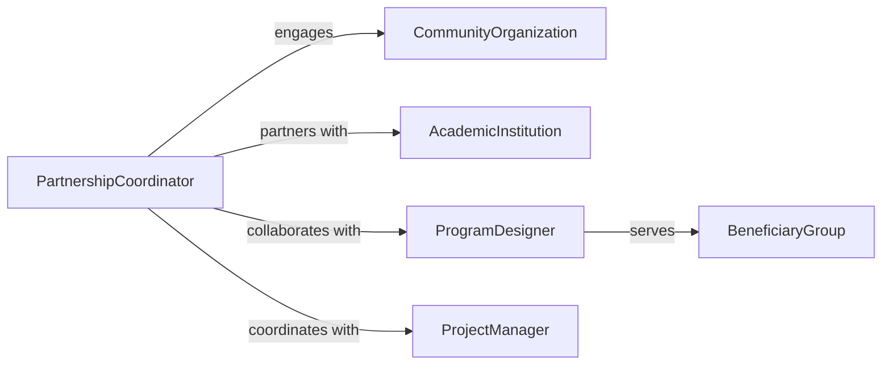

# Collaborate Outside Groups Develop Programs

> Business-as-Code definition for partnering with external organizations to develop joint programs and initiatives. Models partnership formation, collaborative planning, and co-development workflows for shared objectives.

## Overview

External group collaboration involves partnering with nonprofit organizations, community groups, academic institutions, or other entities to develop programs that advance shared goals. This definition provides actions for establishing partnerships, coordinating program development, and managing collaborative project execution.

## Actors

| Actor | Description |
|-------|-------------|
| CommunityOrganization | Local nonprofit or civic group |
| AcademicInstitution | University, college, or research center |
| IndustryAssociation | Professional or trade organization |
| GovernmentPartner | Public agency collaborating on initiatives |
| FoundationFunder | Philanthropic organization providing program support |
| BeneficiaryGroup | Community or population served by program |

## Roles

| Role | Description |
|------|-------------|
| PartnershipCoordinator | Manages relationships with external collaborators |
| ProgramDesigner | Develops program structure and components |
| ProjectManager | Oversees collaborative project execution |
| StakeholderLiaison | Facilitates communication with partner organizations |

## Entities

| Entity | Description |
|--------|-------------|
| CollaborativePartnership | Formal relationship with external organization |
| ProgramConcept | Initial idea for joint initiative |
| JointProgramPlan | Detailed design for collaborative project |
| SharedObjective | Common goal driving partnership |
| ProgramDeliverable | Specific output from collaborative effort |
| PartnershipAgreement | Formal document defining roles and responsibilities |

## Actions

| Action | Description |
|--------|-------------|
| identifyPotentialPartners | Find external groups with aligned interests |
| establishPartnership | Formalize collaborative relationship |
| defineSharedObjectives | Articulate common goals for partnership |
| coDevelopProgramPlan | Jointly design program structure and activities |
| allocatePartnerResponsibilities | Assign tasks and roles across organizations |
| coordinateProgramExecution | Synchronize activities during implementation |
| evaluatePartnershipOutcomes | Assess results and partnership effectiveness |

## Events

| Event | Description |
|-------|-------------|
| potentialPartnersIdentified | External groups with aligned interests have been found |
| partnershipEstablished | Collaborative relationship has been formalized |
| sharedObjectivesDefined | Common goals have been articulated |
| programPlanCoDeveloped | Program structure has been jointly designed |
| partnerResponsibilitiesAllocated | Tasks have been assigned across organizations |
| programExecutionCoordinated | Activities have been synchronized |
| partnershipOutcomesEvaluated | Results have been assessed |

## Searches

| Search | Description |
|--------|-------------|
| findActivePartnerships | List current collaborative relationships |
| getProgramsByObjective | Retrieve initiatives grouped by shared goal |
| getPartnersByType | Find external organizations by category |
| getPendingProgramPlans | List collaborative designs under development |
| getPartnershipOutcomes | Retrieve results data from joint programs |


## Entity Relationships



## State Diagram

```mermaid
stateDiagram-v2
    [*] --> Potential Partners Identified
    Potential Partners Identified --> Partnership Established : partnershipEstablished
    Partnership Established --> Shared Objectives Defined : sharedObjectivesDefined
    Shared Objectives Defined --> Program Plan Co Developed : programPlanCoDeveloped
    Program Plan Co Developed --> Partner Responsibilities Allocated : partnerResponsibilitiesAllocated
    Partner Responsibilities Allocated --> Program Execution Coordinated : programExecutionCoordinated
    Program Execution Coordinated --> Partnership Outcomes Evaluated : partnershipOutcomesEvaluated
    Program Plan Co Developed --> Shared Objectives Defined : revisionRequired
    Partnership Outcomes Evaluated --> [*]
```



## Workflow



## Actor Relationships



## Usage

### Calling Actions

```typescript
import { collaborateOutsideGroupsDevelopPrograms } from '@headlessly/collaborate-outside-groups-develop-programs'

const collaboration = collaborateOutsideGroupsDevelopPrograms()

// Identify potential partners
const potentialPartners = await collaboration.identifyPotentialPartners({
  programArea: 'youth-workforce-development',
  geographicScope: 'metropolitan-area',
  desiredCapabilities: [
    'Direct service delivery to young adults',
    'Employer connections and job placement',
    'Education or training program expertise'
  ],
  alignmentCriteria: {
    mission: 'Economic mobility and career readiness',
    targetPopulation: 'Ages 18-24, opportunity youth'
  }
})

// Establish partnership with selected organization
const partnership = await collaboration.establishPartnership({
  partnerId: 'nonprofit-youth-services-inc',
  partnerType: 'community-organization',
  partnershipScope: 'Joint apprenticeship program development',
  formalAgreement: {
    agreementType: 'memorandum-of-understanding',
    term: { startDate: '2026-03-01', endDate: '2027-02-28' },
    governanceStructure: 'Joint steering committee with monthly meetings',
    resourceCommitments: {
      organization: ['Program staff time', 'Employer partnerships', 'Funding: $150,000'],
      partner: ['Participant recruitment', 'Case management', 'Training facilities']
    }
  },
  signedBy: 'executive-director-123',
  signedDate: '2026-02-15'
})

// Define shared objectives
await collaboration.defineSharedObjectives({
  partnershipId: partnership.id,
  objectives: [
    {
      objective: 'Prepare 100 opportunity youth for careers in advanced manufacturing',
      metrics: [
        { metric: 'Program enrollment', target: 100, timeline: '12 months' },
        { metric: 'Training completion rate', target: '80%', timeline: '12 months' },
        { metric: 'Job placement rate', target: '70%', timeline: '18 months' }
      ]
    },
    {
      objective: 'Strengthen employer partnerships in manufacturing sector',
      metrics: [
        { metric: 'Employer partners engaged', target: 25, timeline: '12 months' },
        { metric: 'Apprenticeship positions created', target: 75, timeline: '12 months' }
      ]
    }
  ]
})

// Co-develop program plan
const programPlan = await collaboration.coDevelopProgramPlan({
  partnershipId: partnership.id,
  programComponents: [
    {
      component: 'Recruitment and Assessment',
      description: 'Identify and enroll eligible youth',
      leadOrganization: 'nonprofit-youth-services-inc',
      activities: ['Community outreach', 'Eligibility screening', 'Skills assessment'],
      timeline: 'Months 1-12 (ongoing)',
      budget: 30000
    },
    {
      component: 'Technical Training',
      description: '8-week intensive training in manufacturing skills',
      leadOrganization: 'organization',
      activities: ['CNC machining', 'Blueprint reading', 'Quality control', 'Safety certification'],
      timeline: 'Cohorts every 10 weeks',
      budget: 75000
    },
    {
      component: 'Work-Based Learning',
      description: 'Paid apprenticeships with employer partners',
      leadOrganization: 'joint',
      activities: ['Job matching', 'Workplace coaching', 'Employer support'],
      timeline: 'Months 3-18',
      budget: 45000
    }
  ],
  developmentProcess: {
    designSessions: 4,
    stakeholderInput: ['Youth advisory council', 'Employer partners', 'Training providers'],
    iterationsCompleted: 2
  }
})

// Allocate partner responsibilities
await collaboration.allocatePartnerResponsibilities({
  programPlanId: programPlan.id,
  responsibilities: [
    {
      task: 'Participant recruitment',
      assignedTo: 'nonprofit-youth-services-inc',
      deliverables: ['25 participants per cohort', 'Eligibility documentation'],
      supportFrom: 'organization'
    },
    {
      task: 'Curriculum delivery',
      assignedTo: 'organization',
      deliverables: ['Technical training for all cohorts', 'Industry certifications'],
      supportFrom: 'nonprofit-youth-services-inc'
    },
    {
      task: 'Case management',
      assignedTo: 'nonprofit-youth-services-inc',
      deliverables: ['Individual support plans', 'Retention support'],
      supportFrom: 'organization'
    }
  ]
})
```

### Event-Driven Automation

```typescript
// Auto-schedule partnership review meetings
collaboration.partnershipEstablished(async ({ partnershipId, formalAgreement }) => {
  const meetingFrequency = formalAgreement.governanceStructure.includes('monthly') ? 30 : 90

  await scheduleRecurringMeeting({
    partnershipId,
    meetingType: 'steering-committee',
    frequency: `Every ${meetingFrequency} days`,
    participants: ['organization-leadership', 'partner-leadership'],
    agenda: ['Progress review', 'Issue resolution', 'Planning']
  })
})

// Track partnership outcome metrics
collaboration.programExecutionCoordinated(async ({ programPlanId, activitiesCompleted }) => {
  await trackPartnershipMetrics({
    programPlanId,
    completedActivities: activitiesCompleted.length,
    timestamp: new Date()
  })
})

// Alert when shared objectives are at risk
collaboration.partnershipOutcomesEvaluated(async ({ objectives, actualResults }) => {
  const atRiskObjectives = objectives.filter(obj => {
    const actual = actualResults.find(r => r.objectiveId === obj.id)
    return actual && (actual.progress / obj.target) < 0.7 // Less than 70% of target
  })

  if (atRiskObjectives.length > 0) {
    await notifyPartnershipTeam({
      priority: 'high',
      message: `${atRiskObjectives.length} partnership objectives at risk`,
      requestActionPlan: true
    })
  }
})
```
