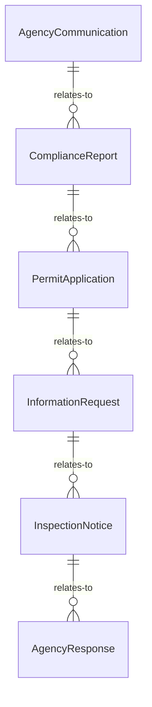
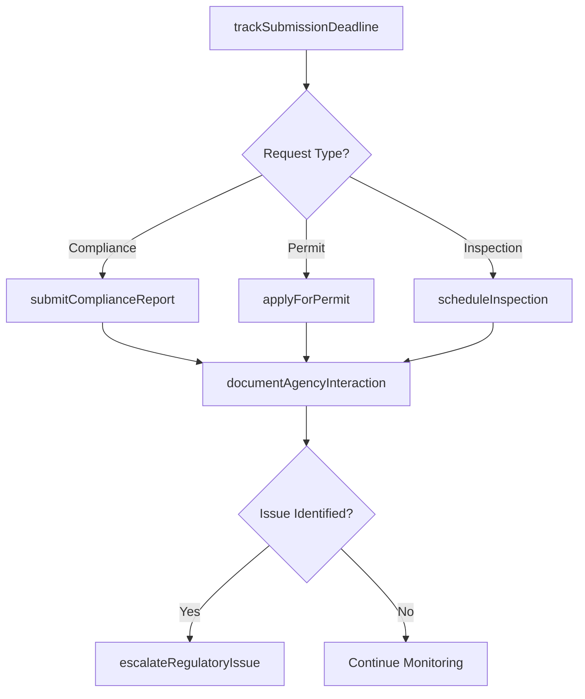
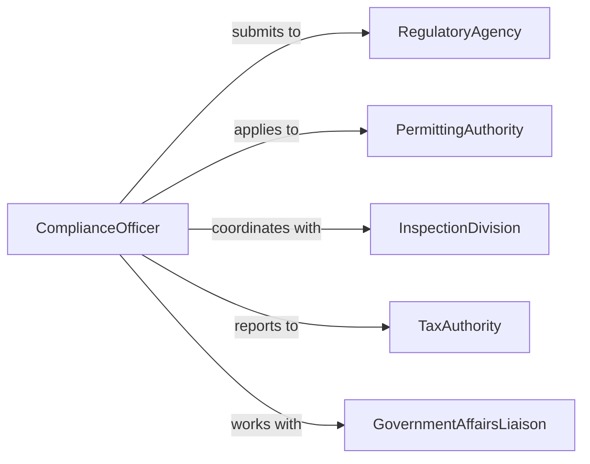

# Communicate Government Agencies

> Business-as-Code definition for organizational communication with government regulatory and administrative agencies. Models compliance reporting, permit applications, and official correspondence workflows.

## Overview

Government agency communication involves submitting required reports, responding to information requests, coordinating inspections, and maintaining regulatory compliance. This definition provides actions for managing official correspondence, tracking submission deadlines, and documenting agency interactions.

## Actors

| Actor | Description |
|-------|-------------|
| RegulatoryAgency | Government body overseeing compliance and permitting |
| PermittingAuthority | Issues licenses and operational permits |
| InspectionDivision | Conducts facility and operational audits |
| TaxAuthority | Administers tax collection and reporting |
| LaborDepartment | Enforces workplace and employment regulations |
| EnvironmentalAgency | Monitors environmental compliance and reporting |

## Roles

| Role | Description |
|------|-------------|
| ComplianceOfficer | Manages regulatory reporting and agency relationships |
| GovernmentAffairsLiaison | Coordinates official communications and requests |
| PermitCoordinator | Handles licensing and permit application processes |
| InspectionManager | Facilitates agency audits and inspections |

## Entities

| Entity | Description |
|--------|-------------|
| AgencyCommunication | Official correspondence with government body |
| ComplianceReport | Required submission documenting regulatory adherence |
| PermitApplication | Request for license or operational authorization |
| InformationRequest | Agency demand for specific data or documentation |
| InspectionNotice | Scheduled audit or facility review |
| AgencyResponse | Official reply from government body |

## Actions

| Action | Description |
|--------|-------------|
| submitComplianceReport | File required regulatory documentation |
| respondToInformationRequest | Provide data requested by agency |
| applyForPermit | Request license or operational authorization |
| scheduleInspection | Arrange agency audit or facility review |
| trackSubmissionDeadline | Monitor compliance filing due dates |
| documentAgencyInteraction | Record official communications and outcomes |
| escalateRegulatoryIssue | Alert management to compliance concerns |

## Events

| Event | Description |
|-------|-------------|
| complianceReportSubmitted | Required documentation has been filed |
| informationRequestResponded | Agency data request has been fulfilled |
| permitApplicationApplied | License request has been submitted |
| inspectionScheduled | Agency audit has been arranged |
| submissionDeadlineTracked | Filing due date has been logged |
| agencyInteractionDocumented | Official communication has been recorded |
| regulatoryIssueEscalated | Compliance concern has been raised to management |

## Searches

| Search | Description |
|--------|-------------|
| findUpcomingDeadlines | List compliance filings due within timeframe |
| getPermitsByStatus | Retrieve permit applications by approval state |
| getAgencyCorrespondence | Find communications with specific agency |
| getOpenInformationRequests | List pending agency data requests |
| getInspectionHistory | Retrieve past agency audits and results |


## Entity Relationships



## State Diagram

```mermaid
stateDiagram-v2
    [*] --> Compliance Report Submitted
    Compliance Report Submitted --> Information Request Responded : informationRequestResponded
    Information Request Responded --> Permit Application Applied : permitApplicationApplied
    Permit Application Applied --> Inspection Scheduled : inspectionScheduled
    Inspection Scheduled --> Submission Deadline Tracked : submissionDeadlineTracked
    Submission Deadline Tracked --> Agency Interaction Documented : agencyInteractionDocumented
    Agency Interaction Documented --> Regulatory Issue Escalated : regulatoryIssueEscalated
    Inspection Scheduled --> Permit Application Applied : revisionRequired
    Regulatory Issue Escalated --> [*]
```



## Workflow



## Actor Relationships



## Usage

### Calling Actions

```typescript
import { communicateGovernmentAgencies } from '@headlessly/communicate-government-agencies'

const govComm = communicateGovernmentAgencies()

// Submit quarterly compliance report
const report = await govComm.submitComplianceReport({
  agencyId: 'EPA-Region5',
  reportType: 'air-emissions-quarterly',
  reportingPeriod: 'Q4-2025',
  submittedBy: 'compliance-officer-123',
  reportData: {
    facilityId: 'facility-XYZ',
    totalEmissions: {
      NOx: { value: 12.4, unit: 'tons' },
      SO2: { value: 5.2, unit: 'tons' },
      VOC: { value: 3.1, unit: 'tons' }
    },
    monitoringData: 'continuous-emissions-monitoring.csv',
    certificationStatement: 'I certify that this report is accurate and complete to the best of my knowledge'
  },
  deadline: '2026-01-30'
})

// Respond to agency information request
await govComm.respondToInformationRequest({
  requestId: 'OSHA-IR-2026-0042',
  agencyId: 'OSHA-District7',
  requestDate: '2026-02-01',
  requestedInformation: 'Employee injury and illness records for 2025',
  responseData: {
    OSHA300Log: 'osha-300-log-2025.pdf',
    recordableInjuries: 3,
    daysAwayFromWork: 15,
    safetyTrainingRecords: 'training-logs-2025.xlsx'
  },
  respondedBy: 'hr-manager-456',
  responseDate: '2026-02-05'
})

// Apply for operational permit
const permit = await govComm.applyForPermit({
  agencyId: 'state-environmental-agency',
  permitType: 'air-quality-operating-permit',
  facilityId: 'facility-XYZ',
  applicationData: {
    operationType: 'manufacturing',
    emissionSources: ['natural-gas-boiler', 'coating-oven', 'emergency-generator'],
    requestedCapacity: 'Existing operations, no expansion',
    controlTechnologies: ['SCR on boiler', 'Thermal oxidizer on oven']
  },
  supportingDocuments: [
    'emissions-calculations.pdf',
    'dispersion-modeling-report.pdf',
    'facility-plot-plan.dwg'
  ],
  applicationFee: 5000
})

// Track submission deadlines
await govComm.trackSubmissionDeadline({
  agencyId: 'IRS',
  submissionType: 'quarterly-941',
  filingDeadline: '2026-04-30',
  preparedBy: 'payroll-dept',
  reminderSchedule: [
    { days Before: 30, notify: 'finance-team' },
    { daysBefore: 14, notify: 'cfo' },
    { daysBefore: 7, notify: 'accounting-manager' }
  ]
})
```

### Event-Driven Automation

```typescript
// Auto-escalate when deadlines are approaching
govComm.submissionDeadlineTracked(async ({ deadline, submissionType, agencyId }) => {
  const daysUntilDeadline = (new Date(deadline) - new Date()) / (1000 * 60 * 60 * 24)

  if (daysUntilDeadline <= 7 && !await isSubmissionPrepared(submissionType)) {
    await govComm.escalateRegulatoryIssue({
      issue: `${submissionType} due in ${Math.floor(daysUntilDeadline)} days - not yet prepared`,
      agency: agencyId,
      severity: 'high',
      escalateTo: 'compliance-director'
    })
  }
})

// Notify legal when information requests are received
govComm.informationRequestResponded(async ({ requestId, agencyId, requestedInformation }) => {
  if (agencyId.includes('OSHA') || agencyId.includes('EPA') || requestedInformation.includes('violation')) {
    await notifyLegalDepartment({
      requestId,
      agency: agencyId,
      scope: requestedInformation,
      recommendReview: true
    })
  }
})
```
