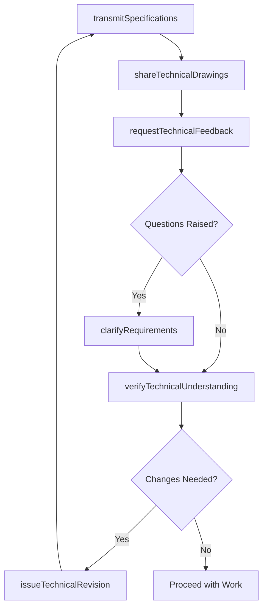
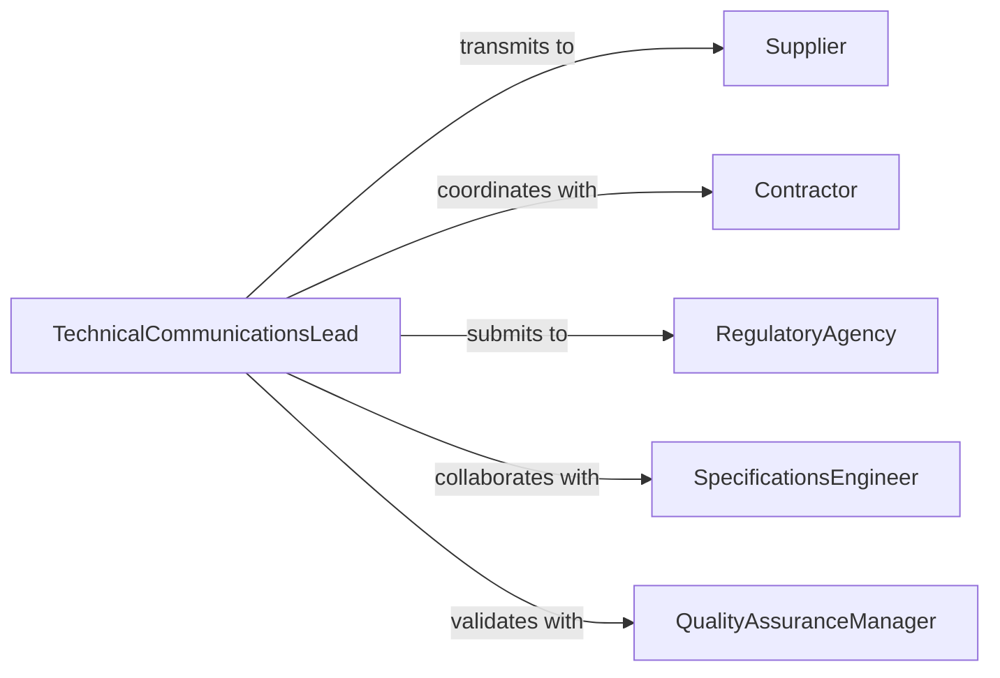

# Communicate Technical Information Suppliers Contractor

> Business-as-Code definition for transmitting technical specifications, requirements, and documentation to suppliers, contractors, and regulatory agencies. Models technical data exchange, specification management, and compliance communication workflows.

## Overview

Technical information communication involves sharing detailed specifications, engineering data, compliance documentation, and performance requirements with external parties. This definition provides actions for transmitting technical documents, clarifying specifications, and ensuring accurate interpretation of complex technical requirements.

## Actors

| Actor | Description |
|-------|-------------|
| Supplier | Provides materials or components per specifications |
| Contractor | Delivers services based on technical requirements |
| RegulatoryAgency | Reviews technical submissions for compliance approval |
| EngineeringFirm | Provides technical expertise or design services |
| TestingLaboratory | Conducts verification testing per specifications |
| CertificationBody | Validates compliance with technical standards |

## Roles

| Role | Description |
|------|-------------|
| TechnicalCommunicationsLead | Manages technical information exchange |
| SpecificationsEngineer | Develops and clarifies technical requirements |
| QualityAssuranceManager | Ensures technical accuracy and compliance |
| ContractAdministrator | Coordinates technical requirements in agreements |

## Entities

| Entity | Description |
|--------|-------------|
| TechnicalSpecification | Detailed requirements for materials, products, or services |
| EngineeringDrawing | Visual representation of technical requirements |
| ComplianceDocument | Technical submission demonstrating regulatory adherence |
| PerformanceRequirement | Measurable criteria for acceptable outcomes |
| TechnicalClarification | Response to questions about specifications |
| ChangeOrder | Modification to previously communicated technical requirements |

## Actions

| Action | Description |
|--------|-------------|
| transmitSpecifications | Send technical requirements to external party |
| shareTechnicalDrawings | Provide engineering diagrams and schematics |
| clarifyRequirements | Answer questions about technical specifications |
| submitComplianceData | Provide technical documentation to regulatory agency |
| issueTechnicalRevision | Communicate updates to previously shared specifications |
| requestTechnicalFeedback | Solicit input on feasibility or requirements |
| verifyTechnicalUnderstanding | Confirm external party comprehends requirements |

## Events

| Event | Description |
|-------|-------------|
| specificationTransmitted | Technical requirements have been sent |
| technicalDrawingsShared | Engineering diagrams have been provided |
| requirementsClarified | Questions about specifications have been answered |
| complianceDataSubmitted | Regulatory documentation has been provided |
| technicalRevisionIssued | Specification updates have been communicated |
| technicalFeedbackRequested | Input on requirements has been solicited |
| technicalUnderstandingVerified | Comprehension has been confirmed |

## Searches

| Search | Description |
|--------|-------------|
| findActiveSpecifications | List current technical requirements by project |
| getTechnicalClarifications | Retrieve Q&A history for specifications |
| getComplianceSubmissions | Find regulatory filings by agency and status |
| getRevisionHistory | Track specification changes over time |
| getPendingFeedbackRequests | List outstanding requests for technical input |

## Workflow



## Actor Relationships



## Usage

### Calling Actions

```typescript
import { communicateTechnicalInformationSuppliersContractor } from '@headlessly/communicate-technical-information-suppliers-contractors'

const techComm = communicateTechnicalInformationSuppliersContractor()

// Transmit specifications to supplier
const specTransmittal = await techComm.transmitSpecifications({
  recipientId: 'supplier-acme-steel',
  projectId: 'bridge-construction-2026',
  specifications: [
    {
      specNumber: 'STL-001',
      title: 'Structural Steel Grade A992',
      requirements: {
        yieldStrength: { min: 50, unit: 'ksi' },
        tensileStrength: { min: 65, unit: 'ksi' },
        elongation: { min: 21, unit: 'percent' },
        chemicalComposition: 'Per ASTM A992/A992M',
        testing: 'Mill test certificates required for all heats'
      }
    },
    {
      specNumber: 'WLD-002',
      title: 'Welding Procedures',
      requirements: {
        process: 'SMAW or FCAW',
        electrodes: 'E70XX low-hydrogen',
        preheat: 'Minimum 200°F for material > 3/4" thick',
        qualifications: 'All welders certified per AWS D1.5'
      }
    }
  ],
  transmittalDate: '2026-02-07',
  responseDeadline: '2026-02-21'
})

// Share technical drawings
await techComm.shareTechnicalDrawings({
  transmittalId: specTransmittal.id,
  drawings: [
    { drawingNumber: 'S-101', revision: 'C', title: 'Foundation Plan', format: 'PDF' },
    { drawingNumber: 'S-201', revision: 'B', title: 'Framing Plan', format: 'DWG' },
    { drawingNumber: 'D-301', revision: 'A', title: 'Connection Details', format: 'PDF' }
  ],
  deliveryMethod: 'secure-file-transfer',
  accessInstructions: 'Login credentials sent separately'
})

// Clarify requirements in response to supplier questions
await techComm.clarifyRequirements({
  transmittalId: specTransmittal.id,
  questionReceived: 'Can A572 Grade 50 be substituted for A992 material?',
  clarificationResponse: {
    answer: 'Yes, ASTM A572 Grade 50 is acceptable as equivalent material',
    technicalBasis: 'Both materials have same 50 ksi yield strength and meet structural requirements',
    additionalRequirements: ['Provide mill test certificates confirming chemical composition', 'Maintain same testing and inspection protocols'],
    approvedBy: 'engineer-of-record-789',
    approvalDate: '2026-02-12'
  }
})

// Submit compliance data to regulatory agency
await techComm.submitComplianceData({
  agencyId: 'state-dot-bridge-division',
  projectId: 'bridge-construction-2026',
  submissionType: 'material-certification',
  complianceDocuments: [
    {
      documentType: 'mill-test-certificates',
      description: 'Steel material certifications for structural members',
      files: ['mtc-heat-123456.pdf', 'mtc-heat-789012.pdf']
    },
    {
      documentType: 'welding-procedure-specifications',
      description: 'Qualified WPS per AWS D1.5',
      files: ['wps-001-smaw.pdf', 'wps-002-fcaw.pdf']
    },
    {
      documentType: 'welder-certifications',
      description: 'Welder qualification records',
      files: ['welder-certs-current.pdf']
    }
  ],
  submittalDate: '2026-02-15',
  certifyingEngineer: 'engineer-of-record-789'
})

// Issue technical revision
await techComm.issueTechnicalRevision({
  originalTransmittalId: specTransmittal.id,
  revisionNumber: 2,
  changesDescription: 'Revised bolt grade from A325 to A490 for high-strength connections',
  affectedSpecifications: ['CON-003'],
  reasonForChange: 'Increased design loads per structural analysis revision',
  revisedRequirements: {
    boltGrade: 'ASTM A490',
    installationTorque: 'Per manufacturer specifications for A490',
    inspection: 'Verify installation with calibrated torque wrench'
  },
  distributionList: ['supplier-acme-steel', 'contractor-bridge-builders'],
  effectiveDate: '2026-02-20'
})
```

### Event-Driven Automation

```typescript
// Auto-track specification acknowledgments
techComm.specificationTransmitted(async ({ transmittalId, recipientId, responseDeadline }) => {
  // Set reminder for 3 days before deadline
  const reminderDate = new Date(responseDeadline)
  reminderDate.setDate(reminderDate.getDate() - 3)

  setTimeout(async () => {
    const status = await getTransmittalStatus(transmittalId)
    if (!status.acknowledged) {
      await sendReminder({
        to: recipientId,
        subject: `Reminder: Technical Specifications Response Due in 3 Days`,
        transmittalId
      })
    }
  }, reminderDate - new Date())
})

// Notify quality team when compliance submissions are made
techComm.complianceDataSubmitted(async ({ agencyId, submissionType, complianceDocuments }) => {
  await notifyQualityAssurance({
    message: `Compliance submission to ${agencyId}: ${submissionType}`,
    documentCount: complianceDocuments.length,
    reviewRequired: true
  })
})

// Alert project team when technical revisions are issued
techComm.technicalRevisionIssued(async ({ revisionNumber, changesDescription, affectedSpecifications }) => {
  await notifyProjectTeam({
    priority: 'high',
    message: `Technical Revision ${revisionNumber} issued affecting ${affectedSpecifications.join(', ')}`,
    changes: changesDescription,
    actionRequired: 'Review and acknowledge receipt within 48 hours'
  })
})
```
