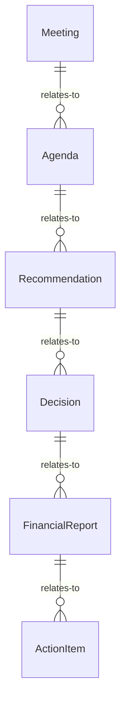
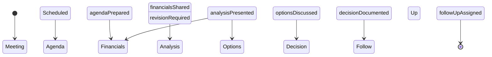
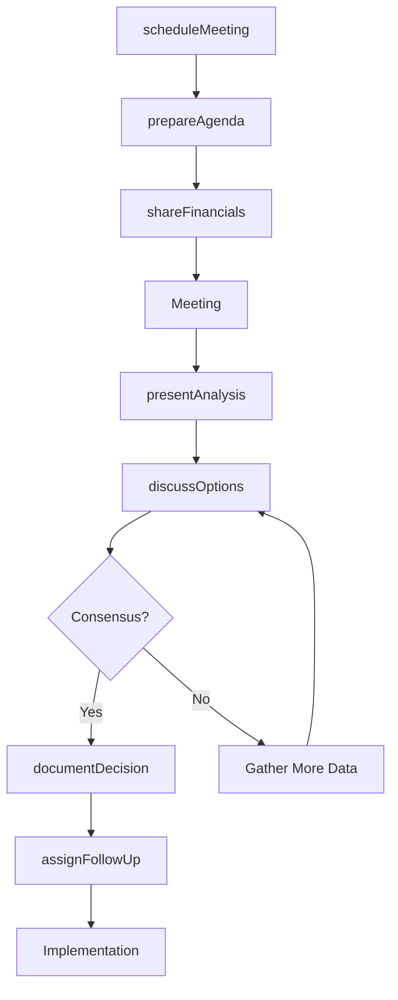

# Confer Others About Financial Matters

> Business-as-Code definition for conducting financial consultations and discussions. Models the complete financial conferencing lifecycle from meeting preparation through decision-making and follow-up.

## Overview

Financial conferencing involves coordinating discussions about budgets, investments, expenses, forecasts, and financial strategies with stakeholders, advisors, and decision-makers. This definition exposes actions for consultation management, events for workflow automation, and searches for tracking financial decisions and recommendations.

## Actors

| Actor | Description |
|-------|-------------|
| Financial Advisor | Provides investment and financial planning guidance |
| Auditor | Reviews financial compliance and reporting accuracy |
| Investor | Discusses portfolio performance and strategy |
| Banking Partner | Coordinates lending and treasury services |
| Tax Consultant | Advises on tax planning and compliance |
| Board Member | Participates in strategic financial decisions |

## Roles

| Role | Description |
|------|-------------|
| Chief Financial Officer | Leads financial strategy and decision-making |
| Financial Analyst | Prepares data and analysis for consultations |
| Controller | Manages financial reporting and compliance |
| Treasury Manager | Oversees cash management and funding |

## Entities

| Entity | Description |
|--------|-------------|
| Meeting | Scheduled financial discussion or consultation |
| Agenda | Topics and objectives for financial conference |
| Recommendation | Suggested financial action or strategy |
| Decision | Agreed-upon financial course of action |
| FinancialReport | Data and analysis supporting discussion |
| ActionItem | Follow-up task resulting from consultation |

## Actions

| Action | Description |
|--------|-------------|
| scheduleMeeting | Arrange financial consultation or discussion |
| prepareAgenda | Define topics and objectives for conference |
| shareFinancials | Distribute reports and data to participants |
| presentAnalysis | Explain financial trends and implications |
| discussOptions | Collaborate on alternative strategies |
| documentDecision | Record agreed-upon financial actions |
| assignFollowUp | Designate responsibility for action items |

## Events

| Event | Description |
|-------|-------------|
| meetingScheduled | Financial consultation has been arranged |
| agendaPrepared | Discussion topics have been defined |
| financialsShared | Reports and data have been distributed |
| analysisPresented | Financial trends have been explained |
| optionsDiscussed | Alternative strategies have been reviewed |
| decisionDocumented | Financial actions have been recorded |
| followUpAssigned | Action item responsibilities have been designated |

## Searches

| Search | Description |
|--------|-------------|
| findMeetings | List financial consultations by date or participant |
| getDecisions | Retrieve agreed-upon financial actions |
| getRecommendations | Find suggested strategies from consultations |
| getActionItems | List follow-up tasks by owner or status |


## Entity Relationships



## State Diagram



## Workflow



## Actor Relationships

```mermaid
graph LR
    CFO[Chief Financial Officer]

    CFO -->|consults| Financial Advisor
    CFO -->|coordinates with| Auditor
    CFO -->|reports to| Investor
    CFO -->|negotiates with| Banking Partner
    CFO -->|engages| Tax Consultant
```

## Usage

### Calling Actions

```typescript
import { conferOthersAboutFinancialMatters } from '@headlessly/confer-others-about-financial-matters'

const financial = conferOthersAboutFinancialMatters()

// Schedule quarterly budget review
const meeting = await financial.scheduleMeeting({
  title: 'Q1 2026 Budget Review',
  date: '2026-03-15',
  time: '14:00',
  duration: 90,
  participants: [
    { id: 'cfo-123', role: 'CFO' },
    { id: 'controller-456', role: 'Controller' },
    { id: 'analyst-789', role: 'Financial Analyst' }
  ]
})

// Prepare agenda and share financials
await financial.prepareAgenda({
  meetingId: meeting.id,
  topics: [
    'Q1 revenue performance vs forecast',
    'Expense variance analysis',
    'Cash flow projections',
    'Capital expenditure requests'
  ]
})

await financial.shareFinancials({
  meetingId: meeting.id,
  reports: [
    { type: 'income_statement', period: 'Q1 2026' },
    { type: 'budget_variance', period: 'Q1 2026' },
    { type: 'cash_flow_forecast', period: '2026' }
  ]
})

// Present analysis and document decision
await financial.presentAnalysis({
  meetingId: meeting.id,
  findings: {
    revenueVariance: -5.2,
    expenseVariance: 3.1,
    cashPosition: 'strong',
    recommendations: ['Accelerate marketing spend', 'Defer non-critical capex']
  }
})

const decision = await financial.documentDecision({
  meetingId: meeting.id,
  decision: {
    action: 'Increase marketing budget by $250K',
    rationale: 'Revenue shortfall driven by awareness gap',
    approvedBy: 'cfo-123',
    effectiveDate: '2026-04-01'
  }
})
```

### Event-Driven Automation

```typescript
// Auto-share financials before meeting
financial.meetingScheduled(async ({ meetingId, date }) => {
  const daysBefore = 2
  await scheduleTask({
    date: addDays(date, -daysBefore),
    task: async () => {
      const reports = await generateFinancialReports({ meetingId })
      await financial.shareFinancials({
        meetingId,
        reports
      })
    }
  })
})

// Track unassigned action items
financial.decisionDocumented(async ({ meetingId, decision }) => {
  const actionItems = extractActionItems(decision)
  for (const item of actionItems) {
    await financial.assignFollowUp({
      meetingId,
      actionItem: item,
      owner: determineOwner(item)
    })
  }
})
```
