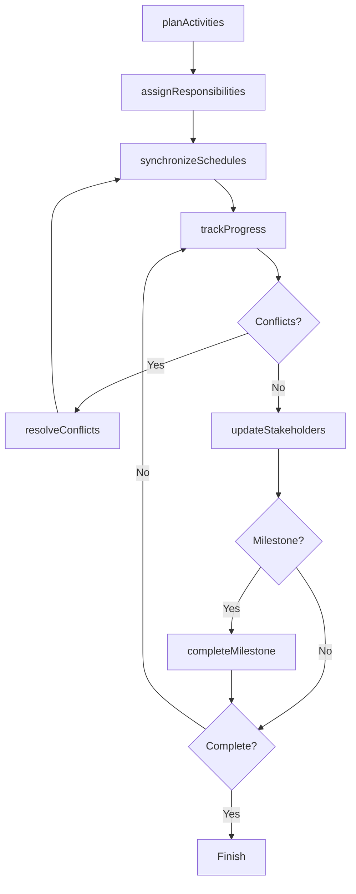

# Coordinate Activities Suppliers Contractors Clients

> Business-as-Code definition for coordinating activities with external parties and internal departments. Models the complete coordination lifecycle from planning through execution and resolution.

## Overview

External activity coordination involves scheduling, synchronizing, and managing interdependent work with suppliers, contractors, clients, and cross-functional teams. This definition exposes actions for coordination management, events for workflow automation, and searches for tracking dependencies and deliverables.

## Actors

| Actor | Description |
|-------|-------------|
| Supplier | Provides materials, components, or services |
| Contractor | Executes specialized work under agreement |
| Client | Receives deliverables and provides requirements |
| Partner Organization | Collaborates on joint initiatives |
| Logistics Provider | Handles transportation and distribution |
| Regulatory Agency | Oversees compliance and approvals |

## Roles

| Role | Description |
|------|-------------|
| Project Manager | Orchestrates coordination across parties |
| Procurement Specialist | Manages supplier and contractor engagement |
| Account Manager | Coordinates client-facing activities |
| Operations Coordinator | Synchronizes cross-departmental work |

## Entities

| Entity | Description |
|--------|-------------|
| Activity | Scheduled work requiring coordination |
| Dependency | Relationship between interdependent tasks |
| Schedule | Timeline for coordinated activities |
| Deliverable | Output expected from coordinated work |
| Milestone | Key checkpoint in coordinated activities |
| Issue | Problem requiring resolution across parties |

## Actions

| Action | Description |
|--------|-------------|
| planActivities | Define scope and schedule for coordinated work |
| assignResponsibilities | Designate parties responsible for deliverables |
| synchronizeSchedules | Align timelines across multiple parties |
| trackProgress | Monitor status of coordinated activities |
| resolveConflicts | Address scheduling or resource conflicts |
| updateStakeholders | Communicate status to involved parties |
| completeMilestone | Mark checkpoint achievement in coordination |

## Events

| Event | Description |
|-------|-------------|
| activitiesPlanned | Coordinated work has been defined |
| responsibilitiesAssigned | Deliverable ownership has been designated |
| schedulesSynchronized | Timelines have been aligned |
| progressTracked | Status of activities has been monitored |
| conflictsResolved | Scheduling or resource issues have been addressed |
| stakeholdersUpdated | Status has been communicated to parties |
| milestoneCompleted | Key checkpoint has been achieved |

## Searches

| Search | Description |
|--------|-------------|
| findActivities | List coordinated work by party, status, or date |
| getDependencies | Retrieve interdependent task relationships |
| getMilestones | Find key checkpoints by project or party |
| getIssues | List unresolved problems requiring attention |

## Workflow



## Actor Relationships

```mermaid
graph LR
    PM[Project Manager]

    PM -->|coordinates with| Supplier
    PM -->|manages| Contractor
    PM -->|updates| Client
    PM -->|collaborates with| Partner Organization
    PM -->|schedules| Logistics Provider
```

## Usage

### Calling Actions

```typescript
import { coordinateActivitiesSuppliersContractorsClients } from '@headlessly/coordinate-activities-suppliers-contractors-clients'

const coordination = coordinateActivitiesSuppliersContractorsClients()

// Plan coordinated product launch activities
const activities = await coordination.planActivities({
  project: 'Q2 Product Launch',
  scope: [
    { activity: 'Component manufacturing', party: 'supplier-123', duration: 30 },
    { activity: 'Assembly and testing', party: 'contractor-456', duration: 20 },
    { activity: 'Marketing materials', party: 'internal-marketing', duration: 15 },
    { activity: 'Distribution setup', party: 'logistics-789', duration: 10 }
  ],
  startDate: '2026-03-01'
})

// Assign responsibilities and synchronize schedules
await coordination.assignResponsibilities({
  activitiesId: activities.id,
  assignments: [
    { party: 'supplier-123', deliverable: '10,000 units by 2026-03-30' },
    { party: 'contractor-456', deliverable: 'QA certification by 2026-04-20' }
  ]
})

await coordination.synchronizeSchedules({
  activitiesId: activities.id,
  dependencies: [
    { from: 'component-manufacturing', to: 'assembly-testing', lag: 2 },
    { from: 'assembly-testing', to: 'distribution-setup', lag: 5 }
  ]
})

// Track progress and resolve conflicts
const progress = await coordination.trackProgress({
  activitiesId: activities.id
})

if (progress.conflicts.length > 0) {
  await coordination.resolveConflicts({
    activitiesId: activities.id,
    conflict: progress.conflicts[0],
    resolution: 'Accelerate supplier delivery by 5 days'
  })
}
```

### Event-Driven Automation

```typescript
// Auto-update stakeholders on milestone completion
coordination.milestoneCompleted(async ({ activitiesId, milestone }) => {
  const stakeholders = await getStakeholders({ activitiesId })
  await coordination.updateStakeholders({
    activitiesId,
    stakeholders,
    update: {
      type: 'milestone',
      milestone: milestone.name,
      status: 'completed',
      nextSteps: milestone.nextActivities
    }
  })
})

// Alert on dependency delays
coordination.progressTracked(async ({ activitiesId, progress }) => {
  const delayed = progress.activities.filter(a => a.status === 'delayed')
  for (const activity of delayed) {
    const impacted = await coordination.getDependencies({
      activityId: activity.id,
      direction: 'downstream'
    })
    if (impacted.length > 0) {
      await notify({
        to: 'project-manager',
        message: `Delay in ${activity.name} impacts ${impacted.length} downstream activities`
      })
    }
  }
})
```
