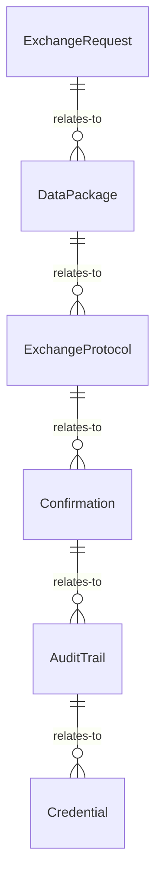
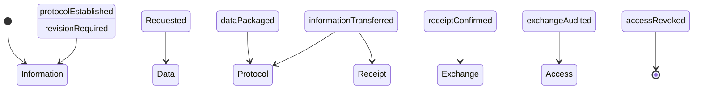
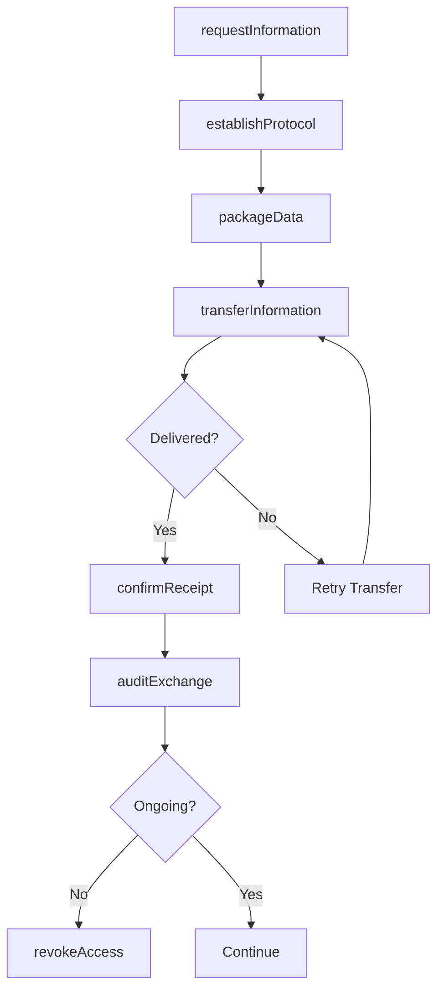

# Coordinate External Parties Exchange Information

> Business-as-Code definition for coordinating information exchange with external parties. Models the complete information exchange lifecycle from request through delivery and confirmation.

## Overview

External information exchange coordination involves managing data sharing, document transfers, and communication protocols with partners, vendors, agencies, and clients. This definition exposes actions for exchange management, events for workflow automation, and searches for tracking information flows and compliance.

## Actors

| Actor | Description |
|-------|-------------|
| Business Partner | Exchanges operational and strategic information |
| Vendor | Provides product, pricing, and availability data |
| Regulatory Agency | Submits and receives compliance information |
| Client Organization | Shares project and service information |
| Data Provider | Supplies external datasets and feeds |
| Industry Consortium | Participates in collaborative information sharing |

## Roles

| Role | Description |
|------|-------------|
| Data Exchange Manager | Oversees information sharing operations |
| Integration Specialist | Implements technical exchange protocols |
| Compliance Officer | Ensures regulatory exchange requirements |
| Business Analyst | Interprets and validates exchanged information |

## Entities

| Entity | Description |
|--------|-------------|
| ExchangeRequest | Formal ask for information from external party |
| DataPackage | Structured information bundle for transfer |
| ExchangeProtocol | Technical method for information transfer |
| Confirmation | Acknowledgment of information receipt |
| AuditTrail | Record of information exchange activities |
| Credential | Access authorization for information exchange |

## Actions

| Action | Description |
|--------|-------------|
| requestInformation | Formally ask external party for data |
| packageData | Prepare information for secure transfer |
| establishProtocol | Define technical exchange method and format |
| transferInformation | Execute information delivery to external party |
| confirmReceipt | Verify successful information delivery |
| auditExchange | Record and review information transfer activities |
| revokeAccess | Terminate information exchange authorization |

## Events

| Event | Description |
|-------|-------------|
| informationRequested | Data request has been submitted to external party |
| dataPackaged | Information has been prepared for transfer |
| protocolEstablished | Exchange method has been defined |
| informationTransferred | Data has been delivered to external party |
| receiptConfirmed | Successful delivery has been verified |
| exchangeAudited | Transfer activities have been recorded |
| accessRevoked | Exchange authorization has been terminated |

## Searches

| Search | Description |
|--------|-------------|
| findRequests | List information requests by party, status, or date |
| getExchanges | Retrieve completed transfers by type or party |
| getAuditTrail | Find exchange activity records for compliance |
| getActiveProtocols | List current exchange methods by party |


## Entity Relationships



## State Diagram



## Workflow



## Actor Relationships

```mermaid
graph LR
    DEM[Data Exchange Manager]

    DEM -->|coordinates with| Business Partner
    DEM -->|receives from| Vendor
    DEM -->|submits to| Regulatory Agency
    DEM -->|shares with| Client Organization
    DEM -->|integrates| Data Provider
```

## Usage

### Calling Actions

```typescript
import { coordinateExternalPartiesExchangeInformation } from '@headlessly/coordinate-external-parties-exchange-information'

const exchange = coordinateExternalPartiesExchangeInformation()

// Request information from business partner
const request = await exchange.requestInformation({
  party: 'partner-org-123',
  type: 'inventory_availability',
  urgency: 'routine',
  format: 'JSON',
  deliveryBy: '2026-02-28'
})

// Establish secure exchange protocol
await exchange.establishProtocol({
  requestId: request.id,
  method: 'SFTP',
  encryption: 'AES-256',
  authentication: 'SSH-key',
  schedule: 'daily at 02:00 UTC'
})

// Package and transfer data to client
const dataPackage = await exchange.packageData({
  type: 'project_status',
  recipient: 'client-org-456',
  contents: [
    { file: 'milestone_report.pdf', size: 2048000 },
    { file: 'budget_summary.xlsx', size: 512000 }
  ],
  metadata: {
    projectId: 'proj-789',
    reportingPeriod: 'Q1 2026'
  }
})

await exchange.transferInformation({
  packageId: dataPackage.id,
  recipient: 'client-org-456'
})

// Confirm receipt and audit
await exchange.confirmReceipt({
  packageId: dataPackage.id,
  confirmedBy: 'client-contact@example.com.ai',
  timestamp: '2026-02-25T10:30:00Z'
})

await exchange.auditExchange({
  packageId: dataPackage.id,
  complianceFramework: 'SOC2'
})
```

### Event-Driven Automation

```typescript
// Auto-retry failed transfers
exchange.informationTransferred(async ({ packageId, status }) => {
  if (status === 'failed') {
    await wait({ minutes: 30 })
    const retryCount = await getRetryCount({ packageId })
    if (retryCount < 3) {
      await exchange.transferInformation({ packageId })
    } else {
      await alert({
        to: 'data-exchange-manager',
        message: `Transfer failed after 3 attempts: ${packageId}`
      })
    }
  }
})

// Track unconfirmed receipts
exchange.informationTransferred(async ({ packageId, recipient }) => {
  await wait({ hours: 24 })
  const confirmation = await exchange.getExchanges({ packageId })
  if (!confirmation.confirmed) {
    await notify({
      to: 'data-exchange-manager',
      message: `No receipt confirmation from ${recipient} for ${packageId}`
    })
  }
})
```
