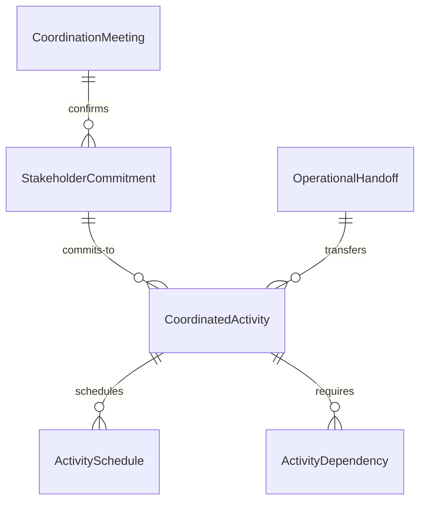
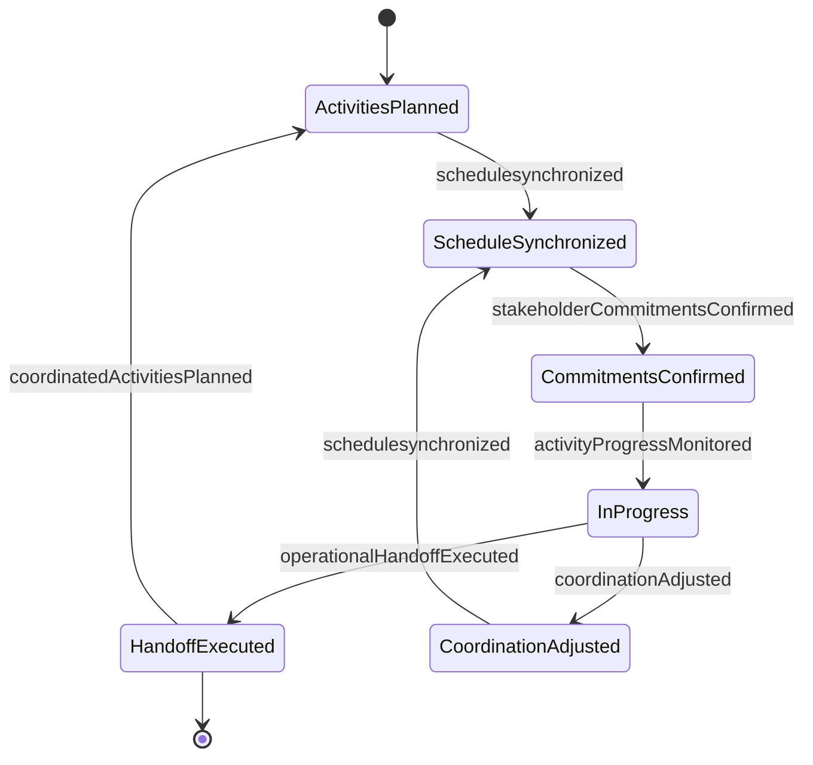
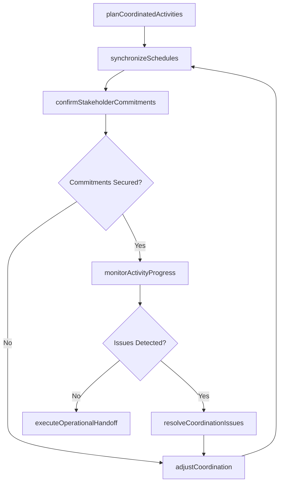
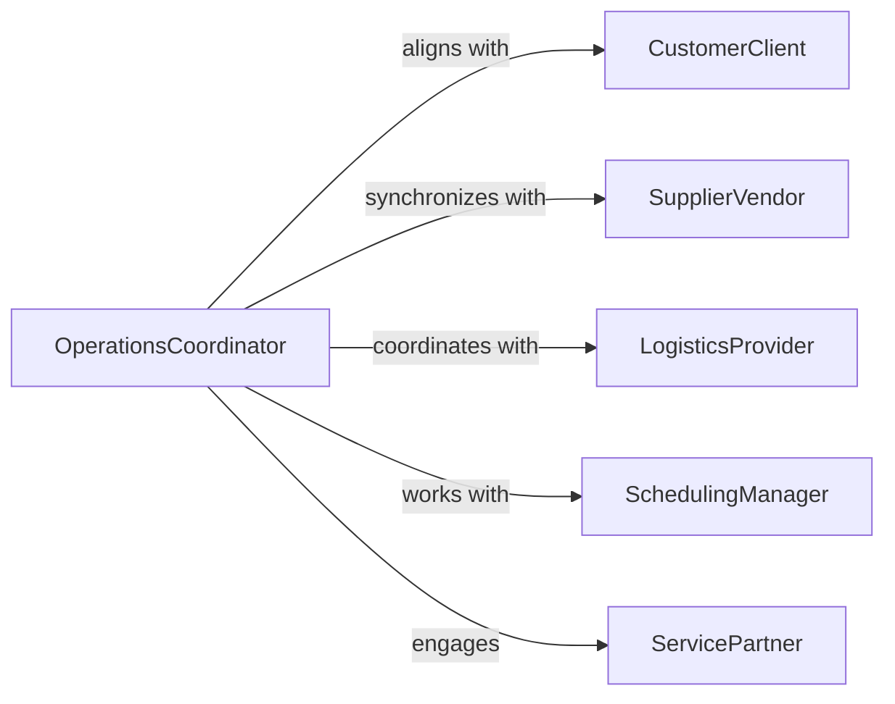

# Coordinate Operational Activities External Stakeholder

> Business-as-Code definition for synchronizing operational activities with external stakeholders including customers, suppliers, partners, and service providers. Models activity coordination, schedule alignment, and operational handoffs.

## Overview

External stakeholder coordination involves aligning operational activities, schedules, and resources with parties outside the organization to ensure smooth execution of interdependent work. This definition provides actions for planning joint activities, synchronizing timelines, and managing operational interfaces with external parties.

## Actors

| Actor | Description |
|-------|-------------|
| CustomerClient | End recipient of products or services requiring coordination |
| SupplierVendor | Provides materials or services on coordinated schedule |
| LogisticsProvider | Manages transportation and delivery coordination |
| ServicePartner | Delivers complementary services requiring synchronization |
| ContractorSubcontractor | Performs work requiring operational alignment |
| RegulatoryInspector | Conducts reviews requiring scheduling coordination |

## Roles

| Role | Description |
|------|-------------|
| OperationsCoordinator | Manages external stakeholder activity alignment |
| SchedulingManager | Synchronizes timelines across organizations |
| StakeholderLiaison | Facilitates communication with external parties |
| ActivityPlanner | Designs coordinated operational workflows |

## Entities

| Entity | Description |
|--------|-------------|
| CoordinatedActivity | Operational task requiring external stakeholder alignment |
| ActivitySchedule | Timeline for interdependent operations |
| StakeholderCommitment | Agreement from external party on activity participation |
| OperationalHandoff | Transfer of responsibility or materials between organizations |
| CoordinationMeeting | Session to align stakeholder activities |
| ActivityDependency | Relationship between operations requiring synchronization |

## Actions

| Action | Description |
|--------|-------------|
| planCoordinatedActivities | Design operations requiring external stakeholder alignment |
| synchronizeSchedules | Align timelines across organizations |
| confirmStakeholderCommitments | Secure agreements on participation and timing |
| executeOperationalHandoff | Transfer responsibility or materials to external party |
| monitorActivityProgress | Track execution of coordinated operations |
| adjustCoordination | Modify plans based on stakeholder changes or delays |
| resolveCoordinationIssues | Address conflicts or misalignments in joint activities |

## Events

| Event | Description |
|-------|-------------|
| coordinatedActivitiesPlanned | Operations requiring alignment have been designed |
| schedulesynchronized | Timelines have been aligned across organizations |
| stakeholderCommitmentsConfirmed | Agreements on participation have been secured |
| operationalHandoffExecuted | Responsibility or materials have been transferred |
| activityProgressMonitored | Execution of coordinated operations has been tracked |
| coordinationAdjusted | Plans have been modified based on changes |
| coordinationIssuesResolved | Conflicts in joint activities have been addressed |

## Searches

| Search | Description |
|--------|-------------|
| findCoordinatedActivities | List operations requiring external alignment by stakeholder |
| getActivityDependencies | Retrieve relationships requiring synchronization |
| getPendingCommitments | Find stakeholder agreements awaiting confirmation |
| getUpcomingHandoffs | List scheduled transfers of responsibility or materials |
| getCoordinationIssues | Retrieve conflicts or misalignments requiring resolution |


## Entity Relationships



## State Diagram



## Workflow



## Actor Relationships



## Usage

### Calling Actions

```typescript
import { coordinateOperationalActivitiesExternalStakeholder } from '@headlessly/coordinate-operational-activities-external-stakeholders'

const coordination = coordinateOperationalActivitiesExternalStakeholder()

// Plan coordinated activities with multiple stakeholders
const activityPlan = await coordination.planCoordinatedActivities({
  projectId: 'manufacturing-line-upgrade',
  activities: [
    {
      activity: 'Equipment delivery and installation',
      stakeholders: ['equipment-vendor-XYZ', 'contractor-installation-pros'],
      dependencies: ['Site preparation complete', 'Power infrastructure upgraded'],
      estimatedDuration: '5 days'
    },
    {
      activity: 'Production line commissioning',
      stakeholders: ['equipment-vendor-XYZ', 'operations-team'],
      dependencies: ['Equipment installation complete', 'Operators trained'],
      estimatedDuration: '3 days'
    },
    {
      activity: 'Final inspection and approval',
      stakeholders: ['regulatory-inspector', 'quality-assurance-team'],
      dependencies: ['Commissioning complete', 'Safety procedures documented'],
      estimatedDuration: '1 day'
    }
  ]
})

// Synchronize schedules across stakeholders
const schedule = await coordination.synchronizeSchedules({
  activityPlanId: activityPlan.id,
  proposedSchedule: [
    {
      activity: 'Equipment delivery',
      proposedDate: '2026-03-15',
      stakeholderAvailability: {
        'equipment-vendor-XYZ': { available: true, constraints: 'Must deliver Mon-Thu' },
        'contractor-installation-pros': { available: true, constraints: 'Need 48hr notice' }
      }
    },
    {
      activity: 'Installation work',
      proposedDates: { start: '2026-03-16', end: '2026-03-20' },
      stakeholderAvailability: {
        'contractor-installation-pros': { available: true, crewSize: 4 },
        'operations-team': { available: true, note: 'Liaison assigned for coordination' }
      }
    }
  ],
  coordinationMeetings: [
    { date: '2026-03-14', participants: 'All stakeholders', purpose: 'Pre-delivery kickoff' },
    { date: '2026-03-19', participants: 'All stakeholders', purpose: 'Mid-installation checkpoint' }
  ]
})

// Confirm stakeholder commitments
await coordination.confirmStakeholderCommitments({
  scheduleId: schedule.id,
  commitments: [
    {
      stakeholder: 'equipment-vendor-XYZ',
      committedActivities: ['Equipment delivery', 'Installation supervision', 'Commissioning support'],
      resources: ['2 field service engineers', 'Startup kit and spare parts'],
      confirmationDate: '2026-02-20',
      confirmedBy: 'vendor-project-manager@xyz.com'
    },
    {
      stakeholder: 'contractor-installation-pros',
      committedActivities: ['Rigging and positioning', 'Mechanical installation', 'Electrical connections'],
      resources: ['4-person installation crew', 'Rigging equipment', 'Tools and consumables'],
      confirmationDate: '2026-02-22',
      confirmedBy: 'contractor-foreman@installpros.com'
    }
  ]
})

// Monitor activity progress
await coordination.monitorActivityProgress({
  scheduleId: schedule.id,
  progressUpdate: {
    date: '2026-03-18',
    completedActivities: ['Equipment delivery', 'Initial positioning'],
    inProgressActivities: ['Mechanical installation - 60% complete'],
    upcomingActivities: ['Electrical connections - starting 3/19'],
    issues: [
      {
        issue: 'Anchor bolts 2 inches off specification location',
        impact: 'Requires custom mounting plates',
        proposedResolution: 'Vendor fabricating plates, delivery 3/19 AM',
        affectedStakeholders: ['equipment-vendor-XYZ', 'contractor-installation-pros']
      }
    ]
  }
})

// Adjust coordination due to issue
await coordination.adjustCoordination({
  scheduleId: schedule.id,
  adjustments: {
    reason: 'Anchor bolt misalignment requires custom mounting plates',
    scheduleChanges: [
      { activity: 'Mechanical installation', newEndDate: '2026-03-21', delay: '1 day' },
      { activity: 'Commissioning', newStartDate: '2026-03-22', delay: '1 day' }
    ],
    notifyStakeholders: true,
    revisedMeetingNeeded: false
  }
})

// Execute operational handoff
await coordination.executeOperationalHandoff({
  activityId: 'commissioning-complete',
  handoffType: 'responsibility-transfer',
  fromStakeholder: 'equipment-vendor-XYZ',
  toStakeholder: 'operations-team',
  handoffDeliverables: {
    documentation: ['Operations manual', 'Maintenance procedures', 'As-built drawings'],
    training: 'Operator training completed - 12 staff certified',
    warranties: 'Equipment warranty in effect through 2027-03-22',
    acceptanceSignoff: {
      acceptedBy: 'operations-manager-789',
      acceptanceDate: '2026-03-23',
      conditions: 'All performance tests passed, staff trained, documentation complete'
    }
  }
})
```

### Event-Driven Automation

```typescript
// Auto-send reminders before coordination meetings
coordination.schedulessynchronized(async ({ scheduleId, coordinationMeetings }) => {
  for (const meeting of coordinationMeetings) {
    const meetingDate = new Date(meeting.date)
    const reminderDate = new Date(meetingDate)
    reminderDate.setDate(reminderDate.getDate() - 2) // 2 days before

    setTimeout(async () => {
      await sendMeetingReminder({
        scheduleId,
        meeting,
        recipients: meeting.participants,
        message: `Coordination meeting in 2 days: ${meeting.purpose}`
      })
    }, reminderDate - new Date())
  }
})

// Escalate when stakeholder commitments are not confirmed
coordination.coordinatedActivitiesPlanned(async ({ activityPlanId, activities }) => {
  const stakeholders = [...new Set(activities.flatMap(a => a.stakeholders))]

  setTimeout(async () => {
    const unconfirmed = await getUnconfirmedCommitments(activityPlanId)
    if (unconfirmed.length > 0) {
      await escalateToManagement({
        activityPlanId,
        issue: `${unconfirmed.length} stakeholders have not confirmed commitments`,
        stakeholders: unconfirmed,
        requestFollowup: true
      })
    }
  }, 7 * 24 * 60 * 60 * 1000) // 7 days after planning
})

// Notify all stakeholders when schedule adjustments occur
coordination.coordinationAdjusted(async ({ scheduleId, adjustments }) => {
  if (adjustments.notifyStakeholders) {
    await notifyAllStakeholders({
      scheduleId,
      message: `Schedule adjustment: ${adjustments.reason}`,
      changes: adjustments.scheduleChanges,
      requestAcknowledgment: true
    })
  }
})
```
