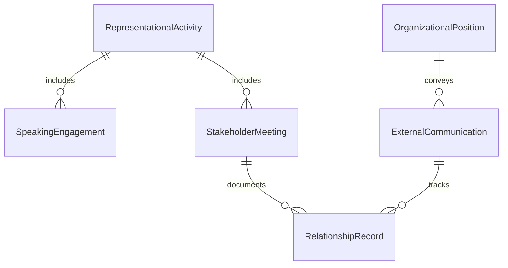
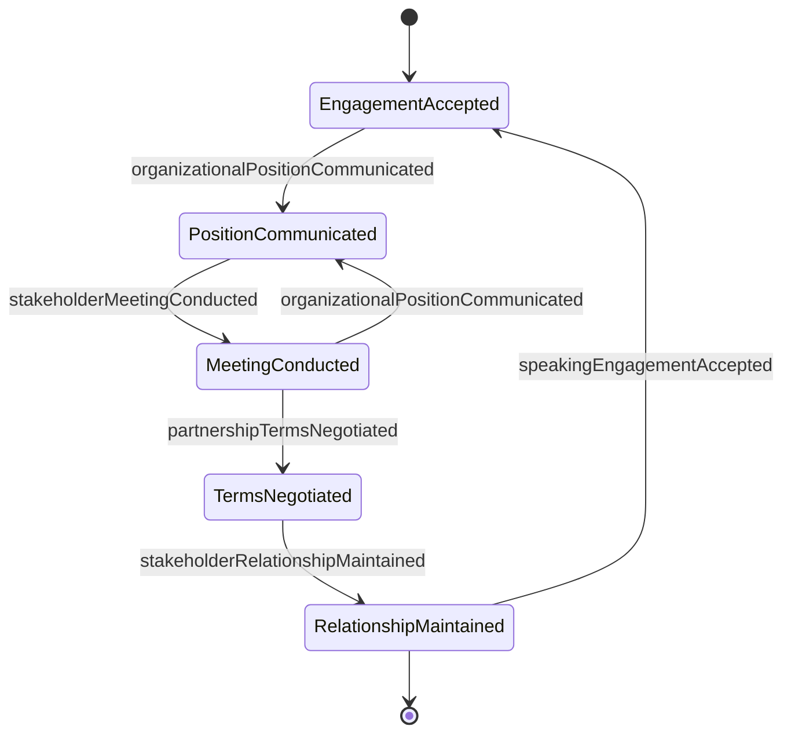
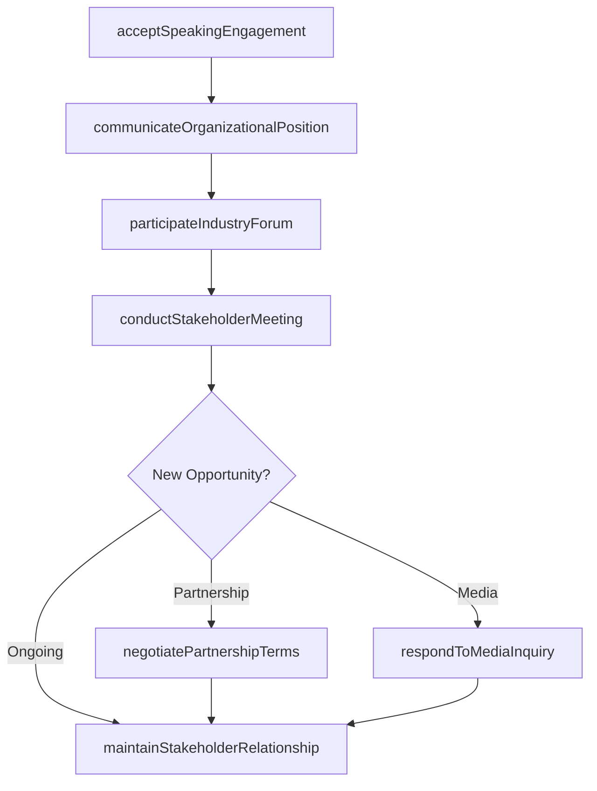
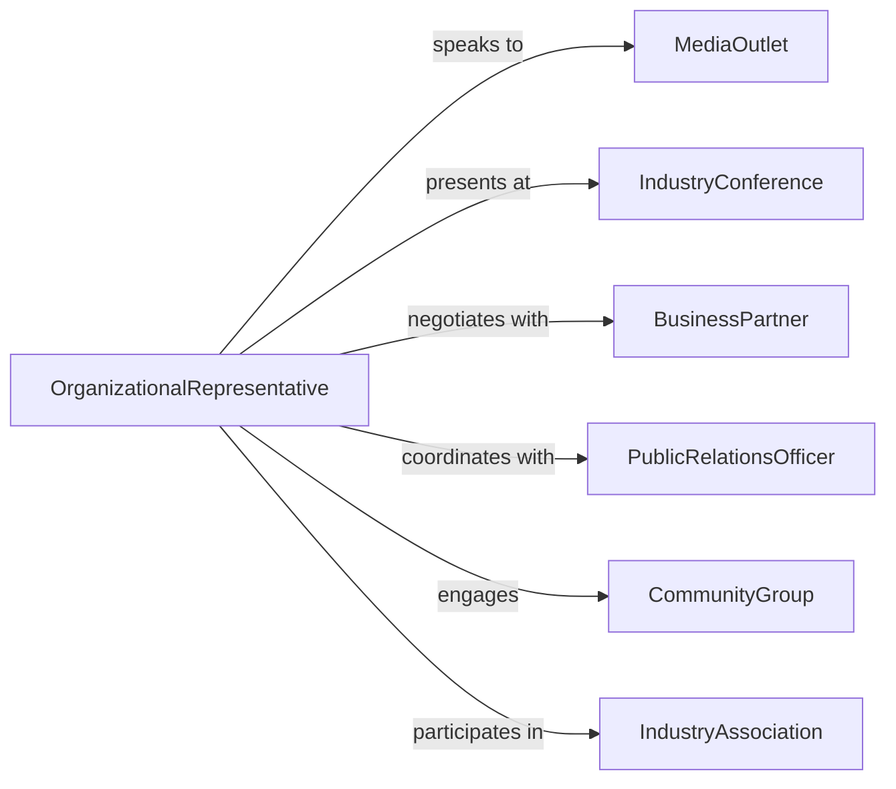

# Represent Organization External Relations

> Business-as-Code definition for serving as official organizational representative in external engagements, partnerships, and public-facing interactions. Models spokesperson activities, institutional representation, and stakeholder relationship management.

## Overview

Organizational representation involves serving as the official voice and face of the institution in external forums, negotiations, partnerships, and public events. This definition provides actions for managing speaking engagements, conducting official meetings, maintaining stakeholder relationships, and communicating organizational positions to external audiences.

## Actors

| Actor | Description |
|-------|-------------|
| MediaOutlet | News organization seeking organizational comment or information |
| IndustryConference | Professional event inviting organizational participation |
| BusinessPartner | Company engaging in strategic relationship discussions |
| CommunityGroup | Local organization seeking organizational involvement |
| IndustryAssociation | Professional body where organization holds membership |
| GovernmentOfficial | Public sector representative engaging organization |

## Roles

| Role | Description |
|------|-------------|
| OrganizationalRepresentative | Serves as official spokesperson for institution |
| PublicRelationsOfficer | Manages media and public communications |
| BusinessDevelopmentExecutive | Represents organization in partnership discussions |
| CommunityRelationsManager | Engages with local stakeholders and groups |

## Entities

| Entity | Description |
|--------|-------------|
| SpeakingEngagement | Invitation to represent organization at external event |
| StakeholderMeeting | Official session with external party |
| OrganizationalPosition | Official stance on issue or topic |
| ExternalCommunication | Message delivered to external audience |
| RelationshipRecord | Documentation of ongoing stakeholder engagement |
| RepresentationalActivity | Any action taken as organizational representative |

## Actions

| Action | Description |
|--------|-------------|
| acceptSpeakingEngagement | Agree to represent organization at external event |
| conductStakeholderMeeting | Hold official session with external party |
| communicateOrganizationalPosition | Deliver official stance to external audience |
| negotiatePartnershipTerms | Discuss strategic relationship on behalf of organization |
| participateIndustryForum | Engage in professional or trade association activities |
| respondToMediaInquiry | Provide official comment to news organization |
| maintainStakeholderRelationship | Nurture ongoing external partnership or connection |

## Events

| Event | Description |
|-------|-------------|
| speakingEngagementAccepted | Agreement to represent organization at event confirmed |
| stakeholderMeetingConducted | Official session with external party completed |
| organizationalPositionCommunicated | Official stance delivered to external audience |
| partnershipTermsNegotiated | Strategic relationship discussion conducted |
| industryForumParticipated | Professional association activity completed |
| mediaInquiryResponded | Official comment provided to news organization |
| stakeholderRelationshipMaintained | Ongoing external connection nurtured |

## Searches

| Search | Description |
|--------|-------------|
| findUpcomingEngagements | List scheduled representational activities |
| getStakeholderInteractions | Retrieve history of external party engagement |
| getOrganizationalPositions | Find official stances by topic or issue |
| getMediaCommunications | Retrieve public statements and press interactions |
| getPartnershipDiscussions | Find records of strategic relationship negotiations |


## Entity Relationships



## State Diagram



## Workflow



## Actor Relationships



## Usage

### Calling Actions

```typescript
import { representOrganizationExternalRelations } from '@headlessly/represent-organization-external-relations'

const representation = representOrganizationExternalRelations()

// Accept speaking engagement at industry conference
const engagement = await representation.acceptSpeakingEngagement({
  invitingOrganization: 'National Manufacturing Association',
  eventName: 'Advanced Manufacturing Summit 2026',
  eventDate: '2026-05-15',
  eventLocation: 'Chicago Convention Center',
  speakingRole: 'Keynote Speaker',
  topic: 'Digital Transformation in Modern Manufacturing',
  audienceSize: 800,
  duration: '45 minutes plus 15 minutes Q&A',
  representativeId: 'ceo-12345',
  preparation: {
    talkingPoints: ['Industry 4.0 implementation', 'Workforce development', 'Sustainability'],
    coordinateWith: 'communications-team',
    rehearsal: 'Scheduled for 2026-05-10'
  }
})

// Conduct stakeholder meeting with potential partner
const meeting = await representation.conductStakeholderMeeting({
  stakeholder: 'TechPartner Solutions Inc',
  stakeholderType: 'potential-business-partner',
  meetingDate: '2026-03-05',
  meetingType: 'partnership-exploration',
  participants: [
    { name: 'CEO', organization: 'our-organization', role: 'organizational-representative' },
    { name: 'CFO', organization: 'our-organization', role: 'financial-advisor' },
    { name: 'CEO', organization: 'TechPartner Solutions', role: 'stakeholder-representative' },
    { name: 'VP Business Development', organization: 'TechPartner Solutions', role: 'stakeholder-contact' }
  ],
  agenda: [
    'Company introductions and strategic objectives',
    'Technology platform capabilities demonstration',
    'Potential integration and partnership models',
    'Next steps and timeline'
  ],
  outcomes: {
    keyTakeaways: [
      'Strong alignment on market opportunity',
      'Technical compatibility confirmed',
      'Mutual interest in joint go-to-market strategy'
    ],
    followUpActions: [
      'Technical teams to conduct integration assessment',
      'Legal teams to draft preliminary term sheet',
      'Schedule follow-up meeting in 3 weeks'
    ]
  }
})

// Communicate organizational position on industry issue
await representation.communicateOrganizationalPosition({
  issue: 'Proposed tariffs on imported steel',
  audience: 'Trade policy stakeholders',
  communicationChannel: 'Written testimony to Senate committee',
  position: {
    stance: 'Opposed to proposed tariffs',
    rationale: [
      'Would increase manufacturing costs by estimated 18%',
      'Limited domestic supply cannot meet production demand',
      'Could force production offshore, reducing US employment'
    ],
    recommendations: [
      'Implement targeted exemption process for manufacturers',
      'Invest in domestic steel production capacity',
      'Negotiate bilateral trade agreements instead of broad tariffs'
    ]
  },
  approvedBy: 'board-of-directors',
  deliveredBy: 'ceo-12345',
  deliveryDate: '2026-03-12'
})

// Negotiate partnership terms
await representation.negotiatePartnershipTerms({
  partner: 'TechPartner Solutions Inc',
  partnershipType: 'Strategic technology alliance',
  negotiationRound: 2,
  termsDiscussed: [
    {
      term: 'Revenue sharing',
      ourProposal: '60/40 split on co-sold solutions',
      partnerProposal: '50/50 split',
      negotiationStatus: 'In discussion - proposing 55/45 compromise'
    },
    {
      term: 'Intellectual property',
      ourProposal: 'Joint ownership of integrated technology, separate ownership of core IP',
      partnerProposal: 'Agreed',
      negotiationStatus: 'Agreed in principle'
    },
    {
      term: 'Exclusivity',
      ourProposal: 'Non-exclusive, freedom to partner with others',
      partnerProposal: 'Exclusive for 2 years in manufacturing vertical',
      negotiationStatus: 'Significant gap - requires executive discussion'
    }
  ],
  nextSteps: [
    'Legal teams to draft term sheet based on agreed points',
    'Executive meeting to resolve exclusivity issue',
    'Target signature date: 2026-04-30'
  ]
})

// Respond to media inquiry
await representation.respondToMediaInquiry({
  mediaOutlet: 'Wall Street Journal',
  reporter: 'Jane Smith, Technology Correspondent',
  inquiryDate: '2026-03-10',
  inquiryTopic: 'Company expansion plans and job creation',
  deadline: '2026-03-11T17:00:00Z',
  response: {
    officialStatement: 'We are pleased to announce a $50M investment in our Midwest manufacturing facility, creating 200 new skilled jobs over the next 18 months. This expansion reflects strong customer demand and our commitment to American manufacturing.',
    backgroundInformation: {
      projectDetails: 'New 100,000 sq ft facility addition with advanced automation',
      jobTypes: 'CNC machinists, robotics technicians, quality engineers, production supervisors',
      timeline: 'Construction begins Q2 2026, full operation by Q4 2027'
    },
    spokespersonAvailable: true,
    interviewScheduled: '2026-03-11T14:00:00Z'
  },
  approvedBy: 'communications-director-456',
  respondedDate: '2026-03-10T16:30:00Z'
})

// Maintain ongoing stakeholder relationship
await representation.maintainStakeholderRelationship({
  stakeholder: 'Midwest Manufacturing Council',
  relationshipType: 'Industry association membership',
  engagementActivities: [
    {
      activity: 'Quarterly board meeting attendance',
      date: '2026-03-20',
      representative: 'vp-operations-789',
      topics: ['Regional workforce development', 'Supply chain challenges']
    },
    {
      activity: 'Annual conference sponsorship',
      level: 'Platinum sponsor',
      amount: 25000,
      benefits: ['Keynote speaking slot', 'Exhibit booth', 'Logo placement']
    },
    {
      activity: 'Workforce development committee participation',
      frequency: 'Monthly',
      representative: 'hr-director-111',
      contribution: 'Apprenticeship program best practices'
    }
  ]
})
```

### Event-Driven Automation

```typescript
// Auto-prepare briefing materials before stakeholder meetings
representation.stakeholderMeetingConducted(async ({ stakeholder, meetingDate, meetingType }) => {
  const daysUntilMeeting = (new Date(meetingDate) - new Date()) / (1000 * 60 * 60 * 24)

  if (daysUntilMeeting <= 7 && daysUntilMeeting > 0) {
    await generateBriefingMaterials({
      stakeholder,
      meetingType,
      includeSections: [
        'Stakeholder background and relationship history',
        'Recent interactions and outcomes',
        'Organizational priorities relevant to meeting',
        'Potential discussion topics and talking points'
      ],
      deliverTo: 'organizational-representative'
    })
  }
})

// Track media coverage from inquiries
representation.mediaInquiryResponded(async ({ mediaOutlet, inquiryTopic, response }) => {
  await trackMediaCoverage({
    outlet: mediaOutlet,
    topic: inquiryTopic,
    responseProvided: response.officialStatement,
    monitorForPublication: true,
    notifyWhenPublished: 'communications-team'
  })
})

// Alert executive team when partnership negotiations reach key milestones
representation.partnershipTermsNegotiated(async ({ partner, termsDiscussed, nextSteps }) => {
  const significantGaps = termsDiscussed.filter(term =>
    term.negotiationStatus.includes('gap') || term.negotiationStatus.includes('unresolved')
  )

  if (significantGaps.length > 0) {
    await notifyExecutiveTeam({
      priority: 'high',
      subject: `Partnership negotiation with ${partner} requires executive attention`,
      unresolvedIssues: significantGaps,
      recommendedAction: 'Executive discussion needed',
      proposedMeetingDate: nextSteps.find(step => step.includes('executive'))
    })
  }
})
```
