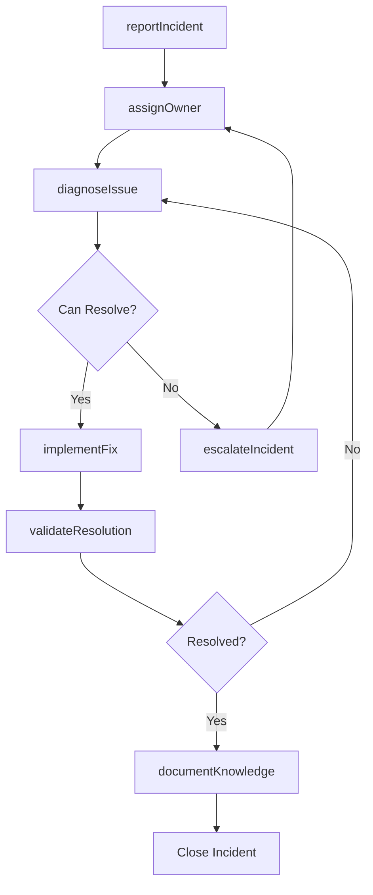

# Collaborate Others Resolve Information Technology

> Business-as-Code definition for collaborative IT issue resolution. Models the complete problem-solving lifecycle from incident detection through resolution and post-mortem.

## Overview

IT issue collaboration involves coordinating troubleshooting, escalation, and resolution activities among technical teams, vendors, and stakeholders. This definition exposes actions for incident management, events for workflow automation, and searches for tracking issues and knowledge.

## Actors

| Actor | Description |
|-------|-------------|
| End User | Reports IT issues and receives support |
| Vendor Support | Provides specialized technical assistance |
| Infrastructure Team | Manages servers, network, and hardware |
| Application Team | Maintains software systems and integrations |
| Security Team | Addresses cybersecurity and compliance issues |
| Management | Receives updates on critical IT incidents |

## Roles

| Role | Description |
|------|-------------|
| Incident Manager | Coordinates cross-team issue resolution |
| Technical Lead | Provides expertise and guides troubleshooting |
| Support Engineer | Diagnoses and resolves technical problems |
| Subject Matter Expert | Offers specialized knowledge for complex issues |

## Entities

| Entity | Description |
|--------|-------------|
| Incident | Reported IT problem requiring resolution |
| Ticket | Tracked record of issue and resolution activities |
| Escalation | Transfer of issue to higher expertise level |
| Resolution | Solution or workaround that resolves incident |
| RootCause | Underlying reason for IT issue occurrence |
| KnowledgeArticle | Documented solution for future reference |

## Actions

| Action | Description |
|--------|-------------|
| reportIncident | Document and submit IT issue for resolution |
| assignOwner | Designate responsible party for incident |
| diagnoseIssue | Investigate and identify problem cause |
| escalateIncident | Transfer issue to higher expertise or priority |
| implementFix | Apply solution or workaround to resolve issue |
| validateResolution | Confirm issue is resolved and user satisfied |
| documentKnowledge | Record solution for future reference |

## Events

| Event | Description |
|-------|-------------|
| incidentReported | IT issue has been documented and submitted |
| ownerAssigned | Responsible party has been designated |
| issueDiagnosed | Problem cause has been identified |
| incidentEscalated | Issue has been transferred to higher level |
| fixImplemented | Solution has been applied |
| resolutionValidated | Issue resolution has been confirmed |
| knowledgeDocumented | Solution has been recorded for reference |

## Searches

| Search | Description |
|--------|-------------|
| findIncidents | List IT issues by status, severity, or team |
| getEscalations | Retrieve incidents transferred to higher levels |
| getResolutions | Find solutions by incident type or component |
| getKnowledge | Search documented solutions by keywords |

## Workflow



## Actor Relationships

```mermaid
graph LR
    IM[Incident Manager]

    IM -->|coordinates with| End User
    IM -->|engages| Vendor Support
    IM -->|assigns to| Infrastructure Team
    IM -->|collaborates with| Application Team
    IM -->|escalates to| Security Team
```

## Usage

### Calling Actions

```typescript
import { collaborateOthersResolveInformationTechnology } from '@headlessly/collaborate-others-resolve-information-technology'

const itIssues = collaborateOthersResolveInformationTechnology()

// Report and assign critical incident
const incident = await itIssues.reportIncident({
  title: 'Production database connection failures',
  severity: 'critical',
  reporter: 'user-123',
  description: 'Application unable to connect to production database since 14:30',
  impactedUsers: 450,
  impactedSystems: ['customer-portal', 'order-processing']
})

await itIssues.assignOwner({
  incidentId: incident.id,
  owner: { team: 'infrastructure', engineer: 'eng-456' },
  priority: 'P1'
})

// Diagnose and escalate if needed
const diagnosis = await itIssues.diagnoseIssue({
  incidentId: incident.id,
  findings: {
    component: 'database-cluster',
    symptoms: ['connection timeout', 'high CPU utilization'],
    suspectedCause: 'resource exhaustion'
  }
})

if (diagnosis.complexity === 'high') {
  await itIssues.escalateIncident({
    incidentId: incident.id,
    escalateTo: { team: 'database-administration', level: 'senior' },
    reason: 'Requires advanced database troubleshooting'
  })
}

// Implement fix and validate
await itIssues.implementFix({
  incidentId: incident.id,
  solution: {
    type: 'configuration_change',
    actions: ['Increased connection pool size', 'Restarted database nodes'],
    implementedBy: 'dba-789'
  }
})

const validation = await itIssues.validateResolution({
  incidentId: incident.id,
  tests: ['connection_test', 'load_test'],
  userConfirmation: true
})

// Document knowledge
await itIssues.documentKnowledge({
  incidentId: incident.id,
  article: {
    title: 'Database Connection Pool Exhaustion',
    symptoms: diagnosis.findings.symptoms,
    rootCause: 'Insufficient connection pool configuration',
    resolution: 'Increase max pool size to 200 connections',
    prevention: 'Monitor connection pool utilization'
  }
})
```

### Event-Driven Automation

```typescript
// Auto-escalate critical incidents without progress
itIssues.ownerAssigned(async ({ incidentId, severity }) => {
  if (severity === 'critical' || severity === 'high') {
    await wait({ minutes: 30 })
    const status = await itIssues.findIncidents({ id: incidentId })
    if (status.state === 'open' && !status.diagnosis) {
      await itIssues.escalateIncident({
        incidentId,
        escalateTo: { level: 'manager' },
        reason: 'No progress after 30 minutes on high-severity incident'
      })
    }
  }
})

// Create knowledge articles from recurring issues
itIssues.resolutionValidated(async ({ incidentId, resolution }) => {
  const similar = await itIssues.findIncidents({
    symptomMatch: resolution.symptoms,
    last: '30 days'
  })
  if (similar.length >= 3) {
    await itIssues.documentKnowledge({
      incidentId,
      article: {
        title: `Recurring Issue: ${resolution.title}`,
        frequency: similar.length,
        impact: 'High recurrence rate requires permanent fix'
      }
    })
  }
})
```
