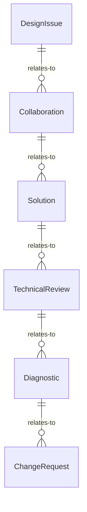
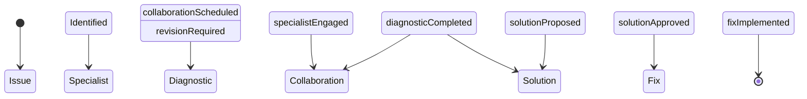
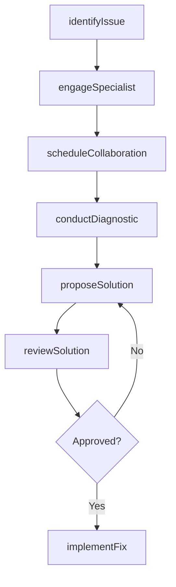
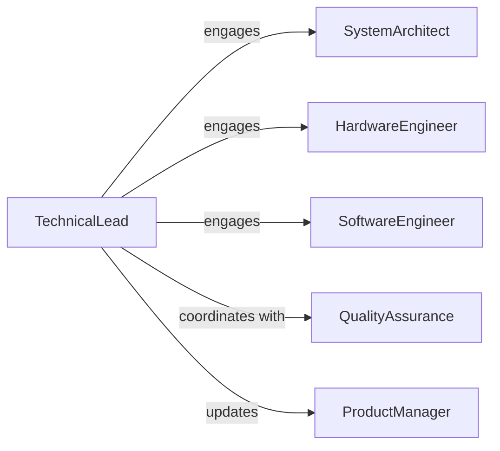

# Collaborate Technical Specialists Resolve Design

> Business-as-Code definition for collaborative technical problem resolution. Models the process of engaging specialists to diagnose and solve design or development challenges through structured collaboration.

## Overview

Technical collaboration involves identifying design obstacles, engaging subject matter experts, coordinating diagnostic sessions, and implementing validated solutions. This definition exposes actions for issue escalation, specialist engagement, and resolution tracking with events for workflow automation.

## Actors

| Actor | Description |
|-------|-------------|
| SystemArchitect | Provides architectural guidance and design patterns |
| HardwareEngineer | Addresses physical component and circuit design issues |
| SoftwareEngineer | Resolves code architecture and integration problems |
| QualityAssurance | Validates solutions against requirements and standards |
| ProductManager | Prioritizes resolution efforts based on business impact |
| Vendor | Supplies technical documentation and component support |

## Roles

| Role | Description |
|------|-------------|
| TechnicalLead | Coordinates specialist involvement and tracks resolution |
| Designer | Identifies design problems requiring specialist input |
| Specialist | Provides domain expertise for specific technical areas |
| Reviewer | Validates proposed solutions before implementation |

## Entities

| Entity | Description |
|--------|-------------|
| DesignIssue | A technical problem blocking development progress |
| Collaboration | A structured session involving multiple specialists |
| Solution | A proposed fix or design change |
| TechnicalReview | Formal evaluation of a proposed solution |
| Diagnostic | Analysis results from specialist investigation |
| ChangeRequest | Formal request to modify design specifications |

## Actions

| Action | Description |
|--------|-------------|
| identifyIssue | Document a design problem requiring specialist input |
| engageSpecialist | Request involvement from a technical expert |
| scheduleCollaboration | Organize a session for joint problem-solving |
| conductDiagnostic | Analyze the issue to determine root cause |
| proposeSolution | Submit a technical fix for review |
| reviewSolution | Evaluate proposed solution against requirements |
| implementFix | Apply the validated solution to the design |

## Events

| Event | Description |
|-------|-------------|
| issueIdentified | A design problem has been documented |
| specialistEngaged | Technical expert has been assigned to the issue |
| collaborationScheduled | Joint problem-solving session has been arranged |
| diagnosticCompleted | Root cause analysis is finished |
| solutionProposed | A fix has been submitted for review |
| solutionApproved | Proposed solution has passed validation |
| fixImplemented | Solution has been applied to the design |

## Searches

| Search | Description |
|--------|-------------|
| findIssues | List design problems by status, priority, or component |
| getCollaborations | Retrieve scheduled sessions by date or specialist |
| getSolutions | Find proposed fixes by issue or reviewer |
| getDiagnostics | Search analysis results by component or date |


## Entity Relationships



## State Diagram



## Workflow



## Actor Relationships



## Usage

### Calling Actions

```typescript
import { collaborateTechnicalSpecialistsResolveDesign } from '@headlessly/collaborate-technical-specialists-resolve-design'

const collaboration = collaborateTechnicalSpecialistsResolveDesign()

// Document a design issue
const issue = await collaboration.identifyIssue({
  title: 'Power supply instability under peak load',
  component: 'PSU-Module-B',
  severity: 'high',
  description: 'Voltage drops below 11.8V when CPU and GPU draw simultaneously'
})

// Engage hardware specialist
await collaboration.engageSpecialist({
  issueId: issue.id,
  specialistRole: 'HardwareEngineer',
  expertise: 'power-electronics'
})

// Schedule diagnostic session
const session = await collaboration.scheduleCollaboration({
  issueId: issue.id,
  participants: ['tech-lead', 'hw-specialist', 'qa-engineer'],
  scheduledFor: '2026-02-10T14:00:00Z'
})
```

### Event-Driven Automation

```typescript
// Auto-engage specialists based on issue type
collaboration.issueIdentified(async ({ issue }) => {
  if (issue.component.startsWith('PSU')) {
    await collaboration.engageSpecialist({
      issueId: issue.id,
      specialistRole: 'HardwareEngineer',
      expertise: 'power-electronics'
    })
  }
})

// Notify stakeholders when solution is approved
collaboration.solutionApproved(async ({ solution, issueId }) => {
  await notify({
    to: 'engineering-team',
    message: `Solution approved for ${issueId}: ${solution.summary}`
  })
})
```
