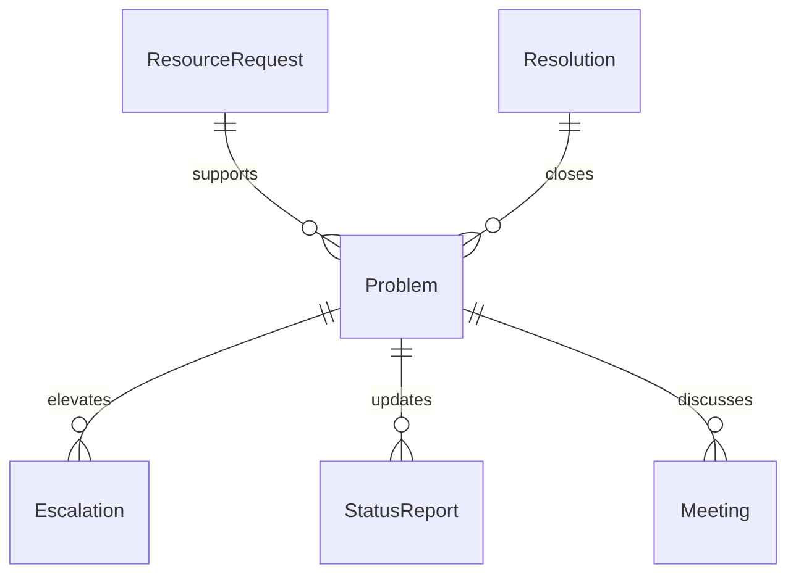
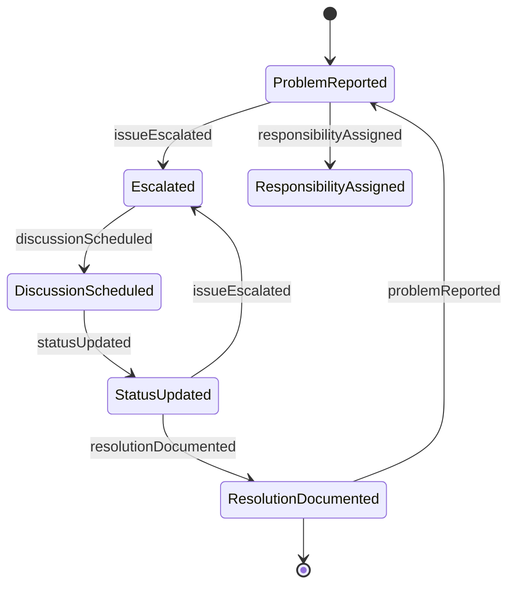
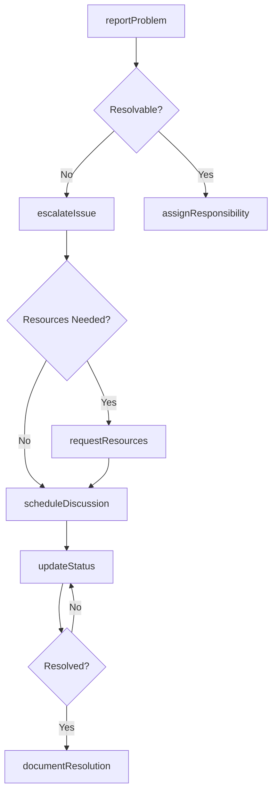
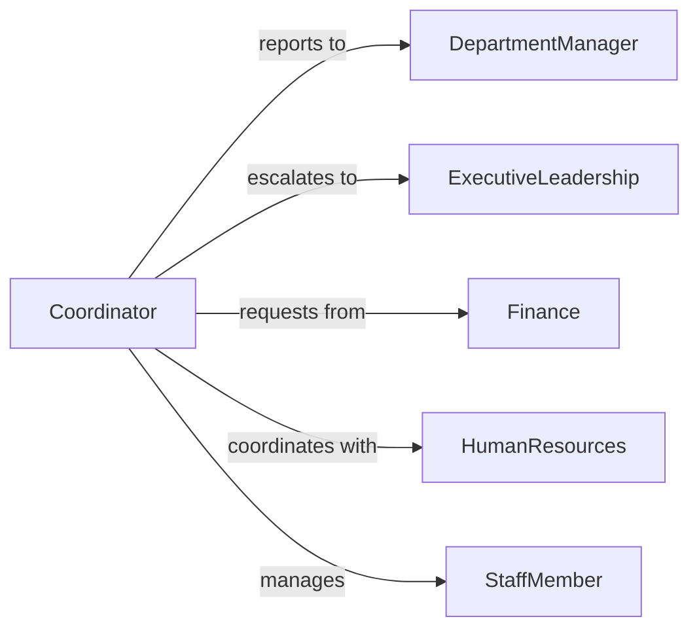

# Communicate Management Staff Resolve Problems

> Business-as-Code definition for management communication and problem escalation. Models the structured process of reporting issues to leadership, requesting resources, and coordinating cross-functional resolution efforts.

## Overview

Management communication for problem resolution involves identifying issues requiring leadership attention, preparing status reports, escalating roadblocks, and coordinating resources across departments. This definition exposes actions for escalation, status updates, and resource requests with events for notification and workflow automation.

## Actors

| Actor | Description |
|-------|-------------|
| ExecutiveLeadership | Makes strategic decisions on resource allocation |
| DepartmentManager | Oversees functional area resolution efforts |
| StaffMember | Reports problems and implements solutions |
| HumanResources | Addresses personnel-related issues |
| Finance | Approves budget-related resolution requests |
| Vendor | Provides external services or products |

## Roles

| Role | Description |
|------|-------------|
| ProblemReporter | Identifies and documents issues for management |
| Escalator | Elevates unresolved issues to higher authority |
| Coordinator | Aligns cross-functional resources for resolution |
| Approver | Authorizes resource allocation or priority changes |

## Entities

| Entity | Description |
|--------|-------------|
| Problem | An issue requiring management intervention |
| Escalation | Formal elevation of an issue to leadership |
| StatusReport | Communication documenting progress or blockers |
| ResourceRequest | Request for budget, personnel, or tools |
| Resolution | Documented outcome and actions taken |
| Meeting | Scheduled discussion with management or staff |

## Actions

| Action | Description |
|--------|-------------|
| reportProblem | Communicate an issue to management |
| escalateIssue | Elevate an unresolved problem to higher authority |
| requestResources | Ask for additional budget, staff, or tools |
| scheduleDiscussion | Arrange a meeting to address the problem |
| updateStatus | Provide progress report on resolution effort |
| documentResolution | Record the final outcome and actions taken |
| assignResponsibility | Delegate resolution tasks to staff members |

## Events

| Event | Description |
|-------|-------------|
| problemReported | An issue has been communicated to management |
| issueEscalated | Problem has been elevated to higher authority |
| resourcesRequested | Request for additional support has been submitted |
| discussionScheduled | Meeting with management has been arranged |
| statusUpdated | Progress report has been provided |
| resolutionDocumented | Final outcome has been recorded |
| responsibilityAssigned | Resolution task has been delegated |

## Searches

| Search | Description |
|--------|-------------|
| findProblems | List issues by department, status, or severity |
| getEscalations | Retrieve escalated items by date or approver |
| getStatusReports | Search progress updates by problem or date |
| getResourceRequests | Find pending requests by type or amount |


## Entity Relationships



## State Diagram



## Workflow



## Actor Relationships



## Usage

### Calling Actions

```typescript
import { communicateManagementStaffResolveProblems } from '@headlessly/communicate-management-staff-resolve-problems'

const communication = communicateManagementStaffResolveProblems()

// Report a problem to management
const problem = await communication.reportProblem({
  title: 'Production line 3 downtime exceeds SLA',
  department: 'Manufacturing',
  severity: 'high',
  impact: 'Daily output reduced by 40%, affecting Q1 delivery commitments',
  reportedBy: 'shift-supervisor'
})

// Escalate if not resolved within SLA
await communication.escalateIssue({
  problemId: problem.id,
  escalateTo: 'vp-operations',
  reason: 'No response after 4 hours, customer deliveries at risk'
})

// Request resources for resolution
await communication.requestResources({
  problemId: problem.id,
  resourceType: 'emergency-maintenance',
  estimatedCost: 15000,
  justification: 'Third-party technician required for hydraulic system repair'
})
```

### Event-Driven Automation

```typescript
// Auto-escalate high-severity problems after timeout
communication.problemReported(async ({ problem }) => {
  if (problem.severity === 'high') {
    setTimeout(async () => {
      const status = await communication.findProblems({ id: problem.id })
      if (status.resolution === null) {
        await communication.escalateIssue({
          problemId: problem.id,
          escalateTo: 'department-head',
          reason: 'Auto-escalation: 4-hour SLA exceeded'
        })
      }
    }, 4 * 60 * 60 * 1000)
  }
})

// Notify stakeholders on resource approval
communication.resourcesRequested(async ({ request }) => {
  await notify({
    to: 'finance-team',
    message: `Resource request pending approval: ${request.resourceType} - $${request.estimatedCost}`
  })
})
```
