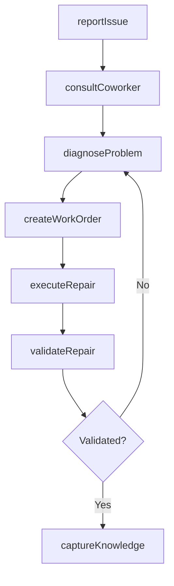
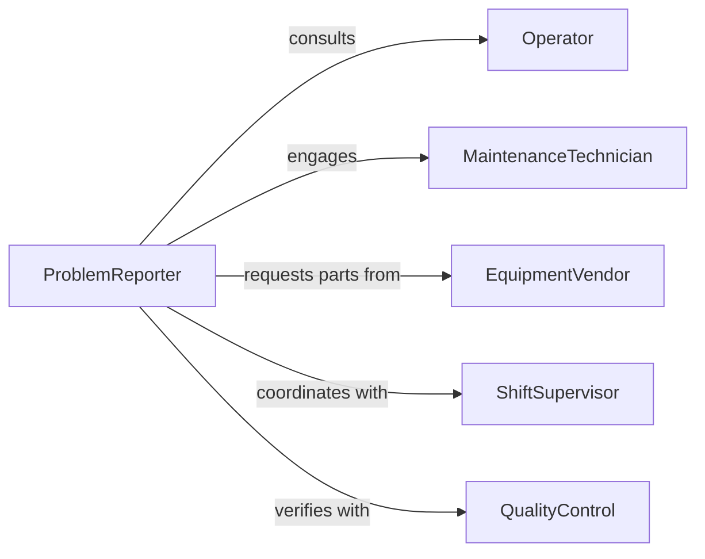

# Confer Coworkers Resolve Equipment Problems

> Business-as-Code definition for peer collaboration on equipment issues. Models the process of diagnosing machinery problems, consulting with operators and technicians, and coordinating repair efforts.

## Overview

Equipment problem resolution through peer collaboration involves identifying malfunctions, consulting with operators who know the equipment's behavior, engaging maintenance staff, and documenting solutions for future reference. This definition exposes actions for issue reporting, diagnostic collaboration, and knowledge capture.

## Actors

| Actor | Description |
|-------|-------------|
| Operator | Runs equipment daily and notices abnormal behavior |
| MaintenanceTechnician | Performs repairs and preventive maintenance |
| EquipmentVendor | Provides technical support and replacement parts |
| SafetyOfficer | Ensures compliance with safety protocols during repair |
| QualityControl | Verifies equipment performance after repair |
| ShiftSupervisor | Coordinates downtime and resource allocation |

## Roles

| Role | Description |
|------|-------------|
| ProblemReporter | Identifies and documents equipment malfunction |
| Diagnostician | Analyzes symptoms to determine root cause |
| Repairer | Executes maintenance or corrective actions |
| Verifier | Confirms equipment is functioning correctly post-repair |

## Entities

| Entity | Description |
|--------|-------------|
| EquipmentIssue | A malfunction or performance degradation |
| DiagnosticSession | Collaborative analysis with coworkers |
| WorkOrder | Formal request for maintenance or repair |
| RepairLog | Documentation of actions taken |
| KnowledgeEntry | Captured solution for future reference |
| PerformanceTest | Validation that equipment meets specifications |

## Actions

| Action | Description |
|--------|-------------|
| reportIssue | Document an equipment malfunction |
| consultCoworker | Engage a peer for diagnostic assistance |
| diagnoseProblem | Analyze symptoms to identify root cause |
| createWorkOrder | Generate formal repair request |
| executeRepair | Perform corrective maintenance |
| validateRepair | Test equipment to confirm resolution |
| captureKnowledge | Document solution for future reference |

## Events

| Event | Description |
|-------|-------------|
| issueReported | Equipment problem has been documented |
| coworkerConsulted | Peer has been engaged for assistance |
| problemDiagnosed | Root cause has been identified |
| workOrderCreated | Repair request has been generated |
| repairExecuted | Corrective action has been completed |
| repairValidated | Equipment has been tested and approved |
| knowledgeCaptured | Solution has been documented |

## Searches

| Search | Description |
|--------|-------------|
| findIssues | List equipment problems by machine, status, or date |
| getWorkOrders | Retrieve repair requests by technician or priority |
| getRepairLogs | Search maintenance history by equipment or date |
| getKnowledge | Find documented solutions by problem type |

## Workflow



## Actor Relationships



## Usage

### Calling Actions

```typescript
import { conferCoworkersResolveEquipmentProblems } from '@headlessly/confer-coworkers-resolve-equipment-problems'

const equipment = conferCoworkersResolveEquipmentProblems()

// Report an equipment issue
const issue = await equipment.reportIssue({
  equipmentId: 'CNC-Mill-07',
  symptoms: 'Spindle vibration above 0.5mm at 3000 RPM',
  reportedBy: 'operator-3',
  severity: 'medium',
  operatingHours: 12847
})

// Consult with experienced operator
await equipment.consultCoworker({
  issueId: issue.id,
  coworkerId: 'senior-operator-1',
  question: 'Have you seen vibration like this before on CNC-07?'
})

// Diagnose and create work order
const diagnosis = await equipment.diagnoseProblem({
  issueId: issue.id,
  findings: 'Likely worn spindle bearings based on vibration frequency',
  recommendedAction: 'Replace bearing assembly'
})

await equipment.createWorkOrder({
  issueId: issue.id,
  diagnosisId: diagnosis.id,
  parts: ['bearing-assy-3000', 'thermal-paste'],
  estimatedDuration: 4
})
```

### Event-Driven Automation

```typescript
// Auto-consult senior operator for recurring issues
equipment.issueReported(async ({ issue }) => {
  const history = await equipment.getRepairLogs({ equipmentId: issue.equipmentId })
  if (history.length >= 3) {
    await equipment.consultCoworker({
      issueId: issue.id,
      coworkerId: 'senior-technician',
      question: 'This machine has recurring issues - recommend full diagnostic?'
    })
  }
})

// Capture knowledge after successful repair
equipment.repairValidated(async ({ issueId, repairLog }) => {
  await equipment.captureKnowledge({
    issueId,
    solution: repairLog.actionsPerformed,
    tags: [repairLog.equipmentType, repairLog.problemCategory]
  })
})
```
