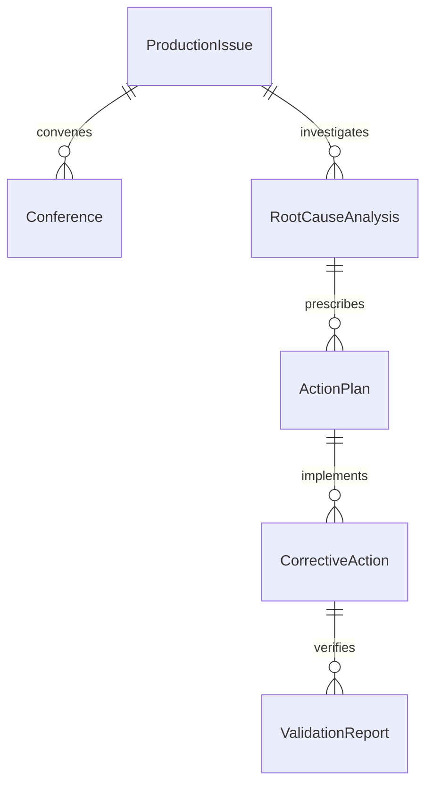
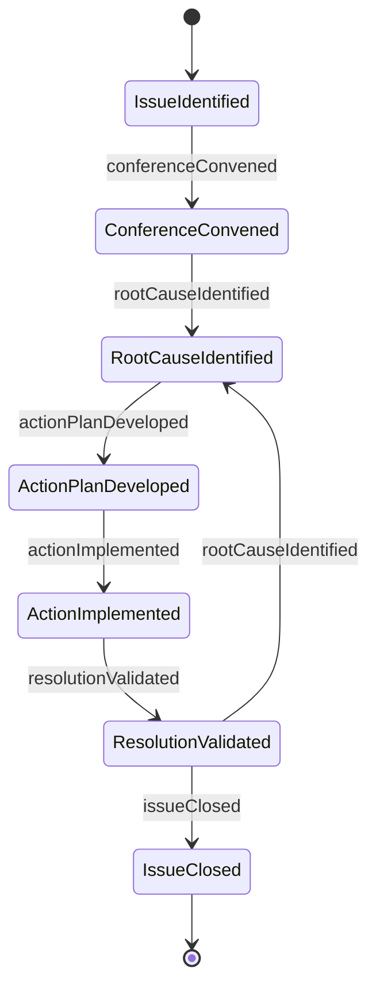
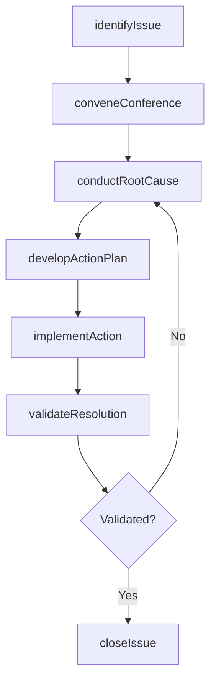
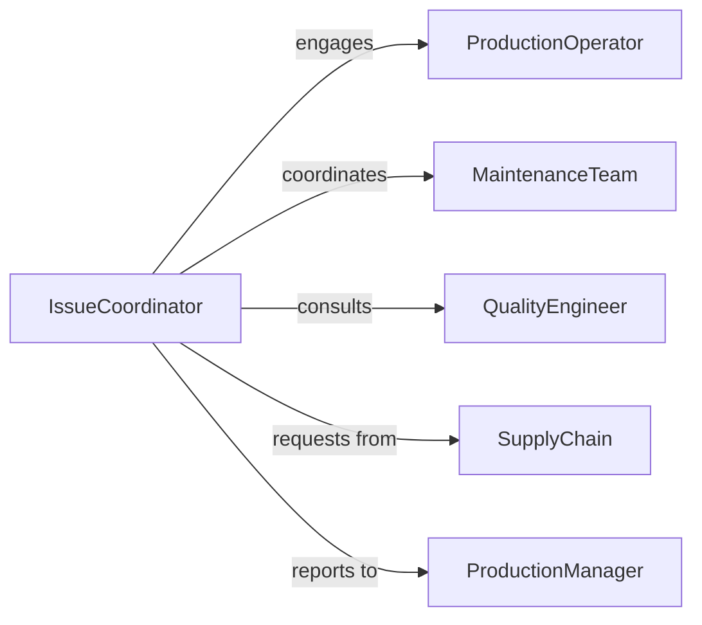

# Confer Others Resolve Production Problems

> Business-as-Code definition for collaborative production issue resolution. Models cross-functional coordination to diagnose manufacturing bottlenecks, equipment failures, and quality defects through structured problem-solving.

## Overview

Production problem resolution requires coordinating multiple stakeholders including line operators, quality inspectors, maintenance staff, and supply chain teams. This definition exposes actions for issue identification, collaborative root cause analysis, and coordinated remediation with events for real-time notification and escalation.

## Actors

| Actor | Description |
|-------|-------------|
| ProductionOperator | Identifies quality and throughput issues |
| MaintenanceTeam | Diagnoses and repairs equipment malfunctions |
| QualityEngineer | Analyzes defect patterns and compliance failures |
| SupplyChain | Addresses material availability and supplier issues |
| ProcessEngineer | Optimizes workflows and production parameters |
| ProductionManager | Coordinates resources and prioritizes resolution |

## Roles

| Role | Description |
|------|-------------|
| IssueCoordinator | Facilitates cross-functional problem-solving |
| RootCauseAnalyst | Investigates underlying causes of production issues |
| Implementer | Executes corrective actions |
| Validator | Confirms issue resolution and process stability |

## Entities

| Entity | Description |
|--------|-------------|
| ProductionIssue | A problem affecting output, quality, or efficiency |
| Conference | Structured meeting to resolve the issue |
| RootCauseAnalysis | Investigation findings and corrective actions |
| ActionPlan | Sequence of steps to resolve the issue |
| CorrectiveAction | Specific remedy implemented |
| ValidationReport | Documentation confirming resolution |

## Actions

| Action | Description |
|--------|-------------|
| identifyIssue | Document a production problem or equipment malfunction |
| conveneConference | Organize cross-functional problem-solving meeting |
| conductRootCause | Perform structured analysis to identify underlying cause |
| developActionPlan | Define steps to remediate the issue |
| implementAction | Execute corrective measures |
| validateResolution | Confirm the problem is fully resolved |
| closeIssue | Finalize documentation and update knowledge base |

## Events

| Event | Description |
|-------|-------------|
| issueIdentified | Production problem has been documented |
| conferenceConvened | Cross-functional meeting has been scheduled |
| rootCauseIdentified | Underlying cause has been determined |
| actionPlanDeveloped | Remediation steps have been defined |
| actionImplemented | Corrective measure has been executed |
| resolutionValidated | Problem has been confirmed resolved |
| issueClosed | Documentation complete and lessons captured |

## Searches

| Search | Description |
|--------|-------------|
| findIssues | List production problems by line, date, or type |
| getConferences | Retrieve meetings by participant or date |
| getRootCauseAnalyses | Search investigations by issue or analyst |
| getActionPlans | Find remediation plans by status or owner |


## Entity Relationships



## State Diagram



## Workflow



## Actor Relationships



## Usage

### Calling Actions

```typescript
import { conferOthersResolveProductionProblems } from '@headlessly/confer-others-resolve-production-problems'

const production = conferOthersResolveProductionProblems()

// Identify a production issue
const issue = await production.identifyIssue({
  productionLine: 'Line-B',
  problemType: 'quality-defect',
  description: 'Surface finish roughness exceeds 3.2 Ra on 15% of parts',
  impactedUnits: 47,
  detectedBy: 'qa-inspector-2'
})

// Convene cross-functional conference
const conference = await production.conveneConference({
  issueId: issue.id,
  participants: ['production-supervisor', 'quality-engineer', 'process-engineer', 'maintenance-lead'],
  scheduledFor: '2026-02-06T09:00:00Z',
  agenda: 'Root cause analysis for surface finish defects'
})

// Conduct root cause analysis
const rootCause = await production.conductRootCause({
  issueId: issue.id,
  method: '5-Whys',
  findings: 'Coolant contamination from improper filtration maintenance',
  contributingFactors: ['filter replacement overdue by 200 hours', 'coolant concentration at 4% vs. spec 6%']
})
```

### Event-Driven Automation

```typescript
// Auto-convene conference for high-impact issues
production.issueIdentified(async ({ issue }) => {
  if (issue.impactedUnits > 50 || issue.problemType === 'safety-hazard') {
    await production.conveneConference({
      issueId: issue.id,
      participants: ['production-manager', 'quality-head', 'safety-officer'],
      scheduledFor: new Date(Date.now() + 30 * 60 * 1000).toISOString(),
      priority: 'urgent'
    })
  }
})

// Notify stakeholders when resolution is validated
production.resolutionValidated(async ({ issueId, validationReport }) => {
  await notify({
    to: 'production-team',
    message: `Issue ${issueId} resolved: ${validationReport.summary}`
  })
})
```
