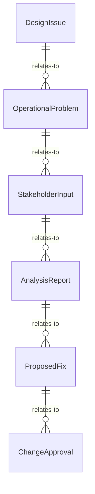
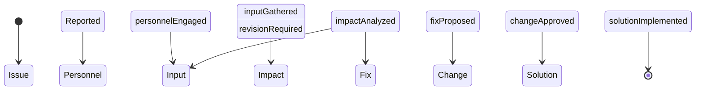
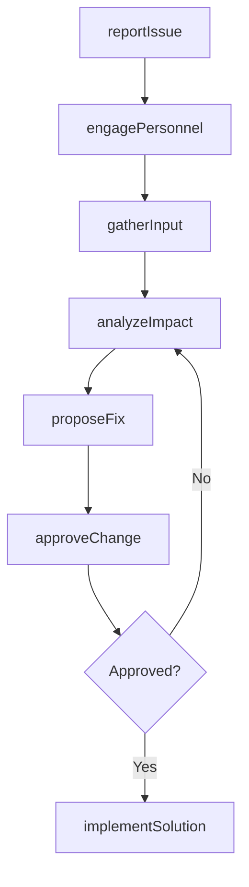
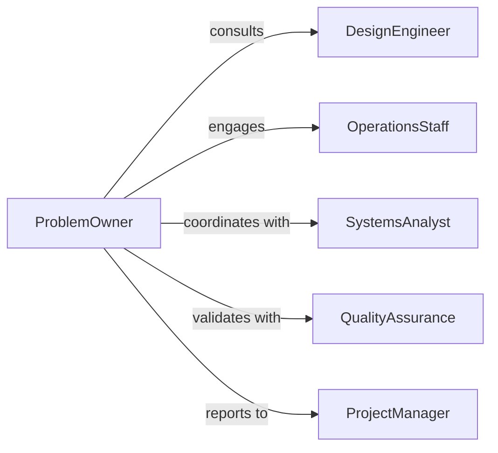

# Confer Personnel Resolve Design Operational

> Business-as-Code definition for cross-functional problem resolution in design and operations. Models the collaborative process of engaging engineers, operators, and managers to address system design flaws and operational inefficiencies.

## Overview

Resolving design and operational problems requires conferring with personnel across engineering, operations, and support functions. This definition exposes actions for issue identification, stakeholder engagement, collaborative analysis, and implementation of design changes or operational workarounds.

## Actors

| Actor | Description |
|-------|-------------|
| DesignEngineer | Addresses architectural and specification issues |
| OperationsStaff | Reports field problems and validates solutions |
| SystemsAnalyst | Evaluates impact of changes on integrated systems |
| QualityAssurance | Ensures solutions meet standards and requirements |
| ProjectManager | Prioritizes resolution efforts and tracks progress |
| EndUser | Provides feedback on operational impact |

## Roles

| Role | Description |
|------|-------------|
| ProblemOwner | Coordinates resolution across stakeholders |
| DesignReviewer | Evaluates technical feasibility of proposed fixes |
| OperationsLiaison | Ensures solutions are operationally practical |
| Approver | Authorizes design changes or operational adjustments |

## Entities

| Entity | Description |
|--------|-------------|
| DesignIssue | A flaw in system architecture or specifications |
| OperationalProblem | An inefficiency or failure in daily operations |
| StakeholderInput | Feedback from personnel on the issue |
| AnalysisReport | Collaborative investigation findings |
| ProposedFix | Design change or operational workaround |
| ChangeApproval | Authorization to implement the solution |

## Actions

| Action | Description |
|--------|-------------|
| reportIssue | Document a design or operational problem |
| engagePersonnel | Invite stakeholders to contribute to resolution |
| gatherInput | Collect feedback and requirements from personnel |
| analyzeImpact | Evaluate effects of the problem and proposed solutions |
| proposeFix | Submit design change or operational adjustment |
| approveChange | Authorize implementation of the solution |
| implementSolution | Execute the approved fix or workaround |

## Events

| Event | Description |
|-------|-------------|
| issueReported | Design or operational problem has been documented |
| personnelEngaged | Stakeholders have been invited to collaborate |
| inputGathered | Feedback has been collected from personnel |
| impactAnalyzed | Effects of problem and solutions have been evaluated |
| fixProposed | Design change or workaround has been submitted |
| changeApproved | Solution has been authorized for implementation |
| solutionImplemented | Fix or adjustment has been executed |

## Searches

| Search | Description |
|--------|-------------|
| findIssues | List design and operational problems by type or status |
| getStakeholderInput | Retrieve feedback by issue or contributor |
| getProposedFixes | Search solutions by problem or approval status |
| getAnalyses | Find impact assessments by date or analyst |


## Entity Relationships



## State Diagram



## Workflow



## Actor Relationships



## Usage

### Calling Actions

```typescript
import { conferPersonnelResolveDesignOperational } from '@headlessly/confer-personnel-resolve-design-operational'

const resolution = conferPersonnelResolveDesignOperational()

// Report a design issue
const issue = await resolution.reportIssue({
  type: 'design',
  title: 'API timeout under concurrent load',
  description: 'Service fails when processing >50 simultaneous requests',
  affectedSystems: ['order-api', 'inventory-sync'],
  severity: 'high'
})

// Engage relevant personnel
await resolution.engagePersonnel({
  issueId: issue.id,
  stakeholders: ['backend-lead', 'devops-engineer', 'operations-manager']
})

// Gather input from operations
const input = await resolution.gatherInput({
  issueId: issue.id,
  contributor: 'operations-manager',
  feedback: 'Timeout occurs daily during 2-4pm peak period, affects order processing SLA'
})

// Propose design fix
const fix = await resolution.proposeFix({
  issueId: issue.id,
  solutionType: 'design-change',
  description: 'Implement request queueing with worker pool',
  estimatedEffort: 5,
  riskLevel: 'medium'
})
```

### Event-Driven Automation

```typescript
// Auto-engage operations staff for field-reported issues
resolution.issueReported(async ({ issue }) => {
  if (issue.source === 'field') {
    await resolution.engagePersonnel({
      issueId: issue.id,
      stakeholders: ['operations-lead', 'field-support']
    })
  }
})

// Notify stakeholders when change is approved
resolution.changeApproved(async ({ issueId, fix }) => {
  await notify({
    to: 'engineering-team',
    message: `Design fix approved for ${issueId}: ${fix.description}`
  })
})
```
