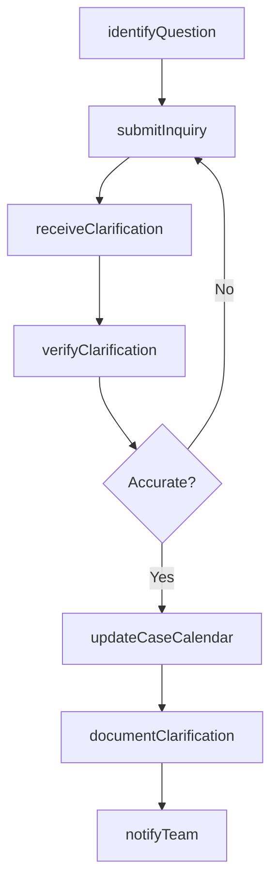
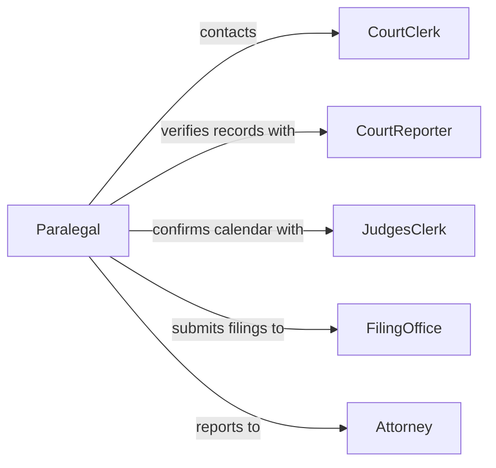

# Confer Court Staff Clarify Information

> Business-as-Code definition for conferring with court staff to clarify information. Models the communication between legal professionals and court administrative personnel to resolve procedural questions, verify filing requirements, and confirm scheduling details.

## Overview

Conferring with court staff to clarify information involves contacting clerks, bailiffs, court reporters, and other administrative personnel to resolve questions about case scheduling, filing procedures, document requirements, and courtroom protocols. This definition covers the identification of information needs, initiation of inquiries, receipt and verification of responses, and incorporation of clarified details into case management workflows. It is essential for maintaining compliance with court rules and avoiding procedural delays.

## Actors

| Actor | Description |
|-------|-------------|
| CourtClerk | Manages case filings, scheduling, and official court records |
| Bailiff | Oversees courtroom security and logistics |
| CourtReporter | Produces official transcripts and clarifies record-related questions |
| JudgesClerk | Manages the judge's calendar and communicates judicial preferences |
| FilingOffice | Receives and processes legal documents submitted to the court |

## Roles

| Role | Description |
|------|-------------|
| Attorney | Initiates inquiries to court staff on behalf of the client |
| Paralegal | Contacts court staff to verify filing requirements and deadlines |
| LegalSecretary | Manages correspondence with court personnel and tracks responses |
| CaseAdministrator | Incorporates clarified information into the case management system |

## Entities

| Entity | Description |
|--------|-------------|
| CourtInquiry | A formal or informal question directed to court staff |
| FilingRequirement | The specifications for submitting a document to the court |
| HearingSchedule | The calendar of upcoming court appearances and deadlines |
| CourtRule | A procedural rule governing filings, appearances, or conduct |
| ClarificationRecord | A documented response from court staff resolving a question |
| CaseCalendar | The internal tracking of all court dates and filing deadlines |

## Actions

| Action | Description |
|--------|-------------|
| identifyQuestion | Determine the specific information needed from court staff |
| submitInquiry | Contact court personnel with the question or request |
| receiveClarification | Obtain the response from court staff |
| verifyClarification | Confirm the accuracy and applicability of the information received |
| updateCaseCalendar | Incorporate confirmed dates and requirements into case tracking |
| documentClarification | Record the question, response, and source for the case file |
| notifyTeam | Communicate the clarified information to relevant legal team members |

## Events

| Event | Description |
|-------|-------------|
| questionIdentified | A specific information need has been determined |
| inquirySubmitted | A question has been sent to court staff |
| clarificationReceived | Court staff has provided a response |
| clarificationVerified | The response has been confirmed as accurate and applicable |
| caseCalendarUpdated | Court dates and filing deadlines have been updated |
| clarificationDocumented | The inquiry and response have been added to the case record |
| teamNotified | Relevant team members have been informed of the clarification |

## Searches

| Search | Description |
|--------|-------------|
| findOpenInquiries | List unanswered questions pending with court staff |
| getFilingRequirements | Retrieve document specifications for a specific court or case type |
| getHearingSchedule | Pull upcoming hearing dates and courtroom assignments |
| getClarificationHistory | Look up past inquiries and responses for a case |

## Workflow



## Actor Relationships



## Usage

### Calling Actions

```typescript
import { conferCourtStaffClarifyInformation } from '@headlessly/confer-court-staff-clarify-information'

const court = conferCourtStaffClarifyInformation()

// Identify a filing question
const question = await court.identifyQuestion({
  caseId: 'CV-2026-03892',
  topic: 'filing-requirements',
  details: 'Confirm page limit and exhibit formatting for summary judgment motion'
})

// Submit the inquiry to the court clerk
await court.submitInquiry({
  questionId: question.id,
  contactMethod: 'phone',
  courtStaff: 'clerk-district-court',
  urgency: 'standard'
})

// Record the clarification received
await court.documentClarification({
  questionId: question.id,
  response: 'Motion limited to 25 pages, exhibits must be tabbed and separately bound',
  source: 'Clerk Johnson, District Court',
  date: '2026-03-14'
})
```

### Event-Driven Automation

```typescript
// Auto-update case calendar when clarification is verified
court.clarificationVerified(async ({ caseId, topic, response }) => {
  if (topic === 'hearing-schedule') {
    await court.updateCaseCalendar({
      caseId,
      updates: response.dates
    })
  }
})

// Alert the attorney when filing requirements change
court.clarificationReceived(async ({ caseId, topic, response }) => {
  if (topic === 'filing-requirements') {
    await notify({
      to: 'lead-attorney',
      message: `Filing requirements clarified for ${caseId}: ${response}`
    })
  }
})
```
